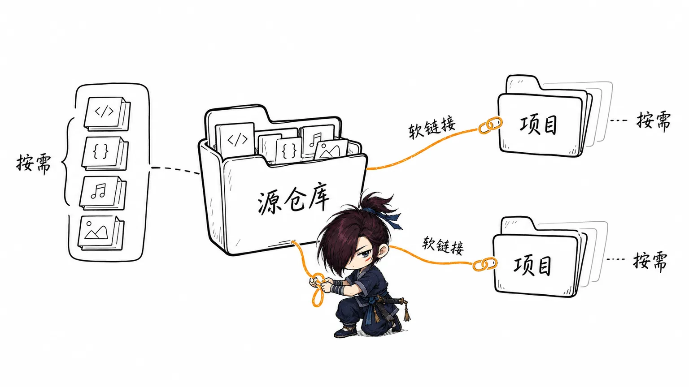
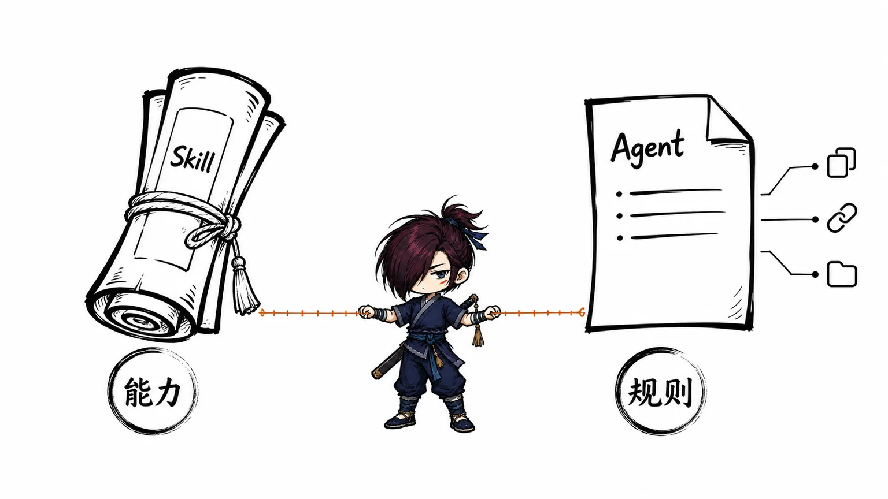

## Skill 管理方式：个人源集中维护，第三方交给安装器

随着使用 Codex、Claude Code 等 coding agent 的时间变长，Skill 会越来越多。它们可能是自己编写的，也可能是第三方作者发布的版本。

我现在更关心一个实际问题：**同一个 Skill 在本机只保留一份实际内容，Codex、Claude Code 和需要它的项目共用这份内容。** 这个目标不要求所有 Skill 都放进同一个 Git 仓库，也不要求我替第三方作者维护一份镜像。

当前采用的分工是：

- 自己编写、自己长期调整的 Skill 放在 [my-skillhub](https://github.com/justwe7/my-skillhub) 中，由我维护。
- 只使用原版的第三方 Skill 由 <code>npx skills</code> 全局安装和更新，不复制进 my-skillhub。
- 需要长期改动的第三方 Skill 转成 <code>fork/</code> 下的个人版本，之后只使用这一份。
- 电脑级 Agent 规则单独维护在 <code>profiles/AGENTS.md</code>，Codex 和 Claude Code 的入口都软链接到它。

这是一套适合个人电脑的管理方式。它解决的是本机内容重复和更新分散的问题，不是团队发布 Skill 的通用方案。

## 目录怎么划分

中央仓库的职责收窄为个人内容和索引页面：

~~~text
mine/       # 自己编写和维护的 Skill
fork/       # 已经定制、由自己维护的第三方 Skill
profiles/   # 电脑级 Agent 规则，唯一源文件为 AGENTS.md
vendor/     # 本地查阅页使用的固定依赖，不是 Skill 来源
scripts/    # 生成索引和查阅页所需的脚本
index.html  # 本地 Skill 文档查阅页
~~~

个人维护的 Skill 目录至少包含一个 <code>SKILL.md</code>：

~~~text
mine/<skill-name>/SKILL.md
fork/<skill-name>/SKILL.md
~~~

<code>SKILL.md</code> 的 frontmatter 提供 <code>name</code> 和 <code>description</code>。Skill 的正文、references、scripts 和 assets 都留在同一个目录中，查阅页直接读取这些 Markdown，不另外维护一份手写摘要。

第三方原版不进入这个仓库。这样中央仓库不会因为上游新增、删除或改名而频繁同步一套自己并不维护的副本。

## Skill 和 Agent 规则不是一回事

Skill 是一项可复用能力，例如文章配图、文档整理、存储分析或代码审查。它通过目录软链接启用：

~~~text
mine/<skill-name> 或 fork/<skill-name>
        ↓
Codex / Claude Code / 项目里的 skills 入口
~~~

电脑级 Agent 规则描述的是跨项目都适用的工作方式，例如沟通语言、修改边界和验证习惯。它不是 Skill，不放到 <code>mine/</code> 或 <code>fork/</code>，而是由一份源文件提供两个入口：

~~~text
profiles/AGENTS.md
        ├── $HOME/.codex/AGENTS.md
        └── $HOME/.claude/CLAUDE.md
~~~

项目自身的业务规则、架构约定和特殊限制仍然写在项目根目录的 <code>AGENTS.md</code> 或 <code>CLAUDE.md</code> 中。电脑级规则只提供共用基础，不替项目文件承担项目上下文。

## 推荐的使用方式

### 个人 Skill：仓库保留一份源，入口使用软链接

常用的个人 Skill 可以全局启用，所有项目读取同一个源目录；只有某个项目确实需要隔离时，才在项目内单独建立入口。

| 范围             | Codex                                                                                                                       | Claude Code                                          |
| ---------------- | --------------------------------------------------------------------------------------------------------------------------- | ---------------------------------------------------- |
| 电脑级全局 Skill | <code>$HOME/.codex/skills/&lt;skill-name&gt;</code>（个人仓库软链；<code>$HOME/.agents/skills</code> 留给 Vercel CLI 管理的第三方 Skill） | <code>$HOME/.claude/skills/&lt;skill-name&gt;</code> |
| 项目级 Skill     | <code>.agents/skills/&lt;skill-name&gt;</code>                                                                              | <code>.claude/skills/&lt;skill-name&gt;</code>       |

查阅页会根据当前范围和 Agent 生成命令。手工操作时，软链接的目标应该是仓库里的实际目录，例如：

~~~sh
mkdir -p .agents/skills
ln -s \
  "/Users/debugger/bugcave/github/skills/fork/article-metaphor-illustrator" \
  ".agents/skills/article-metaphor-illustrator"
~~~

Codex 和 Claude Code 都需要时，分别建立两个入口；两个入口必须指向同一个源目录。项目里只保存软链接，不复制 <code>SKILL.md</code>。

创建前先检查目标路径。如果目标是普通文件、普通目录，或已经指向其他源的软链接，应停止并处理冲突，不要用强制覆盖命令掩盖问题。创建后至少确认：

~~~sh
test -L ".agents/skills/article-metaphor-illustrator"
readlink ".agents/skills/article-metaphor-illustrator"
test -r ".agents/skills/article-metaphor-illustrator/SKILL.md"
~~~

以后只修改中央仓库里的源文件，已经创建的软链接会直接读取新内容，不需要逐项目同步。

### 第三方原版：全局安装一次，使用安装器更新

第三方原版不经过中央仓库。使用 [Vercel 的 <code>skills</code> CLI](https://github.com/vercel-labs/skills) 安装到全局范围，交互时选择需要的 Skill 和 **Symlink**，让 Codex、Claude Code 等 Agent 共用安装器管理的一份内容。

Vercel CLI 的管理分为三层：本机的 canonical 源目录、各 Agent 的入口软链，以及记录来源和更新信息的 lock 文件。它会把上游内容复制到 canonical 目录，再让 Agent 入口指向这份本地内容；软链不直接指向 GitHub，<code>npx</code> 也不是源文件目录。

全局安装和项目级安装的路径关系如下：

~~~text
全局：
$HOME/.agents/skills/<skill-name>/                  # Vercel 管理的实际内容
$HOME/.claude/skills/<skill-name>                  # Agent 入口，通常软链到上面的目录

项目：
<project>/.agents/skills/<skill-name>/             # Vercel 管理的实际内容
<project>/.claude/skills/<skill-name>              # Agent 入口，通常软链到上面的目录
~~~

<code>-g</code> 只决定使用全局目录还是当前项目目录；Symlink 决定是否让多个 Agent 共用 canonical 内容。Codex 等直接读取 <code>.agents/skills</code> 的 Agent 会把 canonical 目录本身作为入口，因此不一定再生成单独的 Agent 软链。若使用 <code>--copy</code>，各 Agent 会得到独立副本，更新也不再共享同一份内容。

以 Matt Pocock 的 Skills 为例：

~~~sh
npx skills@latest add mattpocock/skills -g -a codex claude-code
~~~

安装后查看全局状态：

~~~sh
npx skills@latest list -g
~~~

更新已经安装的第三方 Skill：

~~~sh
npx skills@latest update -g
~~~

只更新一个成员：

~~~sh
npx skills@latest update tdd -g
~~~

全局安装记录默认保存在 <code>$HOME/.agents/.skill-lock.json</code>，项目级安装记录保存在项目根目录的 <code>skills-lock.json</code>。执行 <code>npx skills@latest update -g</code> 时，安装器根据记录重新获取上游内容，更新对应的 canonical 目录；入口软链继续指向相同路径，缺失或目标不正确时会按安装逻辑重新建立。执行 <code>list -g</code> 可以查看全局安装状态，执行 <code>remove -g</code> 可以移除安装器管理的内容和入口。

上游新增了尚未安装的成员时，再运行一次 <code>add</code>，选择需要的成员。更新第三方原版不需要运行 my-skillhub 的 <code>build-registry.mjs</code>，因为它不属于这个仓库的索引。

为了保证本机同一个 Skill 只有一份，遵守三条规则：

- 同一个 Skill 已经通过 <code>npx skills</code> 全局安装后，不再在每个项目重复安装。
- 同一个 Skill 不同时使用插件和 CLI 两种渠道；先选定一个来源。
- 发现某个第三方 Skill 值得长期修改时，把它转入 <code>fork/&lt;skill-name&gt;/</code>，停用原版同名入口，再只使用 Fork 版本。

如果第三方原版只在某个项目临时使用，可以按项目范围安装；但不要让同一个名字同时从全局和项目加载两份不同版本。团队项目或 CI 需要可复现版本时，应另行采用项目级安装或插件分发，这和个人电脑的全局共享方案是两个目标。

具体的第三方来源、安装和更新说明以作者当前文档为准：[Matt Pocock Skills](https://github.com/mattpocock/skills) 。

### 全局 Agent 规则：一份源文件，两个电脑级入口

源文件是：

~~~text
/Users/debugger/bugcave/github/skills/profiles/AGENTS.md
~~~

Codex 和 Claude Code 的入口分别是：

~~~text
$HOME/.codex/AGENTS.md
$HOME/.claude/CLAUDE.md
~~~

首次配置时，在终端执行下面的命令。它会先检查冲突；如果入口已经是指向预期源文件的软链接，可以重复执行，不会创建第二份内容。

~~~sh
(
  skillhub_root='/Users/debugger/bugcave/github/skills'
  agent_source="$skillhub_root/profiles/AGENTS.md"
  codex_agent_file="$HOME/.codex/AGENTS.md"
  claude_agent_file="$HOME/.claude/CLAUDE.md"

  if [ ! -r "$agent_source" ]; then
    echo "源文件不可读：$agent_source"
    exit 1
  fi

  conflict=0
  for agent_file in "$codex_agent_file" "$claude_agent_file"; do
    if [ -e "$agent_file" ] || [ -L "$agent_file" ]; then
      if [ ! -L "$agent_file" ] || [ "$(readlink "$agent_file")" != "$agent_source" ]; then
        echo "冲突：$agent_file 已存在且不是预期软链接。"
        conflict=1
      fi
    fi
  done
  [ "$conflict" -eq 0 ] || exit 1

  mkdir -p "$HOME/.codex" "$HOME/.claude" || exit 1
  for agent_file in "$codex_agent_file" "$claude_agent_file"; do
    if [ ! -L "$agent_file" ]; then
      ln -s "$agent_source" "$agent_file" || exit 1
    fi
    if [ "$(readlink "$agent_file")" != "$agent_source" ]; then
      echo "验证失败：$agent_file"
      exit 1
    fi
    echo "已配置：$agent_file -> $agent_source"
  done
)
~~~

如果目标已经是普通文件，不要直接覆盖。先把需要保留的规则合并到 <code>profiles/AGENTS.md</code>，自行备份旧文件，再重新运行命令。若目标指向另一个源文件，也先确认旧规则后再决定是否替换。

平时只改 <code>profiles/AGENTS.md</code>，不需要重新安装 Skill，也不需要运行索引生成器。新的全局规则在新 Agent 会话中生效；项目专属规则继续修改项目自己的 <code>AGENTS.md</code> 或 <code>CLAUDE.md</code>。

## 怎么查找和维护个人 Skill

打开中央仓库的 <code>index.html</code> 即可使用本地文档库，不需要启动服务，也不依赖网络。当前文件位于：

~~~text
/Users/debugger/bugcave/github/skills/index.html
~~~

页面只索引 <code>mine/</code> 和 <code>fork/</code>，不会把第三方安装器的副本混进来。

查阅页支持：

- 按名称、用途和 Markdown 正文全文搜索；
- 在同一个 Skill 的 <code>SKILL.md</code>、README 和 references 之间切换；
- 使用本页目录跳转章节，文档链接和浏览器前进、后退保持可用；
- 复制源文件路径、代码块和软链命令；
- 查看全局 Agent 规则配置说明。

修改 Skill 文档、README 或新增文件后，在仓库根目录运行：

~~~sh
cd /Users/debugger/bugcave/github/skills
node scripts/build-registry.mjs
~~~

<code>registry-data.js</code> 是生成结果，不手工编辑。全局 Agent 规则不进入索引，所以只修改 <code>profiles/AGENTS.md</code> 时不需要运行这个命令。

## 更新和迁移流程

个人 Skill 的更新流程：

~~~text
修改 mine/ 或 fork/ 源文件
        ↓
查看 git diff，确认没有无关改动
        ↓
运行 node scripts/build-registry.mjs
        ↓
刷新 index.html 查阅和复制命令
        ↓
已有软链接自动读取最新内容
~~~

第三方 Skill 的更新流程：

~~~text
npx skills@latest update -g
        ↓
用 npx skills list -g 查看实际安装状态
        ↓
只在发现需要定制时转入 fork/
~~~

中央仓库删除或重命名个人 Skill 后，要检查已有项目入口是否失效。第三方安装来源发生变化时，旧项目里的软链接也不会自动变成新的安装器入口；重新安装和清理这些入口需要单独处理。

## 这种方式的取舍

优点是：

- 本机同一个 Skill 只有一份实际内容，更新入口清晰；
- 自己维护的内容可以保留在 Git 中，第三方原版不需要重复镜像；
- Codex、Claude Code 和多个项目可以共用同一个个人 Skill 源；
- 本地查阅页只展示自己真正维护的内容，搜索结果更干净；
- 全局 Agent 规则与 Skill 分开，修改边界明确。

限制是：

- 个人 Skill 的软链接依赖本机中央仓库路径，移动仓库后需要重新生成入口；
- 项目中的个人软链接不适合作为团队共享的唯一安装方式；
- 第三方全局更新可能同时影响多个项目，需要按需选择安装成员；
- 第三方原版和 Fork 版本必须明确选一个，不能让同名 Skill 同时存在不同来源。

因此，我的推荐方式是：**个人内容集中维护，第三方原版全局安装，只有需要改动的第三方才 Fork；每个 Skill 在本机只保留一个实际来源。**

## 参考资料

- [Vercel <code>skills</code> CLI：安装、Symlink 和更新](https://github.com/vercel-labs/skills)
- [Matt Pocock Skills：安装说明](https://github.com/mattpocock/skills#installation-30-second-setup)
- [Codex 官方文档：Skill 的发现路径与软链接](https://learn.chatgpt.com/docs/build-skills)
