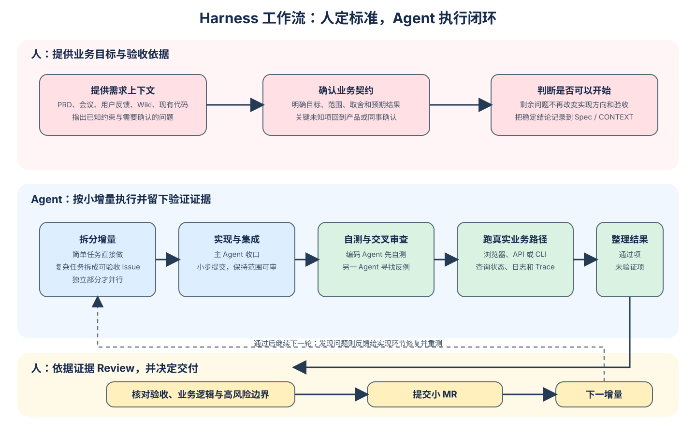
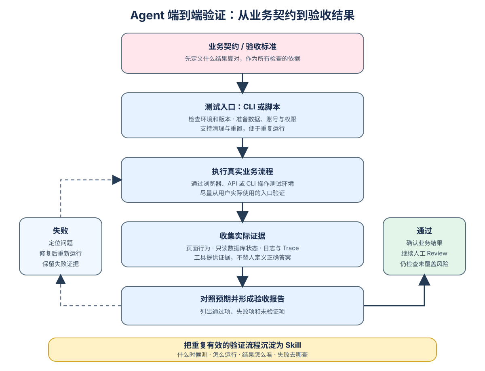

## 先抓住一条主线
1. AI 写代码变快了，但人理解需求、判断对错的速度没变，所以瓶颈从“写”变成了“看”。
2. 既然人看得慢，就要减少人需要看的东西。
3. 减少的办法有两个：让 Agent 自己先验证，把能发现的问题在它那边就解决；把每次改动切小，让人每次只看一小块。
4. Agent 要自己验证，就得有能跑真实业务的环境，这就是端到端测试环境。
5. 验证有个前提：得知道“对”长什么样。所以一开始就要把需求问清楚，写成验收标准。
6. 最后留给人的，只剩机器判断不了的东西：需求理解对没对、高风险的逻辑成不成立。

总结下来 AI 开发到现在**瓶颈是 Review 的速度**。所以我的功夫主要花在验证上：先给 Agent 一套能跑真实业务的测试环境，让问题在交到我手里之前就被它发现；再把每个 MR 切小，让我只需要看测试结果和核心业务逻辑。

## 一、核心思路

Agent 能同时推进好几个任务，但我理解业务、判断方案、确认交付的速度不会跟着翻倍。能做的就是减少需要我判断的东西：

1. **把验证前移给 Agent**：类型检查、测试、业务断言能发现的问题，让它在开发过程中自己发现、自己修、自己复验。
2. **把改动切小**：每个 MR 只包含一个可验收的增量，我每次要理解的范围可控。

## 二、一个需求从拿到到合入



整个流程分两段：前半段对齐需求和方案，后半段按可验收的小增量循环。

| 阶段         | 做什么                                                                                            | 谁来做         |
| ------------ | ------------------------------------------------------------------------------------------------- | -------------- |
| 准备上下文   | PRD、会议纪要、聊天记录、用户反馈、团队 Wiki、现有代码                                            | 我             |
| 需求澄清     | 用 grill 连续追问，把目标、边界、取舍问清楚                                                       | 我 + Agent     |
| 方案设计     | 出技术方案                                                                                        | Astra          |
| 方案审查     | 对抗性审查，必要时修订再审                                                                        | Claude 5 Fable |
| 形成交付依据 | 范围和验收标准写进 Spec 或 `CONTEXT.md`                                                           | Agent          |
| 拆分增量     | 简单需求直接做；复杂需求拆成可独立验收的 Issue，交给 subagent 在不同 worktree 并行，主 Agent 集成 | Codex          |
| 实现和自测   | 编码、集成、跑测试                                                                                | 编码 Agent     |
| 交叉审查     | 按审查深度选 Claude、pi 或 Codex                                                                  | 另一个 Agent   |
| 端到端测试   | 在测试环境跑通这次的业务增量                                                                      | 编码 Agent     |
| 人工 Review  | 看测试结果和核心业务逻辑                                                                          | 我             |
| 提交小 MR    | 进入下一个增量                                                                                    | —              |

中间任何一步发现问题，都统一反馈给主编码 Agent（Codex）修复并重新验证，不在多个 Agent 之间来回改。

现在模型进步都很大，主流是做减法。GPT-5.4、Opus 4.6 那一代，我用过 Superpowers 这类围绕 Spec 和 TDD 的重型 Skill，最直接的感受是 Token 烧得快：上下文明明够了、可以直接动手，模型还是会沿着预设的 Workflow 一步步走完。新模型出来后，不少开发者已经基本不用这类 Skill，OpenAI 发布 Astra 时也专门写了博客讲怎么清理不必要的 Skill 和系统提示词。模型变强之后，一部分约束正在变成噪声。

现在分法很简单：**简单任务直接做**，**复杂任务才拆分**、规划、交叉审查。

### 需求对齐到什么程度就停

PRD、会议、聊天里的需求往往互相对不上：PRD 没更新，会上补过限制，聊天里又调过优先级，我自己的理解里也藏着没说出口的假设。grill 能把这些挖出来，有些我当场回答，有些要回头找产品确认。

停的标准是：剩下的问题已经不会显著改变实现方向和验收结果。要求 Agent 把所有细节提前规划好，对齐本身又会变成一套很重的流程。

### 对齐结论落成文件

Spec 或 `CONTEXT.md` 只记四样东西：这次要解决的问题、范围、关键决策、验收标准。后面负责实现和审查的 Agent 读这一份就够了，不用重读整段对话。grill 的具体用法单独写过：[用 grill-with-docs 做好需求澄清](./3.用%20grill-with-docs%20做好需求澄清.md)。

### 不逐行读代码的前提

我不逐行读生成的代码，但有两个前提：每个 MR 足够小；随着开发推进，完整业务路径被逐步验证过一遍。小 MR 管的是「每次改了什么」，端到端测试管的是「放进真实流程后还成不成立」。

## 三、给 Agent 搭一套端到端测试环境

AI 写测试已经很积极了，一个 Bugfix 动不动配几百行测试，GPT-5.6 Sol 尤其明显。可上线后还是会遇到预期之外的错误。我的判断是：问题不在测试写得少，而在 Agent 没有端到端的测试环境，没机会在编码和自测阶段撞上这些问题。



这套环境本质上是让 Agent 提炼我日常自测的流程，把散落的能力收拢起来：能工具化的做成 MCP 或 CLI，可复用的流程写成 Skill。前期要花功夫，但搭好之后开发明显变快，返工少了，我也不用整天担心 AI 写的代码会不会出事故。

具体做了四件事：

1. **熟悉环境**：一键启动测试环境、创建测试数据，明确当前版本、测试账号和权限，提供清理与重置。
2. **操作业务系统**：通过浏览器、API 或 CLI 执行真实业务流程。
3. **查库表和日志**：只读数据库 MCP 确认落库结果，日志系统 Skill 和 Trace 查链路、定位问题。
4. **固化稳定流程**：稳定操作写成脚本，入口和排障方法整理成 Skill，写清楚什么时候测、怎么跑、结果怎么看、失败去哪查。

### 统一成一个测试 CLI

Skill、MCP 和脚本最后都收进一个测试 CLI，提供环境检查、数据准备、场景执行、结果查询和清理。平时遇到问题我自己也用它排障。整理好了，它可以直接当内部提效工具给其他同学用。

### 浏览器自动化用 ego lite

需要浏览器操作的业务，可以用开源浏览器 ego lite，上手方便，速度也快。配合 pi agent + DeepSeek V4 Flash，测试能跑得比较快。

### 预期结果来自业务契约，不来自系统返回

**不能让 Agent 看到系统返回了什么，就认为什么是对的。** 复杂业务下，系统完全可能返回一个看似合理、实际不符合需求的结果。

分工要清楚：DB 查询用来确认状态，日志和 Trace 用来解释失败，工具只负责收集证据，正确答案从验收标准里来。

如果被测的产品本身就是 Agent，除了流程能不能跑通，还要评估回答质量，也就是 Agent Eval，这里不展开。

## 四、怎么 Review AI 写的代码

业务需求的第一责任人仍然是开发者。大型系统里不做 Review，迟早会在半夜 On-call 时发现是 AI 写的代码出了事。我现在按这个顺序看：

1. **先看验收标准，再看测试结果**：对照端到端测试的结果，确认是否符合预期、有没有遗漏。测试通过了多少条不重要，重要的是这些测试有没有验证这次需求真正关心的事。
2. **沿着业务路径看，精力放在高风险处**：权限、状态变化、并发、重试、数据一致性、迁移和回滚。模式稳定的 CRUD 我现在基本不看。
3. **新增的抽象和机制单独过一遍**：用奥卡姆剃刀让 AI 再审一次，看是否真有必要、有没有更简单的实现。
4. **MR 多了就做 Review Bot**：直接调 pi agent 或 Claude Code 做对抗性审查是一次性的；Review Bot 把 Git 变更信息和预先设计好的审查流程结合起来，能对每个 MR 重复执行。衡量它看的是少漏了多少有效问题、省了多少人工，不是评论了多少条。

### AI 代码里反复出现的问题

看到可疑的地方，我先往这几个方向找：

- 边界条件没处理完整，空值、超时、失败重试这些分支漏掉了。
- 引入了项目本来不需要的依赖，或者绕开已有封装自己重写了一套。
- 风格和项目其他部分对不上，一眼就能看出是另一个人写的。
- 测试覆盖了表面，关键路径反而没测到。
- 给的是最常见的解法，不是最适合当前约束的解法。项目有特殊约束要提前讲明，别指望它自己推断。

## 五、工具箱：模型分工和常用 Skill

### 模型分工

| 用途                        | 工具                            |
| --------------------------- | ------------------------------- |
| 编码实现                    | Codex + GPT-5.6 Sol             |
| 规划                        | Astra（之前是 GPT-5.6 Sol Max） |
| 简单需求                    | Codex + GPT-5.6 Luna Max        |
| 方案对抗性审查、Code Review | Claude 5 Fable                  |
| 个人项目的方案设计          | 网页端 GPT-6 Pro                |

模型迭代很快，这张表只代表现在，不是选型建议。重点是按任务分工。

### 常用 Skill

| Skill                             | 用途                                                                             |
| --------------------------------- | -------------------------------------------------------------------------------- |
| `think`（tw93）                   | 方案对齐、头脑风暴                                                               |
| `grill me` / `grill with docs`    | 需求澄清，结论沉淀到 ADR 或 `CONTEXT.md`，常能挖出前期没想到的问题               |
| `implement`（Matt Pocock 全家桶） | 配合 grill，实现已经明确的计划或 Issue                                           |
| `ponytail`                        | 清理 AI 的过度设计，降低 Review 难度。GPT-5.6 Sol 经常过度设计，所以我用得很频繁 |
| `handoff`                         | 把上下文整理成文件交给新会话，一般用它从 Codex 交接给 Claude Code 或 pi          |
| `check`                           | 提 MR 时做代码审查                                                               |
| 自己沉淀的 Skill                  | 端到端测试这类可复用的 SOP                                                       |

经验法则：**一个流程重复超过三次，就让 Codex 整理成 Skill。** Skill 多了之后怎么管，见 [Skill 管理：从重复复制到单一来源](./1.Skill管理-从重复复制到单一来源.md)。

## 六、短 Prompt：用方法论的名字代替长 Workflow

大段 Prompt 我现在很少自己写，需要时让 Codex 生成。比如讨论几轮后想把上下文交给 GPT Pro 做方案设计，就让 Codex 先写一份完整的交接 Prompt。

我自己常打的反而是很短的 Prompt，效果经常是一句话顶几千字。原因不神秘：第一性原理、对抗性审查、奥卡姆剃刀这些是高度标准化的方法论，模型在论文、代码、设计文档里见过无数次，点个名字就够了，不用手写几百行 Workflow。

| 方法论         | 什么时候用                           | Prompt                                                                                  |
| -------------- | ------------------------------------ | --------------------------------------------------------------------------------------- |
| 第一性原理     | 怀疑题目本身问错了，方案越做越重     | 不要基于「X」这个既定方案继续设计。从第一性原理分析问题的根因，以及最小必要的解决方案。 |
| 对抗性审查     | 方案评审、Code Review                | 对这个方案做一次对抗性审查，优先寻找能推翻核心假设的反例。                              |
| 消融实验       | 一次加了多个优化，不知道谁真正起作用 | 给这几个优化设计消融实验，判断真正的收益来自哪里。                                      |
| 奥卡姆剃刀     | Agent 给了一套很重的方案             | 用奥卡姆剃刀重新审查这个设计，在满足需求的前提下，删除所有非必要机制。                  |
| 高内聚、低耦合 | 文件或模块膨胀，职责混在一起         | 按高内聚、低耦合原则审查 X 的职责边界，不要为了拆而拆。                                 |

### 第一性原理：怀疑题目本身问错了

商品列表页滚动卡顿，讨论几轮后方向已经定成「上虚拟列表」，Agent 开始研究 `vue-virtual-scroller` 的配置、动态高度怎么算。这时打断它：

```text
不要基于「上虚拟列表」这个既定方案继续设计。从第一性原理分析这个列表为什么卡，以及最小必要的解决方案。
```

它会退回去先找卡的原因：

- 列表到底多少条？200 条和 20000 条是两个问题。
- 每一项渲染成本多高？有没有未压缩的大图、每项一个 `IntersectionObserver`、一堆重复计算的 `computed`？
- 是不是整个列表在重复渲染？`key` 用了 `index`，或者父组件每次传一个新对象进来？
- `scroll` 监听里有没有同步读 `offsetHeight`，每帧触发强制回流？

结果可能是修一下 `key`、把滚动监听改成 `requestAnimationFrame` 节流就够了，200 条数据根本用不上虚拟列表。

### 对抗性审查：主动找能推翻方案的反例

「帮我看看这个方案有没有问题」这种问法，模型大多会顺着方案补细节。方案是「为防止表单重复提交，在全局 store 里加一个 `isSubmitting`，提交期间禁用按钮」时，换成：

```text
对这个方案做一次对抗性审查，优先寻找能推翻核心假设的反例。
```

它会开始追问：

- 重复提交真正要防的是什么？后端接口做了幂等吗？没有的话，前端禁用按钮挡不住网络重试和多标签页。
- 请求超时或抛异常时，`isSubmitting` 一定会被重置吗？漏了 `finally`，按钮就永远是灰的。
- 全局状态会不会把同页面另一个不相关的表单也锁住？
- 提交途中切换路由再回来，状态是不是残留了？

最后可能发现，更合理的做法是后端加幂等 token，前端只在组件内部做按钮 loading。

### 消融实验：确认每个优化各自带来了什么

首屏优化一次做了四件事：路由懒加载、首屏图片换 WebP、关键字体 `preload`、第三方 SDK 延迟加载，LCP 从 4.2s 降到 1.8s。效果好，但不知道是谁的功劳：

```text
给这四个优化设计消融实验，判断真正的收益来自哪里。
```

它会以优化前为 Baseline，在固定的网络节流和设备条件下用 Lighthouse 跑每一种组合，每组跑多次取中位数。可能的结论是：图片换 WebP 贡献了大半，字体 `preload` 几乎看不出差别，却多了一份要跟着字体文件名同步维护的配置。哪些该留、哪些是白加的复杂度，一目了然。

### 奥卡姆剃刀：效果接近时选更简单的

一个带筛选条件的列表页，要求刷新后筛选条件不丢、链接可以分享。Agent 给的方案是：Pinia store 存筛选状态 + 自定义 `useQuerySync` 双向同步 URL + 事件总线通知列表刷新 + 防抖请求队列 + 请求结果缓存层。补一句：

```text
用奥卡姆剃刀重新审查这个设计，在满足需求的前提下，删除所有非必要机制。
```

它往往会收敛到：

```js
// 筛选条件只存在 URL query 里，作为唯一状态源；store、事件总线、缓存层都不需要
let controller
watch(() => route.query, (query) => {
  controller?.abort() // 取消上一个还没回来的请求，顺手解决了竞态
  controller = new AbortController()
  fetchList(query, { signal: controller.signal })
}, { immediate: true })
```

这句话对 Coding Agent 尤其有用，模型很容易为了「完整」而过度设计。

### 高内聚、低耦合：重新划职责边界

`OrderDetail.vue` 长到了 1500 行，里面有接口请求、数据转换、权限判断、表单校验、埋点、四个弹窗。直接说「帮我拆一下」，模型通常按行数切成几个子组件，props 一路往下传，耦合反而更重。换成：

```text
按高内聚、低耦合原则审查 OrderDetail.vue 的职责边界，不要为了拆而拆。
```

它会先按职责分类，而不是按行数切：

- 请求和数据转换抽成 `useOrderDetail` composable，页面只消费结果。
- 权限判断不散落在模板的 `v-if` 里，收到路由守卫或统一的权限指令。
- 埋点走统一的 `track` 封装，不和业务逻辑写在同一个函数里。
- 只在这一处用、和页面状态强绑定的小块留在原文件，不必拆成组件。

### 合成一句

```text
从第一性原理重新分析，对当前方案做对抗性审查；核心机制必须通过消融实验验证；方案遵循奥卡姆剃刀，代码保持高内聚、低耦合。
```

几十个字，指定了五个认知动作：重新定义问题 → 攻击假设 → 验证贡献 → 删除复杂度 → 整理边界。这是我理解的新模型时代 Prompt 的变化：与其给模型写死一套思考流程，不如告诉它用哪种方法论思考，再补上这个任务真正必要的约束。

## 七、留在 AGENTS.md 里的底线

约束删了不少，但有几条一直留着。它们管的不是模型能力，而是工程习惯，换哪一代模型都用得上。最早的版本参考了 Chris Dzombak 分享的 Claude Code 配置。

- **取舍有顺序**：可测试性 > 可读性 > 一致性 > 简单性。模型在两种写法之间摇摆时按这个顺序选，不用每次来问我。
- **清晰优于聪明**：不为了写法巧妙牺牲可读性。和奥卡姆剃刀是一回事，只是提前写进了规则。
- **先读懂现有代码再动手**：先找项目里已有的抽象和写法，避免风格不一致和重复造轮子。
- **卡住就停**：这条一直在，但写法改过。最早的版本是这样：

```markdown
## 卡住时的处理方式

同一个问题最多尝试 3 次，仍然失败就停下：
1. 记录失败原因和已经尝试过的方案
2. 换思路研究替代方案，不重复同样的尝试
3. 说明当前状态，等待指引
```

当时的 Agent 会拿同一个命令在同一个错误上反复试，Token 烧掉了，改动也越改越乱。新模型基本不这么干了，第 2 步已经是它的默认行为，写着只是噪声。

现在的卡住还可能是另一种形式：抱着一个错误的假设，换着花样修。每一轮改法都不一样，看着很努力，根因一直没碰到，diff 越堆越大。按次数算的规则拦不住这种情况，因为每次都是「不同的方案」。所以我把它收紧成按假设算：

```markdown
同一假设连续两轮失败，就停下重新检查假设；仍无进展时，记录已尝试的方案和失败原因，说明当前状态后停止。
```

「停下交代状态」这半句我不打算删。几个 Agent 在不同 worktree 里并行跑，我不会一直盯着，一个卡住却不停的 Agent，最后交给我的是一份越改越乱的 diff；一个停下来写清楚试过什么、为什么失败的 Agent，交回给我或者 `handoff` 给别的模型都很顺。

- **重要约定写进文件，不靠会话记忆**：长会话里模型会忘掉早期的约束，慢慢偏离目标。每个会话只做一个小目标，做完用 `/compact` 压缩或者用 `handoff` 换新会话，关键结论落到 Spec、`CONTEXT.md` 或 `AGENTS.md` 里。

`AGENTS.md` 的整体思路见 [全局 AGENTS.md：统一所有项目的 Agent 默认行为](./2.全局AGENTS.md-统一所有项目的agent默认行为.md)。

## 八、接下来想做的，和一些担心

**让重复问题在到我手里之前就被解决。** 需要我判断的，集中到三件事：需求有没有理解对、关键业务逻辑是否成立、还有哪些风险没验证。其余的尽量交给 Agent 在开发过程中处理。

**Harness 不只是上下文。** 除了正确的上下文，还要给 Agent 能执行任务的环境，以及判断结果的依据。自测里反复做的操作整理成 CLI、脚本和 Skill 之后，同类任务可以一直复用，也能交给别人用。

**定期做减法。** 有些步骤是在弥补某一代模型的短板，模型换代后要重新判断还有没有收益。Astra 更新之后，我就删掉了 `AGENTS.md` 里一些过于严格的约束。

这套做法也有管不到的地方：

- 验收标准还得人来给。代码和测试互相对得上，也可能是一起误解了需求。
- 端到端测试覆盖的只是选定的环境和场景，生产环境的流量、并发和数据分布照样会带来新问题。

AI 确实拿走了一部分亲自踩坑的机会。一些本来要经历问题、排查原因才能换来的经验，现在变成了 AI 的一句：

> 「我错了，现在修改一下。」

所以我一直在焦虑：AI 时代，研发真正需要的能力是什么。
