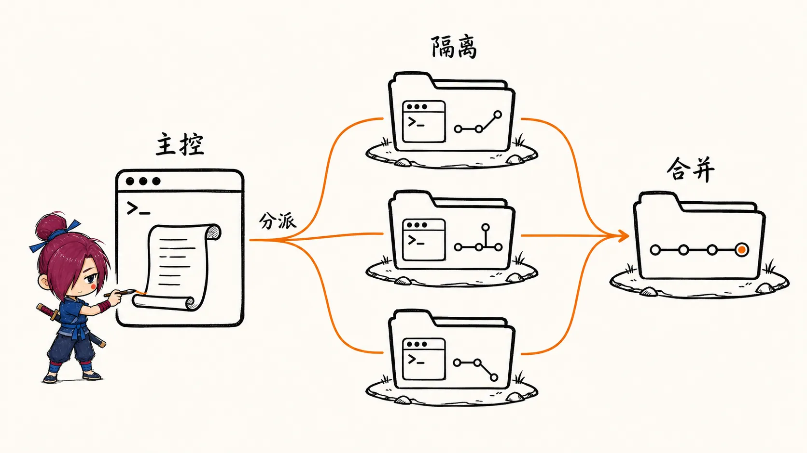

# Claude Code 与 Codex 命令速查

两个工具放在一张表里对照，只收日常真会用到的。2026-09-28 按本机 `Claude Code 2.1.281`、`codex-cli 0.144.2` 的 `--help` 和官方文档核对过，版本变了以 `claude --help` / `codex --help` 为准。

## 一、启动与会话

| 作用 | Claude Code | Codex |
|---|---|---|
| 进入交互 | `claude` | `codex` |
| 带初始问题启动 | `claude "解释一下这个项目"` | `codex "解释一下这个项目"` |
| 继续最近一次会话 | `claude -c` | `codex resume --last` |
| 从列表选会话恢复 | `claude -r` | `codex resume` |
| 从旧会话分叉 | `claude -r <id> --fork-session` | `codex fork` |
| 指定模型 | `--model opus` | `-m <model>` |
| 指定工作目录 | 先 `cd` 再启动 | `-C <dir>` |
| 额外开放目录 | `--add-dir <dir>` | `--add-dir <dir>` |
| 在新 worktree 里启动 | `claude -w <name>` | 无 CLI 参数，手动 `git worktree add`，见第七章 |
| 后台跑 | `claude --bg "任务"`，`claude agents` 查看 | 无 |
| 登录 | `claude auth login` 或会话内 `/login` | `codex login` |
| API Key 登录 | 设 `ANTHROPIC_API_KEY` 环境变量 | `printenv OPENAI_API_KEY \| codex login --with-api-key` |
| 自检 | `claude doctor` | `codex doctor` |
| 升级 | `claude update` | `codex update` |

## 二、会话内斜杠命令

| 作用 | Claude Code | Codex |
|---|---|---|
| 清空上下文、开新对话 | `/clear` | `/clear`（连终端一起清）、`/new` |
| 压缩上下文 | `/compact [保留什么]` | `/compact` |
| 看上下文占用 | `/context` | `/status` |
| 用量与花费 | `/usage`（`/cost` 是别名） | `/usage` |
| 切模型 | `/model` | `/model`（顺带选推理强度） |
| 推理强度 | `/effort` | `/model` 里选 |
| 规划模式 | `/plan` 或 `Shift+Tab` 切到 plan | `/plan` |
| 权限 | `/permissions` | `/permissions` |
| 生成项目说明文件 | `/init` → `CLAUDE.md` | `/init` → `AGENTS.md` |
| 记忆 | `/memory` 编辑 `CLAUDE.md` | `/memories` 开关记忆的读取和生成 |
| 看改动 | `/diff` | `/diff`（含未跟踪文件） |
| 代码审查 | `/code-review`（别名 `/review`） | `/review` |
| 回滚到检查点 | `/rewind` 或空输入时 `Esc Esc` | 无，靠 git |
| 分叉当前对话 | `/branch`；`/fork` 是复制到后台会话 | `/fork` |
| 恢复会话 | `/resume` | `/resume` |
| 旁支提问，不进主上下文 | `/btw` | `/side`（别名 `/btw`） |
| 子 Agent | 直接说「用 subagent 去查……」；`/subtask <任务>` | 直接说「开子 agent 并行做」；`/agent` 切换查看子线程 |
| 并行批量改 | `/batch <指令>` | 无 |
| 后台任务 | `/tasks` | `/ps` 看后台终端，`/stop` 全停 |
| MCP | `/mcp` | `/mcp` |
| Hooks | `/hooks` | `/hooks` |
| Skills | 输入 `/skill-name` 直接调用 | `/skills` |
| 状态栏 | `settings.json` 的 `statusLine` | `/statusline` |
| 从另一家迁配置 | `/import`（可导入 Codex、Cursor） | `/import`（可导入 Claude Code、Cursor） |
| 复制上一条回复 | `/copy` | `/copy` |
| 退出 | `/exit` | `/exit`、`/quit` |

Claude Code 的状态栏具体怎么配见 [自定义 Claude Code 状态栏](./自定义%20Claude%20Code%20状态栏：额度、context%20与花费监控.md) 。

## 三、快捷键与输入前缀

| 作用 | Claude Code | Codex |
|---|---|---|
| 引用文件 | `@路径` | `@路径` 或 `/mention` |
| 执行 shell | `!git status`（输出进上下文） | `!git status` |
| 打断当前动作 | `Esc` | `Esc` |
| 回退 / 编辑上一条 | 空输入时 `Esc Esc` 打开 rewind 菜单 | 空输入时 `Esc Esc` 编辑上一条并分叉 |
| 切权限模式 | `Shift+Tab` 循环 manual → acceptEdits → plan → … | `/permissions` |
| 切模型不清输入 | `Option+P` | 无 |
| 换行 | `Shift+Enter` | 按终端而定，没核对 |
| 搜历史输入 | `Ctrl+R` | `Ctrl+R` |
| 附图片 | `Ctrl+V` 粘贴 | 启动时 `-i <图片>`，会话内没核对 |
| 后台化正在跑的命令 | `Ctrl+B` | 无 |
| 外部编辑器写长 prompt | `Ctrl+G` | 没核对 |
| 看完整工具调用记录 | `Ctrl+O` | 没核对 |
| 快捷键帮助 / 改键 | 空输入时按 `?`；`/keybindings` 改键 | `/keymap` 查看和改键 |

## 四、执行中插话

Agent 跑到一半想补一句，两边都不用打断：

| 操作 | Claude Code | Codex |
|---|---|---|
| 补充指令，当前这轮就生效 | 直接打字 + `Enter`：进队列，**当前这批工具调用结束后**、同一轮内交给模型 | `Enter`：直接注入当前轮 |
| 等这轮做完再处理 | 队列里的 `/命令` 和 `!命令` 会等这一轮结束再执行 | `Tab`：排到下一轮 |
| 立刻发出队列 | `Ctrl+Enter` 或 `Ctrl+X Ctrl+S` | 无 |
| 撤回已排队的内容 | 输入框第一行按 `Up` | 没核对 |
| 硬中断 | `Esc`，已排队的消息紧接着发出 | `Esc` |

方向大体对、只是补个约束，就直接打字；整体跑偏了才按 `Esc`。

## 五、权限与沙箱

| 作用 | Claude Code | Codex |
|---|---|---|
| 只读 / 先规划 | `--permission-mode plan` | `-s read-only` |
| 自动改文件，命令仍要确认 | `--permission-mode acceptEdits` | `-s workspace-write -a untrusted` |
| 自动放行，危险操作才拦 | `--permission-mode auto`（分类器判断） | `-s workspace-write -a on-request`（模型决定何时问） |
| 完全不问 | `--dangerously-skip-permissions` | `--dangerously-bypass-approvals-and-sandbox` |
| 预先放行某类命令 | `--allowed-tools "Bash(git *)"` 或 `settings.json` 的 `permissions.allow` | `~/.codex/rules/` |
| 禁止读某些文件 | `settings.json` 的 `permissions.deny` | 沙箱只开放工作区 |

**完全不问的两个参数只在隔离环境（容器、一次性虚拟机）里用。** Codex 的沙箱（`-s`）和审批（`-a`）是两个独立开关：沙箱管能碰哪些文件和网络，审批管什么时候问你。

`.claudeignore` 不是官方机制，网上教程还在抄，排除文件用 `permissions.deny`。

## 六、非交互 / 脚本调用

| 作用 | Claude Code | Codex |
|---|---|---|
| 跑一次就退出 | `claude -p "任务"` | `codex exec "任务"` |
| 从管道读输入 | `git diff \| claude -p "review"` | `git diff \| codex exec "review"` |
| JSON 输出 | `--output-format json` / `stream-json` | `--json`（JSONL 事件） |
| 最终回复写文件 | 重定向 stdout | `-o last.md` |
| 约束输出结构 | `--json-schema '<schema>'` | `--output-schema schema.json` |
| 限制花费 | `--max-budget-usd 2` | 无 |
| 接着上次跑 | `claude -p -c "继续"` | `codex exec resume --last "继续"` |
| 非交互审查 | `claude ultrareview`（云端，多 Agent） | `codex review` |

```bash
# 在 CI 里让两边各自给出结论，只留最后一条回复
git diff origin/main... | claude -p "只报 bug 和安全问题" --output-format json > cc.json
codex exec -s read-only -o codex.md "审查当前分支相对 origin/main 的改动，只报 bug 和安全问题"
```

## 七、多 Agent 并行：用 git worktree 隔离

多个 Agent 在同一个目录里同时写文件，会互相覆盖。git worktree 让同一个仓库在多个目录同时 checkout 不同分支，每个 Agent 各占一个目录，最后再合并。



### 手动 worktree

两个工具都能用这种方式：

```bash
git switch main && git pull                        # 先同步，保证每个 worktree 起点一致
git worktree add ../proj-user -b feature/user main
git worktree add ../proj-auth -b feature/auth main
git worktree list
git worktree remove ../proj-user                   # 有未提交改动时加 --force
```

### Claude Code

| 作用 | 写法 |
|---|---|
| 开一个隔离会话 | `claude -w feature-auth`，建在 `.claude/worktrees/feature-auth/`，分支名 `worktree-feature-auth` |
| 从 PR 开 worktree | `claude -w "#1234"` |
| 会话中途进 worktree | 直接说「在 worktree 里做」 |
| 子 Agent 各自一个 worktree | 说「给你的 agents 用 worktree」，或在 `.claude/agents/xxx.md` 的 frontmatter 写 `isolation: worktree` |
| 把 `.env` 等被忽略的文件带进去 | 项目根目录建 `.worktreeinclude`，语法同 `.gitignore` |
| 从当前分支而不是 main 开 | `settings.json` 里写 `"worktree": { "baseRef": "head" }` |
| 一句话大批量并行改 | `/batch <指令>` |

`.claude/worktrees/` 记得加进 `.gitignore` 。退出时 worktree 没有改动会自动删；有改动会问你保留还是删除。

### Codex

交互里直接说「开子 agent 并行做」，用 `/agent` 切换查看各个子线程，实际用法见 [把 Codex 当成会分工的工程代理](./把%20Codex%20当成会分工的工程代理.md) 。想完全自己调度，就用 `codex exec` 配合手动 worktree：

```bash
#!/bin/bash
git worktree add ../agent-a -b feature/user main
git worktree add ../agent-b -b feature/auth main

codex exec -C ../agent-a -s workspace-write -o ../a.md \
  "实现 userService 的 CRUD，使用 Prisma，完成后跑测试" &
codex exec -C ../agent-b -s workspace-write -o ../b.md \
  "实现 JWT 认证中间件，校验 Authorization header" &
wait

# 任何一个失败就先看它的 diff，不要急着合并
git -C ../agent-a diff --stat
git -C ../agent-b diff --stat
```

### 在 AGENTS.md / CLAUDE.md 写清各自负责哪些文件

所有子 Agent 都会读项目说明文件，并行任务开始前把各目录归谁写进去：

```markdown
## 并行任务的文件归属
- src/services/ — user agent 负责，其他 agent 不改
- src/middleware/ — auth agent 负责
- tests/ — test agent 负责
- 入口文件和公共类型声明：子 agent 不改，由主 agent 最后统一修改

## 禁止
- 不改 prisma/schema.prisma，schema 变更单独走迁移任务
```

### 常见坑

| 坑 | 解法 |
|---|---|
| **多个 Agent 都改了 `index.ts` 之类的共享文件，合并时冲突** | 拆任务时保证文件不重叠；共享文件留给主 Agent 最后统一改 |
| A 新增的工具函数 B 看不到，结果重复实现一遍 | 有依赖关系的任务改成串行，A 完成后再启动 B |
| 非交互模式出错后静默退出 | 检查退出码，用 `-o` / `--output-format json` 留下最终输出，合并前逐个看 diff |
| 各 worktree 的起点不一致，合并差异很大 | 创建前先同步 main；Claude Code 默认就从远端默认分支开 |
| 同时开太多，触发限流、token 翻倍、冲突变多 | 并行数控制在 2–4 个 |

### 什么时候并行

| 场景 | 建议 |
|---|---|
| 互不依赖的独立模块 | 适合 |
| 批量生成测试、批量机械重构 | 适合，每个文件相互独立 |
| 要改共享入口文件的跨文件重构 | 不适合 |
| 功能之间有接口依赖 | 不适合，改串行 |
| 边界还不清楚的探索性任务 | 先单 Agent 摸清楚，再拆 |

## 八、配置文件位置

### 文件对照

| 用途 | Claude Code | Codex |
|---|---|---|
| 全局说明 | `~/.claude/CLAUDE.md` | `~/.codex/AGENTS.md`，同目录有 `AGENTS.override.md` 时改读它 |
| 项目说明 | `CLAUDE.md`（提交）；只给自己看的写 `CLAUDE.local.md`（不提交） | `AGENTS.md`，从仓库根目录往下到当前目录逐级拼接，离当前目录越近越优先，总量默认上限 32 KiB（`project_doc_max_bytes`） |
| 按主题拆规则 | `.claude/rules/`、`~/.claude/rules/`，可以按路径生效 | 无 |
| 全局设置 | `~/.claude/settings.json` | `~/.codex/config.toml` |
| 项目设置 | `.claude/settings.json`（提交）、`.claude/settings.local.json`（不提交） | `.codex/config.toml`，项目要先被信任才生效 |
| 预设一套配置 | 无 | `~/.codex/<name>.config.toml`，用 `-p <name>` 启用 |
| 临时覆盖 | `--settings '<json或文件>'` | `-c key=value` |
| 自定义子 Agent | `.claude/agents/*.md`、`~/.claude/agents/` | `.codex/agents/*.toml`、`~/.codex/agents/` |
| Skill | `.claude/skills/`、`~/.claude/skills/` | `.agents/skills/`、`~/.agents/skills/` |
| MCP | 团队共享放 `.mcp.json`，个人的在 `~/.claude.json`；`claude mcp add` | `config.toml` 的 `[mcp_servers.<id>]`；`codex mcp add` |
| 命令放行 / 禁止 | `settings.json` 的 `permissions.allow` / `deny` | `~/.codex/rules/*.rules` |
| Hooks | `settings.json` 的 `hooks` | `/hooks` 管理，存在哪里没核对 |
| 状态栏 | `settings.json` 的 `statusLine` | `config.toml` 的 `[tui] status_line` |
| 快捷键 | `~/.claude/keybindings.json` | `/keymap`，写进 `config.toml` |
| 自动记忆 | `~/.claude/projects/<项目>/memory/` | `/memories` 开关 |

`~/.claude.json` 是 Claude Code 自己维护的状态文件，存登录态、个人 MCP 和项目信任记录，不用手改。Codex 的 `~/.codex/rules/` 管的是命令放行，不是 `.claude/rules/` 那种写给模型看的说明，别混了。

本机还留着 `~/.codex/skills/` 目录，但官方文档现在只列 `.agents/skills/`，旧目录还读不读没核对。一份 Skill 怎么同时给两边用，见 [1.Skill管理](./1.Skill管理-从重复复制到单一来源.md) ；一份规则同时当 `CLAUDE.md` 和 `AGENTS.md` 用，见 [2.全局AGENTS.md](./2.全局AGENTS.md-统一所有项目的agent默认行为.md) 。

### 优先级（高 → 低）

| Claude Code | Codex |
|---|---|
| 组织托管配置 `managed-settings.json` | 命令行参数和 `-c` |
| 命令行 `--settings` | 项目 `.codex/config.toml`（离当前目录近的优先） |
| `.claude/settings.local.json` | profile：`~/.codex/<name>.config.toml` |
| `.claude/settings.json` | `~/.codex/config.toml` |
| `~/.claude/settings.json` | 云端托管配置 → `/etc/codex/config.toml` → 内置默认值 |

**Claude Code 的组织托管配置谁都覆盖不了**，公司电脑上改了设置不生效，先跑 `/status` 看 `Setting sources` 那一行。

### settings.json 常用写法

```json
{
  "model": "opus",
  "env": { "HTTPS_PROXY": "http://127.0.0.1:7890" },
  "permissions": {
    "allow": ["Bash(git status)", "Bash(npm run test *)"],
    "deny": ["Read(./.env)", "Read(./.env.*)"]
  },
  "hooks": {
    "PostToolUse": [
      {
        "matcher": "Edit|Write",
        "hooks": [
          { "type": "command", "command": "jq -r '.tool_input.file_path' | xargs npx prettier --write" }
        ]
      }
    ]
  },
  "statusLine": { "type": "command", "command": "~/.claude/statusline.sh" },
  "worktree": { "baseRef": "head" }
}
```

- `permissions.deny` 同时是排除敏感文件的正确位置，`.claudeignore` 不是官方机制。
- hooks 的事件名是 `PostToolUse` 这类，改动的文件路径从 stdin 的 JSON 里取；老教程里的 `afterEdit` 不存在。

### config.toml 常用写法

下面基于我本机的配置删减而来，`[agents]` 一段是为第七章补的：

```toml
model = "gpt-6-luna"
model_reasoning_effort = "xhigh"
personality = "pragmatic"
developer_instructions = "请使用中文回答，风格清晰、准确、直接。"

# 日常研发：只能写工作区，需要时再提权
sandbox_mode = "workspace-write"
approval_policy = "on-request"

[sandbox_workspace_write]
network_access = true          # 允许 npm / pnpm 下载依赖

[features]
multi_agent = true

[agents]
max_concurrent_threads_per_session = 4   # 子 agent 并发上限，对应第七章「2–4 个」

[mcp_servers.context7]
command = "npx"
args = ["-y", "@upstash/context7-mcp@latest"]

[tui]
status_line = ["model-with-reasoning", "context-remaining", "project-root", "codex-version"]
```

自定义子 Agent 每个文件定义一个，`name`、`description`、`developer_instructions` 三项必填：

```toml
# .codex/agents/explorer.toml
name = "explorer"
description = "只读探索代码库，收集证据，不提修改方案"
sandbox_mode = "read-only"
developer_instructions = """
只做探索：追踪调用链、标注文件和行号，除非被要求，否则不给修复方案。
"""
```

## 九、国内网络

终端通常不走系统代理，要单独设置：

```bash
# 写进 ~/.zshrc；端口按自己的代理工具改
export HTTPS_PROXY=http://127.0.0.1:7890
export HTTP_PROXY=http://127.0.0.1:7890
```

- OAuth 登录卡在浏览器授权页：多半是浏览器和终端走的代理不一致。改用 API Key 登录，整个流程只在终端里完成。
- 中途断网导致任务中断：重连后 Claude Code 用 `claude -c` 接着做，Codex 用 `codex resume --last` 。
