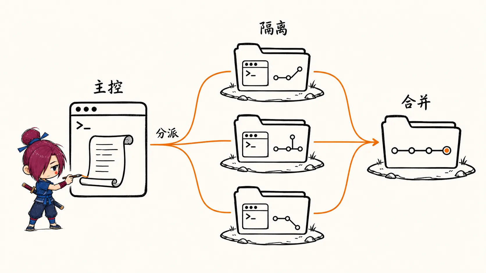

# Codex CLI 使用教程

## 为什么需要 Codex CLI

终端里写代码，最大的断点是"从想法到实现"之间的跳跃——你知道要做什么，但需要自己逐步敲出每一行命令、每一个文件。

Codex CLI 是 OpenAI 推出的终端 AI 编程助手，它可以直接理解你的需求，生成并执行代码、修改文件、运行命令。和 GitHub Copilot 补全不同，Codex CLI 是一个**自主执行的 Agent**：你描述任务，它规划并完成整个流程。

适合这样的场景：

- 在已有项目里快速实现某个功能
- 搭建新项目骨架
- 理解和重构陌生代码
- 执行重复性的工程任务（批量重命名、生成测试等）

---

## 一、安装与配置

### 前置条件

- Node.js 22 或更高版本
- OpenAI API Key（需要有 API 访问权限）

### 安装

```bash
npm install -g @openai/codex
```

验证安装：

```bash
codex --version
```

### 配置 API Key

Codex CLI 通过环境变量读取 API Key：

```bash
export OPENAI_API_KEY="sk-..."
```

推荐写入 `~/.zshrc` 或 `~/.bashrc`，避免每次手动 export：

```bash
echo 'export OPENAI_API_KEY="sk-..."' >> ~/.zshrc
source ~/.zshrc
```

也可以通过配置文件设置，Codex 会读取 `~/.codex/config.json`：

```json
{
  "model": "codex-1",
  "approvalMode": "suggest"
}
```

---

## 二、核心概念

在上手之前，有几个概念值得先理解，否则容易对 Codex 的行为感到困惑。

### 审批模式（Approval Mode）

Codex 执行任务时，需要写文件、运行命令。它提供三种模式控制这个行为：

| 模式 | 说明 | 适合场景 |
|------|------|----------|
| `suggest`（默认） | 每步操作都显示建议，需要你手动确认 | 不熟悉任务时，保守操作 |
| `auto-edit` | 自动修改文件，但运行命令仍需确认 | 代码修改类任务 |
| `full-auto` | 完全自主执行，文件和命令都不需确认 | 熟悉任务、批量自动化 |

> **建议**：刚开始使用时保持 `suggest` 模式，熟悉 Codex 的行为后再调整为 `auto-edit`。`full-auto` 模式下 Codex 会自主写文件和执行命令，需要你对任务有足够把握。

### 沙盒环境

在 macOS 上，Codex 默认在沙盒中运行命令，限制网络访问和文件系统写入范围，降低误操作风险。Linux 上使用 Docker 隔离。

### 上下文窗口

Codex 会读取当前目录的文件作为上下文。在项目根目录运行效果最好，它能感知目录结构、依赖文件、已有代码。

---

## 三、基本使用

### 交互式对话

```bash
codex
```

进入交互模式，像聊天一样描述你的需求：

```
> 帮我写一个 Express 服务，包含 /health 接口
```

Codex 会生成代码，并逐步询问是否执行每一步操作。

### 单次任务执行

```bash
codex "帮我给 src/utils.ts 里的所有函数添加 JSDoc 注释"
```

适合明确的一次性任务。

### 指定审批模式

```bash
codex --approval-mode auto-edit "重构 components/ 目录下的命名，统一改为 PascalCase"
```

### 指定工作目录

```bash
codex --cwd ./my-project "初始化一个 TypeScript 项目"
```

### 静默模式（跳过确认）

```bash
codex --full-auto "生成 README.md"
```

等价于 `--approval-mode full-auto`。

---

## 四、如何用 Codex 开发一个项目

以搭建一个 **Node.js + TypeScript REST API 项目**为例，完整走一遍流程。

### 1. 初始化项目目录

```bash
mkdir my-api && cd my-api
codex
```

### 2. 描述项目目标

在交互窗口里输入：

```
初始化一个 Node.js + TypeScript 项目，使用 Express，包含以下结构：
- src/index.ts 作为入口
- src/routes/ 放路由
- src/middleware/ 放中间件
- 配置 tsconfig.json 和 package.json
- 添加 nodemon 用于开发热重载
```

Codex 会依次：

1. 生成 `package.json` 并询问是否执行 `npm install`
2. 生成 `tsconfig.json`
3. 创建目录结构
4. 写入 `src/index.ts` 初始代码

每一步都会展示具体内容，你可以接受或修改后再继续。

### 3. 逐步添加功能

项目骨架建好后，继续在同一个 session 里追加需求：

```
添加一个 /users 路由，支持 GET 列出用户和 POST 创建用户，数据暂时存在内存里
```

Codex 会读取当前目录结构，在合适的位置新建路由文件，并更新 `index.ts` 里的注册代码。

```
给 POST /users 添加请求体校验，使用 zod
```

```
写一套针对 /users 路由的单元测试，使用 vitest
```

### 4. 处理已有代码

如果接手一个陌生项目：

```
帮我理解 src/auth/ 目录的认证逻辑，并说明用户登录的完整调用链
```

Codex 会读取相关文件并给出解释，不会修改任何内容。

---

## 五、AGENTS.md：给 Codex 写项目说明书

类似 Claude Code 的 `CLAUDE.md`，你可以在项目根目录创建 `AGENTS.md`，让 Codex 在每次启动时自动读取项目上下文：

```markdown
# 项目说明

## 技术栈
- Node.js 20 + TypeScript 5
- Express 4
- vitest 用于测试
- zod 用于校验

## 目录结构
- src/routes/ — 路由，每个文件对应一个资源
- src/middleware/ — 全局中间件
- src/services/ — 业务逻辑层

## 开发约定
- 路由文件只做参数解析和响应，业务逻辑放 services/
- 所有异步路由用 try/catch 包裹，错误统一走 errorHandler 中间件
- 新增路由必须配套写测试
```

有了 `AGENTS.md`，Codex 能更准确地判断在哪里新增代码、遵循什么风格，不需要每次都重新解释项目背景。

> `AGENTS.md` 和 `CLAUDE.md`、`GEMINI.md` 是同类文件——不同 AI 工具读取各自对应的文件。如果你同时使用多个工具，可以各自维护。

---

## 六、常用技巧

### 提问要具体，不要宽泛

效果差：

```
帮我优化代码
```

效果好：

```
src/services/userService.ts 里的 getUserById 函数有 N+1 查询问题，
帮我改成批量查询，使用 Promise.all
```

上下文越具体，Codex 生成的方案越准确，返工越少。

### 分步而不是一步到位

一次性描述过于复杂的需求，容易让 Codex 跑偏。拆成多步更可控：

```
# 第一步
先创建数据库 schema 和 migration 文件

# 第二步（确认第一步后）
再写对应的 ORM model

# 第三步
最后写 service 层和路由
```

### 用 git 做安全网

在 `full-auto` 或 `auto-edit` 模式下，建议先 commit 当前状态：

```bash
git add . && git commit -m "checkpoint before codex"
codex --approval-mode auto-edit "重构认证模块"
```

如果结果不满意，随时可以 `git checkout .` 回退。

### 结合只读模式调研代码

```
只读模式下帮我分析 src/ 目录的整体架构，不要修改任何文件
```

Codex 会给出架构分析报告，适合在动手之前先理清思路。

---

## 七、多 Agent 模式

单个 Codex 实例是串行的：一次只做一件事，做完再做下一件。对于大型任务——比如同时重构前端组件、后端 service、以及对应的测试——串行模式效率很低，而且上下文越塞越长，质量会下降。

多 Agent 模式解决的是这个问题：用一个 **Orchestrator（主控）** 拆分任务，多个 **Subagent（工作者）** 并行执行，每个人只处理自己的那一块。

### 工作原理

```
Orchestrator（主 Codex 实例）
│
├── 分析任务，拆成独立子任务
├── 为每个子任务创建独立的 git worktree
│
├── Subagent A（worktree-a）→ 实现 feature/user-service
├── Subagent B（worktree-b）→ 实现 feature/auth-middleware
└── Subagent C（worktree-c）→ 编写集成测试
│
└── 等待所有子任务完成 → 合并回主分支
```

每个 Subagent 是一个独立的 `codex` 进程，运行在独立的 worktree 里，彼此不共享文件系统状态，避免写冲突。



### 核心机制：git worktree 隔离

worktree 是 git 内置的功能，允许同一个仓库在多个目录里同时 checkout 不同分支，互不干扰：

```bash
# 主控为每个 subagent 创建独立 worktree
git worktree add ../project-agent-a feature/user-service
git worktree add ../project-agent-b feature/auth-middleware
git worktree add ../project-agent-c feature/integration-tests
```

Subagent 在各自的 worktree 目录里运行，完成后合并：

```bash
# 各 subagent 完成后，主控合并
git -C ../project-agent-a merge main
git merge feature/user-service
```

### 如何启动多 Agent 任务

Codex 支持非交互式执行，这是并行调度的基础：

```bash
# 非交互模式，full-auto，适合作为 subagent 被调度
codex --full-auto --quiet "在 src/services/userService.ts 实现 CRUD 方法"
```

一个典型的并行调度脚本：

```bash
#!/bin/bash

# 创建 worktree
git worktree add ../agent-a feature/user-service
git worktree add ../agent-b feature/auth

# 并行启动两个 subagent
codex --full-auto --quiet --cwd ../agent-a \
  "实现 userService，包含 create/read/update/delete，使用 Prisma" &

codex --full-auto --quiet --cwd ../agent-b \
  "实现 JWT 认证中间件，验证 Authorization header" &

# 等待两个任务都完成
wait

echo "两个子任务完成，开始合并"

# 清理 worktree
git worktree remove ../agent-a
git worktree remove ../agent-b
```

### AGENTS.md 在多 Agent 场景下的作用

多个 Subagent 同时运行时，每个实例都会读取项目根目录的 `AGENTS.md`。这是协调多个 Agent 行为一致性的关键——相当于团队的共同规范：

```markdown
# AGENTS.md

## 文件所有权（并行任务时）
- src/services/ — 由 user-service agent 负责，其他 agent 不要修改
- src/middleware/ — 由 auth agent 负责
- tests/ — 由 test agent 负责

## 接口约定
- service 层方法签名：async methodName(params: XxxParams): Promise<XxxResult>
- 错误统一抛出 AppError，不在 service 层 catch

## 禁止事项
- 不要修改 prisma/schema.prisma，schema 变更需要单独 migration 任务
```

> 多 Agent 场景下，`AGENTS.md` 的"文件所有权"划分非常关键，是防止写冲突的第一道防线。

---

### 坑点与注意事项

#### 1. 文件冲突：最常见的问题

多个 Agent 如果都去修改同一个文件（比如 `index.ts` 里的路由注册），合并时必然冲突。

解法：
- 任务拆分时就要保证文件级别的独立性
- 在 `AGENTS.md` 里明确写清楚每个 Agent 负责哪些文件
- **共享文件（如入口文件、类型声明）由 Orchestrator 最后统一修改**，不要交给 Subagent

#### 2. 上下文不共享

每个 Subagent 是独立进程，不知道其他 Agent 在做什么。如果 Agent A 新增了一个 util 函数，Agent B 不会感知到——它可能重复实现一遍。

解法：
- 并行任务要设计成真正独立，不要有隐式的代码依赖
- 如果 B 依赖 A 的输出，就改成串行：A 完成后再启动 B

#### 3. full-auto 模式下的静默失败

Subagent 在 `--quiet --full-auto` 模式下不会交互，出错时可能静默退出，你不知道它做了什么或做到哪一步。

解法：

```bash
# 检查退出码
codex --full-auto --quiet --cwd ../agent-a "实现 userService" 
if [ $? -ne 0 ]; then
  echo "agent-a 失败，查看日志"
  # 检查 agent-a worktree 里的状态
  git -C ../agent-a diff
fi
```

同时让每个 Subagent 在任务描述里加上"完成后输出一个 DONE 文件"，作为完成信号：

```bash
codex --full-auto --cwd ../agent-a \
  "实现 userService，完成后在根目录创建 DONE.txt 写入完成状态"
```

#### 4. worktree 分支混乱

如果 worktree 创建时没有从最新 main 分支出发，各 Subagent 的基线不一致，合并时差异会很大。

```bash
# 正确做法：先确保 main 是最新的
git checkout main && git pull

# 再创建 worktree
git worktree add ../agent-a -b feature/user-service main
git worktree add ../agent-b -b feature/auth main
```

#### 5. 并行数量不是越多越好

同时跑太多 Subagent：
- API 并发请求量大，容易触发 rate limit
- token 消耗成倍增加
- 合并冲突风险指数上升

实践中 **2 到 4 个并行 Agent** 是比较合理的范围，超过这个数量收益递减，管理成本反而更高。

---

### 什么时候用多 Agent

| 场景 | 建议 |
|------|------|
| 独立模块并行开发（互不依赖） | 适合，拆任务后并行效果好 |
| 批量生成测试文件 | 适合，每个文件独立，天然并行 |
| 跨文件重构（共享入口文件） | 不适合，冲突难处理 |
| 功能之间有接口依赖 | 不适合，改串行 |
| 探索性任务（不确定边界） | 不适合，先用单 Agent 摸清再拆 |

---

## 八、与 Claude Code 的对比

Codex CLI 和 Claude Code 功能上高度重叠，都是终端 AI 编程助手，选择时参考：

| 维度 | Codex CLI | Claude Code |
|------|-----------|-------------|
| 背后模型 | OpenAI codex-1 | Anthropic Claude |
| 上下文理解 | 强，擅长代码执行链路 | 强，擅长解释和架构分析 |
| 沙盒隔离 | 有（macOS/Docker） | 有权限确认机制 |
| 配置文件 | `AGENTS.md` | `CLAUDE.md` |
| 定价 | 按 token 计费 | 按 token 计费 / 订阅制 |
| 生态集成 | OpenAI 生态 | Anthropic 生态，MCP 支持好 |

两者并不互斥。有些团队会同时配置 `AGENTS.md` 和 `CLAUDE.md`，根据任务类型选用不同工具。

### 指令体系对比

两者都有交互式指令，但设计哲学不同：**Claude Code 的斜杠命令偏向工作流编排**，**Codex 的指令偏向执行控制**。

#### 通用功能对比

| 功能           | Claude Code                    | Codex CLI                     |
| ------------ | ------------------------------ | ----------------------------- |
| 制定计划         | `/plan` — 进入规划模式，Claude 先分析不动手 | 无专用指令，在 prompt 里加"先列出计划再执行"即可 |
| 查看帮助         | `/help`                        | `codex --help` 或交互中输入 `/help` |
| 清空上下文        | `/clear`                       | `/clear`（相同）                  |
| 退出           | `/exit`                        | `/exit` 或 `Ctrl+C`            |
| 查看当前 session | `/status`                      | 无等价指令                         |
| 内存管理         | `/memory` — 查看和编辑持久记忆          | 无，依赖 `AGENTS.md` 静态注入         |
| 执行 shell 命令  | `!<命令>` — 直接在对话中运行 shell       | 无需特殊前缀，Codex 会自己决定是否执行命令      |

#### Claude Code 有但 Codex 没有的

**`/plan` — 规划模式**

Claude Code 的 `/plan` 会让 Claude 进入只分析、不执行的状态，输出完整实施计划后等待确认。这是显式的"思考与执行分离"。

Codex 没有这个模式。变通方式是在 prompt 里明确要求：

```
先给我列出实现步骤和将要修改的文件，等我确认后再开始写代码
```

但这依赖模型自觉，不如 `/plan` 来得可靠——Codex 有时会直接开始写。

**`/memory` — 持久记忆**

Claude Code 可以在对话中动态修改持久记忆（`~/.claude/CLAUDE.md`），跨 session 记住用户偏好。

Codex 没有动态记忆机制，所有上下文都在 `AGENTS.md` 里静态写死，需要手动维护。

**`/cost` — token 消耗统计**

Claude Code 可以随时查看本次 session 的 token 用量和费用估算，方便控制成本。Codex 没有内置这个功能。

**Skills / 自定义斜杠命令**

Claude Code 支持通过 `.claude/skills/` 目录定义自定义斜杠命令，把常用工作流固化成可复用的指令（如 `/commit`、`/review`）。

Codex 目前不支持自定义指令，复用靠 shell 脚本或在 `AGENTS.md` 里写固定 prompt 片段。

#### Codex 有但 Claude Code 没有的

**审批模式切换（交互中实时切换）**

Codex 支持在交互式 session 里随时用 `/set-approval-mode` 切换审批策略，不需要重启：

```
/set-approval-mode auto-edit
```

Claude Code 的权限控制是启动时通过 `--dangerously-skip-permissions` 等参数设定，交互中无法动态切换。

**`--quiet` 无头模式**

Codex 的 `--quiet` 让它完全不输出交互提示，只输出最终结果，专门为脚本调用和多 Agent 编排设计。Claude Code 没有等价的无头模式——它始终保持交互式 UI。

这是 Codex 在多 Agent 场景下的核心优势：它可以作为一个纯粹的"执行单元"被调度，而 Claude Code 更适合作为"与人交互的主控"。

**原生沙盒（macOS）**

Codex 在 macOS 上使用系统级沙盒限制文件访问范围，即使 `full-auto` 模式也有硬边界。Claude Code 的安全机制依赖权限确认对话，没有 OS 层的硬隔离。

---

### 选择建议

- **日常编码、需要解释分析**：Claude Code，`/plan` + 逐步确认体验更好
- **大批量自动化任务、CI 集成**：Codex，`--full-auto --quiet` 更适合非交互环境
- **多 Agent 并行开发**：Codex，原生支持被调度；Claude Code 作为主控 Orchestrator
- **需要自定义工作流**：Claude Code，Skills 机制更灵活
- **团队协作、统一规范**：两者都配置各自的 context 文件，按任务类型分工

---

## 实践建议

- **新项目**：先用 `suggest` 模式从零搭架子，确认 Codex 理解了项目意图后切换到 `auto-edit`
- **已有项目**：先写好 `AGENTS.md`，让 Codex 了解项目约定，再开始修改代码
- **批量任务**（如批量加注释、重命名）：用 `full-auto` 配合 git checkpoint 最高效
- **敏感操作**（删文件、改配置）：始终保持 `suggest` 模式，每步手动确认
