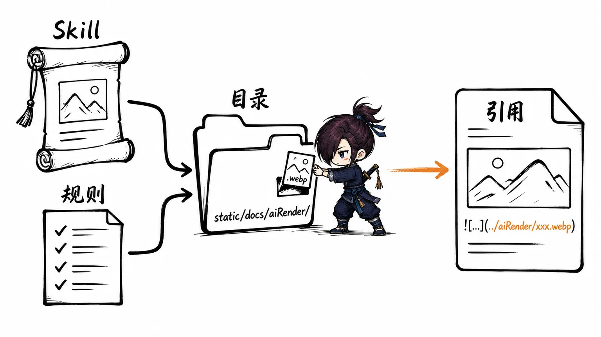
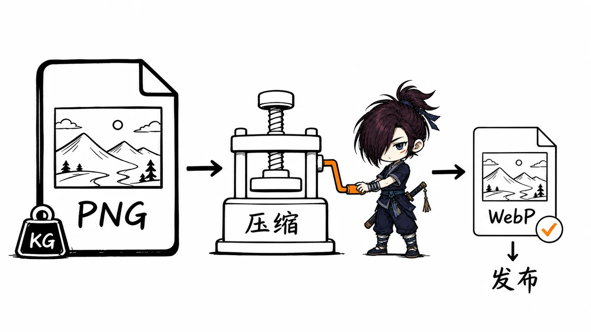
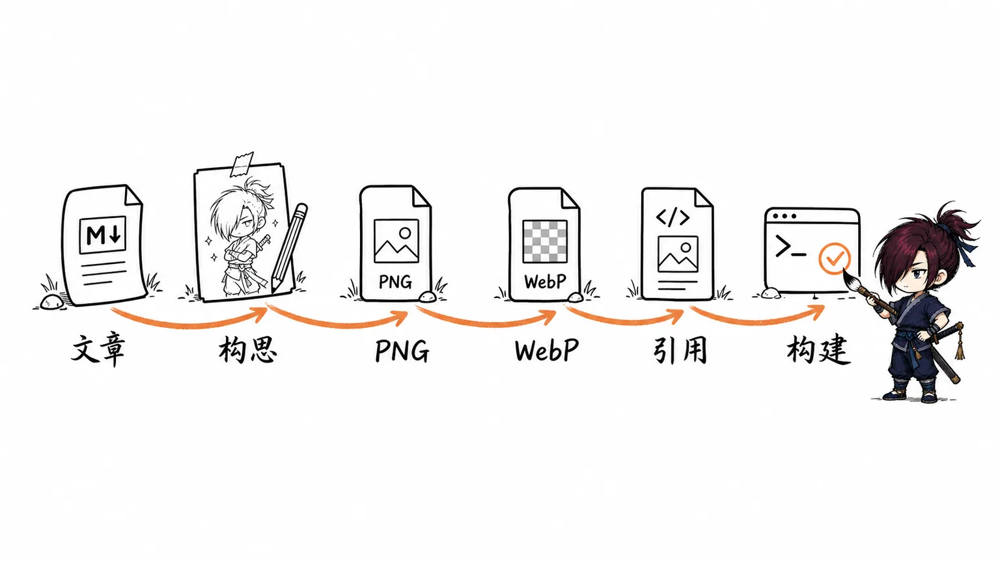

# 为笔记添加插图工作流

给知识库文章配图时，最容易遇到两个问题：

1. 图片生成可以交给 AI，但插图应该放在哪里、用什么路径、是否需要压缩，容易每次临时决定。
2. 生成出来的 PNG 往往很大，1536 × 864 的手绘插图经常超过 1MB，不适合直接作为站点文章图片使用。

---

## 一、启用文章配图 Skill

项目现在使用 Codex 辅助整理笔记和生成配图。为了让 Codex 在项目内识别文章配图工作流，需要把本地维护的 [article-metaphor-illustrator](https://github.com/justwe7/my-skillhub/tree/main/fork/article-metaphor-illustrator) Skill 软链接到项目的 `.agents/skills/` 目录。

可以直接让 Codex 执行下面这段任务：

```text
请在当前项目启用 Skill `article-metaphor-illustrator`，目标是 Codex。

要求：
- Codex: 将 /Users/debugger/bugcave/github/skills/fork/article-metaphor-illustrator 软链接到当前项目的 .agents/skills/article-metaphor-illustrator

只创建必要目录和软链接；如果目标路径已经存在且不是软链接，请先说明冲突，不要删除真实目录。如果因为沙箱限制无法创建指向项目外源目录的软链接，请按相同源路径和目标路径申请提升权限重试，不要改成复制 Skill 内容。

创建完成后请验证是否可行：检查目标路径存在、目标路径是软链接、软链接指向上面的源目录，并确认通过目标路径可以读取到 SKILL.md。最后简要报告验证结果。
```

这里选择软链接而不是复制，是为了让 Skill 的维护位置保持唯一。后续更新 `/Users/debugger/bugcave/github/skills/fork/article-metaphor-illustrator` 后，当前项目会直接使用最新版本。

---

## 二、把图片保存规则写进项目约定

只启用 Skill 还不够。AI 生成图片后，如果没有项目级规则，容易出现这些问题：

- 图片散落在不同目录
- 有的文章引用 PNG，有的引用 WebP
- 有的图片放在 `static/img/`，有的放在 `static/docs/`
- 后续维护时不知道哪张图属于哪篇文章

因此需要在项目级 `AGENTS.md` 中补充配图规则。本项目最终使用的约定是：

```md
## 编辑工作流

- Markdown 文件通过 **Obsidian** 编辑
- 图片由 Obsidian 自动存放至 `static/docs/` 目录
- Obsidian 粘贴图片沿用现有相对路径风格，例如 `../../static/docs/<图片文件名>`
- AI 生成的文章配图统一放在 `static/docs/aiRender/<文章分类>/` 目录下，例如 `static/docs/aiRender/应用上架与生态/`
- AI 生成配图最终使用 WebP；PNG 只作为临时源图
- 使用 ImageMagick 压缩为 WebP，默认质量 `82`，例如：`magick example.png -quality 82 example.webp`
- WebP 生成并验证成功后删除对应 PNG 源图；只有 WebP 生成失败或需要排查问题时才保留 PNG
- 默认将配图构思卡存档写入配图同目录：`static/docs/aiRender/<文章分类>/<文章名>-配图存档.md`，至少包含插图说明清单和构思卡摘要
- 完整生图提示词默认不写入存档；只有用户明确要求时，才补充生成提示词摘要和完整提示词
- 在文章中引用 AI 生成配图时沿用现有相对路径风格，例如 ``；不要把这类配图放到 `static/img/` 后再用 `/img/...` 引用
```

这段规则解决的是“生成之后怎么落地”的问题。Skill 负责理解文章、构思画面和生成图片；`AGENTS.md` 负责约束文件路径、格式和引用方式。



---

## 三、为什么要转成 WebP

AI 生成的文章插图通常是 PNG。PNG 适合保留无损细节，但对手绘纹理、渐变和大尺寸插图并不友好，文件体积很容易变大。

这类文章配图的使用场景是网页阅读，不是二次编辑。只要视觉质量没有明显损失，优先控制加载体积更重要。因此最终选择：

- 生成阶段保留 PNG 作为临时源图
- 发布阶段统一转成 WebP
- Markdown 中只引用 WebP

我对比过三种常见方案：

| 方案 | 特点 | 适合场景 |
|---|---|---|
| `cwebp` | Google 官方 WebP 工具，压缩稳定 | 专门做 WebP 批处理 |
| `ImageMagick` | 通用图片处理工具，能转格式、resize、批处理 | 已经安装 `magick`，希望命令统一 |
| `sharp` | Node 生态常用，适合写成脚本 | 需要接入 npm script 或自动化流水线 |

当前项目选择 `ImageMagick`，原因是命令简单，而且以后如果需要统一 resize、裁剪、转格式，也可以继续用同一个工具。

---

## 四、安装和验证 ImageMagick

安装 ImageMagick 后，先用一张已有 PNG 手动验证压缩效果。

示例命令：

```bash
magick developer-account-payment-flow.png -quality 82 output.webp
```

验证文件大小：

```bash
ls -al
```

实际测试结果：

```text
developer-account-payment-flow.png    1255137 bytes
output.webp                              57722 bytes
```

这次压缩把图片从约 `1.3MB` 降到约 `56KB`。对文章配图来说，这个结果已经足够好：页面加载压力明显降低，同时肉眼查看效果仍然可接受。

> `quality 82` 是当前项目的默认值。它不是绝对标准，只是一个比较稳妥的起点：比 90 更省体积，比 70 更不容易出现明显压缩痕迹。



---

## 五、完整配图流程

整理后，当前项目给文章添加 AI 配图的流程可以固定为 6 步。

### 1. 让 Codex 调用配图 Skill

在目标文章准备好之后，直接给 Codex 明确文件路径：

```text
$article-metaphor-illustrator 给'/Users/debugger/bugcave/Obsidian/docs/应用上架与生态/国内安卓应用市场上架指南.md'生成配图
```

Skill 会先通读文章，判断哪些段落适合配图，再根据文章结构选择流程图、结构图、关系图、对比图或概念插图。

### 2. 生成 PNG 源图

图片生成工具通常会先输出 PNG。这个阶段不要急着插入文章，先检查：

- 图片是否和文章段落有关
- 是否出现乱码文字
- 是否是横向 16:9
- 是否有明显变形或无关元素

如果图片本身不合格，应该重新生成，而不是直接压缩。

### 3. 保存到文章分类目录

AI 生成的文章配图统一放到：

```text
static/docs/aiRender/<文章分类>/
```

例如“应用上架与生态”分类下的文章配图放在：

```text
static/docs/aiRender/应用上架与生态/
```

这样做的好处是文章分类和配图目录保持一致，后续迁移或清理时更容易定位。

### 4. 转成 WebP

单张图片压缩：

```bash
magick input.png -quality 82 output.webp
```

如果还要统一尺寸，可以在同一条命令里处理：

```bash
magick input.png -resize 1536x864^ -gravity center -extent 1536x864 -quality 82 output.webp
```

这里的 `1536x864` 是严格 16:9，适合文章正文横向插图。

### 5. 在 Markdown 中引用 WebP

文章里只引用压缩后的 WebP：

```md

```

不要把这类文章配图放到 `static/img/` 后再写 `/img/...`。当前知识库的 Markdown 图片路径已经形成了相对路径风格，AI 配图也沿用这个约定，避免同一类内容出现两套路径规则。

### 6. 构建验证

图片插入后，执行构建命令：

```bash
npm run build
```

构建通过只能说明路径和 MDX 解析没有问题。图片是否适合文章，还需要在页面里再看一遍：位置是否自然、图片是否过密、是否真的帮助理解当前段落。



---

## 六、一次实际结果

这套流程在《国内安卓应用市场上架指南》里试了一次。Codex 最终插入了三张配图，压缩后的体积分别约为：

- `64KB`
- `95KB`
- `64KB`

生成结果如下：


从结果看，WebP 压缩对文章插图非常合适。PNG 源图通常在 1MB 以上，而 WebP 可以压到几十 KB，视觉效果仍然能满足正文阅读。

---

## 七、实践建议

这套流程的关键不是“生成一张漂亮图”，而是把配图变成稳定的文章生产环节。

后续给笔记添加插图时，建议遵守三条原则：

1. **先判断文章是否真的需要图。** 操作清单、参数表、命令速查不一定需要手绘插图；机制、流程、对比和关系更适合配图。
2. **图片只承担一个主要任务。** 一张图要么解释流程，要么区分概念，要么强化记忆，不要把所有内容都塞进一张图。
3. **最终只引用 WebP。** PNG 可以作为生成和排查阶段的临时文件，但正文里优先引用压缩后的 WebP。

当这三点固定下来之后，文章配图就不再是一次性的手工操作，而是可以反复执行的知识库工作流。
