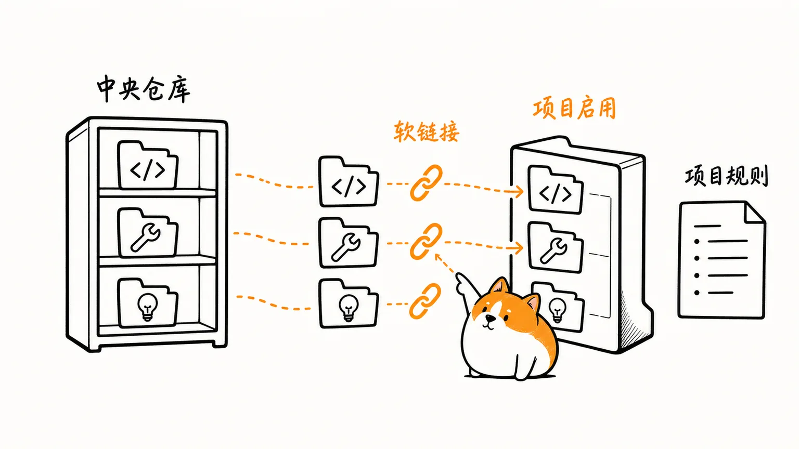
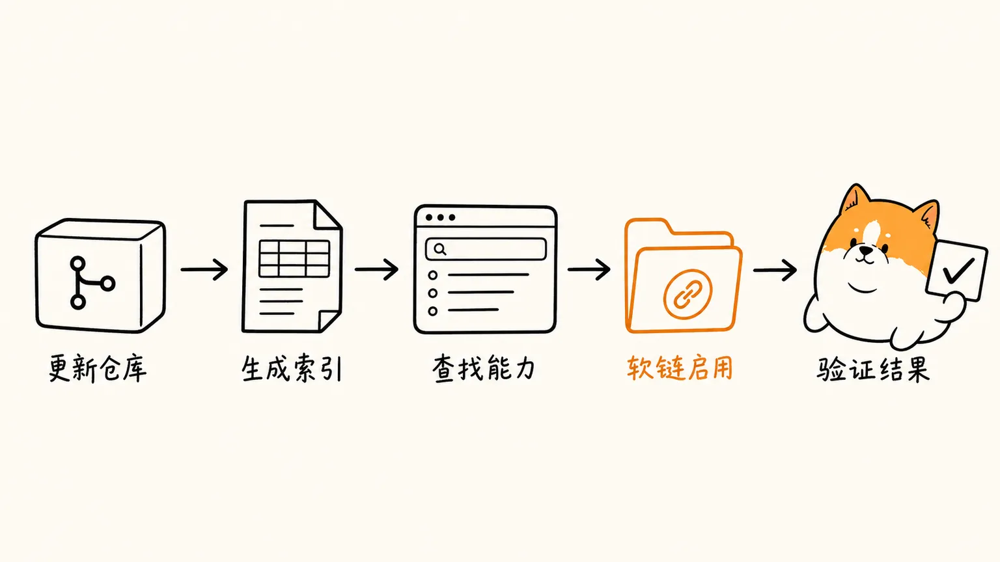

## 我的 Skill 管理方式：集中维护，项目按需启用

随着使用 Codex、Claude Code 等 coding agent 的时间变长，Skill 会越来越多。它们可能来自第三方仓库、个人 fork，也可能是自己编写的版本。

如果每个项目都复制一份 Skill，就会产生几个问题：

- 同一个 Skill 在不同项目中有多份副本
- 更新 Skill 时需要逐个项目同步
- 很难记住每个 Skill 的用途和安装方式
- Codex 和 Claude Code 的目录结构不同，容易链接到错误的位置
- 项目级 Agent 规则和通用 Skill 容易混在一起

我的做法是建立一个独立的 [https://github.com/justwe7/my-skillhub](https://github.com/justwe7/my-skillhub) 管理仓库，集中维护所有源文件，具体项目只通过软链接启用需要的 Skill。



仅仅是个人赛博洁癖的处理方案，并不是通用最佳实践，整理这套思路时参考了 dotey 在 X 上关于 Skill 管理的讨论线索。[^1]

## 仓库目录怎么划分

仓库按 Skill 的来源和用途划分为几个目录：

```text
upstream/   # 第三方原版 Skills，只更新，不直接修改
fork/       # Fork 后维护的第三方 Skills，可以本地修改
mine/       # 自己编写和维护的 Skills
npx/        # npx 安装器生成的 Skill 套件
profiles/   # 项目级 Agent 文案模板
```

个人维护的单个 Skill 通常放在：

```text
fork/<skill-name>/SKILL.md
mine/<skill-name>/SKILL.md
```

第三方原版放在 `upstream/` 中，只作为同步和对照来源。如果需要修改第三方 Skill，应将它维护在 `fork/` 中，而不是直接修改原版。

`npx/` 用来保存整套安装结果。它在索引页面中作为一个 Suite 展示，启用时再把套件里的每个子 Skill 分别链接到项目中。

`profiles/` 保存项目级 Agent 文案，例如：

```text
profiles/frontend/AGENTS.md
profiles/flutter/AGENTS.md
profiles/node/AGENTS.md
```

这些文案描述的是项目的技术栈、编码规范和协作方式，不属于通用 Skill。

## Skill 和项目级 Agent 的区别

Skill 是某一项具体能力，例如：

- 文章配图
- 文档整理
- 存储空间分析
- Git 提交信息生成
- 代码或技术方案分析

项目级 Agent 文案描述的是整个项目的工作规则，例如：

- 项目使用什么框架
- 目录结构如何组织
- 代码应该遵守什么规范
- 测试和提交应该怎么执行
- 哪些文件不能修改

因此，两者的安装方式也不同。

Skill 只通过软链接启用：

```text
中央 Skill 源文件
        ↓
项目 .agents/skills 或 .claude/skills
```

项目级 Agent 文案则可以选择：

- 复制初始化
- 整文件软链接
- 本地引用

Skill 更适合按需启用，Agent 文案则需要根据项目情况决定是否允许项目继续自定义。

## 怎么使用这个仓库

这个仓库的基本使用流程是：

```text
更新仓库
  ↓
生成索引数据
  ↓
打开 HTML 页面查找能力
  ↓
复制提示词或命令
  ↓
在目标项目中安装
  ↓
验证安装结果
```



### 1. 更新仓库

先进入 Skill 管理仓库，获取最新内容：

```sh
cd /Users/debugger/bugcave/github/my-skillhub
git pull
```

如果新增或修改了 Skill、Skill Suite 或项目级 Agent 文案，需要重新生成页面数据：

```sh
node scripts/build-registry.mjs
```

生成结果保存在：

```text
registry-data.js
```

这个文件由脚本自动生成，不应该手动编辑。

### 2. 通过 HTML 索引查找能力

Skill 数量变多后，最现实的问题是记不住：

- 当前有哪些 Skill
- 每个 Skill 适合什么场景
- 应该安装到 Codex 还是 Claude Code
- Skill 的实际源目录是什么
- 项目级 Agent 文案应该选择哪种安装方式

因此仓库提供了一个本地 HTML 索引页面：

```text
index.html
```

可以直接用浏览器打开：

```text
file:///Users/debugger/bugcave/github/my-skillhub/index.html
```

页面不需要启动服务，也不需要部署。它直接读取同目录下自动生成的 `registry-data.js`。

页面中主要有三类内容：

- Skills：单个可启用的 Skill
- Skill Suites：由多个 Skill 组成的套件
- Project Agents：项目级 Agent 文案模板

打开页面后，可以搜索目标能力，查看描述，并选择：

- 只安装到 Codex
- 只安装到 Claude Code
- 同时安装到 Codex 和 Claude Code

选择后，页面会生成两种内容：

- 可以复制给当前项目 Agent 执行的提示词
- 可以在当前项目根目录直接执行的 shell 命令

这样不需要手动记住不同 Agent 的目录结构和源文件路径。

### 3. 在项目中启用 Skill

Skill 的安装方式是软链接。

Codex 使用：

```text
.agents/skills/<skill-name>
```

Claude Code 使用：

```text
.claude/skills/<skill-name>
```

例如，在项目中启用 `article-metaphor-illustrator`：

```sh
mkdir -p .agents/skills
ln -sfn \
  "/Users/debugger/bugcave/github/my-skillhub/fork/article-metaphor-illustrator" \
  ".agents/skills/article-metaphor-illustrator"
```

Claude Code 的安装方式：

```sh
mkdir -p .claude/skills
ln -sfn \
  "/Users/debugger/bugcave/github/my-skillhub/fork/article-metaphor-illustrator" \
  ".claude/skills/article-metaphor-illustrator"
```

如果 Codex 和 Claude Code 都需要使用同一个 Skill，就分别创建两条软链接。

项目中只保存软链接，实际的 `SKILL.md` 仍然由中央仓库维护。中央仓库更新后，项目会直接读取更新后的内容。

如果目标路径已经存在且是普通目录，不应该直接删除。需要先报告冲突，确认后再处理。

### 4. 在项目中初始化 Agent 文案

项目级 Agent 文案通过页面中的 `Project Agents` 视图安装。

例如，前端项目可以使用：

```text
profiles/frontend/AGENTS.md
```

Flutter 项目可以使用：

```text
profiles/flutter/AGENTS.md
```

Node.js 项目可以使用：

```text
profiles/node/AGENTS.md
```

Codex 使用项目根目录的：

```text
AGENTS.md
```

Claude Code 使用项目根目录的：

```text
CLAUDE.md
```

两者的源文案可以共用一份 `AGENTS.md`，只是安装到 Claude Code 时目标文件名改为 `CLAUDE.md`。

#### 复制初始化

复制方式适合项目需要在模板基础上继续修改的情况：

```sh
cp \
  "/Users/debugger/bugcave/github/my-skillhub/profiles/frontend/AGENTS.md" \
  "AGENTS.md"
```

Claude Code：

```sh
cp \
  "/Users/debugger/bugcave/github/my-skillhub/profiles/frontend/AGENTS.md" \
  "CLAUDE.md"
```

如果目标文件已经存在，不应该覆盖。应当先人工合并，保留原有项目规则。

#### 整文件软链接

如果项目希望完全跟随中央模板更新，可以把项目级文件直接软链接到源文件：

```sh
ln -sfn \
  "/Users/debugger/bugcave/github/my-skillhub/profiles/frontend/AGENTS.md" \
  "AGENTS.md"
```

这种方式的同步成本最低，但项目不能独立修改这份文件。

#### 本地引用

如果项目既有自己的 `AGENTS.md`，又希望共享中央模板，适合使用本地引用：

```sh
mkdir -p .agent-profiles

ln -sfn \
  "/Users/debugger/bugcave/github/my-skillhub/profiles/frontend/AGENTS.md" \
  ".agent-profiles/frontend.agents.md"
```

然后在项目自己的 `AGENTS.md` 中补充：

```md
本项目使用共享的前端项目 Agent 规则。开始任何任务前，必须读取：

`.agent-profiles/frontend.agents.md`
```

这种方式只把共享文案作为外部规则引用，项目仍然保留自己的 Agent 文件和项目专属配置。

### 5. 验证安装结果

安装完成后，不应该只看命令是否执行成功，还要确认结果确实可用。

Skill 至少需要检查：

```sh
test -e ".agents/skills/article-metaphor-illustrator"
test -L ".agents/skills/article-metaphor-illustrator"
readlink ".agents/skills/article-metaphor-illustrator"
test -r ".agents/skills/article-metaphor-illustrator/SKILL.md"
```

需要确认：

- 目标路径存在
- 目标路径是软链接
- 软链接指向预期的中央仓库目录
- 可以通过目标路径读取 `SKILL.md`

项目级 Agent 文案则需要确认：

- 目标文件或引用文件存在
- 文件内容可以读取
- 复制方式确实复制了模板
- 软链接方式指向预期源文件
- 本地引用方式在 `AGENTS.md` 或 `CLAUDE.md` 中包含读取引用文件的说明

## 如何新增和更新 Skill

新增 Skill 时，先根据来源放入对应目录。

自己编写的 Skill：

```text
mine/<skill-name>/SKILL.md
```

Fork 后维护的第三方 Skill：

```text
fork/<skill-name>/SKILL.md
```

`SKILL.md` 建议包含 frontmatter：

```md
---
name: my-skill
description: 说明这个 Skill 适合什么时候使用。
---
```

新增或更新后，先用 Git 查看变化：

```sh
git status --short
git diff --stat
git diff -- <skill-path>
```

确认源目录和 `SKILL.md` 没有问题后，重新生成索引：

```sh
node scripts/build-registry.mjs
```

页面索引不手动维护，Skill 的新增、删除、重命名和描述变化都应该通过源目录和生成脚本完成。

## 这种方式的取舍

这种方式的主要优点是：

- Skill 内容只有一份，更新集中
- 项目可以按需启用，不会加载不需要的能力
- Codex 和 Claude Code 可以单独安装，也可以共存
- 页面可以集中搜索和生成安装方式
- 项目级 Agent 文案可以复用，同时保留项目自己的规则
- 通过软链接可以避免多个项目之间出现内容分叉

它也有一些限制：

- 项目依赖本地中央仓库，仓库路径变化后软链接可能失效
- 软链接不适合直接提交给其他没有相同目录结构的开发者
- 共享 Agent 文案更新后，可能会影响多个项目
- 使用本地引用时，Agent 必须确实读取引用文件，否则规则不会生效
- 删除或重命名 Skill 后，需要检查已有项目中的软链接

因此，这种方案更适合个人开发环境，或者团队中已经约定好中央仓库位置的场景。

## 总结

这套管理方式的核心只有三点：

1. Skill 和项目级 Agent 文案集中维护。
2. 具体项目只按需启用，不复制 Skill 内容。
3. 通过 `index.html` 查找能力并生成安装提示词或命令。

Skill 是可复用的具体能力，项目级 Agent 文案是项目规则。前者通过 `.agents/skills` 或 `.claude/skills` 软链接启用，后者根据项目需求选择复制、整文件软链接或本地引用。

中央仓库负责维护源文件，项目负责选择需要什么。这样既能保持统一管理，也能让每个项目拥有自己的开发上下文。

## 参考资料

[^1]: dotey — [关于 Skill 管理的 X 帖子](https://x.com/dotey/status/2069632132431929651)
