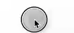

## 文本控件
### Text
用于显示简单样式文本:
```dart
Text("Hello world")
// 添加属性
Text('你好', textAlign: TextAlign.left, )
```

| API                                               | 属性             | 描述                                                           |
| ------------------------------------------------- | -------------- | ------------------------------------------------------------ |
| textAlign                                         | TextAlign.left | 对齐方式，对齐的参考系是Text widget 本身，如果宽度本身撑不满一行没有效果                   |
| maxLines: 2,<br/>overflow: TextOverflow.ellipsis, |                | 最大行数及截断方式                                                    |
| textScaleFactor                                   | init           | 理解为字体大小的em值，默认为1em。该属性的默认值可以通过MediaQueryData.textScaleFactor |
| style                                             | TextStyle      | 文本样式                                                         |
|                                                   |                |                                                              |
注意： `textScaleFactor` 属性在Flutter的未来版本中已被弃用，原因是为了准备支持更复杂的非线性文本缩放功能。作为替代，应使用新引入的 `textScaler` 属性:
```dart
textScaler: TextScaler.linear(2),
// 等同于
textScaleFactor: 2,
```
##### TextStyle
设置字体:
```dart
Text("Hello world",
  style: TextStyle(
    color: Colors.blue,
    fontSize: 18.0,
    height: 1.2,  
    fontFamily: "Courier",
    background: Paint()..color=Colors.yellow,
    decoration:TextDecoration.underline,
    decorationStyle: TextDecorationStyle.dashed
  ),
);
```

| API             | 属性                           | 描述                                                                  |
| --------------- | ---------------------------- | ------------------------------------------------------------------- |
| fontSize        | 16.0                         | `fontSize`可以精确指定字体大小，而`textScaleFactor`只能通过缩放比例来控制                  |
| height          |                              | 该属性用于指定行高，但它并不是一个绝对值，而是一个因子，具体的行高等于fontSize * height，类似于line-height |
| fontFamily      |                              |                                                                     |
| color           | Colors.red                   | 字体颜色                                                                |
| background      | Paint()..color=Colors.yellow | 背景色                                                                 |
| decoration      | TextDecoration.underline     | 字体修饰                                                                |
| decorationStyle | TextDecorationStyle.dashed   | 修饰样式                                                                |

在Dart语言中，`..` 语法称为级联操作符（cascade operator）：
```dart
var paint = Paint(); 
paint.color = Colors.yellow;
// 等同于
var paint = Paint()..color = Colors.yellow;
```

### TextSpan
Text 的所有文本内容只能按同一种样式，如果我们需要对一个 Text 内容的不同部分按照不同的样式显示，这时就可以使用`TextSpan`，比如html中段落需要超链样式的协议就比较方便:
```dart
Text.rich(TextSpan(
  children: [
      TextSpan(
        text: "Home: "
      ),
      TextSpan(
      text: "https://flutterchina.club",
      style: TextStyle(color: Colors.blue),
      recognizer: TapGestureRecognizer()..onTap = () {
        // 这里可以使用url_launcher包来打开链接
        print('Open the URL');
      },
    ),
  ]
)),
```

在`TextSpan`中，可以使用`children`属性来嵌套更多的`TextSpan`对象，以此创建一个富文本布局。但`TextSpan`只能包含其他`TextSpan`对象，不能包含`Text`或其他类型的widget。

### DefaultTextStyle
如果在 Widget 树的某一个节点处设置一个默认的文本样式，那么该节点的子树中所有文本都会默认使用这个样式，而`DefaultTextStyle`正是用于设置默认文本样式的：
```dart
DefaultTextStyle(
  //1.设置文本默认样式  
  style: TextStyle(
    color: Colors.red,
    fontSize: 20.0,
  ),
  textAlign: TextAlign.start,
  child: Column(
    crossAxisAlignment: CrossAxisAlignment.start,
    children: <Widget>[
      Text("hello world"),
      Text("I am Jack"),
      Text("I am Jack",
        style: TextStyle(
          inherit: false, //2.不继承默认样式
          color: Colors.grey
        ),
      ),
    ],
  ),
),
```

### 需求示例
#### 换行的文本右边参差不齐
在 Flutter 中使用 `TextSpan` 组件时，如果遇到换行参差不齐的问题，可能是因为不同的 `TextSpan` 具有不同的样式设置，如字体大小、字重或字体系列，这些都可能影响文本的对齐和换行。为了解决这个问题，可以尝试以下几个步骤：
##### Text的textAlign属性
在 `RichText` 组件中设置 `textAlign` 属性为 `TextAlign.justify`，这样可以使文本在水平方向上对齐，看起来更加整齐
```dart
Text(
		'我们非常重视您的隐私保护，点击“同意并继续”按钮即代表您已充分理解并同意上述协议。我们将严格保管及审慎使用您的信息，并按照成熟的安全标准采取相应措施尽全力保护您的个人信息安全。',
		textAlign: TextAlign.justify,
		style: textGreyStyle,
	  ),
```
#####  strutStyle属性
`StrutStyle` 可以用来定义一个统一的行高，它会忽略具体文本样式中的字体大小差异。通过设置 `RichText` 的 `strutStyle` 属性，可以使所有行都有相同的高度
```dart
Text(
	'xxx',
	strutStyle: StrutStyle( fontSize: 16, height: 1.2, forceStrutHeight: true, ),
)
```
## 按钮控件
Material 组件库中提供了多种按钮组件如`ElevatedButton`、`TextButton`、`OutlinedButton`等，它们都是直接或间接对`RawMaterialButton`组件的包装定制，按下时都会有“水波动画”（又称“涟漪动画”，就是点击时按钮上会出现水波扩散的动画）
现在(2024年01月)默认引入的material的版本为v3，所以默认样式与一些教程中图片展示有差异：[flutter Material3风格Button、AppBar，Material3与Material2简单对比 - 掘金](https://juejin.cn/post/7240020551404896293)

### ElevatedButton
通过style自定义按钮的样式，默认有阴影和灰色背景
```dart
ElevatedButton(
  child: Text("按钮"),
  // style: ElevatedButton.styleFrom(
  //   foregroundColor: Colors.white, // 按下时的前景色
  //   backgroundColor: Colors.blue,
  // ),
  onPressed: () {},
),
```


### TextButton
文本按钮，默认没有阴影和背景色，按下时有涟漪背景色
```dart
TextButton(
  child: Text("按钮"),
  onPressed: () {},
),
```

### OutlinedButton
带边框的按钮，默认没有阴影和背景色，按下有涟漪背景色
```dart
OutlinedButton(
  child: Text("按钮"),
  onPressed: () {},
),
```


### IconButton
不包括文字，默认没有背景，点击后会出现背景
```dart
IconButton(
  icon: Icon(Icons.add),
  onPressed: () {},
),
```


### 带图标的按钮
`ElevatedButton`、`TextButton`、`OutlinedButton`都有一个`icon` 构造函数:
```dart
ElevatedButton.icon(
  icon: Icon(Icons.send),
  label: Text("发送"),
  onPressed: () {},
),
OutlinedButton.icon(
  icon: Icon(Icons.add),
  label: Text("添加"),
  onPressed: () {},
),
TextButton.icon(
  icon: Icon(Icons.info),
  label: Text("详情"),
  onPressed: () {},
),
```


## 图片及ICON
通过`Image`组件来加载并显示图片，`Image`的数据源可以是asset、文件、内存以及网络。
`ImageProvider` 是一个抽象类，主要定义了图片数据获取的接口`load()`，从不同的数据源获取图片需要实现不同的`ImageProvider` ，如`AssetImage`是实现了从Asset中加载图片的 ImageProvider，而`NetworkImage` 实现了从网络加载图片的 ImageProvider。
### 本地图片
1. 项目根目录创建`images目录`，并将图片 avatar.png 拷贝到该目录
2. 在`pubspec.yaml`中的`flutter`部分添加目录，也可以指定文件名称:

3. 代码中加载图片：
```dart
Image.asset('images/avatar.png',
  width: 300.0,
),
// 或者
Image(
  image: AssetImage("images/avatar.png"),
  width: 100.0
);
```

### 远端
直接抛链接就好了
```dart
Image.network("https://s2.loli.net/2024/01/03/FO8skIcnBjYvuiN.png",
  height: 100.0,
),
// 或者
Image(
  image: NetworkImage("https://s2.loli.net/2024/01/03/FO8skIcnBjYvuiN.png"),
  height: 100.0,
),
```

### 远端图片资源(圆形头像)
```dart
const CircleAvatar(
  backgroundImage: NetworkImage(
      'https://s2.loli.net/2024/01/03/FO8skIcnBjYvuiN.png',
  ),
  radius: 2
  0,
),
```

### 占位图
如果考虑用户弱网或者资源过大的情况，用本地图片实现占位图：
```dart
const FadeInImage(
  placeholder: AssetImage('images/avatar.png'),
  image: NetworkImage('https://s2.loli.net/2024/01/28/BTOFjZbVe6aNnAk.png')
),
```


### Image参数
```dart
const Image({
  ...
  this.width, //图片的宽
  this.height, //图片高度
  this.color, //图片的混合色值
  this.colorBlendMode, //混合模式
  this.fit,//缩放模式
  this.alignment = Alignment.center, //对齐方式
  this.repeat = ImageRepeat.noRepeat, //重复方式
  ...
})
```

| 属性 | 值 | 描述 |
| ---- | ---- | ---- |
| width / height | 100.0 | 用于设置图片的宽、高，当不指定宽高时，图片会根据当前父容器的限制，尽可能的显示其原始大小，如果只设置`width`、`height`的其中一个，那么另一个属性默认会按比例缩放，但可以通过`fit`属性来指定适应规则 |
| fit | BoxFit.contain | 适应模式是在BoxFit中定义，它是一个枚举类型 |
| repeat | ImageRepeat.repeat | 当图片本身大小小于显示空间时，指定图片的重复规则 |
**Fit效果：**


### 实现圆角图片
通过Container裁切边缘
```dart
Container(
  width: 100,
  height: 100,
  clipBehavior: Clip.hardEdge, // 超出部分，可裁剪
  decoration: BoxDecoration(
    borderRadius: BorderRadius.circular(5),
  ),
  child: Image.asset(
    'images/home/avatar-blank.png',
    fit: BoxFit.cover,
  ),
)
```
### Icon
[3.3 图片及ICON | 《Flutter实战·第二版》](https://book.flutterchina.club/chapter3/img_and_icon.html#_3-3-2-icon)
Flutter默认包含了一套Material Design的字体图标，在`pubspec.yaml`文件中的配置:
```dart
flutter:
  uses-material-design: true
```
使用：
```dart
String icons = "";
// accessible: 0xe03e
icons += "\uE03e";
// error:  0xe237
icons += " \uE237";
// fingerprint: 0xe287
icons += " \uE287";

Text(
  icons,
  style: TextStyle(
    fontFamily: "MaterialIcons",
    fontSize: 24.0,
    color: Colors.green,
  ),
);
```

## Checkbox、Switch
本身不会保存当前选中状态，选中状态都是由父组件来管理的。当Switch或Checkbox被点击时，会触发它们的onChanged回调，我们可以在此回调中处理选中状态改变逻辑。

```dart
class SwitchAndCheckBoxTestRoute extends StatefulWidget {
  @override
  _SwitchAndCheckBoxTestRouteState createState() => _SwitchAndCheckBoxTestRouteState();
}

class _SwitchAndCheckBoxTestRouteState extends State<SwitchAndCheckBoxTestRoute> {
  bool _switchSelected=true; //维护单选开关状态
  bool _checkboxSelected=true;//维护复选框状态
  @override
  Widget build(BuildContext context) {
    return Column(
      children: <Widget>[
        Switch(
          value: _switchSelected,//当前状态
          onChanged:(value){
            //重新构建页面  
            setState(() {
              _switchSelected=value;
            });
          },
        ),
        Checkbox(
          value: _checkboxSelected,
          activeColor: Colors.red, //选中时的颜色
          onChanged:(value){
            setState(() {
              _checkboxSelected=value!;
            });
          } ,
        )
      ],
    );
  }
}
```

`Checkbox`的大小是固定的，**无法自定义**，而`Switch`只能定义宽度，**高度也是固定**的。值得一提的是`Checkbox`有一个属性`tristate` ，表示是否为三态，其默认值为`false` ，这时 Checkbox 有两种状态即“选中”和“不选中”，对应的 value 值为`true`和`false` ；如果`tristate`值为`true`时，value 的值会增加一个状态`null`

## 输入框及表单
### TextField
基础的表单界面：

```dart
TextField(
  autofocus: true,
  onChanged: (v) {
    print('onChange: $v');
  },
  decoration: const InputDecoration(
    labelText: "用户名",
    hintText: "用户名或邮箱",
    prefixIcon: Icon(Icons.person)
  ),
),
const TextField(
  decoration: InputDecoration(
    labelText: "密码",
    hintText: "您的登录密码",
    prefixIcon: Icon(Icons.lock)
  ),
  obscureText: true, // 是否隐藏输入内容
),
```

#### 获取输入的内容
1. 可以通过`onChanged`回调来获取
2. 通过`controller`直接获取：
```dart
//定义一个controller
TextEditingController _unameController = TextEditingController();

TextField(
    autofocus: true,
    controller: _unameController, //设置controller
    ...
)

print(_unameController.text)
```
#### 监听输入变化
1. 同样可以通过`onChanged`获取
2. 通过`controller`监听：
```dart
@override
void initState() {
  //监听输入改变  
  _unameController.addListener((){
    print(_unameController.text);
  });
}
```
`onChanged`是专门用于监听文本变化，而`controller`的功能却多一些，除了能监听文本变化外，它还可以设置默认值、选择文本:
```dart
final TextEditingController foo = TextEditingController(text: '张三');

void initState() {
	super.initState();
	// 定时器3秒后
	Future.delayed(const Duration(seconds: 3), () {
	  foo.text = 'San Zhang';
	});
}

TextField(
  controller: foo,
)
```
#### 控制焦点
1. `autofocus`属性可以控制自动聚焦
2. 也可以通过`FocusNode`和`FocusScopeNode`来控制，我们可以通过`FocusScope.of(context)` 来获取Widget树中默认的`FocusScopeNode`:
```dart
final FocusNode focusNodeFoo = FocusNode(); // 焦点
final FocusNode focusNodeBar = FocusNode();

TextField(
	controller: foo,
	focusNode: focusNodeFoo, // 焦点
), // 输入框组件
TextField(
	controller: bar,
	focusNode: focusNodeBar, // 焦点
), // 输入框组件
ElevatedButton(
	onPressed: () {
	  print('表单内容为${foo.text}');  // 笔记：如果为简单数据可以直接 $foo
	  print('表单内容为${bar.text}');
	  
	  FocusScope.of(context).unfocus(); // 如果是通过聚焦密码框聚焦的，那么提交后需要取消聚焦
	}, child: Text('提交'))
,
ElevatedButton(
	onPressed: () {
	  FocusScope.of(context).requestFocus(focusNodeBar); // 焦点聚焦
	}, child: Text('聚焦密码框'))
,
```
#### 自定义样式
通过`decoration`属性来定义输入框样式：
```dart
decoration: const InputDecoration( // 笔记：InputDecoration 为输入框的装饰器
  // 未获得焦点，去掉下划线
  enabledBorder: InputBorder.none,
  //获得焦点下划线设为蓝色
  focusedBorder: UnderlineInputBorder(
    borderSide: BorderSide(color: Colors.blue),
  ),
  labelText: '密码',
  hintText: '请输入密码',
  prefixIcon: Icon(Icons.password),
  border: OutlineInputBorder(),
),
```
直接通过InputDecoration的enabledBorder和focusedBorder来分别设置了输入框在未获取焦点和获得焦点后的下划线颜色，还有一种通过`Theme` Widget定义的方式：
```dart
Theme(
  data: Theme.of(context).copyWith(
      hintColor: Colors.grey[200], //定义下划线颜色
      inputDecorationTheme: InputDecorationTheme(
          labelStyle: TextStyle(color: Colors.red),//定义label字体样式
          hintStyle: TextStyle(color: Colors.yellow, fontSize: 14.0)//定义提示文本样式
      )
  ),
  child: Column(
    children: <Widget>[
      TextField(
        decoration: InputDecoration(
            labelText: "用户名",
            hintText: "用户名或邮箱",
            prefixIcon: Icon(Icons.person)
        ),
      ),
      TextField(
        decoration: InputDecoration(
            prefixIcon: Icon(Icons.lock),
            labelText: "密码",
            hintText: "您的登录密码",
            hintStyle: TextStyle(color: Colors.grey, fontSize: 13.0)
        ),
        obscureText: true,
      )
    ],
  )
),
```
组件中decoration优先级高于Theme
> 通过这种组件组合的方式，也可以定义背景圆角等。一般来说，优先通过`decoration`来自定义样式，如果`decoration`实现不了，再用widget组合的方式。

#### 完整示例
```dart
class Home extends StatefulWidget {
  const Home({super.key});

  @override
  State<Home> createState() => _HomeState();
}

class _HomeState extends State<Home> {
  final TextEditingController foo = TextEditingController(text: '张三'); // 控制器
  final TextEditingController bar = TextEditingController();

  final FocusNode focusNodeFoo = FocusNode(); // 焦点
  final FocusNode focusNodeBar = FocusNode();

  @override
  void initState() {
    super.initState();
    foo.addListener(() { // 监听输入
      print('controller监听: ${foo.text}');
    });
    focusNodeBar.addListener((){ // 监听焦点变化
      print('focusNodeBar: ${focusNodeBar.hasFocus}');
    });
    // 定时器3秒后
    Future.delayed(const Duration(seconds: 3), () {
      foo.text = 'San Zhang';
    });
  }

  @override
  void dispose() {
    foo.dispose(); // 释放控制器资源
    super.dispose();
  }

  @override
  Widget build(BuildContext context) {
    return Scaffold(
      appBar: AppBar(
        title: const Text(
          '表单',
          style: TextStyle(
            fontSize: 20.0,
            color: Colors.white,
          ),
        ),
        backgroundColor: const Color(0xFFFF0000), // ARGB(FF, FF, 0, 0)
      ),
      body: Column(
        children: [
          TextField(
            controller: foo,
            focusNode: focusNodeFoo, // 焦点
            decoration: const InputDecoration(
              labelText: '用户名',
              hintText: '请输入用户名',
              prefixIcon: Icon(Icons.person),
            ),
          ), // 输入框组件
          TextField(
            controller: bar,
            focusNode: focusNodeBar, // 焦点
            decoration: const InputDecoration( // 笔记：InputDecoration 为输入框的装饰器
              // 未获得焦点，去掉下划线
              enabledBorder: InputBorder.none,
              //获得焦点下划线设为蓝色
              focusedBorder: UnderlineInputBorder(
                borderSide: BorderSide(color: Colors.blue),
              ),
              labelText: '密码',
              hintText: '请输入密码',
              prefixIcon: Icon(Icons.password),
              border: OutlineInputBorder(),
            ),
            obscureText: true, // 隐藏文本
            keyboardType: TextInputType.number, // 唤起的键盘类型，并非限制输入类型
            maxLength: 10,
            onChanged: (val) {
              print('onChanged: $val');
            },
            // 限制输入数字类型
            inputFormatters: [
              FilteringTextInputFormatter.digitsOnly, // 只允许输入数字
              LengthLimitingTextInputFormatter(6), // 限制长度
            ],
          ), // 输入框组件
          ElevatedButton(
            onPressed: () {
              print('表单内容为${foo.text}');  // 笔记：如果为简单数据可以直接 $foo
              print('表单内容为${bar.text}');
              
              FocusScope.of(context).unfocus(); // 如果是通过聚焦密码框聚焦的，那么提交后需要取消聚焦
            }, child: Text('提交'))
          ,
          ElevatedButton(
            onPressed: () {
              FocusScope.of(context).requestFocus(focusNodeBar); // 焦点聚焦
            }, child: Text('聚焦密码框'))
          ,
        ],
      ),
    );
  }
}

```

### 表单Form
#### Form
`Form`继承自`StatefulWidget`对象，它对应的状态类为`FormState`:
```dart
Form({
  required Widget child,
  bool autovalidate = false,
  WillPopCallback onWillPop,
  VoidCallback onChanged,
})
```
#### FormField
`Form`的子孙元素必须是`FormField`类型，`FormField`是一个抽象类，定义几个属性，`FormState`内部通过它们来完成操作。
为了方便使用，Flutter 还提供了一个`TextFormField`组件，它继承自`FormField`类，也是`TextField`的一个包装类，所以除了`FormField`定义的属性之外，它还包括`TextField`的属性。
`FormField`部分定义如下：
```dart
const FormField({
  ...
  FormFieldSetter<T> onSaved, //保存回调
  FormFieldValidator<T>  validator, //验证回调
  T initialValue, //初始值
  bool autovalidate = false, //是否自动校验。
})
```
#### FormState
`FormState`为`Form`的`State`类，可以通过`Form.of()`或`GlobalKey`获得。我们可以通过它来对`Form`的子孙`FormField`进行统一操作。我们看看其常用的三个方法：
- `FormState.validate()`：调用此方法后，会调用`Form`子孙`FormField的validate`回调，如果有一个校验失败，则返回false，所有校验失败项都会返回用户返回的错误提示。
- `FormState.save()`：调用此方法后，会调用`Form`子孙`FormField`的`save`回调，用于保存表单内容
- `FormState.reset()`：调用此方法后，会将子孙`FormField`的内容清空。
#### 示例
1. 用户名不能为空，如果为空则提示“用户名不能为空”。
2. 密码不能少于 6 位，如果小于 6 为则提示“密码不能少于 6 位”。
```dart
import 'package:flutter/material.dart';

// 定义FormTestRoute类，它是一个有状态的widget，用于展示表单
class FormTestRoute extends StatefulWidget {
  const FormTestRoute({super.key});

  @override
  _FormTestRouteState createState() => _FormTestRouteState();
}

// 定义_FormTestRouteState类，它是FormTestRoute的状态类
class _FormTestRouteState extends State<FormTestRoute> {
  // 定义两个TextEditingController，分别用于控制用户名和密码输入框
  final TextEditingController _unameController = TextEditingController();
  final TextEditingController _pwdController = TextEditingController();

  // 定义一个global key，用于获取FormState
  final GlobalKey _formKey = GlobalKey<FormState>();

  @override
  Widget build(BuildContext context) {
    // 使用Form widget来收集和校验输入内容
    return Form(
      key: _formKey, // 设置globalKey，用于后面获取FormState
      autovalidateMode: AutovalidateMode.onUserInteraction, // 设置表单自动校验模式
      child: Column(
        children: <Widget>[
          // 用户名输入框
          TextFormField(
            autofocus: true, // 自动获取焦点
            controller: _unameController, // 设置控制器
            decoration: const InputDecoration( // 设置装饰器
              labelText: "用户名", // 标签文本
              hintText: "用户名或邮箱", // 占位文本
              icon: Icon(Icons.person), // 左侧图标
            ),
            // 校验用户名函数
            validator: (v) {
              return v!.trim().isNotEmpty ? null : "用户名不能为空"; // 判断用户名是否为空
            },
          ),
          // 密码输入框
          TextFormField(
            controller: _pwdController, // 设置控制器
            decoration: const InputDecoration( // 设置装饰器
              labelText: "密码", // 标签文本
              hintText: "您的登录密码", // 占位文本
              icon: Icon(Icons.lock), // 左侧图标
            ),
            obscureText: true, // 密码隐藏
            // 校验密码函数
            validator: (v) {
              return v!.trim().length > 5 ? null : "密码不能少于6位"; // 判断密码长度是否大于5
            },
          ),
          // 登录按钮
          Padding(
            padding: const EdgeInsets.only(top: 28.0), // 上边距
            child: Row(
              children: <Widget>[
                Expanded(
                  child: ElevatedButton(
                    child: const Padding(
                      padding: EdgeInsets.all(16.0), // 内边距
                      child: Text("登录"), // 按钮文本
                    ),
                    onPressed: () {
                      // 当按钮按下时的处理函数
                      // 通过_formKey.currentState 获取FormState后，
                      // 调用validate()方法校验用户名密码是否合法，校验
                      // 通过后再提交数据。
                      if ((_formKey.currentState as FormState).validate()) {
                        // 验证通过后的操作
                        // 获取表单数据
                        print('用户名：${_unameController.text}'); // 打印用户名
                        print('密码：${_pwdController.text}'); // 打印密码
                      }
                    },
                  ),
                ),
              ],
            ),
          )
        ],
      ),
    );
  }
}

```

> `validator` 函数必须是一个同步函数，它不能是异步的。这是因为`validator`需要立即返回一个字符串作为错误信息，或者返回`null`表示输入是有效的。

#### 实现一个异步校验
```dart
class _FormTestRouteState extends State<FormTestRoute> {
  // ... 其他代码

  String? _usernameError;

  // 用户名异步校验函数
  void _validateUsername(String value) async {
    // 模拟网络请求检查用户名
    final bool usernameExists = await checkUsernameExist(value);
    setState(() {
      // 根据异步结果设置错误信息
      _usernameError = usernameExists ? '用户名已存在' : null;
    });
  }

  @override
  Widget build(BuildContext context) {
    return Form(
      // ... 其他代码
      child: Column(
        children: <Widget>[
          TextFormField(
            // ... 其他装饰器代码
            onChanged: (value) {
              // 当用户停止输入一段时间后进行异步校验
              debounce(_validateUsername(value));
            },
            // 校验用户名（同步）
            validator: (value) {
              // 直接返回异步校验后设置的错误信息
              return _usernameError;
            },
          ),
          // ... 其他 TextFormField 和按钮代码
        ],
      ),
    );
  }
  
  // 防抖函数，用于延迟执行校验
  void debounce(VoidCallback callback, {Duration duration = const Duration(milliseconds: 500)}) {
    // ... 防抖实现代码
  }
  
  Future<bool> checkUsernameExist(String username) async {
    // ... 异步请求服务器检查用户名
  }
}
```

## 颜色和主题
### Color
`Color`是一个不可变的类，用于表示颜色。它使用32位整数来表示颜色值，该整数通常以16进制形式提供，遵循ARGB格式，即Alpha（透明度）、Red（红色）、Green（绿色）和Blue（蓝色）

#### 构造
Flutter提供了几种方式来创建`Color`对象：
**一、直接使用颜色代码**
通过提供一个16进制的颜色代码来创建`Color`对象，例如`Color(0xFF42A5F5)`。这里`0xFF`是Alpha值，`42`是Red值，`A5`是Green值，`F5`是Blue值：
```dart
// 如果颜色固定可以直接使用整数值
Color blue = Color(0xFF42A5F5);

//颜色是一个字符串变量
var c = "42A5F5";
Color(int.parse(c,radix:16)|0xFF000000) //通过位运算符将Alpha设置为FF
Color(int.parse(c,radix:16)).withAlpha(255)  //通过方法将Alpha设置为FF
```
**二、使用预定义的颜色**
Flutter的`material`库中定义了一系列预设的颜色，可以直接使用，例如`Colors.blue`:
```dart
static const MaterialColor blue = MaterialColor(
  _bluePrimaryValue,
  <int, Color>{
     50: Color(0xFFE3F2FD),
    100: Color(0xFFBBDEFB),
    200: Color(0xFF90CAF9),
    300: Color(0xFF64B5F6),
    400: Color(0xFF42A5F5),
    500: Color(_bluePrimaryValue),
    600: Color(0xFF1E88E5),
    700: Color(0xFF1976D2),
    800: Color(0xFF1565C0),
    900: Color(0xFF0D47A1),
  },
);
static const int _bluePrimaryValue = 0xFF2196F3;
```

> `MaterialColor`是实现Material Design中的颜色的类，它包含一种颜色的10个级别的渐变色。`MaterialColor`通过"[]"运算符的索引值来代表颜色的深度，有效的索引有：50，100，200，…，900，数字越大，颜色越深: `Colors.red[300]`效果等同于`Colors.red.shade300`。
> `MaterialColor`的默认值为索引等于500的颜色。

**三、使用ARGB方法**
通过指定Alpha、Red、Green和Blue的值来创建颜色。每个值的范围是0-255
```dart
Color customColor = Color.fromARGB(255, 66, 165, 245); // 蓝色
```
**四、使用RGBO**
与`fromARGB`类似，但是Alpha值的范围是0.0-1.0
```dart
Color customColor = Color.fromRGBO(66, 165, 245, 1.0); // 同样的蓝色，不透明
```

#### 不透明度
```dart
backgroundColor: Colors.red.withOpacity(0.5),
backgroundColor: const Color.fromARGB(30, 255, 0, 0), // 不透明度(0-255), r, g, b
backgroundColor: Color.fromRGBO(255, 0, 0, 0), // r, g, b, 不透明度(0-1),
```

#### 颜色亮度
`computeLuminance()` 是 Flutter 中 `Color` 类的一个方法，它用于计算颜色的相对亮度。这个方法返回一个 `double` 类型的值，范围从 0.0（完全黑）到 1.0（完全白）。
颜色的亮度是根据人类视觉对不同颜色的敏感度计算出来的。具体来说，对绿色的敏感度最高，其次是红色，对蓝色的敏感度最低。`computeLuminance()` 方法就是基于这样的权重计算颜色的亮度。

假设你有一个颜色 `Color color = Color(0xFF42A5F5);`，通过 `luminance` 值可以用来判断颜色是偏亮还是偏暗，进而决定使用什么颜色的文本或其他元素以确保良好的可读性。例如，如果背景颜色较暗（亮度低），可能需要使用白色或浅色文本：
```dart
double luminance = color.computeLuminance();
// 如果 `luminance` 小于 0.5，意味着背景颜色偏暗，所以选择白色文本；否则，如果背景颜色偏亮，选择黑色文本
Color textColor = luminance < 0.5 ? Colors.white : Colors.black;
```

#### 注意事项
- 当使用16进制颜色值时，记得加上前缀`0xFF`。这是因为Flutter中的颜色是完全不透明的，即Alpha值为`FF`。
- 使用颜色时考虑可访问性和对比度，确保文本和背景颜色组合在各种设备和光照条件下都清晰可见。

### Theme
`Theme`是一种通过单一配置来统一应用程序整体视觉样式的方式。`Theme`不仅定义了应用程序的颜色方案和字体样式，还会影响按钮、文本框等多种widget的默认样式。
```dart
ThemeData({
  Brightness? brightness, //深色还是浅色
  MaterialColor? primarySwatch, //主题颜色样本，见下面介绍
  Color? primaryColor, //主色，决定导航栏颜色
  Color? cardColor, //卡片颜色
  Color? dividerColor, //分割线颜色
  ButtonThemeData buttonTheme, //按钮主题
  Color dialogBackgroundColor,//对话框背景颜色
  String fontFamily, //文字字体
  TextTheme textTheme,// 字体主题，包括标题、body等文字样式
  IconThemeData iconTheme, // Icon的默认样式
  TargetPlatform platform, //指定平台，应用特定平台控件风格
  ColorScheme? colorScheme,
  ...
})
```

#### 使用
`Theme`数据通常在应用程序的根部设置，通过`MaterialApp`的`theme`属性来指定：
```dart
MaterialApp(
  theme: ThemeData(
    primarySwatch: Colors.blue,
    accentColor: Colors.green,
    brightness: Brightness.light,
    textTheme: TextTheme(
      headline1: TextStyle(fontSize: 36.0, fontWeight: FontWeight.bold),
      bodyText1: TextStyle(fontSize: 14.0, fontFamily: 'Hind'),
    ),
  ),
  home: MyHomePage(),
)
```

#### 访问当前Theme
在应用程序的任何地方使用`Theme.of(context)`来访问最近的`Theme`数据：
```dart
Widget build(BuildContext context) {
  // 使用Theme.of(context)来获取当前ThemeData
  final ThemeData theme = Theme.of(context);

  return Container(
    // 使用ThemeData中的颜色和样式
    color: theme.primaryColor,
    child: Text(
      'Hello, Theme!',
      style: theme.textTheme.headline1,
    ),
  );
}
```

#### 修改局部主题
要修改应用中某个特定区域的主题，可以使用`Theme` widget来覆盖全局主题。这对于某个屏幕或应用的某个部分需要不同于全局主题的情况特别有用：
```dart
class ThemeTestRoute extends StatefulWidget {
  @override
  _ThemeTestRouteState createState() => _ThemeTestRouteState();
}

class _ThemeTestRouteState extends State<ThemeTestRoute> {
  var _themeColor = Colors.teal; //当前路由主题色

  @override
  Widget build(BuildContext context) {
    ThemeData themeData = Theme.of(context);
    return Theme(
      data: ThemeData(
          primarySwatch: _themeColor, //用于导航栏、FloatingActionButton的背景色等
          iconTheme: IconThemeData(color: _themeColor) //用于Icon颜色
      ),
      child: Scaffold(
        appBar: AppBar(title: Text("主题测试")),
        body: Column(
          mainAxisAlignment: MainAxisAlignment.center,
          children: <Widget>[
            //第一行Icon使用主题中的iconTheme
            Row(
                mainAxisAlignment: MainAxisAlignment.center,
                children: <Widget>[
                  Icon(Icons.favorite),
                  Icon(Icons.airport_shuttle),
                  Text("  颜色跟随主题")
                ]
            ),
            //为第二行Icon自定义颜色（固定为黑色)
            Theme(
              data: themeData.copyWith(
                iconTheme: themeData.iconTheme.copyWith(
                    color: Colors.black
                ),
              ),
              child: Row(
                  mainAxisAlignment: MainAxisAlignment.center,
                  children: <Widget>[
                    Icon(Icons.favorite),
                    Icon(Icons.airport_shuttle),
                    Text("  颜色固定黑色")
                  ]
              ),
            ),
          ],
        ),
        floatingActionButton: FloatingActionButton(
            onPressed: () =>  //切换主题
                setState(() =>
                _themeColor =
                _themeColor == Colors.teal ? Colors.blue : Colors.teal
                ),
            child: Icon(Icons.palette)
        ),
      ),
    );
  }
}
```