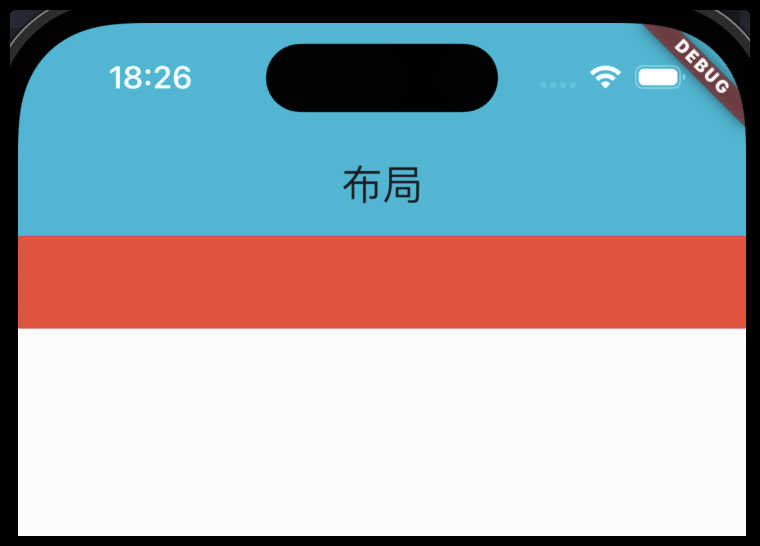

## 布局控件简介
布局类组件都会包含一个或多个子组件，不同的布局类组件对子组件排列（layout）方式不同：
**为什么不是`Text`这种控件?** 
我理解`Text`只是`RenderObject`的一个最终实现，可以查看: [2.2 Widget 简介 | 《Flutter实战·第二版》](https://book.flutterchina.club/chapter2/flutter_widget_intro.html#_2-2-3-flutter%E4%B8%AD%E7%9A%84%E5%9B%9B%E6%A3%B5%E6%A0%91)

|Widget|说明|用途|
|---|---|---|
|LeafRenderObjectWidget|非容器类组件基类|Widget树的叶子节点，用于没有子节点的widget，通常基础组件都属于这一类，如Image。|
|SingleChildRenderObjectWidget|单子组件基类|包含一个子Widget，如：ConstrainedBox、DecoratedBox等|
|MultiChildRenderObjectWidget|多子组件基类|包含多个子Widget，一般都有一个children参数，接受一个Widget数组。如Row、Column、Stack等|

## 布局原理与约束（constraints）
尺寸限制类容器用于限制容器大小，Flutter中提供了多种这样的容器，如`ConstrainedBox`、`SizedBox`、`UnconstrainedBox`、`AspectRatio` 等

### Flutter布局流程如下：
1. 上层组件向下层组件传递约束（constraints）条件。
2. 下层组件确定自己的大小，然后告诉上层组件。注意下层组件的大小必须符合父组件的约束。
3. 上层组件确定下层组件相对于自身的偏移和确定自身的大小（大多数情况下会根据子组件的大小来确定自身的大小）。
> 父组件传递给子组件的约束是“最大宽高不能超过100，最小宽高为0”，如果我们给子组件设置宽高都为200，则子组件最终的大小是100\*100，**因为任何时候子组件都必须先遵守父组件的约束**，在此基础上再应用子组件约束（相当于父组件的约束和自身的大小求一个交集）。

### 盒模型布局组件有两个特点：
1. 组件对应的渲染对象都继承自 RenderBox 类。在本书后面文章中如果提到某个组件是 RenderBox，则指它是基于盒模型布局的，而不是说组件是 RenderBox 类的实例。
2. 在布局过程中父级传递给子级的约束信息由 BoxConstraints 描述。
### BoxConstraints
BoxConstraints 是盒模型布局过程中父渲染对象传递给子渲染对象的约束信息，包含最大宽高信息，子组件大小需要在约束的范围内，BoxConstraints 默认的构造函数如下：
```dart
const BoxConstraints({
  this.minWidth = 0.0, //最小宽度
  this.maxWidth = double.infinity, //最大宽度
  this.minHeight = 0.0, //最小高度
  this.maxHeight = double.infinity //最大高度
})
```
BoxConstraints还定义了一些便捷的构造函数用于快速生成特定限制规则的BoxConstraints，如：
- `BoxConstraints.tight(Size size)`，它可以生成固定宽高的限制；
- `BoxConstraints.expand()`可以生成一个尽可能大的用以填充另一个容器的BoxConstraints。
### ConstrainedBox
```dart
class Home extends StatelessWidget {
  const Home({super.key}); // 将构造函数改为常量构造函数

  final Widget redBox = const DecoratedBox( // 红色盒子不指定高度
    decoration: BoxDecoration(color: Colors.red),
  );

  @override
  // demo1 文本控件
  Widget build(BuildContext context) {
    return Scaffold(
      appBar: AppBar(
        title: const Text(
          '布局',
        ),
        centerTitle: true, // 文本居中
        backgroundColor: Colors.cyanAccent.shade700,
      ),
      body: ConstrainedBox(
        constraints: const BoxConstraints(
            minWidth: double.infinity, //宽度尽可能大
            minHeight: 50.0 //最小高度为50像素
            ),
        child: Container(
          height: 1.0,
          child: redBox,
        ),
      ),
    );
  }
}

```

在这个例子中，`ConstrainedBox` 强制其子widget至少有 `50.0` 的高度，但 `Container` widget的高度被设置为 `1.0`，违反了这个约束。
当发生这种约束冲突时，Flutter会尝试解决这个问题，通常是通过忽略掉一些约束来避免布局失败。在这种情况下，`Container` 的实际高度将会是 `50.0`，而不是 `1.0`，因为 `ConstrainedBox` 的约束优先级更高。

### SizedBox
实际上`SizedBox`只是`ConstrainedBox`的一个定制，
```dart
SizedBox(
  width: 80.0,
  height: 80.0,
  child: redBox
)
// 等同于
ConstrainedBox(
  constraints: BoxConstraints.tightFor(width: 80.0,height: 80.0),
  child: redBox, 
)
```

> 实际上`ConstrainedBox`和`SizedBox`都是通过`RenderConstrainedBox`来渲染的，我们可以看到`ConstrainedBox`和`SizedBox`的`createRenderObject()`方法都返回的是一个`RenderConstrainedBox`对象

### 多重限制
如果某一个组件有多个父级`ConstrainedBox`限制：
```dart
ConstrainedBox(
  constraints: BoxConstraints(minWidth: 90.0, minHeight: 20.0),
  child: ConstrainedBox(
    constraints: BoxConstraints(minWidth: 60.0, minHeight: 60.0),
    child: redBox,
  )
)
```
- **最小宽度和高度** (`minWidth`, `minHeight`): 子Widget的最小尺寸会取决于它自身的限制和父Widget限制中较大的值。
- **最大宽度和高度** (`maxWidth`, `maxHeight`): 子Widget的最大尺寸会取决于它自身的限制和父Widget限制中较小的值。
### UnconstrainedBox
`UnconstrainedBox`是Flutter中的一个布局widget，它对其子widget不施加任何约束，这意味着子widget可以根据其自身大小任意绘制，而不受父widget的限制。这在某些布局场景中非常有用，特别是想要让子widget完全按照其自身的大小需求来布局时。

> `UnconstrainedBox`对父组件限制的“去除”并非是真正的去除：上面例子中虽然红色区域大小是90×20，但上方仍然有80的空白空间。也就是说父限制的`minHeight`(100.0)仍然是生效的，只不过它不影响最终子元素`redBox`的大小，但仍然还是占有相应的空间，可以认为此时的父`ConstrainedBox`是作用于子`UnconstrainedBox`上，而`redBox`只受子`ConstrainedBox`限制。
那么有什么方法可以彻底去除父`ConstrainedBox`的限制吗？答案是否定的！请牢记，**任何时候子组件都必须遵守其父组件的约束**，所以在此提示读者，在定义一个通用的组件时，如果要对子组件指定约束，那么一定要注意，因为一旦指定约束条件，子组件自身就不能违反约束。

#### 注意事项
虽然`UnconstrainedBox`提供了布局的灵活性，但也应谨慎使用，因为它可能导致以下问题：
- **布局溢出**：如果`UnconstrainedBox`的子widget超出了可视区域，可能会出现布局溢出的情况，Flutter会在界面上显示溢出警告（黄黑相间的斜条）。
- **性能问题**：在某些情况下，如果`UnconstrainedBox`内部的widget非常复杂，且尺寸很大，可能会对性能产生负面影响。


在实际开发中，当我们发现已经使用 `SizedBox` 或 `ConstrainedBox`给子元素指定了固定宽高，但是仍然没有效果时，几乎可以断定：已经有父组件指定了约束！举个例子，如 Material 组件库中的`AppBar`（导航栏）的右侧菜单会限制子组件的宽高，所以可以通过`UnconstrainedBox`去除限制:
```dart
AppBar(
  title: Text(title),
  actions: <Widget>[
    UnconstrainedBox(
      child: SizedBox(
        width: 20,
        height: 20,
        child: CircularProgressIndicator(
          strokeWidth: 3,
          valueColor: AlwaysStoppedAnimation(Colors.white70),
        ),
      ),
    )
  ],
)

```