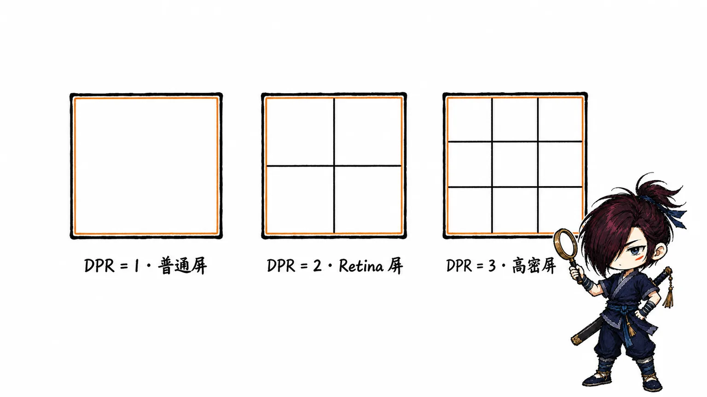
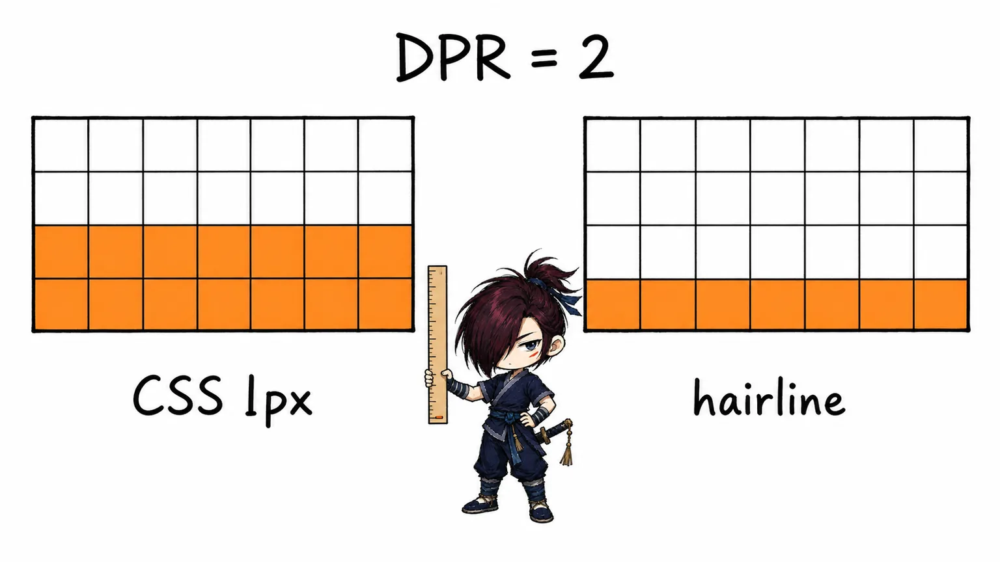
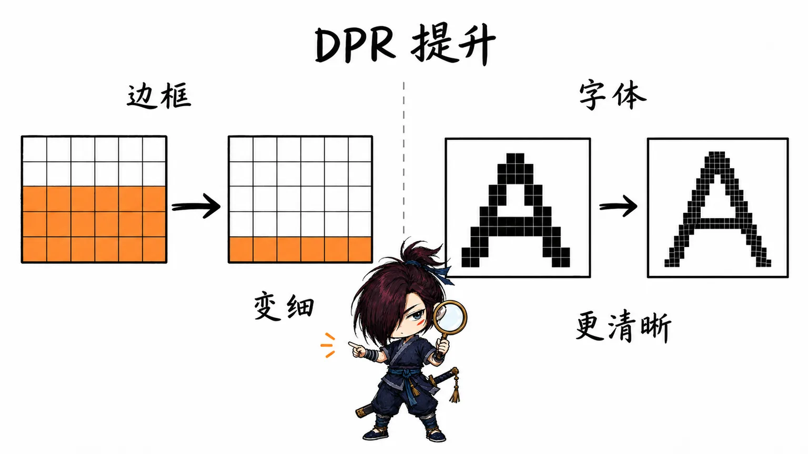

`1px` 在普通屏、Retina 屏和手机上究竟是不是一样粗？为什么移动端经常要处理“1px 边框”，字体却仍然可以写成 `16px`？`px`、`rem`、`vw`、`dvh` 和 `clamp()` 又应该如何选择？

这些问题容易混在一起，是因为其中同时存在三套坐标：

- 设备屏幕的物理像素；
- 浏览器布局使用的 CSS 像素；
- Figma、Sketch 等设计工具中的画布单位。

先把三者分开，再讨论边框、字体与自适应单位，结论就会清晰很多。

<!-- truncate -->

## 核心问题：CSS 的 1px 到底是什么？

> **一眼看懂**
>
> CSS 中的 `1px` 是一个逻辑像素（CSS pixel），不是固定的物理像素（device pixel）。设备通过 DPR（Device Pixel Ratio，设备像素比）决定用多少物理像素绘制一个 CSS 像素。
>
> - **DPR = 1 · 普通屏：**`1 CSS px` 每边约对应 1 个物理像素，`1px × 1px` 的面积约占 `1 × 1 = 1` 个物理像素；
> - **DPR = 2 · Retina 屏：**每边约对应 2 个物理像素，面积约占 `2 × 2 = 4` 个物理像素；
> - **DPR = 3 · iPhone 15 等高密度手机屏：**每边约对应 3 个物理像素，面积约占 `3 × 3 = 9` 个物理像素。
>
> 对 `border: 1px` 来说，我们只计算一个方向上的厚度：DPR=3 时约为 **3 个物理像素厚**，不是 9 个。

高 DPR 屏幕会使用更多物理像素描绘同样的 CSS 尺寸，所以边缘通常更细腻、更锐利；低 DPR 屏幕的像素格更粗，曲线和斜线更容易出现锯齿。它不会让 `1 CSS px` 的逻辑尺寸自动变成三倍。只有当设计目标是“无论 DPR 多少都只占一个物理像素”的 **hairline** 时，才需要额外做缩放适配。

### 直接操作演示

- <a href="/demos/css/css_1px_dpr_explainer.html" target="_blank" rel="noopener noreferrer">DPR、物理像素与 1px 边框互动演示</a>：点击 DPR 卡片，并切换普通边框、直接小数边框、伪元素缩放等方案；
- <a href="/demos/css/font_dpr_visual.html" target="_blank" rel="noopener noreferrer">字体在不同 DPR 下的像素演示</a>：保持 CSS 字号不变，观察字形如何随着采样像素增加而变清晰。

## 从核心问题得到的结论

1. CSS 中的 `1px` 是一个 **CSS 像素**，不是“强制点亮一个物理像素”。
2. DPR 表示一个 CSS 像素在每个方向上通常由多少物理像素绘制。DPR 为 3 时，`1px × 1px` 的面积大约覆盖 `3 × 3` 个物理像素，但 `1px` 边框的厚度是约 3 个物理像素，不是 9 个。
3. **DPR 增大不会让同一个 CSS 尺寸自动变大。** 浏览器正是通过增加参与绘制的物理像素，让元素保持近似相同的视觉尺寸，同时得到更精细的边缘。
4. 所谓“移动端 1px 问题”，通常不是 CSS 出错，而是设计需要的是“一个物理像素的 hairline”，前端却写成了“一个 CSS 像素”。
5. 字体的目标是保持可读的视觉尺寸。DPR 越高，浏览器可以用更多物理像素描绘同样大小的字形，因此字体通常只会更清晰，不需要按 DPR 缩小。
6. 字体是否使用 `px`，主要是可访问性与设计系统策略问题，而不是 DPR 问题。正文和标题通常优先使用 `rem`，微小几何尺寸可以使用 `px`。
7. 响应式排版针对的是视口或容器尺寸变化，常用 `clamp()`；它与针对屏幕密度的 DPR 适配是两件不同的事。

## 三种“像素”不是一回事

### 物理像素

物理像素（device pixel）是显示面板能够独立显示颜色的最小硬件单元。屏幕的物理分辨率，例如 `2556 × 1179`，描述的就是横向和纵向各有多少物理像素。

同样大小的屏幕，物理像素越密集，像素密度越高，文字与图形的边缘通常越细腻。

### CSS 像素

CSS 像素是浏览器布局使用的抽象长度单位。规范把 `px` 定义为参考像素（reference pixel），它更接近一个视觉角度，而不是固定尺寸的硬件发光点。

浏览器使用 CSS 像素的目的，是让下面这个按钮在不同像素密度的屏幕上仍然保持近似相同的视觉大小：

```css
.button {
  width: 120px;
  height: 40px;
}
```

如果高密度屏幕直接把一个 CSS 像素映射成一个物理像素，那么同一个 `120px` 按钮会在高密度屏幕上变得非常小。DPR 这一层映射避免了这个问题。

> 规范中的参考像素并不保证网页上的 `1px` 在任何真实设备上都严格等于某个固定毫米数。屏幕尺寸、操作系统缩放、浏览器缩放和观看距离都可能参与最终映射。

### 设计稿中的 px

Figma 或 Sketch 面板中的 `px` 本质上是设计画布的坐标单位。它是不是可以直接对应 CSS 像素，要看团队如何定义画布，而不能只看单位名称。

| 设计方式 | 16px 正文字体如何交付 | 1 CSS px 边框如何交付 | 一个物理像素 hairline |
| --- | --- | --- | --- |
| 375 宽逻辑稿（常见） | 16 个设计单位 | 1 个设计单位 | DPR=2 时约 0.5 个设计单位 |
| 750 宽 @2x 稿 | 32 个设计单位 | 2 个设计单位 | 1 个设计单位 |
| 1125 宽 @3x 稿 | 48 个设计单位 | 3 个设计单位 | 1 个设计单位 |

因此：

- 375 宽逻辑稿里的 `16`，通常可以直接实现成 CSS `16px`；
- 750 宽 @2x 稿里的 `32`，换算后才是 CSS `16px`；
- 如果 750 宽的稿子仍然把正文字号标成 `16`，按 2 倍比例还原后其实只有 CSS `8px`；
- 设计稿上的“一像素线”究竟表示一个设计单位、一个 CSS 像素，还是一个物理像素，必须先确认设计约定。

设计交付时，最好明确说“CSS 1px 边框”或“hairline”，不要只说“1px”。

## DPR 如何连接两套坐标

DPR（Device Pixel Ratio，设备像素比）可以简化理解为：

```text
DPR = 物理像素数量 / CSS 像素数量
```

在页面缩放为 100% 的典型场景下，可以近似得到：

| DPR | `1 CSS px` 每边约对应 | `1px × 1px` 面积约覆盖 | `1px` 边框厚度约占 |
| --- | --- | --- | --- |
| 1 | 1 个物理像素 | 1 个物理像素 | 1 个物理像素 |
| 2 | 2 个物理像素 | 4 个物理像素 | 2 个物理像素 |
| 3 | 3 个物理像素 | 9 个物理像素 | 3 个物理像素 |

这里最容易混淆的是面积与厚度：

- `1px × 1px` 是二维面积，所以 DPR=3 时大约由 9 个物理像素组成；
- `border-bottom: 1px` 只讨论垂直方向的厚度，所以约为 3 个物理像素。

可以在浏览器控制台查看当前值：

```js
console.log(window.devicePixelRatio)
```

但不要把它当成设备永不改变的硬件常量：

- 操作系统显示缩放可能影响它；
- 浏览器页面缩放可能改变它；
- 将窗口拖到另一块像素密度不同的显示器上，也可能改变它；
- 移动端的双指缩放更接近“放大镜”，不一定改变布局使用的 CSS 像素和 `devicePixelRatio`。

所以 DPR 更准确的含义是：**当前显示与缩放环境下，设备像素和 CSS 像素的比例。**



## 重新理解“移动端 1px 问题”

### CSS 1px 并不会单纯因为 DPR 更高而变得更粗

下面这条边框在 DPR=1 和 DPR=3 的屏幕上，布局厚度始终都是一个 CSS 像素：

```css
.card {
  border: 1px solid #ddd;
}
```

DPR=3 时浏览器会使用更多物理像素绘制它，主要结果是边缘更细腻，而不是逻辑尺寸扩大三倍。因此，“同一个 CSS `1px` 在 Retina 屏上一定比普通屏粗三倍”并不准确。

真正的差异来自设计目标：

- 如果设计需要的是正常边框，直接使用 CSS `1px` 即可；
- 如果设计需要的是屏幕能够呈现的最细分割线，那么目标接近一个物理像素；
- 在 DPR=2 的屏幕上，一个物理像素约为 `0.5 CSS px`；
- 在 DPR=3 的屏幕上，一个物理像素约为 `0.333 CSS px`。

后者通常被称为 hairline。它比普通的 CSS `1px` 边框更细，所以才需要特殊实现。



### 为什么它在移动端项目中格外常见

移动端设计稿过去常以 750 宽的 @2x 位图交付。设计师画的一条“1px 线”，换算到 375 CSS 像素宽的页面后就是 `0.5 CSS px`。

如果开发者没有先除以 2，而是直接写：

```css
border-bottom: 1px solid #ddd;
```

实现出来的线自然会是设计稿的两倍厚。这个问题的本质是 **设计坐标没有换算**，而不是 DPR 让 CSS 边框异常变粗。

## 1px 与 hairline 的实现方案

### 方案一：直接使用 `1px`，作为默认选择

```css
.card {
  border: 1px solid #d9d9d9;
}
```

适合：

- 卡片轮廓、输入框边框等正常 UI 边界；
- 没有明确要求“一物理像素线”的场景；
- 需要代码简单、渲染稳定的业务项目。

优点是无额外元素、支持圆角、虚线和四边不同样式，也不会因为媒体查询或页面缩放而改变设计语义。

很多项目并不需要解决所谓的“1px 问题”。如果肉眼和设计验收都没有问题，直接使用 `1px` 通常是更好的工程选择。

### 方案二：直接使用小数边框

```css
.divider {
  border-bottom: 1px solid #d9d9d9;
}

@media (min-resolution: 2dppx) {
  .divider {
    border-bottom-width: 0.5px;
  }
}

@media (min-resolution: 3dppx) {
  .divider {
    border-bottom-width: 0.333333px;
  }
}
```

现代 CSS 可以解析小数长度，但“能够解析”不等于“必然精确点亮一个物理像素”。边框在栅格化时可能被取整、吸附到设备像素网格或进行抗锯齿处理，不同浏览器、缩放倍率和显示器组合的效果可能不同。

这个方案代码最直观，适合目标浏览器明确、并且已经在真机上验证过的项目。

> `@supports (border: 0.5px solid)` 只能检测浏览器是否接受这段语法，不能检测它最终是否渲染成理想的 hairline。

### 方案三：伪元素加 `transform`，兼容性更可控

单边分割线可以用一个 `1px` 高的伪元素，再根据分辨率缩放：

```css
.hairline-bottom {
  position: relative;
}

.hairline-bottom::after {
  position: absolute;
  right: 0;
  bottom: 0;
  left: 0;
  height: 1px;
  background: #d9d9d9;
  content: '';
  pointer-events: none;
  transform: scaleY(1);
  transform-origin: 0 100%;
}

@media (-webkit-min-device-pixel-ratio: 2), (min-resolution: 2dppx) {
  .hairline-bottom::after {
    transform: scaleY(0.5);
  }
}

@media (-webkit-min-device-pixel-ratio: 3), (min-resolution: 3dppx) {
  .hairline-bottom::after {
    transform: scaleY(0.333333);
  }
}
```

这段代码的思路是：

1. 先创建一个正常的 CSS `1px` 图层；
2. DPR=2 时在垂直方向缩放到一半，得到 `0.5 CSS px`；
3. DPR=3 时缩放到约三分之一，得到 `0.333 CSS px`；
4. 通过 `transform-origin` 让线固定贴在元素底部。

优点：

- 不占据盒模型空间，不会改变内容区尺寸；
- 对只需要上、下、左、右某一条分割线的场景很实用；
- 可以通过媒体查询分别控制不同 DPR。

代价：

- 需要伪元素和绝对定位；
- 宿主元素必须建立定位上下文；
- 四边边框、圆角、虚线和复杂交互状态的代码会明显增加；
- 分辨率媒体查询也可能响应页面缩放，因此它不一定只代表硬件屏幕。

如果分割线在用户放大页面后也应该同步变粗，就不要把它永久约束为 hairline。

### 其他方案为什么不是首选

| 方案 | 可用场景 | 主要问题 |
| --- | --- | --- |
| `box-shadow` | 简单单边线、视觉装饰 | 小数偏移仍可能被抗锯齿，语义也不是边框 |
| `linear-gradient()` | 背景中的分割线、重复纹理 | 代码复杂，圆角和多边状态不直观 |
| SVG 或背景图 | 特殊纹理、复杂可缩放图形 | 维护和换色成本较高 |
| 全局缩放 viewport | 历史移动端适配方案 | 会影响所有字体、间距、布局与缩放行为 |

不建议为了 hairline 动态把页面设置成 `initial-scale=1 / DPR`。这会让整个页面坐标系跟着变化，之后还要对字体、间距和布局进行反向补偿，也容易破坏用户缩放。

常规移动端页面保持标准 viewport 即可：

```html
<meta
  name="viewport"
  content="width=device-width, initial-scale=1"
/>
```

同时避免使用 `user-scalable=no` 或把 `maximum-scale` 锁死，否则会妨碍需要放大页面的用户。

### 方案选择

```text
普通 UI 边框
└─ 直接使用 1px

设计明确要求 hairline
├─ 目标浏览器固定，真机验证通过 → 尝试 0.5px / 0.333px
├─ 主要是单边分割线 → 伪元素 + transform
└─ 复杂四边、圆角、虚线 → 优先与设计确认是否真的需要 hairline
```

“精确控制一个物理像素”在 Web 中更适合作为视觉目标，而不是绝对承诺。浏览器缩放、操作系统缩放和非整数 DPR 都可能让最终栅格化结果发生变化。

## 为什么字体不需要按 DPR 缩小

### 字体与 hairline 的设计目标不同

边框和字体看起来都由像素组成，但目标不同：

| 对象 | 设计目标 | DPR 增大后的理想结果 |
| --- | --- | --- |
| hairline | 尽可能细的一条线 | 仍接近一个物理像素 |
| 字体 | 保持舒适、稳定的阅读尺寸 | 视觉尺寸近似不变，字形更清晰 |

以 `font-size: 16px` 为例：

```css
.body-text {
  font-size: 16px;
}
```

- DPR=1 时，浏览器使用较少的物理像素描绘字形；
- DPR=2 或 3 时，浏览器使用更多物理像素描绘同一个 CSS 尺寸的字形；
- 字符轮廓、曲线和抗锯齿会更精细；
- 字体的 CSS 布局尺寸仍然是 `16px`，不会因为 DPR=3 就变成视觉上的三倍大。



如果错误地按 DPR 把字号除以 3：

```css
/* 错误：不要为了 DPR=3 把 16px 缩成约 5.33px */
.body-text {
  font-size: 5.333px;
}
```

得到的只会是一段难以阅读的小字。DPR 已经由浏览器处理，不应该在业务 CSS 中再补偿一次。

### `font-size` 不是字形可见高度

`font-size: 16px` 定义的是字体排版使用的 em square，并不保证每个汉字、字母或数字的可见轮廓刚好高 16 个 CSS 像素。

实际观感还受这些因素影响：

- 字体的 x-height、字面框和字重；
- 操作系统的字体栅格化与抗锯齿；
- 字体是否正确加载，还是回退到了备用字体；
- 行高、字间距、颜色对比度；
- 用户的页面缩放和字体偏好。

因此，两款字体即使都写 `16px`，肉眼大小也可能不同。这是字体度量问题，不是 DPR 适配问题。

## 字体到底应该用 px 还是 rem

### `px` 并非完全不能缩放

现代浏览器的页面缩放会整体放大布局，显式写成 `px` 的字体也会一起变大。WCAG 2.2 的“调整文本大小”要求页面在文本放大到 200% 时不丢失内容或功能，并没有简单规定“使用 px 就不合格”。

但是，页面缩放不是唯一的字体偏好入口。某些浏览器、WebView、辅助工具或文本缩放模式更容易让相对单位响应用户的默认字号。相对单位也能让组件的字体、间距和容器一起形成可扩展的比例系统。

因此更稳妥的原则是：

- `px` 可以用于需要精确几何控制的尺寸；
- 正文、标题等排版字号优先使用 `rem`；
- 不论使用哪种单位，都要实际测试 200% 页面缩放和窄视口回流；
- 不要用固定高度把放大后的文字裁掉。

### 推荐保留浏览器默认根字号

```css
html {
  /* 通常不必重设 font-size */
}

:root {
  --font-size-sm: 0.875rem;
  --font-size-base: 1rem;
  --font-size-lg: 1.25rem;
}

.body-text {
  font-size: var(--font-size-base);
  line-height: 1.6;
}
```

在浏览器默认根字号为 `16px` 时：

- `0.875rem` 约为 `14px`；
- `1rem` 约为 `16px`；
- `1.25rem` 约为 `20px`。

这里的“约为”很重要。如果用户改变了默认字号，`rem` 应该随之变化，这正是相对单位的价值。

不建议为了让 `1rem = 10px` 而固定写：

```css
html {
  font-size: 10px;
}
```

这样虽然心算方便，却会覆盖浏览器默认根字号。`font-size: 62.5%` 比固定 `10px` 更能保留用户默认值的比例，但会让第三方组件和设计令牌的换算更难理解。大多数项目直接保留默认根字号会更简单。

### 行高优先使用无单位数字

```css
.article {
  font-size: 1rem;
  line-height: 1.6;
}

.article h2 {
  font-size: 1.75rem;
  line-height: 1.25;
}
```

无单位 `line-height` 会以元素自己的字号为基准计算。子元素继承的是比例，而不是父元素已经计算完成的固定像素值，更适合可缩放排版。

## 自适应单位与兼容处理

### 常用单位如何选择

| 单位或函数 | 相对基准 | 推荐场景 | 注意事项 |
| --- | --- | --- | --- |
| `px` | CSS 坐标系 | 边框、图标细节、最小尺寸 | 不响应所有用户字体偏好 |
| `rem` | 根元素字号 | 正文、标题、全局间距令牌 | 根字号被重设会影响全站 |
| `em` | 当前元素或父元素字号 | 按钮内边距、随文字缩放的组件 | 多层嵌套可能累乘 |
| `%` | 由具体属性决定 | 流式宽度、比例布局 | 不是所有属性都相对同一个维度 |
| `vw` / `vh` | 视口宽高 | 大幅面布局、装饰尺寸 | 移动端 `100vh` 可能受浏览器工具栏影响 |
| `svh` / `lvh` / `dvh` | 小、大、动态视口 | 移动端全屏区域 | 旧浏览器需要 `vh` 回退 |
| `ch` | 字体中字符 `0` 的进阶宽度 | 控制文本行宽 | 不适合要求精确像素宽度的组件 |
| `clamp()` | 最小值、首选值、最大值 | 流体字号和间距 | 旧浏览器需要在前面写静态回退值 |

### 使用 clamp() 实现流体排版

不要只使用 `vw` 控制字号：

```css
/* 不推荐：超宽屏可能过大，窄屏可能过小 */
.title {
  font-size: 5vw;
}
```

用 `clamp(min, preferred, max)` 同时设置上下限：

```css
.title {
  /* 不支持 clamp() 的旧浏览器会保留这一行 */
  font-size: 2rem;

  /* 视口变化时流体缩放，但不会小于 2rem 或大于 4rem */
  font-size: clamp(2rem, 1.5rem + 2vw, 4rem);
  line-height: 1.15;
}
```

这里使用 `rem + vw`，而不是完全依赖 `vw`：

- `vw` 提供随视口变化的流体部分；
- `rem` 保留与根字号、页面缩放相关的基础尺寸；
- 最小值和最大值防止字体失控。

`clamp()` 已在现代浏览器中广泛可用。仍需兼容旧环境时，把静态声明写在前面即可；旧浏览器会忽略无法识别的后一行。

### 移动端全屏高度使用 dvh，并保留 vh 回退

传统写法：

```css
.full-screen {
  min-height: 100vh;
}
```

移动浏览器的地址栏和底部工具栏会动态展开、收起。传统 `vh` 通常按大视口计算，工具栏显示时，`100vh` 内容可能超出当前可见区域。

现代写法：

```css
.full-screen {
  min-height: 100vh;
  min-height: 100dvh;
}
```

旧浏览器不认识 `dvh` 时会忽略第二行，继续使用 `100vh`。

三类视口高度的侧重点不同：

- `100svh`：按工具栏展开时的小视口计算，尺寸稳定，更不容易遮挡内容，但工具栏收起后可能留白；
- `100lvh`：按工具栏收起时的大视口计算，通常与传统 `100vh` 的行为接近；
- `100dvh`：跟随当前动态视口变化，适合需要实时填满可见区域的页面，但滚动时可能发生尺寸变化。

因此 `dvh` 不是任何场景下都绝对更好。登录页、播放器或弹层可以使用 `dvh`；希望高度稳定、不随滚动跳动的首屏区域可以评估 `svh`。

### em 适合让组件跟随自身字体缩放

```css
.button {
  padding: 0.625em 1em;
  border-radius: 0.5em;
  font-size: 1rem;
}

.button--large {
  font-size: 1.25rem;
}
```

按钮字号变大时，内边距和圆角会按比例变化。这里使用 `em` 是有意让几何尺寸相对于按钮文字，而不是拿它代替所有 `px`。

### 文本容器用 ch 控制可读行宽

```css
.article-content {
  width: min(100%, 70ch);
  margin-inline: auto;
}
```

`ch` 与当前字体的字符度量有关，适合表达“这一行大约容纳多少字符”，但不同字体的真实宽度仍会有差异。

## 一套可直接落地的单位策略

```css
:root {
  --font-sm: 0.875rem;
  --font-base: 1rem;
  --font-lg: 1.25rem;
  --space-1: 0.25rem;
  --space-2: 0.5rem;
  --space-3: 1rem;
  --radius: 0.5rem;
  --border-color: #d9d9d9;
}

body {
  font-size: var(--font-base);
  line-height: 1.6;
}

.page-title {
  font-size: 2rem;
  font-size: clamp(2rem, 1.5rem + 2vw, 4rem);
  line-height: 1.15;
}

.card {
  padding: var(--space-3);
  border: 1px solid var(--border-color);
  border-radius: var(--radius);
}

.full-screen-layout {
  min-height: 100vh;
  min-height: 100dvh;
}
```

对应的选择逻辑是：

| 属性 | 优先方案 | 原因 |
| --- | --- | --- |
| 正文、标题 | `rem`，必要时配合 `clamp()` | 响应用户字号与视口变化 |
| 行高 | 无单位数字 | 相对当前元素字号计算 |
| 普通边框 | `1px` | 简单、稳定、语义准确 |
| hairline 分割线 | 小数边框或伪元素缩放 | 接近一个物理像素 |
| 组件内部间距 | `rem` 或有意使用 `em` | 形成可缩放比例 |
| 流式容器宽度 | `%`、`min()`、`max()` | 跟随可用空间 |
| 文章最大行宽 | `ch` | 直接表达可读行长 |
| 移动端全屏高度 | `vh` 回退 + `dvh` | 处理动态浏览器工具栏 |

## 常见误区

### “DPR=3，所以所有 px 都要除以 3”

错误。浏览器已经完成 CSS 像素到物理像素的映射。业务代码再次除以 DPR 会让字体、间距和组件整体缩小。

只有设计目标明确是“一物理像素 hairline”时，才需要根据 DPR 缩小线条。

### “CSS 1px 在 DPR=3 上占 9 个物理像素，所以边框厚 9px”

错误。9 描述的是 `1px × 1px` 的二维面积。边框厚度只沿一个方向计算，约为 3 个物理像素。

### “Retina 屏上的 CSS 1px 一定更粗”

不准确。它仍是一个 CSS 像素，视觉尺寸应近似稳定，只是由更多物理像素绘制。它只会相对于“一个物理像素的 hairline”显得更粗。

### “设计师标注 16px，它就是 16 个物理像素”

错误。它首先是设计画布中的 16 个坐标单位。能否直接写成 CSS `16px`，取决于画布是 375 逻辑稿、750 @2x 稿，还是其他比例。

### “字体用了 px 就完全不能被用户放大”

不准确。现代浏览器页面缩放会放大 `px` 字体。但是相对单位通常更容易尊重用户默认字号，也更适合构建设计令牌。真正需要验证的是 200% 缩放后是否仍能回流、是否出现裁切，以及功能是否完整。

### “rem 天然无障碍，写了就不用测试”

错误。即使用了 `rem`，固定高度、禁止换行、绝对定位和不合理的 `clamp()` 仍可能在放大后遮挡文字。单位选择只是基础，缩放与回流测试才是结果。

## 最终认知

可以用两句话记住这篇笔记：

> DPR 解决的是“同样的 CSS 尺寸如何在不同像素密度上显示”；响应式设计解决的是“可用空间变化时，布局和排版如何调整”。

> hairline 追求的是尽可能细，所以可能需要按 DPR 压缩；字体追求的是可读尺寸与清晰轮廓，高 DPR 已经让它更清晰，不需要再次补偿。

实践中，先按设计稿坐标正确换算，普通边框直接使用 `1px`，只有明确的 hairline 才增加特殊实现；字体以 `rem` 为主、`px` 为辅，用 `clamp()` 处理视口变化，用无单位行高和缩放测试保证可读性。

## 参考资料

- [CSS Values and Units Module Level 4：长度单位与参考像素](https://www.w3.org/TR/css-values-4/#absolute-lengths)
- [MDN：Window.devicePixelRatio](https://developer.mozilla.org/en-US/docs/Web/API/Window/devicePixelRatio)
- [MDN：resolution 媒体特性](https://developer.mozilla.org/en-US/docs/Web/CSS/@media/resolution)
- [MDN：font-size](https://developer.mozilla.org/en-US/docs/Web/CSS/font-size)
- [MDN：clamp()](https://developer.mozilla.org/en-US/docs/Web/CSS/clamp)
- [CSS Values and Units Level 4：大小、动态与小视口单位](https://www.w3.org/TR/css-values-4/#viewport-variants)
- [web.dev：The large, small, and dynamic viewport units](https://web.dev/blog/viewport-units)
- [W3C WAI：Understanding SC 1.4.4 Resize Text](https://www.w3.org/WAI/WCAG22/Understanding/resize-text)
