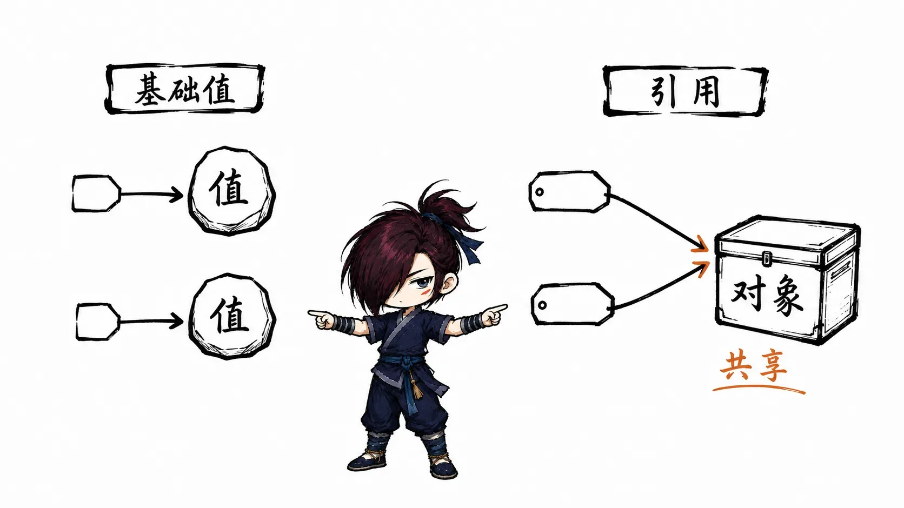
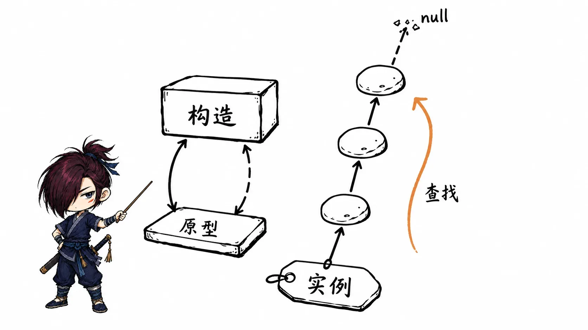
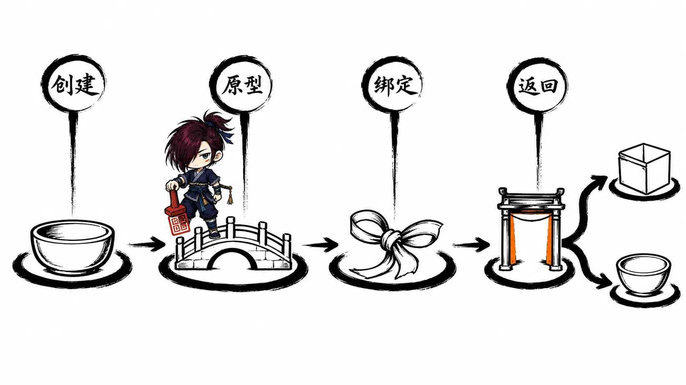
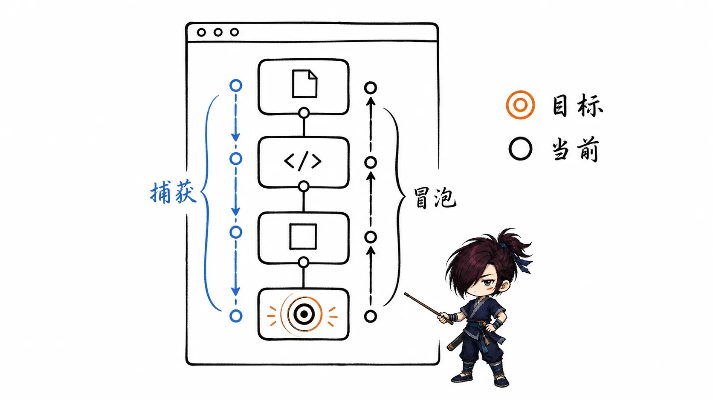
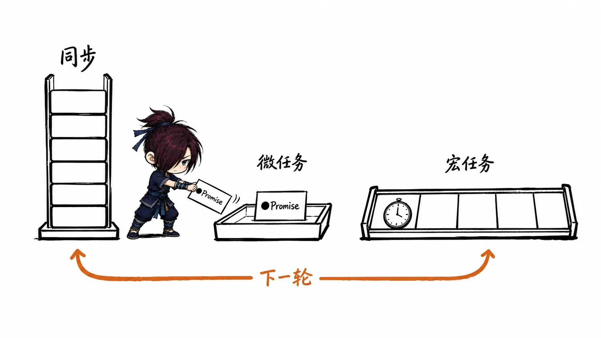
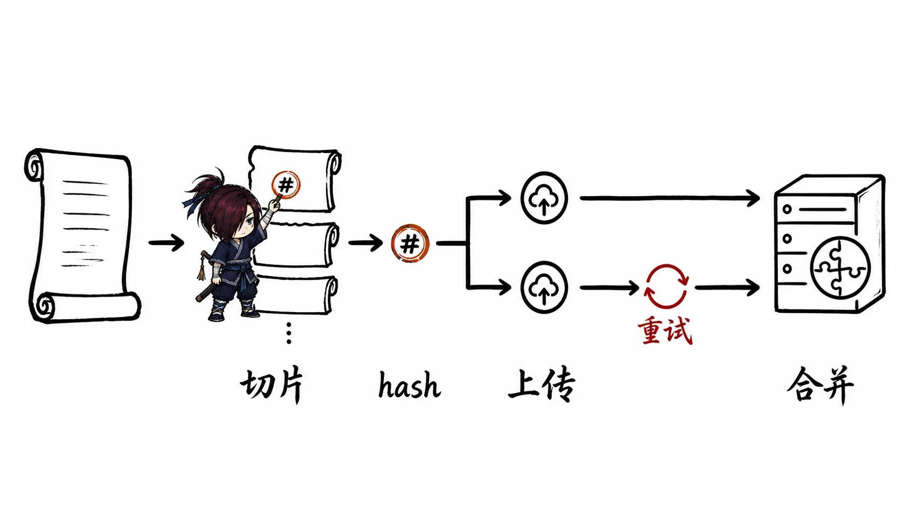
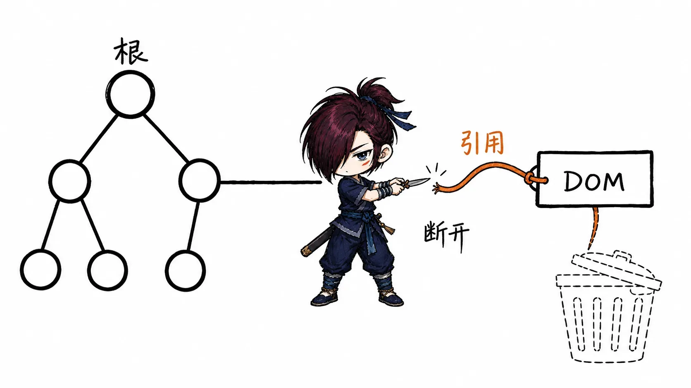
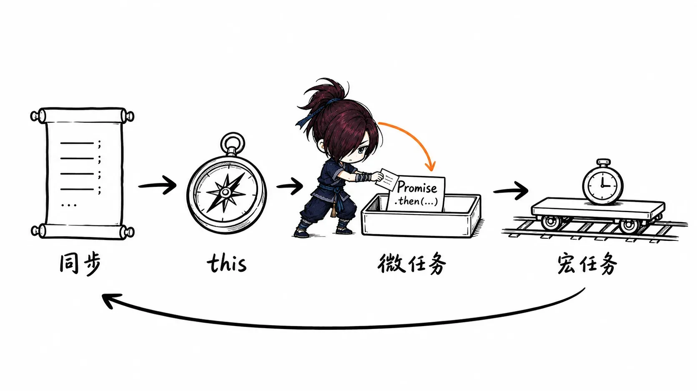

# JavaScript 面试知识整理

> 本文基于《JavaScript 面试真题》PDF 重新梳理。内容没有严格沿用原 PDF 目录，而是按照知识依赖和面试复习效率重新组织。原文中的重复内容已合并，部分过时或不严谨描述已修正，必要的新增内容会标记为“补充说明（非原文）”。

## 复习建议

- 优先掌握五星和四星内容，它们最容易被连续追问。
- 代码题不要只背输出，要先判断运行环境、严格模式、调用方式和任务队列。
- DOM、BOM、存储、Ajax、文件上传等内容更偏工程 API，复习时重点记使用场景和边界。
- 原型、`this`、闭包、异步、继承、内存泄漏、数值精度是 JavaScript 面试的核心知识链。

## 数据类型、类型判断与类型转换

**重要程度：⭐⭐⭐⭐⭐**

### JavaScript 的数据类型

JavaScript 数据类型分为基础类型和引用类型。

基础类型包括：

- `Undefined`
- `Null`
- `Boolean`
- `Number`
- `String`
- `Symbol`
- `BigInt`

引用类型主要是对象，包括普通对象、数组、函数、日期、正则、`Map`、`Set` 等。

面试回答可以这样说：

> JavaScript 的数据类型分为基础类型和引用类型。基础类型保存的是值本身，通常存放在栈相关的执行环境中；引用类型变量保存的是对象引用，对象本体在堆内存中。需要注意的是，`Symbol` 和 `BigInt` 是 ES6 之后补充的重要基础类型。

> **补充说明（非原文）：** 很多旧面试资料会说基础类型只有 5 或 6 种，现代 JavaScript 面试应把 `Symbol` 和 `BigInt` 一起说出来。

### 基础类型和引用类型的存储差异

基础类型赋值时复制的是值：

```js
let a = 10;
let b = a;
b = 20;

console.log(a); // 10
console.log(b); // 20
```

引用类型赋值时复制的是引用地址：

```js
const obj1 = {};
const obj2 = obj1;

obj2.name = 'Tom';

console.log(obj1.name); // 'Tom'
```

面试中要强调：引用类型变量之间共享同一个对象，修改对象属性会互相影响；重新赋值变量本身只会改变当前变量指向。

> [!VISUALIZATION]  
> **类型：** relationship  
> **优先级：** high  
> **标题：** 基础类型与引用类型的存储关系  
> **目的：** 展示基础类型变量直接保存值，引用类型变量保存对象地址，对象内容位于堆内存。  
> **必须表达：** 两个变量引用同一个对象时，修改对象属性会互相可见；重新赋值变量不会修改原对象。  
> **避免表达：** 不要把“栈”和“堆”画成绝对的语言规范细节，应表达为便于理解的内存模型。



### `null` 和 `undefined`

`undefined` 通常表示变量已声明但尚未赋值、函数没有返回值、对象属性不存在；`null` 通常表示主动设置为空值。

必须记住：

- `typeof undefined` 返回 `"undefined"`
- `typeof null` 返回 `"object"`，这是历史遗留问题
- `null == undefined` 为 `true`
- `null === undefined` 为 `false`

面试回答可以这样说：

> `undefined` 更像系统默认的“缺失值”，`null` 更像开发者主动设置的“空对象引用”。判断业务字段是否为空时，要结合语义选择，而不是简单混用。

### `typeof`、`instanceof` 与 `Object.prototype.toString`

| 方法 | 适用场景 | 主要限制 |
| --- | --- | --- |
| `typeof` | 判断基础类型、函数 | `typeof null` 是 `"object"`，数组和普通对象都返回 `"object"` |
| `instanceof` | 判断对象原型链上是否存在某个构造函数的 `prototype` | 不适合基础类型，跨 iframe 等执行环境可能失效 |
| `Object.prototype.toString.call()` | 精确区分内置对象类型 | 写法较长，通常封装成工具函数 |

```js
typeof 1; // 'number'
typeof '1'; // 'string'
typeof undefined; // 'undefined'
typeof true; // 'boolean'
typeof Symbol(); // 'symbol'
typeof 10n; // 'bigint'
typeof null; // 'object'
typeof []; // 'object'
typeof function () {}; // 'function'

[] instanceof Array; // true
Object.prototype.toString.call([]); // '[object Array]'
Object.prototype.toString.call(null); // '[object Null]'
```

一个常见的类型判断工具：

```js
function getType(value) {
  if (value === null) return 'null';

  const type = typeof value;
  if (type !== 'object') return type;

  return Object.prototype.toString
    .call(value)
    .slice(8, -1)
    .toLowerCase();
}
```

常见追问：

- 为什么 `typeof null` 是 `"object"`？
- `instanceof` 的本质是什么？
- 如何判断数组？
- 跨 iframe 场景下为什么 `instanceof Array` 可能失效？

### 隐式类型转换

隐式类型转换常出现在 `==`、加法、条件判断、对象转基本类型等场景。

```js
Boolean(undefined); // false
Boolean(null); // false
Boolean(0); // false
Boolean(NaN); // false
Boolean(''); // false
Boolean({}); // true
Boolean([]); // true
```

`==` 的常见结论：

- `null == undefined` 为 `true`
- `0 == false` 为 `true`
- `'' == false` 为 `true`
- `[] == false` 为 `true`
- `[] == ![]` 为 `true`

面试时不要机械背规则，可以这样说：

> 隐式转换的核心风险是比较双方类型不一致时，JavaScript 会按规则把它们转成可比较的值。实际开发中应优先使用 `===`，只有明确需要宽松比较时才使用 `==`，比如判断 `value == null` 同时覆盖 `null` 和 `undefined`。

### `Number` 精度问题

JavaScript 的 `Number` 使用 IEEE 754 双精度浮点数，因此小数计算可能出现精度误差。

```js
console.log(0.1 + 0.2); // 0.30000000000000004
console.log(0.1 + 0.2 === 0.3); // false
```

常见解决方式：

- 金额等场景使用整数分作为计算单位。
- 使用 `Number.EPSILON` 做误差范围判断。
- 使用专门的高精度计算库。
- 大整数使用 `BigInt`，但不能和普通 `Number` 直接混算。

```js
function nearlyEqual(a, b) {
  return Math.abs(a - b) < Number.EPSILON;
}
```

> **补充说明（非原文）：** `BigInt` 解决的是安全整数范围问题，不直接解决小数精度问题。

## 对象、原型链与继承

**重要程度：⭐⭐⭐⭐⭐**

### 构造函数、实例与原型

JavaScript 中函数可以作为构造函数使用。每个函数都有 `prototype` 属性，实例对象内部有原型引用，指向构造函数的 `prototype`。

```js
function Person(name) {
  this.name = name;
}

Person.prototype.sayName = function () {
  console.log(this.name);
};

const person = new Person('Tom');
person.sayName(); // 'Tom'
```

面试回答可以这样说：

> 原型的作用是让多个实例共享方法和属性。实例访问属性时，会先从自身查找，找不到再沿着原型链向上查找，直到 `Object.prototype`，最后是 `null`。

### 原型链查找规则

属性读取流程：

1. 先查找对象自身属性。
2. 找不到就查找对象的原型。
3. 继续沿原型链向上查找。
4. 查到 `Object.prototype` 后再向上是 `null`。
5. 全部找不到则返回 `undefined`。

`hasOwnProperty` 只判断自身属性，`in` 会包含原型链上的属性。

```js
const obj = Object.create({ inherited: true });
obj.own = true;

console.log('own' in obj); // true
console.log('inherited' in obj); // true
console.log(obj.hasOwnProperty('inherited')); // false
```

> [!VISUALIZATION]  
> **类型：** relationship  
> **优先级：** high  
> **标题：** 构造函数、实例与原型链  
> **目的：** 展示构造函数的 `prototype`、实例的原型引用、`constructor` 以及向上查找属性的路径。  
> **必须表达：** 实例先查自身，再沿原型链查找；原型链终点是 `null`。  
> **避免表达：** 不要把 `__proto__` 表达成推荐业务代码直接依赖的 API。



### `instanceof` 的实现原理

`instanceof` 判断右侧构造函数的 `prototype` 是否出现在左侧对象的原型链上。

```js
function myInstanceof(value, Constructor) {
  if (value === null || (typeof value !== 'object' && typeof value !== 'function')) {
    return false;
  }

  let proto = Object.getPrototypeOf(value);
  const target = Constructor.prototype;

  while (proto) {
    if (proto === target) return true;
    proto = Object.getPrototypeOf(proto);
  }

  return false;
}
```

常见追问：

- `[] instanceof Array` 为什么是 `true`？
- `[] instanceof Object` 为什么也是 `true`？
- 基础类型为什么通常不适合用 `instanceof` 判断？
- `Object.create(null)` 创建的对象有什么特殊之处？

### 继承方式

常见继承方式可以按演进关系理解。

原型链继承：

```js
function Parent() {
  this.colors = ['red'];
}

function Child() {}

Child.prototype = new Parent();

const c1 = new Child();
const c2 = new Child();
c1.colors.push('blue');

console.log(c2.colors); // ['red', 'blue']
```

问题是引用类型属性会被实例共享，并且给父构造函数传参不方便。

构造函数继承：

```js
function Parent(name) {
  this.name = name;
}

function Child(name) {
  Parent.call(this, name);
}
```

问题是方法不能复用，每个实例都会复制一份。

组合继承：

```js
function Parent(name) {
  this.name = name;
}

Parent.prototype.sayName = function () {
  console.log(this.name);
};

function Child(name, age) {
  Parent.call(this, name);
  this.age = age;
}

Child.prototype = new Parent();
Child.prototype.constructor = Child;
```

组合继承解决了属性隔离和方法复用，但会调用两次父构造函数。

寄生组合继承是更常见的完整写法：

```js
function inherit(Child, Parent) {
  Child.prototype = Object.create(Parent.prototype);
  Child.prototype.constructor = Child;
}

function Parent(name) {
  this.name = name;
}

function Child(name, age) {
  Parent.call(this, name);
  this.age = age;
}

inherit(Child, Parent);
```

ES6 `class extends` 本质上仍然基于原型链：

```js
class Parent {
  constructor(name) {
    this.name = name;
  }

  sayName() {
    console.log(this.name);
  }
}

class Child extends Parent {
  constructor(name, age) {
    super(name);
    this.age = age;
  }
}
```

面试回答可以这样说：

> JavaScript 继承的核心是复用父类实例属性和原型方法。早期常用寄生组合继承，现在项目里通常使用 `class extends`，但它只是语法层面的封装，底层仍然离不开原型链。

### `class` 的注意点

`class` 不是传统意义上的类系统，它是原型机制上的语法糖，但有一些行为差异：

- 类声明不会像函数声明那样可在声明前直接调用。
- 类内部默认是严格模式。
- 类方法不可枚举。
- 子类构造函数中必须先调用 `super()`，才能使用 `this`。
- `class` 必须通过 `new` 调用。

## 作用域、执行上下文与闭包

**重要程度：⭐⭐⭐⭐⭐**

### 作用域和作用域链

作用域决定变量在哪里可访问。JavaScript 采用词法作用域，也就是函数的作用域在定义时确定，而不是调用时确定。

```js
const name = 'global';

function foo() {
  console.log(name);
}

function bar() {
  const name = 'bar';
  foo();
}

bar(); // 'global'
```

面试回答可以这样说：

> 作用域链是变量查找链。当前作用域找不到变量时，会向外层词法作用域继续查找，直到全局作用域。它和函数在哪里调用无关，和函数在哪里定义有关。

### 执行上下文

执行上下文可以理解为代码执行时创建的一套环境，通常包括：

- 变量环境
- 词法环境
- `this` 绑定

函数调用时会创建函数执行上下文，压入调用栈；执行完成后出栈。

常见追问：

- 变量提升和函数提升有什么区别？
- `var`、`let`、`const` 在提升上有什么差异？
- 暂时性死区是什么？

```js
console.log(a); // undefined
var a = 1;

// console.log(b); // ReferenceError
let b = 2;
```

> **补充说明（非原文）：** `let` 和 `const` 也会被提升到块级作用域顶部，但在初始化前处于暂时性死区，不能访问。

### 闭包

闭包是函数和它能访问的外部词法环境的组合。只要内部函数被外部引用保留下来，它就可以继续访问定义时的外部变量。

```js
function createCounter() {
  let count = 0;

  return function () {
    count += 1;
    return count;
  };
}

const counter = createCounter();

console.log(counter()); // 1
console.log(counter()); // 2
```

面试回答可以这样说：

> 闭包的核心是函数可以记住并访问定义时的词法作用域，即使外层函数已经执行结束。它常用于封装私有变量、函数柯里化、防抖节流、模块化等场景。需要注意的是，闭包会让被引用的变量无法及时释放，滥用可能造成内存占用增加。

常见追问：

- 闭包为什么能访问外部变量？
- 闭包一定会导致内存泄漏吗？
- 循环中使用闭包为什么容易出错？
- 项目中哪些场景用到了闭包？

循环闭包经典题：

```js
for (var i = 0; i < 3; i += 1) {
  setTimeout(() => {
    console.log(i);
  });
}

// 3 3 3
```

使用 `let` 解决：

```js
for (let i = 0; i < 3; i += 1) {
  setTimeout(() => {
    console.log(i);
  });
}

// 0 1 2
```

> [!VISUALIZATION]  
> **类型：** relationship  
> **优先级：** high  
> **标题：** 闭包如何保留外部变量  
> **目的：** 展示外层函数执行结束后，内部函数仍然引用外部词法环境中的变量。  
> **必须表达：** 只要内部函数仍被引用，相关外部变量就不会被回收。  
> **避免表达：** 不要把闭包描述成只有返回函数才会产生，事件回调和异步回调也可能形成闭包。


## `this`、显式绑定、箭头函数与 `new`

**重要程度：⭐⭐⭐⭐⭐**

### `this` 的绑定规则

`this` 的值取决于函数调用方式，而不是函数定义位置。常见规则按优先级理解：

1. `new` 绑定。
2. 显式绑定：`call`、`apply`、`bind`。
3. 隐式绑定：作为对象方法调用。
4. 默认绑定：普通函数直接调用。
5. 箭头函数没有自己的 `this`，从外层词法作用域捕获。

```js
function foo() {
  console.log(this.a);
}

const obj = {
  a: 2,
  foo,
};

obj.foo(); // 2
```

隐式绑定丢失：

```js
var a = 1;

const obj = {
  a: 2,
  foo() {
    console.log(this.a);
  },
};

const fn = obj.foo;
fn(); // 非严格模式下通常是 1，严格模式下 this 为 undefined
```

> **补充说明（非原文）：** 旧资料常默认非严格模式和浏览器全局环境。现代项目中模块代码、构建工具、`class` 内部往往是严格模式，普通函数调用时 `this` 可能是 `undefined`，不要一概说成 `window`。

### 箭头函数中的 `this`

箭头函数没有自己的 `this`、`arguments`、`super` 和 `new.target`，它的 `this` 来自外层作用域。

```js
const obj = {
  name: 'Tom',
  sayLater() {
    setTimeout(() => {
      console.log(this.name);
    });
  },
};

obj.sayLater(); // 'Tom'
```

不适合用箭头函数作为需要动态 `this` 的对象方法：

```js
const obj = {
  name: 'Tom',
  say: () => {
    console.log(this.name);
  },
};

obj.say(); // 通常不是 'Tom'
```

### `call`、`apply` 和 `bind`

三者都用于改变函数执行时的 `this`。

| 方法 | 是否立即执行 | 参数形式 | 返回值 |
| --- | --- | --- | --- |
| `call` | 是 | 参数逐个传入 | 函数执行结果 |
| `apply` | 是 | 参数数组或类数组 | 函数执行结果 |
| `bind` | 否 | 参数逐个传入，可预置 | 新函数 |

```js
function greet(prefix, suffix) {
  return `${prefix}${this.name}${suffix}`;
}

const user = { name: 'Tom' };

greet.call(user, 'Hi, ', '!');
greet.apply(user, ['Hi, ', '!']);

const bound = greet.bind(user, 'Hi, ');
bound('!');
```

手写 `bind` 的核心点：

- 返回一个函数。
- 支持预置参数。
- 被 `new` 调用时，绑定的 `this` 应失效，实例应继承原函数原型。

```js
Function.prototype.myBind = function (context, ...presetArgs) {
  const fn = this;

  function boundFn(...args) {
    const isNew = this instanceof boundFn;
    return fn.apply(isNew ? this : context, [...presetArgs, ...args]);
  }

  boundFn.prototype = Object.create(fn.prototype);
  return boundFn;
};
```

### `new` 的执行过程

`new` 调用构造函数时会做四件事：

1. 创建一个新对象。
2. 将新对象的原型指向构造函数的 `prototype`。
3. 用新对象作为 `this` 执行构造函数。
4. 如果构造函数返回对象，则返回该对象；否则返回新对象。

```js
function myNew(Constructor, ...args) {
  const obj = Object.create(Constructor.prototype);
  const result = Constructor.apply(obj, args);

  return result !== null && (typeof result === 'object' || typeof result === 'function')
    ? result
    : obj;
}
```

```js
function Person(name) {
  this.name = name;
}

const p = myNew(Person, 'Tom');
console.log(p.name); // 'Tom'
console.log(p instanceof Person); // true
```

常见追问：

- 构造函数返回基本类型会怎样？
- 构造函数返回对象会怎样？
- `new` 和 `Object.create` 有什么区别？
- `new` 绑定和 `bind` 绑定谁优先？

> [!VISUALIZATION]  
> **类型：** flow  
> **优先级：** high  
> **标题：** `new` 的执行流程  
> **目的：** 展示创建对象、连接原型、绑定 `this`、处理返回值的顺序。  
> **必须表达：** 构造函数返回对象时会覆盖默认新对象，返回基本类型不会覆盖。  
> **避免表达：** 不要遗漏原型连接步骤。



## DOM、BOM 与浏览器事件

**重要程度：⭐⭐⭐⭐**

### DOM 的基本理解

DOM（Document Object Model）把 HTML/XML 文档表示为节点树，JavaScript 可以通过 DOM API 查询、创建、修改和删除节点。

常见节点操作：

```js
const div = document.createElement('div');
div.textContent = 'Hello';

document.body.appendChild(div);
```

常见查询 API：

- `getElementById`
- `getElementsByClassName`
- `getElementsByTagName`
- `querySelector`
- `querySelectorAll`

易混点：

- `getElementsByClassName`、`getElementsByTagName` 返回动态集合。
- `querySelectorAll` 返回静态集合。
- `innerHTML` 会解析 HTML 字符串，存在 XSS 风险。
- `textContent` 只处理文本，更安全。

### BOM 的常见对象

BOM（Browser Object Model）描述浏览器窗口相关能力，核心对象是 `window`。

常见对象：

- `window`：浏览器窗口和全局对象。
- `location`：URL 信息和跳转。
- `history`：浏览历史操作。
- `navigator`：浏览器和设备信息。
- `screen`：屏幕信息。

```js
console.log(location.href);
history.pushState({}, '', '/new-path');
console.log(navigator.userAgent);
```

面试时要能区分：

- DOM 关注文档结构。
- BOM 关注浏览器环境。
- 浏览器中 `window` 同时也是全局对象。

### 事件流：捕获、目标与冒泡

浏览器事件传播通常分为三个阶段：

1. 捕获阶段：从 `window`、`document` 向目标元素传播。
2. 目标阶段：事件到达目标元素。
3. 冒泡阶段：从目标元素向外层祖先传播。

```js
element.addEventListener('click', handler, false); // 冒泡阶段
element.addEventListener('click', handler, true); // 捕获阶段
```

常用控制方法：

- `event.stopPropagation()`：阻止继续传播。
- `event.preventDefault()`：阻止默认行为。
- `event.target`：事件真正触发的元素。
- `event.currentTarget`：当前绑定监听器的元素。

> [!VISUALIZATION]  
> **类型：** flow  
> **优先级：** high  
> **标题：** DOM 事件流  
> **目的：** 展示事件从捕获阶段到目标阶段，再到冒泡阶段的传播路径。  
> **必须表达：** `target` 是触发源，`currentTarget` 是当前处理事件的元素。  
> **避免表达：** 不要把事件冒泡画成只发生在父子两层之间。



### 事件委托

事件委托是把事件监听器绑定到父元素，通过事件冒泡和 `event.target` 判断具体触发的子元素。

```js
const list = document.getElementById('list');

list.addEventListener('click', (event) => {
  const item = event.target.closest('li');
  if (!item || !list.contains(item)) return;

  console.log(item.dataset.id);
});
```

优势：

- 减少事件监听器数量。
- 动态新增子元素无需重新绑定。
- 适合列表、表格、菜单等结构。

注意点：

- 不冒泡的事件不适合直接委托。
- 要判断目标元素是否属于当前容器。
- `closest` 需要考虑兼容性。

## 异步编程、Promise 与事件循环

**重要程度：⭐⭐⭐⭐⭐**

### 同步任务、宏任务与微任务

JavaScript 主线程先执行同步代码。当前调用栈清空后，会优先清空微任务队列，再进入下一个宏任务。

常见宏任务：

- `setTimeout`
- `setInterval`
- DOM 事件回调
- 网络请求回调

常见微任务：

- `Promise.then/catch/finally`
- `queueMicrotask`
- `MutationObserver`

```js
console.log('script start');

setTimeout(() => {
  console.log('setTimeout');
}, 0);

Promise.resolve().then(() => {
  console.log('promise');
});

console.log('script end');

// script start
// script end
// promise
// setTimeout
```

面试回答可以这样说：

> 事件循环负责协调同步代码、宏任务和微任务。同步代码先进入调用栈执行，执行完后清空本轮微任务队列，然后浏览器可能进行渲染，再取出下一个宏任务继续执行。Promise 的 `then` 属于微任务，`setTimeout` 属于宏任务，所以常见情况下 Promise 回调会先于定时器回调执行。

> [!VISUALIZATION]  
> **类型：** flow  
> **优先级：** high  
> **标题：** Event Loop 执行流程  
> **目的：** 展示同步代码、调用栈、微任务队列和宏任务队列的执行顺序。  
> **必须表达：** 当前同步任务执行完成后先清空微任务，再进入下一个宏任务。  
> **避免表达：** 不要将所有宏任务画成一次性全部执行。



### Promise

Promise 有三种状态：

- `pending`
- `fulfilled`
- `rejected`

状态一旦从 `pending` 变为成功或失败，就不可再改变。

```js
const promise = new Promise((resolve, reject) => {
  resolve('ok');
});

promise
  .then((value) => {
    console.log(value);
    return 'next';
  })
  .then((value) => {
    console.log(value);
  })
  .catch((error) => {
    console.error(error);
  });
```

需要特别记住：

- Promise 构造函数中的代码是同步执行的。
- `then` 回调是微任务。
- `then` 返回新的 Promise，因此可以链式调用。
- 错误会沿链路向后传递，直到被 `catch` 捕获。

常见追问：

- `Promise.all` 和 `Promise.race` 的区别？
- `Promise.allSettled` 适合什么场景？
- 为什么 Promise 可以链式调用？
- `then` 中返回普通值和返回 Promise 有什么区别？

### `async/await`

`async/await` 是 Promise 的语法糖，让异步代码更像同步流程。

```js
async function fetchUser() {
  try {
    const response = await fetch('/api/user');
    const data = await response.json();
    return data;
  } catch (error) {
    console.error(error);
    throw error;
  }
}
```

面试回答可以这样说：

> `async` 函数一定返回 Promise。`await` 会等待后面的 Promise 状态变化，并把后续代码放到微任务中继续执行。它并不会阻塞整个线程，只是暂停当前 async 函数内部后续逻辑。

经典输出题：

```js
async function async1() {
  console.log('async1 start');
  await async2();
  console.log('async1 end');
}

async function async2() {
  console.log('async2');
}

console.log('script start');

setTimeout(() => {
  console.log('setTimeout');
}, 0);

async1();

new Promise((resolve) => {
  console.log('promise1');
  resolve();
}).then(() => {
  console.log('promise2');
});

console.log('script end');

// script start
// async1 start
// async2
// promise1
// script end
// async1 end
// promise2
// setTimeout
```

> **补充说明（非原文）：** 不同历史版本的浏览器和 Node.js 对 `await` 后续微任务入队细节曾有差异。现代面试中应以当前 ECMAScript 语义和目标运行环境为准，输出题最好说明环境。

## 深拷贝、浅拷贝与对象复制

**重要程度：⭐⭐⭐⭐**

### 浅拷贝

浅拷贝只复制对象第一层属性。如果属性值是引用类型，复制的是引用地址。

常见浅拷贝方式：

```js
const copy1 = Object.assign({}, source);
const copy2 = { ...source };
const copy3 = array.slice();
const copy4 = [...array];
```

手写浅拷贝：

```js
function shallowClone(obj) {
  if (obj === null || typeof obj !== 'object') return obj;

  const result = Array.isArray(obj) ? [] : {};

  for (const key in obj) {
    if (Object.prototype.hasOwnProperty.call(obj, key)) {
      result[key] = obj[key];
    }
  }

  return result;
}
```

### 深拷贝

深拷贝会递归复制嵌套对象，使新对象和原对象互不影响。

`JSON.parse(JSON.stringify(obj))` 的局限：

- 会丢失 `undefined`、函数、`Symbol`。
- `Date` 会变成字符串。
- `RegExp` 会变成普通对象。
- 不能处理循环引用。
- 不能保留原型链。

更完整的深拷贝需要处理类型和循环引用：

```js
function deepClone(value, cache = new WeakMap()) {
  if (value === null || typeof value !== 'object') return value;

  if (cache.has(value)) return cache.get(value);

  if (value instanceof Date) return new Date(value);
  if (value instanceof RegExp) return new RegExp(value);

  const result = Array.isArray(value) ? [] : Object.create(Object.getPrototypeOf(value));
  cache.set(value, result);

  Reflect.ownKeys(value).forEach((key) => {
    result[key] = deepClone(value[key], cache);
  });

  return result;
}
```

面试回答可以这样说：

> 浅拷贝只复制第一层，嵌套对象仍然共享引用；深拷贝会递归复制嵌套结构。简单数据可以用 JSON 方式，但真实项目要注意函数、`undefined`、`Symbol`、`Date`、`RegExp`、循环引用和原型链等问题。

## 浏览器存储、Cookie 与同源策略

**重要程度：⭐⭐⭐⭐**

### Cookie

Cookie 会随同域请求自动发送，常用于登录态、服务端会话标识和少量状态保存。

常见属性：

- `Expires` / `Max-Age`：过期时间。
- `Domain`：生效域名。
- `Path`：生效路径。
- `HttpOnly`：禁止 JavaScript 读取，降低 XSS 窃取风险。
- `Secure`：只在 HTTPS 下发送。
- `SameSite`：限制跨站请求携带 Cookie，缓解 CSRF。

面试回答可以这样说：

> Cookie 的特点是容量小、会自动随请求发送，适合保存会话标识，不适合保存大量数据。安全上要关注 `HttpOnly`、`Secure` 和 `SameSite`，不要把敏感明文信息直接放进 Cookie。

### `localStorage`、`sessionStorage` 与 IndexedDB

| 存储 | 生命周期 | 容量 | 适用场景 |
| --- | --- | --- | --- |
| `localStorage` | 手动清除前长期存在 | 通常约 5MB | 本地偏好、非敏感缓存 |
| `sessionStorage` | 当前标签页会话 | 通常约 5MB | 页面临时状态 |
| IndexedDB | 长期存在 | 更大 | 结构化、大体量离线数据 |

```js
localStorage.setItem('username', 'Tom');
localStorage.getItem('username');
localStorage.removeItem('username');
localStorage.clear();
```

注意点：

- Web Storage 只能直接存字符串，对象需要序列化。
- 同步 API 可能阻塞主线程，不适合频繁写入大量数据。
- 不要存储敏感信息，XSS 可以读取 Web Storage。

### 同源策略与跨域

同源要求协议、域名、端口完全一致。浏览器限制跨源读取响应，是前端安全的基础。

常见跨域解决方案：

- CORS：主流方案，由服务端返回跨域响应头。
- JSONP：利用 `<script>` 不受同源限制，只支持 GET，已较少使用。
- 代理：开发或服务端转发请求。
- `postMessage`：窗口、iframe 之间安全通信。

```http
Access-Control-Allow-Origin: https://example.com
Access-Control-Allow-Credentials: true
```

常见追问：

- 简单请求和预检请求有什么区别？
- 携带 Cookie 时 CORS 要注意什么？
- 为什么不能把 `Access-Control-Allow-Origin` 设为 `*` 同时携带凭证？

## Ajax、网络请求与文件上传

**重要程度：⭐⭐⭐**

### Ajax 与 XMLHttpRequest

Ajax 的核心是通过 JavaScript 在不刷新页面的情况下发起 HTTP 请求并更新页面。

`XMLHttpRequest` 的基本流程：

```js
function ajax({ method = 'GET', url, data, headers = {} }) {
  return new Promise((resolve, reject) => {
    const xhr = new XMLHttpRequest();
    xhr.open(method, url, true);

    Object.keys(headers).forEach((key) => {
      xhr.setRequestHeader(key, headers[key]);
    });

    xhr.onreadystatechange = function () {
      if (xhr.readyState !== 4) return;

      if (xhr.status >= 200 && xhr.status < 300) {
        resolve(xhr.responseText);
      } else {
        reject(new Error(`HTTP ${xhr.status}`));
      }
    };

    xhr.onerror = function () {
      reject(new Error('Network Error'));
    };

    xhr.send(data);
  });
}
```

`readyState` 常见状态：

- `0`：未初始化。
- `1`：已调用 `open`。
- `2`：已收到响应头。
- `3`：正在接收响应体。
- `4`：请求完成。

### `fetch`

`fetch` 返回 Promise，API 更现代，但有几个面试易错点：

- HTTP 4xx/5xx 不会自动 reject，需要检查 `response.ok`。
- 默认不携带 Cookie，跨域携带需要配置 `credentials`。
- 中止请求需要 `AbortController`。

```js
async function request(url) {
  const response = await fetch(url, {
    credentials: 'include',
  });

  if (!response.ok) {
    throw new Error(`HTTP ${response.status}`);
  }

  return response.json();
}
```

### 文件上传

浏览器文件上传常用 `input[type=file]`、`FileReader`、`FormData`。

```js
const input = document.querySelector('input[type="file"]');

input.addEventListener('change', async function () {
  const file = this.files[0];
  if (!file) return;

  const formData = new FormData();
  formData.append('file', file);

  await fetch('/upload', {
    method: 'POST',
    body: formData,
  });
});
```

大文件上传常见思路：

- 前端按固定大小切片。
- 计算文件 hash，用于秒传或断点续传。
- 并发上传分片。
- 服务端合并分片。
- 上传失败后只重传失败分片。

> [!VISUALIZATION]  
> **类型：** flow  
> **优先级：** medium  
> **标题：** 大文件上传流程  
> **目的：** 展示文件切片、计算 hash、并发上传、失败重试、服务端合并的顺序。  
> **必须表达：** 秒传和断点续传依赖文件标识与分片状态。  
> **避免表达：** 不要把所有上传都画成必须先完整读入内存。



## 性能优化与高频工具函数

**重要程度：⭐⭐⭐⭐**

### 防抖

防抖是事件持续触发时不立即执行，等停止触发一段时间后再执行。适合搜索输入、窗口大小变化结束后计算等场景。

```js
function debounce(fn, wait) {
  let timer = null;

  return function (...args) {
    clearTimeout(timer);

    timer = setTimeout(() => {
      fn.apply(this, args);
    }, wait);
  };
}
```

### 节流

节流是事件持续触发时，固定时间间隔内最多执行一次。适合滚动、拖拽、按钮防连点等场景。

```js
function throttle(fn, wait) {
  let lastTime = 0;

  return function (...args) {
    const now = Date.now();

    if (now - lastTime >= wait) {
      lastTime = now;
      fn.apply(this, args);
    }
  };
}
```

防抖与节流对比：

| 机制 | 核心行为 | 适用场景 |
| --- | --- | --- |
| 防抖 | 等最后一次触发后再执行 | 搜索联想、表单校验、resize 结束 |
| 节流 | 固定间隔最多执行一次 | scroll、拖拽、持续点击 |

### 图片懒加载

图片懒加载的目标是只加载即将进入视口的图片，减少首屏请求和带宽消耗。

现代方案优先使用 `IntersectionObserver`：

```js
const observer = new IntersectionObserver((entries) => {
  entries.forEach((entry) => {
    if (!entry.isIntersecting) return;

    const img = entry.target;
    img.src = img.dataset.src;
    observer.unobserve(img);
  });
});

document.querySelectorAll('img[data-src]').forEach((img) => {
  observer.observe(img);
});
```

旧方案是监听 `scroll` 并计算元素位置，但要配合节流，避免频繁计算。

### 判断元素是否在可视区域

常用 `getBoundingClientRect`：

```js
function isInViewport(element) {
  const rect = element.getBoundingClientRect();

  return (
    rect.top < window.innerHeight &&
    rect.bottom > 0 &&
    rect.left < window.innerWidth &&
    rect.right > 0
  );
}
```

工程中优先考虑 `IntersectionObserver`，因为它由浏览器优化，代码更简洁。

## 正则表达式

**重要程度：⭐⭐⭐**

### 创建方式与修饰符

正则可以用字面量或构造函数创建：

```js
const re1 = /\d+/g;
const re2 = new RegExp('\\d+', 'g');
```

常见修饰符：

- `g`：全局匹配。
- `i`：忽略大小写。
- `m`：多行匹配。
- `s`：允许 `.` 匹配换行。
- `u`：Unicode 模式。
- `y`：粘连匹配。

### 常用方法

```js
const str = 'I love JavaScript 2026';

str.match(/\d+/); // ['2026']
/\d+/.test(str); // true
str.replace(/JavaScript/, 'JS'); // 'I love JS 2026'
```

常见量词：

- `*`：0 次或多次。
- `+`：1 次或多次。
- `?`：0 次或 1 次。
- `{n}`：恰好 n 次。
- `{n,}`：至少 n 次。
- `{n,m}`：n 到 m 次。

### 贪婪与非贪婪

默认量词是贪婪匹配，会尽可能多地匹配；在量词后加 `?` 变为非贪婪。

```js
const html = '<div>one</div><div>two</div>';

html.match(/<div>.*<\/div>/)[0]; // '<div>one</div><div>two</div>'
html.match(/<div>.*?<\/div>/)[0]; // '<div>one</div>'
```

## Web 安全

**重要程度：⭐⭐⭐⭐**

### XSS

XSS 是攻击者把恶意脚本注入页面并在用户浏览器中执行。

常见类型：

- 存储型 XSS：恶意内容存入数据库，其他用户访问时执行。
- 反射型 XSS：恶意脚本通过 URL 参数等立即反射到页面。
- DOM 型 XSS：前端脚本把不可信数据写入 DOM。

常见防护：

- 对用户输入和输出进行转义。
- 避免把不可信内容写入 `innerHTML`。
- Cookie 设置 `HttpOnly`。
- 配置内容安全策略 CSP。
- 富文本使用可信白名单过滤。

```js
function escapeHTML(str) {
  return str.replace(/[&<>"']/g, (char) => {
    const map = {
      '&': '&amp;',
      '<': '&lt;',
      '>': '&gt;',
      '"': '&quot;',
      "'": '&#39;',
    };

    return map[char];
  });
}
```

### CSRF

CSRF 是攻击者诱导已登录用户在不知情的情况下向目标站点发起请求，利用浏览器自动携带 Cookie 的特性完成操作。

常见防护：

- `SameSite` Cookie。
- CSRF Token。
- 验证 `Origin` / `Referer`。
- 关键操作二次确认。

XSS 与 CSRF 的区别：

| 攻击 | 核心能力 | 防护重点 |
| --- | --- | --- |
| XSS | 在页面执行恶意脚本 | 输入输出转义、CSP、HttpOnly |
| CSRF | 借用户身份发起请求 | Token、SameSite、Origin 校验 |

### SQL 注入

SQL 注入通常发生在服务端拼接 SQL 时，前端面试中了解即可。核心防护是服务端使用参数化查询，不要拼接用户输入。

```sql
-- 风险写法：把用户输入直接拼进 SQL
SELECT * FROM users WHERE name = '${name}';
```

面试时可说明：前端能做输入校验提升体验，但安全边界必须在服务端。

## 内存管理与垃圾回收

**重要程度：⭐⭐⭐⭐**

### 垃圾回收机制

JavaScript 引擎会自动回收不再可达的对象。现代垃圾回收主要基于可达性分析，也就是从根对象出发，能访问到的对象保留，访问不到的对象回收。

常见根对象包括：

- 全局对象。
- 当前调用栈中的变量。
- 闭包仍引用的变量。
- DOM 引用、定时器回调等可达对象。

旧资料常提到引用计数，但引用计数无法解决循环引用问题。

> **补充说明（非原文）：** 现代主流 JavaScript 引擎不是只靠引用计数回收内存，面试中应把“标记清除/可达性”作为核心回答。

### 常见内存泄漏场景

常见原因：

- 意外创建全局变量。
- 定时器或事件监听未清除。
- 闭包长期持有大对象。
- DOM 被移除后仍被 JavaScript 引用。
- 缓存没有淘汰策略。

```js
function bindEvent() {
  const element = document.createElement('div');

  element.addEventListener('click', function onClick() {
    console.log(element);
  });

  return element;
}
```

组件销毁时应清理副作用：

```js
const timer = setInterval(() => {
  // do something
}, 1000);

window.addEventListener('resize', handleResize);

function cleanup() {
  clearInterval(timer);
  window.removeEventListener('resize', handleResize);
}
```

面试回答可以这样说：

> 内存泄漏本质是对象已经不再需要，但仍然能从根对象访问到，导致垃圾回收器无法释放。前端项目里最常见的是定时器、事件监听、闭包、DOM 引用和无限增长的缓存。

> [!VISUALIZATION]  
> **类型：** relationship  
> **优先级：** medium  
> **标题：** 可达性与内存泄漏  
> **目的：** 展示对象是否能从根对象访问到，决定其是否可被回收。  
> **必须表达：** 已移除 DOM 如果仍被闭包或变量引用，就仍然可达。  
> **避免表达：** 不要把“变量置为 null”画成唯一解决方案，关键是断开所有不再需要的引用。



## 数组、字符串与常用 API

**重要程度：⭐⭐⭐**

### 数组增删改查

常见会改变原数组的方法：

- `push`
- `pop`
- `shift`
- `unshift`
- `splice`
- `sort`
- `reverse`

常见不改变原数组的方法：

- `concat`
- `slice`
- `map`
- `filter`
- `reduce`
- `find`
- `some`
- `every`

```js
const arr = [1, 2, 3];

arr.push(4); // 改变原数组
const next = arr.map((item) => item * 2); // 返回新数组
```

面试容易问：

- `slice` 和 `splice` 的区别？
- `map` 和 `forEach` 的区别？
- `find` 和 `filter` 的区别？
- `some` 和 `every` 的区别？

### 数组去重

基础去重：

```js
const unique = [...new Set([1, 1, 2, 3])];
```

对象数组按字段去重：

```js
function uniqueBy(list, key) {
  const map = new Map();

  list.forEach((item) => {
    if (!map.has(item[key])) {
      map.set(item[key], item);
    }
  });

  return [...map.values()];
}
```

### 类数组转数组

类数组有 `length` 和索引，但没有数组方法。

```js
function fn() {
  const args1 = Array.prototype.slice.call(arguments);
  const args2 = Array.from(arguments);
  const args3 = [...arguments];
}
```

> **补充说明（非原文）：** `arguments` 在普通函数中可用，箭头函数没有自己的 `arguments`。

## 现代 JavaScript 语法与工程实践

**重要程度：⭐⭐⭐**

### `var`、`let`、`const`

| 关键字 | 作用域 | 是否可重复声明 | 是否可重新赋值 | 特点 |
| --- | --- | --- | --- | --- |
| `var` | 函数作用域 | 可以 | 可以 | 存在变量提升，容易污染作用域 |
| `let` | 块级作用域 | 不可以 | 可以 | 有暂时性死区 |
| `const` | 块级作用域 | 不可以 | 不可以重新绑定 | 声明时必须初始化 |

`const` 限制的是变量绑定，不是对象内容：

```js
const user = { name: 'Tom' };
user.name = 'Jerry'; // 可以

// user = {}; // TypeError
```

### 模块化

常见模块化方案：

- CommonJS：Node.js 传统模块，`require` / `module.exports`。
- ES Module：现代标准模块，`import` / `export`。

```js
// ES Module
export function add(a, b) {
  return a + b;
}

import { add } from './math.js';
```

对比重点：

- CommonJS 通常运行时加载，导出的是值拷贝或对象引用。
- ES Module 静态分析，支持 Tree Shaking，导出绑定是 live binding。
- 浏览器和现代构建工具优先使用 ES Module。

### `Map`、`Set`、`WeakMap`、`WeakSet`

`Set` 适合唯一值集合，`Map` 适合键值映射，键可以是任意类型。

```js
const set = new Set([1, 1, 2]);
console.log([...set]); // [1, 2]

const map = new Map();
map.set({ id: 1 }, 'value');
```

`WeakMap` 的 key 必须是对象，且是弱引用，适合保存对象私有数据或缓存，不影响垃圾回收。

```js
const privateData = new WeakMap();

class User {
  constructor(name) {
    privateData.set(this, { name });
  }

  getName() {
    return privateData.get(this).name;
  }
}
```

## 手写题与输出题复习清单

**重要程度：⭐⭐⭐⭐⭐**

### 高频手写题

建议能独立写出并解释以下题目：

- `new`
- `bind`
- `instanceof`
- 防抖
- 节流
- 浅拷贝
- 深拷贝
- 发布订阅或事件总线
- Promise 基础版
- 数组去重
- Ajax 封装

复习时不要只记代码，要能说清楚每一步为什么存在。例如手写 `new` 必须解释原型连接和返回值处理；手写深拷贝必须解释循环引用；手写 `bind` 必须解释被 `new` 调用时的行为。

### 输出题判断顺序

遇到输出题建议按这个顺序分析：

1. 找同步代码，按顺序执行。
2. 遇到函数调用，判断 `this` 和作用域。
3. 遇到 Promise 构造函数，立即执行其中同步代码。
4. 遇到 `then`、`await` 后续，放入微任务。
5. 遇到 `setTimeout`、事件等，放入宏任务。
6. 当前同步代码结束后，清空微任务。
7. 再执行下一个宏任务。

> [!VISUALIZATION]  
> **类型：** flow  
> **优先级：** medium  
> **标题：** JavaScript 输出题分析顺序  
> **目的：** 给出分析输出题时从同步代码、作用域、`this`、微任务到宏任务的步骤。  
> **必须表达：** Promise 构造函数同步执行，`then` 回调进入微任务。  
> **避免表达：** 不要简化成“Promise 永远比 setTimeout 快”，应强调同一轮事件循环中的关系。



## 面试冲刺索引

### ⭐⭐⭐⭐⭐ 核心必会

- 数据类型、存储差异与类型判断
- 原型、原型链、`instanceof` 与继承
- 作用域、执行上下文与闭包
- `this` 绑定、箭头函数、`call/apply/bind` 与 `new`
- Promise、`async/await` 与 Event Loop
- 高频手写题与输出题

### ⭐⭐⭐⭐ 高频重点

- 深拷贝与浅拷贝
- DOM 事件流与事件委托
- Cookie、Web Storage、同源策略与跨域
- 防抖、节流、图片懒加载
- XSS、CSRF 与基础安全
- 垃圾回收与内存泄漏

### ⭐⭐⭐ 常见考点

- Ajax、`XMLHttpRequest` 与 `fetch`
- 文件上传、大文件分片上传
- 正则表达式
- 数组、字符串与常用 API
- `var`、`let`、`const`
- 模块化、`Map`、`Set`、`WeakMap`

### 容易连续追问的知识链

- 数据类型 → 类型判断 → 隐式转换 → `==` 输出题
- 作用域 → 执行上下文 → 闭包 → 内存泄漏
- `this` → 箭头函数 → `call/apply/bind` → `new`
- 构造函数 → 原型 → 原型链 → `instanceof` → 继承
- Promise → `async/await` → 微任务 → Event Loop 输出题
- Cookie → 同源策略 → CORS → CSRF
- DOM 事件流 → 事件委托 → 性能优化
