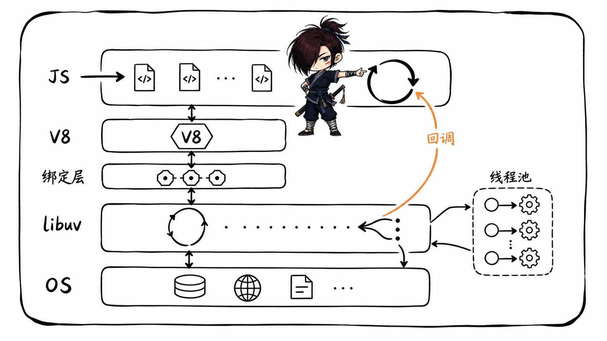
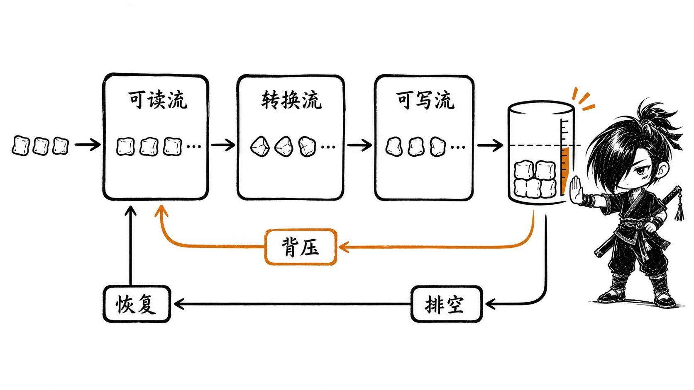
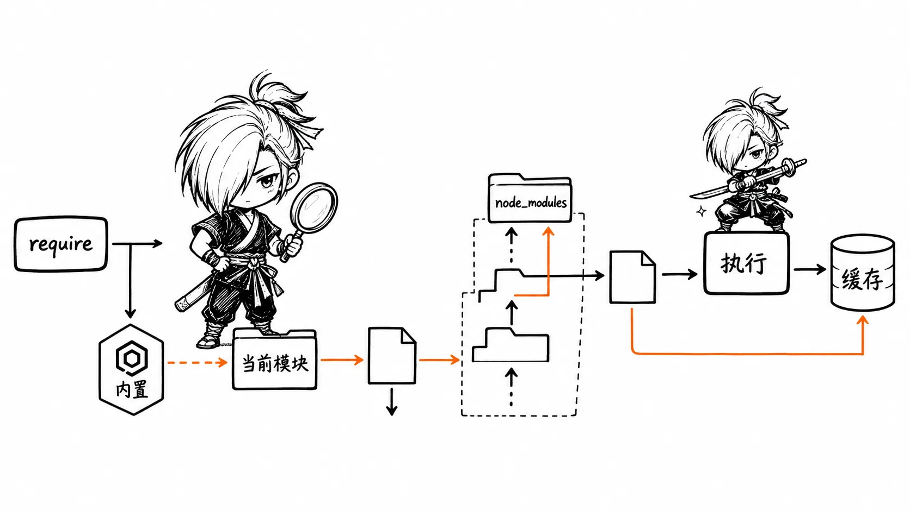
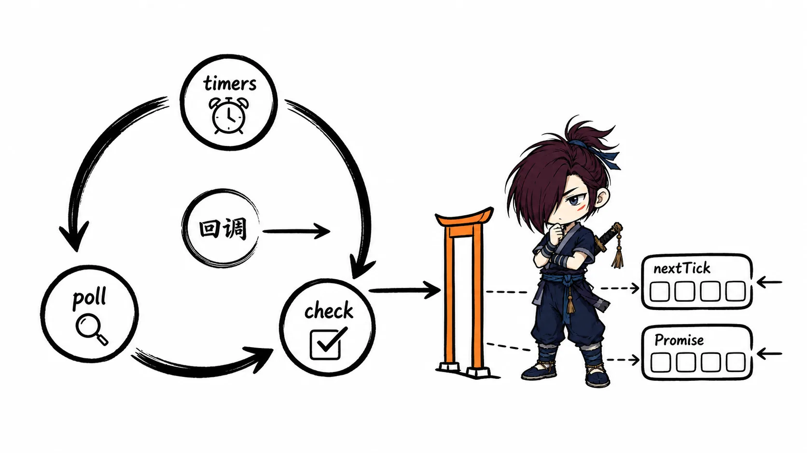
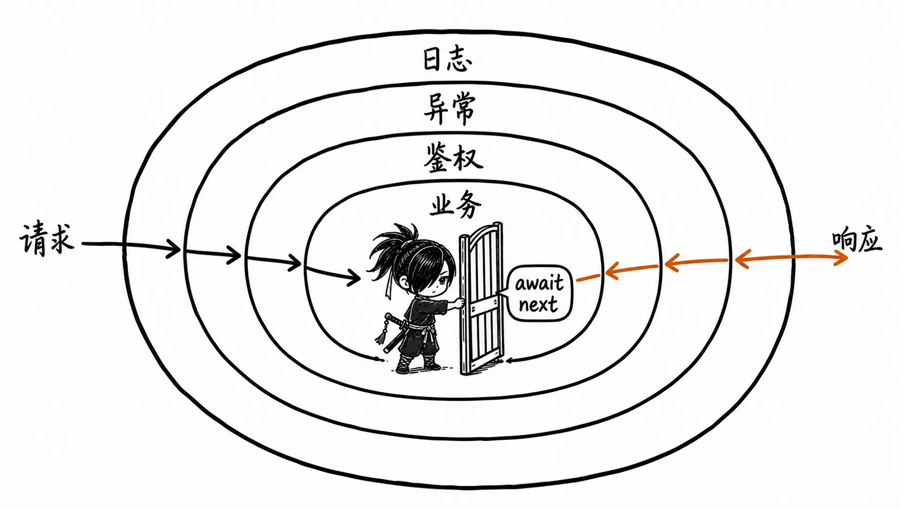
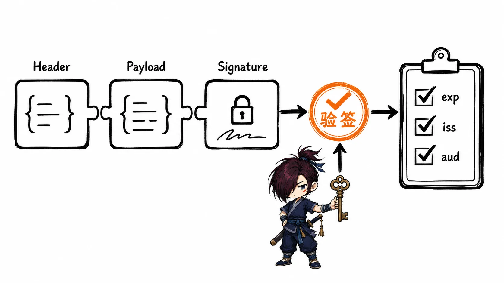
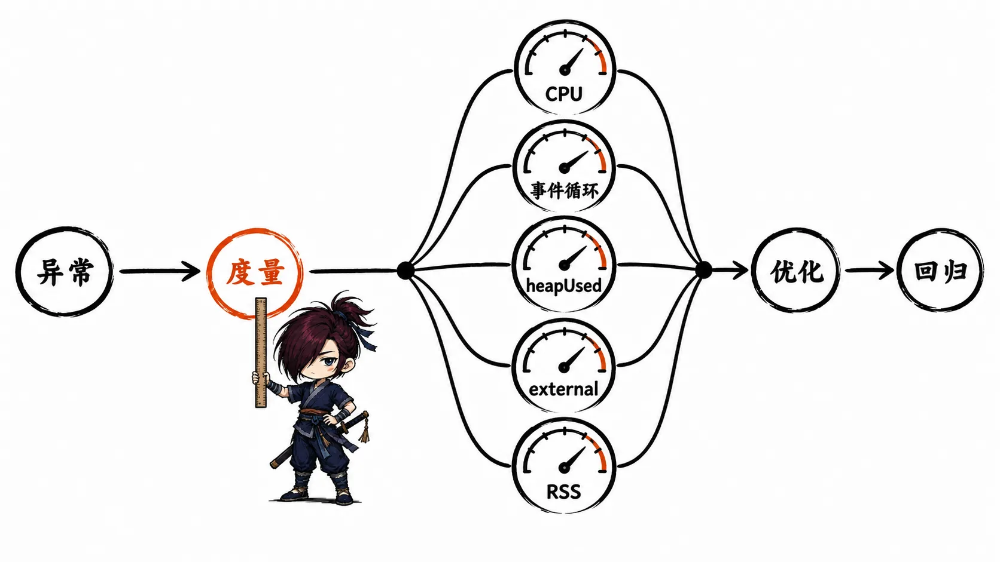

# Node.js 面试知识整理

> 本文基于《Node.js 面试真题（14 题）》PDF 重新梳理。内容没有沿用原 PDF 的逐题顺序，而是按照“运行时基础 → 核心 I/O 抽象 → 异步机制 → Web 工程实践 → 性能与安全”的知识依赖组织。原文中的重复内容已合并，部分过时、不严谨或存在安全风险的写法已修正；必要的新增内容会标记为“补充说明（非原文）”。

## 复习建议

- 优先掌握五星和四星内容：事件循环、Stream、模块系统、中间件、性能诊断与 JWT。
- 回答 Node.js 原理题时，先区分 JavaScript 主线程、V8、libuv、操作系统和线程池各自负责什么。
- 回答 API 题时，不要只背方法名，要说明同步与异步、内存占用、错误处理和背压等边界。
- 工程题要主动补充安全性：上传文件不能只看扩展名，JWT 不是加密，密码不能使用 MD5，SQL 参数不能直接拼接。
- 事件循环题必须说明 Node.js 版本和代码所处上下文，不能死背某一组输出顺序。

## Node.js 定位、运行时组成与适用场景

**重要程度：⭐⭐⭐⭐**

### Node.js 是什么

Node.js 是一个基于 V8 的 JavaScript 运行时。它让 JavaScript 可以脱离浏览器运行，并通过 Node.js 核心模块访问文件系统、网络、进程等操作系统能力。

面试时可以这样回答：

> Node.js 不是一门新语言，也不只是一个 Web 框架。它是服务端 JavaScript 运行时，核心由 V8、Node.js 的 JavaScript/C++ 绑定以及 libuv 等组件构成。JavaScript 默认在主线程执行，Node.js 通过事件循环和异步 I/O 提高并发处理能力。

### V8、libuv 与操作系统如何协作

| 组件 | 主要职责 | 面试要点 |
| --- | --- | --- |
| V8 | 解析、编译和执行 JavaScript，管理 JavaScript 堆与垃圾回收 | JavaScript 回调最终由 V8 执行 |
| Node.js 绑定层 | 把 JavaScript API 与底层 C/C++ 能力连接起来 | `fs`、网络等 API 不只是纯 JavaScript 实现 |
| libuv | 事件循环、跨平台异步 I/O、线程池等 | 文件系统、DNS 等部分操作可能进入线程池 |
| 操作系统 | 网络通知、文件、进程、调度等 | 网络 I/O 通常尽量使用内核的异步通知机制 |

“Node.js 是单线程的”只描述了默认执行用户 JavaScript 的主线程，不代表整个进程只有一个线程。V8、libuv 线程池、垃圾回收以及 Worker Threads 都可能使用其他线程。

> [!VISUALIZATION]  
> **类型：** architecture  
> **优先级：** high  
> **标题：** Node.js 运行时分层  
> **目的：** 展示业务 JavaScript、V8、Node.js 绑定层、libuv 与操作系统之间的协作关系。  
> **必须表达：** JavaScript 默认在主线程执行；异步能力可能来自内核通知或 libuv 线程池；完成后的回调回到事件循环执行。  
> **避免表达：** 不要把所有异步任务都画成在线程池中执行，也不要把 Node.js 描述成整个进程只有一个线程。



### 优势、限制与应用场景

Node.js 的主要优势：

- JavaScript 全栈开发，前后端可以共享语言、类型与部分工具链。
- 事件驱动、非阻塞 I/O，适合大量网络请求和 I/O 密集型任务。
- npm 生态成熟，适合快速构建 Web 服务、工具链和自动化脚本。
- Stream 能分块处理大文件或网络数据，降低峰值内存占用。

常见场景包括 API/BFF 服务、实时通信、代理与网关、SSR、CLI、前端工程化工具和 I/O 密集型微服务。

主要限制是：主线程上的长时间同步计算会阻塞所有请求。CPU 密集任务应考虑算法优化、Worker Threads、子进程、任务队列或独立计算服务。

### 高频追问：高并发是否等于高性能

不等于。Node.js 能高效管理大量等待 I/O 的连接，但吞吐量和延迟还会受以下因素影响：

- 单次回调的 CPU 时间
- 下游数据库和第三方服务
- 连接池与文件描述符限制
- 内存、垃圾回收和对象分配
- 序列化、日志、压缩与加密成本
- 是否正确处理背压、超时和限流

## 文件系统、路径与二进制数据

**重要程度：⭐⭐⭐⭐**

### `fs` 的三套 API 风格

Node.js 文件系统 API 主要有同步、回调和 Promise 三种形式。

| 风格 | 示例 | 适用场景 | 风险 |
| --- | --- | --- | --- |
| 同步 | `readFileSync()` | 启动阶段、一次性脚本、构建工具 | 会阻塞事件循环 |
| 回调 | `readFile(path, callback)` | 兼容旧代码、底层库 | 容易出现嵌套，需显式处理错误 |
| Promise | `fs/promises.readFile()` | 现代业务代码 | 仍需控制并发和处理拒绝 |

```js
const { readFile, writeFile, mkdir } = require('node:fs/promises')

async function updateConfig() {
  await mkdir('./data', { recursive: true })
  const text = await readFile('./data/config.json', 'utf8')
  const config = JSON.parse(text)
  config.updatedAt = new Date().toISOString()
  await writeFile('./data/config.json', JSON.stringify(config, null, 2))
}
```

面试时可以这样回答：

> 同步 API 会一直占用 JavaScript 主线程，完成前其他回调无法执行，因此请求处理路径中通常使用异步 API。异步不等于无限并发，大量并行文件操作仍可能耗尽文件描述符或挤占 libuv 线程池，需要限流。

### 高频文件操作与注意事项

- 读取：`readFile` 适合小文件，`createReadStream` 适合大文件或持续数据。
- 写入：`writeFile` 默认覆盖；追加用 `appendFile` 或带追加标志的写流。
- 复制：优先使用 `copyFile`，复杂目录复制可使用 `cp` 并明确选项。
- 目录：`mkdir(path, { recursive: true })` 可递归创建目录。
- 元信息：`stat`/`lstat` 可判断文件、目录和符号链接等。
- 删除：使用 `rm` 时要严格限制路径，避免把用户输入直接拼成文件路径。

所有文件操作都要考虑不存在、无权限、路径穿越、磁盘写满、并发覆盖和部分写入等失败场景。

### 文件描述符与标准流

进程通常约定：

- `0`：标准输入，对应 `process.stdin`
- `1`：标准输出，对应 `process.stdout`
- `2`：标准错误，对应 `process.stderr`

文件描述符是进程访问已打开文件或 I/O 资源的整数句柄。高并发打开文件、Socket 或连接而不释放，会出现资源耗尽。

POSIX 权限常见的 `rwx` 分别代表读、写、执行；文件类型和所有者/用户组/其他用户的权限需要分组理解。跨平台代码不要假设 Windows 与 POSIX 的权限语义完全一致。

### 路径处理与目录穿越

跨平台路径应使用 `node:path`，不要手写 `/` 或 `\\`：

```js
const path = require('node:path')

const uploadRoot = path.resolve(__dirname, 'uploads')
const target = path.resolve(uploadRoot, userProvidedName)

if (!target.startsWith(`${uploadRoot}${path.sep}`)) {
  throw new Error('非法路径')
}
```

仅调用 `path.join()` 并不能自动防止 `../` 路径穿越，仍要在规范化后检查目标是否位于允许目录内。

## Buffer、编码与 Stream

**重要程度：⭐⭐⭐⭐⭐**

### Buffer 解决了什么问题

Buffer 表示一段固定长度的字节序列，用于处理文件、网络包、压缩、加密等二进制数据。它不是“只能放字符串的数组”，也不能把 `buffer.length` 简单理解为字符数。

```js
const utf8 = Buffer.from('你好', 'utf8')

console.log(utf8)        // 6 个字节
console.log(utf8.length) // 6
console.log(utf8.toString('utf8')) // 你好
```

常用创建方式：

- `Buffer.from(string, encoding)`：按编码把字符串转为字节。
- `Buffer.from(array)`：根据整数数组创建。
- `Buffer.alloc(size)`：创建并初始化为零，安全但有初始化成本。
- `Buffer.allocUnsafe(size)`：速度更快但内容未初始化，必须完整覆盖后再读取或暴露。

> **补充说明（非原文）：** 旧代码中的 `new Buffer()` 已废弃。现代代码使用 `Buffer.from()`、`Buffer.alloc()` 或谨慎使用 `Buffer.allocUnsafe()`。

### 编码与截断边界

UTF-8 是变长编码，一个中文字符通常占 3 个字节。按任意字节位置截断后直接解码，可能得到替换字符 `�`。处理文本流时，应避免把一个多字节字符拆开后分别解码，可使用 `StringDecoder` 或让流设置字符编码。

```js
const { StringDecoder } = require('node:string_decoder')

const decoder = new StringDecoder('utf8')
const bytes = Buffer.from('你好')

console.log(decoder.write(bytes.subarray(0, 4)))
console.log(decoder.end(bytes.subarray(4)))
```

### Stream 的四种类型

| 类型 | 作用 | 常见例子 |
| --- | --- | --- |
| Readable | 产生数据 | `fs.createReadStream()`、HTTP 请求体 |
| Writable | 消费数据 | `fs.createWriteStream()`、HTTP 响应 |
| Duplex | 可读又可写，两侧相对独立 | TCP Socket |
| Transform | Duplex 的特例，输出由输入转换得到 | 压缩、加密、转码 |

### 为什么大文件应使用 Stream

`readFile()` 会在回调前把整个文件读入内存；Stream 按块传输，可以更早开始处理，并把峰值内存控制在缓冲区附近。

```js
const fs = require('node:fs')
const { pipeline } = require('node:stream/promises')
const { createGzip } = require('node:zlib')

async function compress() {
  await pipeline(
    fs.createReadStream('./large.log'),
    createGzip(),
    fs.createWriteStream('./large.log.gz'),
  )
}
```

相比只写 `source.pipe(dest)`，`pipeline()` 更适合把多个流组合起来，能统一传播错误并处理资源清理。

### 背压（Backpressure）

背压是消费者处理速度慢于生产者时，对生产速度进行反馈和限制的机制。如果忽略背压，待处理数据会持续堆积，最终造成内存增长和延迟恶化。

手动写流时，`write()` 返回 `false` 表示内部缓冲区达到阈值，应等待 `drain` 再继续；`pipe()`、`pipeline()` 和异步迭代通常能帮助协调背压。

面试时可以这样回答：

> Stream 的价值不只是“分块读取”，还在于边读边处理和背压控制。生产者过快时，Writable 会通过返回值或事件让上游暂停，等缓冲区排空后再继续，从而避免无限制占用内存。

> [!VISUALIZATION]  
> **类型：** flow  
> **优先级：** high  
> **标题：** Stream 管道与背压  
> **目的：** 展示 Readable、Transform、Writable 之间的数据流，以及下游变慢时背压如何逐级传回上游。  
> **必须表达：** 数据分块流动；下游缓冲区达到阈值后上游暂停；排空后恢复。  
> **避免表达：** 不要把 Stream 画成一次性把整个文件加载到内存，也不要把背压理解为丢弃数据。



## 进程、运行环境与模块系统

**重要程度：⭐⭐⭐⭐**

### `process` 常用能力

`process` 提供当前 Node.js 进程的信息和控制能力，本身也是 `EventEmitter`。

| API | 含义 |
| --- | --- |
| `process.cwd()` | 当前工作目录，可能随启动位置或 `chdir()` 改变 |
| `process.argv` | 命令行参数，前两项通常是 Node 可执行文件和入口脚本 |
| `process.env` | 环境变量，读取到的值按字符串处理 |
| `process.pid` / `ppid` | 当前进程和父进程 ID |
| `process.platform` / `arch` | 平台与 CPU 架构 |
| `process.memoryUsage()` | RSS、V8 堆、外部内存等指标 |
| `process.cpuUsage()` | 用户态与系统态 CPU 时间 |
| `process.exitCode` | 设置自然退出时的退出码 |

`process.exit()` 会立即推动进程退出，可能截断尚未完成的标准输出或异步清理。服务优雅关闭时通常应停止接收新请求、等待在途请求、关闭连接池，并设置 `process.exitCode`；还要设置最长退出超时。

### `cwd`、`__dirname` 与 `__filename`

| 名称 | 表示什么 | 注意事项 |
| --- | --- | --- |
| `process.cwd()` | 进程当前工作目录 | 取决于从哪里启动程序 |
| `__dirname` | 当前 CommonJS 模块所在目录 | 是模块包装参数，不是真正的全局变量 |
| `__filename` | 当前 CommonJS 模块完整文件名 | ESM 中默认不存在 |

ESM 中可使用 `import.meta.url`，现代 Node.js 也提供相应的 `import.meta` 文件信息能力；编写跨模块系统代码时要明确运行版本。

### Node.js 中的“全局”对象

`globalThis` 是跨环境访问全局对象的标准方式，Node.js 中 `global` 与它指向同一全局对象。常见全局能力包括定时器、`console`、`Buffer`、`URL`、`fetch` 等，但具体可用能力与 Node.js 版本有关。

`module`、`exports`、`require`、`__dirname`、`__filename` 只是在 CommonJS 模块作用域中看起来像全局变量，实际上由模块包装器注入。

不要随意向全局对象挂载业务状态，否则会增加隐式依赖、测试污染和并发请求之间的数据串扰。

### CommonJS 的导出机制

CommonJS 模块最终导出的是 `module.exports`。模块初始化时，`exports` 只是它的快捷引用：

```js
exports.getUser = getUser // 修改同一个导出对象，生效

exports = { getUser }     // 只改变局部变量指向，不生效

module.exports = getUser  // 替换最终导出值，生效
```

`require()` 首次加载模块时会执行模块代码，并按解析后的文件名缓存导出结果。循环依赖时可能拿到“尚未初始化完成”的导出对象，因此不要依赖模块初始化顺序完成复杂副作用。

### `require()` 的查找与缓存

面试回答可以这样说：

> `require()` 先识别内置模块；相对或绝对路径会按文件或目录规则解析；裸包名会从当前模块所在目录开始，逐级向父目录查找 `node_modules`。定位到文件后执行模块并缓存 `module.exports`，后续解析到同一文件通常直接复用缓存。

需要补充的现代边界：

- 内置模块推荐显式写成 `node:fs`、`node:path`。
- CommonJS 文件解析会涉及 `.js`、`.json`、`.node` 等规则；包入口还受 `package.json` 的 `main`、`exports` 等字段影响。
- `NODE_PATH` 虽仍受支持，但容易制造环境差异，现代项目不应把它作为主要依赖解析方案。
- ESM 的相对导入通常必须写扩展名，并按 URL 语义解析；不要把 CommonJS 查找规则原样套到 ESM。
- `require.resolve()` 只解析并返回目标文件路径，不执行模块。

> [!VISUALIZATION]  
> **类型：** flow  
> **优先级：** high  
> **标题：** CommonJS 模块解析与缓存  
> **目的：** 展示 `require()` 从内置模块、路径模块到逐级 `node_modules` 查找，再到执行和缓存的完整过程。  
> **必须表达：** 相对路径相对于当前模块；裸包名逐级向上查找；缓存键基于解析后的文件名。  
> **避免表达：** 不要把 CommonJS 与 ESM 的解析规则画成完全相同，也不要暗示每次 `require()` 都重新执行模块。



## EventEmitter 与事件驱动

**重要程度：⭐⭐⭐⭐**

### 核心机制

EventEmitter 维护“事件名 → 监听器列表”的关系。`on()` 注册监听器，`emit()` 按注册顺序同步调用当前事件的监听器，`once()` 包装监听器并在首次触发后移除。

```js
const { EventEmitter } = require('node:events')

class JobQueue extends EventEmitter {}

const queue = new JobQueue()
queue.once('ready', () => console.log('只执行一次'))
queue.on('failed', (error) => console.error(error))

queue.emit('ready')
queue.emit('ready')
```

“事件驱动”不等于“监听器会自动异步执行”。`emit()` 默认同步调用监听器；如果监听器做大量同步计算，同样会阻塞事件循环。

### 高频 API 与易错点

- `on()` / `addListener()`：追加监听器。
- `prependListener()`：把监听器放到队列前面。
- `once()`：只执行一次。
- `off()` / `removeListener()`：移除同一个函数引用。
- `removeAllListeners()`：影响范围大，库代码应谨慎使用。
- `listenerCount()`：排查重复注册或泄漏。

```js
function handleMessage(message) {
  console.log(message)
}

emitter.on('message', handleMessage)
emitter.off('message', handleMessage) // 必须保留原函数引用
```

用两个内容相同的箭头函数分别注册和移除不会成功，因为它们不是同一个函数对象。

### `error` 事件与监听器泄漏

EventEmitter 发出 `'error'` 且没有对应监听器时，通常会抛出错误并可能导致进程退出。底层组件应通过回调、Promise 拒绝或 `'error'` 事件清晰传递错误，上层必须处理。

`MaxListenersExceededWarning` 不是简单的“监听器超过十个就报错”，而是可能重复注册、未清理或持有无效对象引用的告警。不要只通过增大上限掩盖问题，应先检查注册与注销是否成对。

### 手写简化版 EventEmitter

```js
class SimpleEmitter {
  #events = new Map()

  on(type, handler) {
    const handlers = this.#events.get(type) ?? []
    handlers.push(handler)
    this.#events.set(type, handlers)
    return this
  }

  off(type, handler) {
    const handlers = this.#events.get(type) ?? []
    this.#events.set(type, handlers.filter(item => item !== handler))
    return this
  }

  once(type, handler) {
    const wrapper = (...args) => {
      this.off(type, wrapper)
      handler.apply(this, args)
    }
    return this.on(type, wrapper)
  }

  emit(type, ...args) {
    const handlers = this.#events.get(type) ?? []
    for (const handler of [...handlers]) handler.apply(this, args)
    return handlers.length > 0
  }
}
```

复制监听器数组后再遍历，可以减少监听器在执行中增删导致的遍历混乱。完整 Node.js 实现还涉及 `'error'` 语义、元事件、最大监听器告警等更多边界。

## Node.js 事件循环与异步调度

**重要程度：⭐⭐⭐⭐⭐**

### 一句话理解

Node.js 事件循环让单个 JavaScript 主线程可以持续处理已就绪的回调，而耗时 I/O 由操作系统或底层设施等待；它解决的是 I/O 并发调度，不会让主线程上的 JavaScript 自动并行。

### 事件循环主要阶段

面试中重点掌握：

1. `timers`：执行达到时间阈值的 `setTimeout`、`setInterval` 回调。
2. `pending callbacks`：执行被延迟到下一轮的部分系统 I/O 回调。
3. `idle, prepare`：libuv 内部使用。
4. `poll`：获取新的 I/O 事件并执行大部分 I/O 回调，必要时等待。
5. `check`：执行 `setImmediate()` 回调。
6. `close callbacks`：执行部分资源关闭回调。

定时器参数表示“最短等待阈值”，不是准确执行时间。主线程被占用或前面的回调过慢，都会让定时器延迟。

> **补充说明（非原文）：** 从 libuv 1.45、Node.js 20 开始，每轮事件循环中的 timers 调整为在 poll 之后运行；进入事件循环前仍可能运行一次 timers。这会影响 `setImmediate()` 与定时器的边界顺序，因此旧版阶段图不能不加版本条件地死背。

### `process.nextTick()`、Promise 微任务与阶段队列

执行完当前 JavaScript 操作或回调、调用栈清空后，Node.js 会优先处理 `process.nextTick()` 队列，再处理 Promise/`queueMicrotask()` 微任务，然后继续事件循环。

```js
console.log('sync')

process.nextTick(() => console.log('nextTick'))
Promise.resolve().then(() => console.log('promise'))
setImmediate(() => console.log('immediate'))

// 稳定的前半段：sync → nextTick → promise
```

递归安排 `process.nextTick()` 会让事件循环迟迟无法进入 I/O 阶段，造成 I/O 饥饿。普通异步业务不要把它当成无限递归调度工具。

### `setTimeout(0)` 与 `setImmediate()` 谁先执行

没有统一答案：

- 在主模块顶层同时调用时，顺序可能受运行时状态影响，不应依赖。
- 在 I/O 回调内同时安排时，当前 poll 阶段结束后进入 check，`setImmediate()` 通常先于下一轮 timers 中的 `setTimeout(0)`。

```js
const fs = require('node:fs')

fs.readFile(__filename, () => {
  setTimeout(() => console.log('timeout'), 0)
  setImmediate(() => console.log('immediate'))
})

// 在该 I/O 回调场景中，通常输出 immediate → timeout
```

### `async/await` 输出题的判断步骤

1. 先执行所有同步代码；`async` 函数会立即执行到第一个 `await`。
2. Promise 构造器的执行器同步运行。
3. `await` 后续代码与 `.then()` 一样进入 Promise 微任务语义。
4. 当前操作结束后，先清空 `nextTick` 队列，再处理 Promise 微任务。
5. 再根据所处阶段判断 timer、I/O、`setImmediate()`。

不要把“微任务一定比所有宏任务早”当成跨轮次的绝对规则。准确说法是：在当前回调/操作结束的微任务检查点，先处理对应微任务，然后事件循环才进入后续阶段。

> [!VISUALIZATION]  
> **类型：** flow  
> **优先级：** high  
> **标题：** Node.js 事件循环与微任务检查点  
> **目的：** 展示 timers、poll、check 等阶段，以及每次 JavaScript 回调结束后 `nextTick` 和 Promise 微任务的处理位置。  
> **必须表达：** `process.nextTick()` 不属于 libuv 阶段；其队列通常先于 Promise 微任务；`setImmediate()` 位于 check；timer 是阈值而非准点任务。  
> **避免表达：** 不要沿用“每轮固定先 timers 再 poll”的无版本旧图，也不要把所有异步任务统称为宏任务。



### 常见追问

- 为什么 CPU 密集任务会阻塞所有请求？
- 哪些 I/O 主要依赖操作系统通知，哪些可能使用 libuv 线程池？
- 递归 `nextTick` 或微任务为什么会造成饥饿？
- Node.js 20 前后 timers 阶段有什么变化？
- 为什么顶层 `setTimeout(0)` 和 `setImmediate()` 的顺序不应作为业务契约？

## Koa 中间件与洋葱模型

**重要程度：⭐⭐⭐⭐⭐**

### 中间件是什么

中间件位于请求与最终业务处理之间，用于复用横切逻辑，例如日志、鉴权、异常处理、跨域、解析请求体、压缩和静态资源服务。

Koa 中间件签名通常是 `async (ctx, next) => {}`。调用 `await next()` 前是下游处理前的逻辑，`await next()` 后是下游返回后的逻辑，因此形成“先进后出”的洋葱模型。

```js
app.use(async (ctx, next) => {
  const start = performance.now()
  try {
    await next()
  } finally {
    const duration = performance.now() - start
    console.log(ctx.method, ctx.url, duration)
  }
})
```

多个中间件 A、B、C 的执行顺序是：

1. A 的 `await next()` 之前
2. B 的 `await next()` 之前
3. C 的业务逻辑
4. B 的 `await next()` 之后
5. A 的 `await next()` 之后

如果忘记 `await next()`，当前中间件会提前返回，外层中间件可能无法正确等待下游完成，错误和响应时长也可能被错误处理。

> [!VISUALIZATION]  
> **类型：** flow  
> **优先级：** high  
> **标题：** Koa 洋葱模型  
> **目的：** 展示请求依次进入日志、异常、鉴权、业务中间件，再按相反顺序返回响应。  
> **必须表达：** `await next()` 是进入下游与恢复上游的分界；执行顺序是先进后出。  
> **避免表达：** 不要把所有中间件画成互不等待的并行任务。



### 错误处理、鉴权与日志中间件

错误处理中间件通常放在较外层，才能捕获下游异常：

```js
app.use(async (ctx, next) => {
  try {
    await next()
  } catch (error) {
    ctx.status = error.status ?? 500
    ctx.body = { message: ctx.status === 500 ? '服务器内部错误' : error.message }
    ctx.app.emit('error', error, ctx)
  }
})
```

日志中间件不要在高并发请求路径里使用 `appendFileSync()`，否则会阻塞事件循环。生产环境通常使用结构化日志、缓冲写入、异步传输和日志轮转，并加入请求 ID 便于串联调用链。

鉴权中间件应只负责解析身份、校验权限并把可信结果放入上下文；不要把 token 校验失败后仅 `console.log` 再继续访问受保护资源。

### 请求体与静态资源中间件的核心思路

请求体解析器会监听请求流，收集或流式处理数据，根据 `Content-Type` 解析后挂载到上下文。自己实现时至少要处理：

- 请求体大小上限与超时
- 流的 `'error'`、`'aborted'` 事件
- JSON 解析异常
- `application/json`、表单等正确 MIME 类型
- 字符编码与压缩请求体

静态资源中间件要把 URL 安全映射到指定根目录，校验路径穿越，判断文件/目录，设置正确 MIME、缓存头和范围请求；业务项目通常优先使用成熟实现或交给 CDN/反向代理。

## HTTP 请求体与文件上传

**重要程度：⭐⭐⭐⭐**

### `multipart/form-data` 的结构

文件上传常使用 `multipart/form-data`。请求头中的 `boundary` 用于分隔多个字段，每一部分有自己的头部和内容：

```http
Content-Type: multipart/form-data; boundary=----demo

------demo
Content-Disposition: form-data; name="description"

avatar
------demo
Content-Disposition: form-data; name="file"; filename="avatar.png"
Content-Type: image/png

...binary data...
------demo--
```

浏览器使用 `FormData` 时通常不要手动设置 `Content-Type`，让浏览器自动添加与正文一致的 boundary。

### 为什么上传必须流式处理

把整个上传文件先读入 Buffer 会使内存随并发上传量迅速增长。上传解析器应边读取请求流边写入临时文件或对象存储，并使用背压、大小限制、超时和中止清理。

### Koa 上传的工程要点

原资料使用 `koa-body`、`koa-multer` 展示思路。具体库 API 会随版本变化，面试重点应放在流程：

1. 只允许预期的字段名和文件数量。
2. 在解析阶段限制单文件、字段和总请求大小。
3. 生成服务端文件名，不信任客户端 `filename`。
4. 同时校验扩展名、声明 MIME 和文件签名；三者都不能单独作为安全依据。
5. 文件存到 Web 根目录之外，或上传到隔离的对象存储。
6. 病毒扫描、图片重编码等高成本处理放入受控异步任务。
7. 失败或请求中止时删除临时文件。
8. 返回不可猜测的资源 ID，不直接回显本地绝对路径。

> **补充说明（非原文）：** 不要直接使用上传文件的原始名称拼接保存路径；这既可能产生路径穿越，也可能覆盖同名文件。仅用时间戳也可能碰撞，通常使用随机 UUID/哈希并把原名称作为元数据保存。

## JWT 鉴权与接口安全

**重要程度：⭐⭐⭐⭐⭐**

### JWT 的结构与本质

JWT（JSON Web Token）通常由三段 Base64URL 文本组成：

```text
base64url(header).base64url(payload).signature
```

- Header：令牌类型和签名算法，如 `HS256`、`RS256`。
- Payload：声明（claims），如用户 ID、签发时间 `iat`、过期时间 `exp`、签发方 `iss`、受众 `aud`。
- Signature：对前两段和密钥相关信息计算的签名，用于检测篡改。

面试时必须说清楚：

> JWT 默认是签名令牌，不是加密令牌。Header 和 Payload 只做 Base64URL 编码，拿到 token 的人可以读取，因此不能放密码、身份证号等敏感信息。签名保证的是完整性和来源校验，不负责隐藏内容。

> [!VISUALIZATION]  
> **类型：** relationship  
> **优先级：** medium  
> **标题：** JWT 三段结构与验签  
> **目的：** 展示 Header、Payload、Signature 的组成，以及服务端如何用密钥或公钥验证前两段未被篡改。  
> **必须表达：** Header/Payload 可读；Signature 用于验签；验签后仍需检查过期时间、签发方和受众。  
> **避免表达：** 不要把 Base64URL 画成加密，也不要暗示验签成功就自动拥有所有权限。



### HS256 与 RS256

| 算法 | 密钥模型 | 典型特点 |
| --- | --- | --- |
| HS256 | 签发和验证共享同一秘密 | 简单，但所有验证方拿到 secret 后也能签发 |
| RS256 | 私钥签发，公钥验证 | 验证方不能签发，适合多服务验证和密钥分发 |

服务端验证时应限制允许的算法，校验 `exp`、`nbf`、`iss`、`aud` 等业务需要的声明，并设计密钥轮换。不能仅解析 Payload 后就信任用户身份。

### 登录、携带与校验流程

1. 用户通过 HTTPS 提交凭证。
2. 服务端校验密码哈希，签发短期 Access Token；需要长会话时可配合可撤销的 Refresh Token。
3. 客户端通过 `Authorization: Bearer <token>` 或安全 Cookie 携带凭证。
4. 服务端验签并检查声明，再根据当前用户/角色执行授权。
5. 令牌过期、撤销、用户状态变化时按策略拒绝或刷新。

浏览器存储方式没有万能答案：

- `localStorage` 易于使用，但发生 XSS 时脚本可读取 token。
- `HttpOnly` Cookie 可降低 token 被脚本读取的风险，但需要 `Secure`、`SameSite` 和 CSRF 防护。

身份认证回答的是“你是谁”，授权回答的是“你能做什么”。JWT 验签通过后仍必须做资源级权限检查。

### 原资料中必须修正的安全问题

> **补充说明（非原文）：** 原示例用 MD5 存储密码，这不适合现代密码存储。应使用 Argon2、scrypt 或 bcrypt 等带盐且成本可调的密码哈希，并设置登录限速和异常告警。

还应修正以下问题：

- HTTP 头是 `Bearer`，不是 `Beraer`。
- HS256 使用 HMAC-SHA-256，不是原文中拼写不完整的算法名。
- secret 不应硬编码在源码中，应由密钥管理或受控环境配置提供。
- 不要把异常内容、token 或密码写入普通日志。
- 短期 JWT 天然难以即时撤销，敏感系统需要 token 版本、撤销列表或会话存储等机制。

## 性能评估、内存与稳定性

**重要程度：⭐⭐⭐⭐⭐**

### 先定义指标，再谈优化

性能优化不能只说“Node.js 快”。应先明确：

- 延迟：平均值之外更关注 P95、P99 尾延迟。
- 吞吐：单位时间完成的请求或任务数。
- 错误率：超时、拒绝、5xx 和业务失败。
- 资源：CPU、RSS、V8 堆、事件循环延迟、GC、连接池、磁盘和网络。
- 饱和度：队列长度、活动句柄、线程池和下游容量。

压测要固定环境、预热、逐级增加并发，并观察瓶颈是否从应用转移到数据库或网络。只看单次请求耗时不能代表并发能力。

### CPU 密集与 I/O 密集的优化方向

CPU 密集问题：

- 用 CPU Profile/火焰图定位热点，而不是先猜。
- 减少大对象序列化、复杂正则、同步压缩和无界循环。
- 把可并行的纯计算交给 Worker Threads；隔离性要求高时使用子进程或独立服务。
- 多核部署可以提升总体吞吐，但不会缩短单个低效算法的执行时间。

I/O 密集问题：

- 避免同步文件、同步日志和串行的独立请求。
- 设置数据库/HTTP 连接池、超时、重试上限和熔断。
- 对并行任务做并发限制，避免把压力一次性推给下游。
- 大文件使用 Stream，批量查询避免 N+1。
- 缓存只用于可接受一致性代价且命中率有价值的数据。

### `process.memoryUsage()` 怎么看

| 字段 | 含义 |
| --- | --- |
| `rss` | 进程占用的常驻内存，包含 JavaScript、C++ 对象、代码等 |
| `heapTotal` | V8 当前分配的堆容量 |
| `heapUsed` | V8 堆中已使用部分 |
| `external` | 与 JavaScript 对象绑定的 C++ 外部内存 |
| `arrayBuffers` | `ArrayBuffer`/`SharedArrayBuffer`，包含 Node.js Buffer，且计入 external |

不要用“系统空闲内存比例”代替 Node.js 进程内存诊断。容器环境还要关注内存限制和 OOM；RSS 持续上涨也不一定等于 V8 堆泄漏，可能来自 Buffer、原生模块或内存碎片。

### 内存泄漏的常见来源与排查

常见来源：

- 无上限的全局数组、Map、缓存或消息队列。
- EventEmitter、定时器、Socket、订阅没有注销。
- 闭包长期持有大对象。
- 请求对象被写入进程级变量。
- Buffer 或原生资源持续增长。

典型排查流程：

1. 先确认现象：RSS、heapUsed、external 谁在增长，增长是否经过 GC 仍不回落。
2. 在可控环境复现，记录请求量和内存曲线。
3. 在不同时间获取 Heap Snapshot，对比对象数量与 Retaining Path。
4. 若 JavaScript 堆稳定但 RSS/external 增长，再检查 Buffer、原生模块和内存分配器。
5. 修复后用同样负载回归，确认曲线收敛。

```js
// 典型泄漏：每次请求都永久保留一份文件 Buffer
const leaked = []

app.use(async ctx => {
  leaked.push(await readFile('./large.html'))
  ctx.body = 'ok'
})
```

### 高频追问：如何避免阻塞事件循环

- 禁止在请求热路径使用 `readFileSync`、`appendFileSync` 等同步 I/O。
- 对大数组处理、JSON 序列化和正则匹配做基准测试。
- 拆分长任务只能改善调度公平性；真正的 CPU 并行要用 Worker/进程。
- 给每个外部调用设置超时，避免请求无限占用资源。
- 监控事件循环延迟和 utilization，结合 CPU Profile 判断是“忙”还是“等”。

> [!VISUALIZATION]  
> **类型：** flow  
> **优先级：** medium  
> **标题：** Node.js 性能与内存问题诊断路径  
> **目的：** 从延迟/吞吐异常出发，按 CPU、事件循环、V8 堆、外部内存和下游 I/O 分流定位。  
> **必须表达：** 先度量再定位；heapUsed、external、RSS 需要分别判断；优化后必须用同负载回归。  
> **避免表达：** 不要把所有内存增长都归因于 JavaScript 闭包，也不要把增加机器配置当成唯一优化方案。



## API 分页与数据库访问

**重要程度：⭐⭐⭐**

### Offset 分页

常见请求参数是 `page` 和 `pageSize`：

```js
const page = Math.max(1, Number.parseInt(ctx.query.page, 10) || 1)
const pageSize = Math.min(100, Math.max(1, Number.parseInt(ctx.query.pageSize, 10) || 20))
const offset = (page - 1) * pageSize

const rows = await db.query(
  'SELECT id, title, created_at FROM records ORDER BY id DESC LIMIT ? OFFSET ?',
  [pageSize, offset],
)
```

响应可包含：

```json
{
  "items": [],
  "page": 1,
  "pageSize": 20,
  "total": 1836,
  "totalPages": 92
}
```

`totalPages` 应使用 `Math.ceil(total / pageSize)`。查询列表和 `COUNT(*)` 是两次查询，要根据业务是否真的需要精确总数来权衡成本。

### Offset 分页的边界

- 必须有稳定且唯一的排序，否则翻页可能重复或遗漏。
- 数据在翻页过程中插入/删除时，结果可能漂移。
- 大 OFFSET 往往需要扫描并丢弃大量记录，深页性能会下降。
- `page`、`pageSize` 要做类型、范围和最大值校验。
- SQL 使用参数绑定，不要把请求参数直接插入 SQL 字符串。

### 游标分页

数据量大、实时变化频繁时，可按稳定索引字段做 Keyset/Cursor Pagination：

```sql
SELECT id, title, created_at
FROM records
WHERE id < ?
ORDER BY id DESC
LIMIT ?;
```

响应返回 `nextCursor`，客户端继续请求下一页。它适合信息流和滚动加载，深页性能更稳定，但不适合直接跳到任意页，也不天然提供精确总页数。

### 易混点：Offset 与 Cursor

| 维度 | Offset 分页 | Cursor 分页 |
| --- | --- | --- |
| 跳页 | 容易 | 不方便 |
| 深页性能 | 可能明显下降 | 通常更稳定 |
| 数据变化 | 容易重复/遗漏 | 基于稳定游标时更可靠 |
| 总页数 | 容易配合 COUNT | 通常不强调总页数 |
| 常见场景 | 后台表格、小中型数据 | Feed、无限滚动、大数据集 |

## 面试冲刺索引

### ⭐⭐⭐⭐⭐ 核心必会

- Node.js 事件循环的阶段、微任务检查点和 Node.js 20 之后的 timers 变化
- Buffer、Stream、`pipeline()` 与背压
- Koa 洋葱模型和 `await next()`
- JWT 结构、验签、存储风险与权限校验
- CPU/内存/事件循环/下游 I/O 的性能诊断思路

### ⭐⭐⭐⭐ 高频重点

- Node.js 运行时组成与“单线程”的准确含义
- `fs` 同步、回调、Promise API 的选择
- CommonJS 查找、缓存、`exports` 与 `module.exports`
- EventEmitter 的同步触发、`once`、移除监听器和 `'error'` 事件
- 文件上传的流式处理与安全限制

### ⭐⭐⭐ 常见考点

- `process`、标准流、`cwd`、`__dirname` 与模块级变量
- POSIX 文件权限和跨平台路径
- Offset 分页与 Cursor 分页

### 容易连续追问的知识链

- Node.js 单线程 → libuv → 非阻塞 I/O → 线程池 → CPU 密集任务
- Buffer → Stream → 背压 → `pipe()` / `pipeline()` → 大文件上传
- EventEmitter → 同步监听器 → `'error'` 事件 → 重复注册 → 内存泄漏
- Event Loop → `nextTick` → Promise 微任务 → `setImmediate` → `setTimeout`
- CommonJS → 模块包装 → `module.exports` → 查找算法 → 缓存 → 循环依赖 → ESM 差异
- Koa 中间件 → 洋葱模型 → 异常处理 → 鉴权 → 日志与响应时长
- JWT → Base64URL → 签名/加密区别 → HS256/RS256 → 过期与撤销 → XSS/CSRF
- 内存上涨 → heapUsed/external/RSS → Heap Snapshot → Retaining Path → 回归验证
- Offset 分页 → 稳定排序 → 深分页 → Cursor 分页 → 索引设计

## 参考资料

- [Node.js：事件循环、定时器与 `process.nextTick()`](https://nodejs.org/learn/asynchronous-work/event-loop-timers-and-nexttick)
- [Node.js：File system API](https://nodejs.org/api/fs.html)
- [Node.js：Stream API](https://nodejs.org/api/stream.html)
- [Node.js：CommonJS modules](https://nodejs.org/api/modules.html)
- [Node.js：ECMAScript modules](https://nodejs.org/api/esm.html)
- [Node.js：Events API](https://nodejs.org/api/events.html)
- [Node.js：Process API](https://nodejs.org/api/process.html)
- [RFC 7519：JSON Web Token](https://www.rfc-editor.org/rfc/rfc7519)
