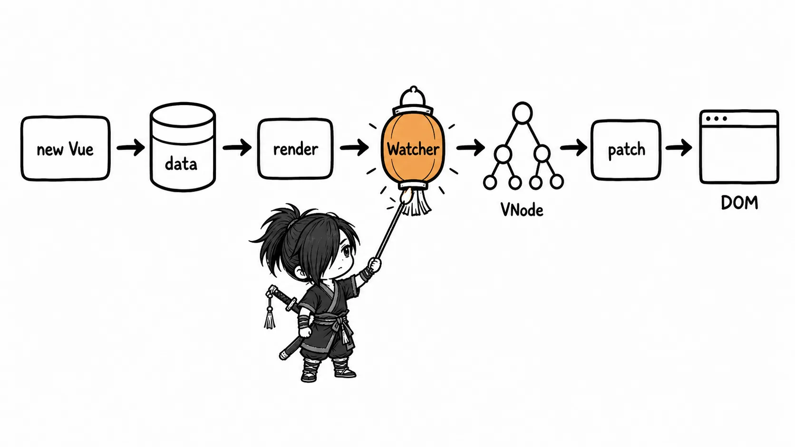
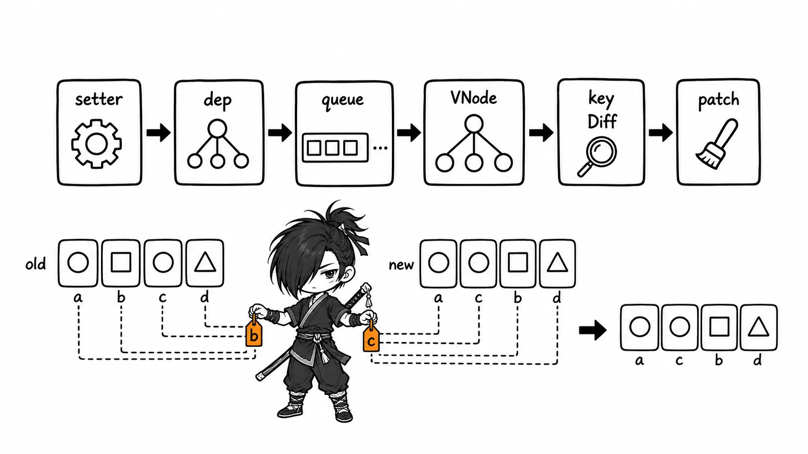
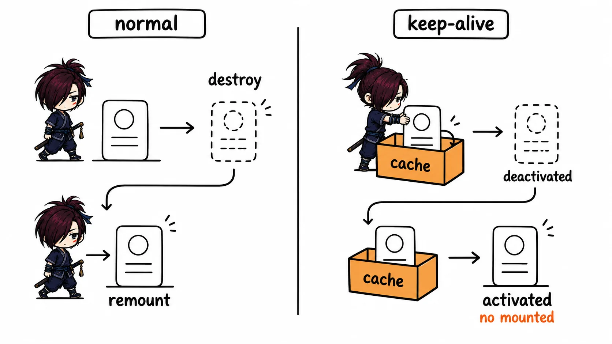

# Vue 面试知识整理

> 本文基于《Vue2 面试真题（29 题）》重新梳理。内容不沿用原 PDF 的逐题顺序，而是按知识依赖与面试复习效率重组；重复的源码片段已合并。资料以 Vue 2 为主，涉及旧版 API 的部分均会说明当前 Vue 3 项目的对应做法。

## 复习建议

- 先掌握五星、四星模块：生命周期、响应式、渲染更新、组件通信、路由与状态管理。
- 回答源码题先给流程，再点出关键对象或方法；不要背大段实现代码。
- 区分 Vue 2 与 Vue 3：Vue 2 以 `Object.defineProperty` 为核心，Vue 3 以 `Proxy` 为核心。
- 工程题要同时说明“前端体验措施”和“后端/服务端必须兜底的安全措施”。

## Vue 基础认知与常用语法

**重要程度：⭐⭐⭐⭐**

### Vue、MVVM 与渐进式

Vue 是以响应式系统、组件化和声明式渲染为核心的渐进式 JavaScript 框架。它借鉴 MVVM 思想：开发者维护 Model（状态），Vue 作为连接状态和 View 的层，把数据变化反映到界面；但 Vue 并非严格教科书意义上的 MVVM。

“渐进式”是指可以只使用核心渲染能力，也可以按需加入 Router、Pinia/Vuex、构建工具和 SSR，而不是被迫接受完整技术栈。

### 常见指令与安全边界

- `v-bind` / `:` 绑定属性，`v-on` / `@` 绑定事件，`v-model` 是表单双向绑定语法糖。
- `v-once` 只渲染一次，`v-pre` 跳过编译；适合明确的静态内容，不能误用于需要响应更新的区域。
- `v-html` 会把字符串当 HTML 插入，未经可信消毒的用户输入可能造成 XSS，默认应使用文本插值或经过专业 HTML Sanitizer 处理。

Vue 3 的组件 `v-model` 是 `modelValue` prop 与 `update:modelValue` 事件；Vue 2 默认是 `value` 与 `input`，可通过 `model` 选项修改。

## 生命周期、实例创建与挂载

**重要程度：⭐⭐⭐⭐⭐**

### Vue 2 生命周期与使用场景

面试回答：

> Vue 实例从创建、初始化响应式状态、编译模板、挂载 DOM，到数据更新和销毁，会依次触发生命周期钩子。创建阶段常做数据初始化和请求；`mounted` 后才可以稳定访问真实 DOM；更新阶段通常不直接修改状态，避免循环更新；销毁前应清理定时器、事件监听和第三方实例。

| 阶段 | 钩子 | 此时可以做什么 |
| --- | --- | --- |
| 创建 | `beforeCreate` / `created` | `created` 中已可访问 `data`、`computed`、`methods`，但没有真实 DOM |
| 挂载 | `beforeMount` / `mounted` | `mounted` 后 DOM 已插入页面，适合初始化图表、测量节点、绑定 DOM 型第三方库 |
| 更新 | `beforeUpdate` / `updated` | 前者适合读取更新前状态；`updated` 仅在确认不会再次改响应式状态时做 DOM 后处理 |
| 销毁 | `beforeDestroy` / `destroyed` | 清理副作用；Vue 3 对应 `beforeUnmount` / `unmounted` |
| 缓存组件 | `activated` / `deactivated` | 被 `<keep-alive>` 缓存组件的激活与失活 |

请求既可在 `created` 发起，也可在 `mounted` 发起；如果请求本身不依赖 DOM，`created` 能更早启动。如果需要依据元素尺寸、DOM ref 或第三方插件状态确定请求参数，才放到 `mounted`。

不要用箭头函数定义生命周期钩子：箭头函数没有自己的 `this`，不会绑定到组件实例。

### `new Vue()` 到首屏渲染的过程

1. 调用 `_init`，合并全局配置、组件配置与 mixin，初始化生命周期、事件、渲染上下文。
2. 初始化 `props`、`methods`、`data`、`computed`、`watch`；Vue 2 递归把数据转换为 getter/setter。
3. 若配置了 `el`，执行 `$mount`：优先使用 `render`，否则编译 `template`，再否则使用挂载元素的 `outerHTML`（运行时含编译器版本）。
4. 创建渲染 `Watcher`，其求值时调用 `_render` 生成 VNode，再调用 `_update` / `patch` 创建真实 DOM 并挂载。
5. 依赖变化后，渲染 Watcher 被异步调度，下一轮统一重新渲染并 patch。

> **补充说明（非原文）：** Vue 3 使用 `createApp` 创建应用，编译后的 render 函数和响应式运行时仍遵循“依赖收集 → 调度 → 渲染器 patch”的主链路，但具体内部结构不同。

> [!VISUALIZATION]  
> **类型：** flow  
> **优先级：** high  
> **标题：** Vue 2 实例创建到首屏挂载  
> **目的：** 展示初始化状态、编译/生成 render、创建渲染 Watcher、VNode 和 patch 的先后关系。  
> **必须表达：** `data` 初始化发生在首次渲染前；首次渲染由渲染 Watcher 驱动。  
> **避免表达：** 不要把模板编译描述为每次数据更新都执行。



## 响应式系统、依赖收集与异步更新

**重要程度：⭐⭐⭐⭐⭐**

### Vue 2 响应式原理

面试回答：

> Vue 2 在初始化时遍历 `data`，通过 `Object.defineProperty` 把属性转换成 getter/setter。组件渲染时会读取属性，getter 将当前渲染 Watcher 收集到对应 `Dep`；属性修改时 setter 通知 Dep，Watcher 被放入更新队列，最后在 `nextTick` 中批量执行并重新渲染。

核心关系是：一个响应式属性对应一个 `Dep`；一个组件渲染、计算属性或用户 `watch` 对应一个 Watcher；Watcher 在求值期间读取到哪些属性，就订阅哪些 `Dep`。

Vue 2 的限制与处理：

- 新增对象属性、通过索引直接修改数组、直接修改数组长度不能可靠侦测。
- 使用 `this.$set(target, key, value)` / `Vue.set()` 新增属性，数组使用 `splice` 等已被重写的变异方法。
- `Object.defineProperty` 无法天然覆盖 `Map`、`Set` 等集合类型，也需要递归遍历已有属性。

### Vue 3 为什么改用 `Proxy`

`Proxy` 代理整个对象，可拦截新增、删除、`in`、遍历等操作，能天然侦测数组索引和对象新增属性，也支持更完整的数据结构；它不需要初始化时深度遍历全部属性，通常按访问路径惰性代理。代价是不能直接代理原始值，且旧浏览器兼容性较差。

> **补充说明（非原文）：** Vue 3 中对象用 `reactive()`，基本值通常用 `ref()`；解构 `reactive` 对象会丢失响应式连接，需用 `toRefs()` 等方式保留引用。

### `computed`、`watch` 与 `methods`

| 对比项 | `computed` | `watch` | `methods` |
| --- | --- | --- | --- |
| 目的 | 根据已有状态推导值 | 响应变化执行副作用 | 封装普通行为 |
| 缓存 | 有，依赖未变则复用 | 无 | 无，每次渲染调用都会执行 |
| 适合 | 过滤、格式化、组合状态 | 请求、存储、日志、异步动作 | 点击处理、业务逻辑 |

`computed` 内部也有 Watcher，采用惰性求值和脏标记：依赖没变时直接返回缓存值；依赖变化后标记为脏，下次访问才重新计算。不要在 `computed` 中发请求、改状态或写其他副作用。

### `nextTick` 与批量更新

Vue 不会在每次赋值后立即 patch DOM，而是去重后把 Watcher 放进队列；同一轮同步代码内多次修改只会合并成一次更新。`nextTick` 会在这一轮 DOM 更新完成后执行回调。

```js
this.visible = true;
await this.$nextTick();
// 此时由 visible 控制的节点已经可获取
this.$refs.dialog.focus();
```

Vue 2 会优先使用 `Promise.then`，再降级到 `MutationObserver`、`setImmediate`、`setTimeout` 等机制。这里的关键不是死记具体降级顺序，而是理解它把 DOM 更新安排在异步队列，以完成批处理。

## 模板、指令与渲染更新

**重要程度：⭐⭐⭐⭐⭐**

### `v-if`、`v-show` 与 `v-for`

`v-if` 控制分支是否创建和销毁，初始条件为假时没有对应 VNode/DOM；`v-show` 始终渲染，仅切换 CSS `display`。频繁切换用 `v-show`，条件很少改变或初始不展示且子树较重时用 `v-if`。

不要在同一个元素上同时使用 `v-if` 与 `v-for`：Vue 2 中 `v-for` 优先级更高，会在每次渲染中先遍历再判断；Vue 3 的优先级又不同，容易产生迁移歧义。应该先用 `computed` 过滤，或把 `v-if` 放到外层 `<template>`。

### `key` 的作用

`key` 是 VNode 的稳定身份标识。列表 patch 时，它帮助 Vue 判断“这是同一个节点移动了”还是“旧节点应删除、新节点应创建”，从而正确复用组件与 DOM 状态。

- 使用唯一、稳定的业务 id，如 `:key="item.id"`。
- 不要在会插入、删除、排序的列表中使用数组下标；否则输入框状态、组件局部状态可能错位。
- 不必为了性能给每个静态节点都添加 key；重点是动态同级列表和组件切换。

### 虚拟 DOM 与 Vue 2 Diff

VNode 是用普通 JavaScript 对象描述节点类型、属性、子节点和文本的中间表示。状态更新时 Vue 生成新 VNode，与旧 VNode 对比，只把必要差异应用到真实 DOM。

Vue 2 的子节点 Diff 采用双端比较：旧开始/旧结束与新开始/新结束四种命中优先；都不命中时按 key 建旧节点索引，再处理新节点的移动、创建和删除。这是针对同层级列表的优化，并非任意树的最优编辑距离算法。

> [!VISUALIZATION]  
> **类型：** flow  
> **优先级：** high  
> **标题：** Vue 2 响应式更新与 Diff  
> **目的：** 串联 setter 通知、Watcher 队列、生成新 VNode、同层 key Diff 与 DOM patch。  
> **必须表达：** 多次同步修改会合并；`key` 用于识别同一节点。  
> **避免表达：** 不要说 Virtual DOM 一定比直接操作 DOM 快。



### `v-model` 与自定义指令

Vue 2 中组件上的 `v-model` 默认是 `value` prop + `input` 事件；可通过组件的 `model` 选项改变。原生表单会按控件类型处理 `value` / `checked` 与事件，并有 `.lazy`、`.trim`、`.number` 修饰符。

Vue 3 默认模型改为 `modelValue` prop + `update:modelValue` 事件，并支持多个 `v-model`。

自定义指令适合直接操作 DOM，例如聚焦、懒加载、权限元素处理；业务状态优先用组件和组合逻辑表达。Vue 2 常用钩子是 `bind`、`inserted`、`update`、`componentUpdated`、`unbind`；Vue 3 对应 `created`、`beforeMount`、`mounted`、`beforeUpdate`、`updated`、`beforeUnmount`、`unmounted`。

### 过滤器与全局 mixin

Vue 2 过滤器可用于简单展示格式化，但会隐藏依赖、调试不便，Vue 3 已移除。现代项目应使用 `computed`、普通格式化函数或可复用 composable。

`Vue.mixin()` 会把选项混入所有实例，生命周期会合并执行，`data` 会合并，冲突选项遵循 Vue 的策略。它影响范围太大、来源不透明；项目中应谨慎，Vue 3 优先使用组合式函数或局部复用。

## 组件通信、插槽与可复用能力

**重要程度：⭐⭐⭐⭐⭐**

### 组件通信如何选择

| 场景 | 推荐方式 | 说明 |
| --- | --- | --- |
| 父传子 | `props` | 单向数据流；子组件不直接改 prop |
| 子传父 | 自定义事件 `this.$emit` | 由父组件决定如何更新状态 |
| 跨多层祖孙 | `provide` / `inject` | 适合依赖注入，不宜代替全部状态管理 |
| 兄弟或无直接关系组件 | 提升状态、Vuex/Pinia | Vue 2 Event Bus 可临时用，但难追踪 |
| 复杂跨页面共享状态 | Vuex（Vue 2）/ Pinia（新项目） | 状态、更新规则与调试集中管理 |

`$parent`、`$children`、直接操作组件实例会增加耦合，不作为默认方案。Vue 2 的 Event Bus 通常是 `Vue.prototype.$bus = new Vue()`；必须在销毁时解绑监听，现代项目更推荐显式状态管理或轻量事件库。

### 插槽（Slot）

插槽解决“组件负责结构和行为，使用者决定局部内容”的问题。默认插槽用于普通内容，具名插槽用于多个内容区域，作用域插槽让子组件把数据以 slot props 暴露给父组件渲染。

```vue
<!-- Child.vue -->
<slot name="item" :row="row" />

<!-- Parent.vue -->
<Child>
  <template #item="{ row }">
    <strong>{{ row.name }}</strong>
  </template>
</Child>
```

插槽内容的作用域属于**父组件**，不是子组件；这是常见追问。Vue 2.6+ 可用 `v-slot` / `#`，它统一了旧的 `slot`、`slot-scope` 写法。

### 组件与插件的区别

组件是可组合的 UI/业务单元，通常有模板、状态、事件和插槽；插件是通过 `Vue.use()` 为 Vue 增加全局能力的安装单元，可以注册组件、指令、mixin、原型方法等。插件应提供 `install(Vue, options)`，并防止重复安装。

不要把大型可变业务状态挂在 `Vue.prototype`：它难测试、难追踪，也会污染全局实例。

## 状态管理与错误处理

**重要程度：⭐⭐⭐⭐**

### Vuex 的工作方式

Vuex 以单一状态树管理共享状态：`state` 保存数据，`getters` 派生数据，`mutations` 同步且唯一地修改 state，`actions` 处理异步并提交 mutation，`modules` 组织大型应用。

面试回答：

> 组件局部状态就近放在组件内；当多个页面或深层组件共享同一份状态、需要统一更新规则和调试轨迹时，再使用 Vuex。异步请求放在 action，最终通过 mutation 同步提交状态变化，这样 Devtools 能明确看到状态从哪里变更。

> **补充说明（非原文）：** Vuex 适用于 Vue 2 和存量 Vue 3 项目；新 Vue 3 项目一般优先 Pinia。不要为了“所有数据集中”把纯表单临时状态也搬到全局。

### 错误边界与统一异常处理

Vue 2 可用组件内 `errorCaptured(err, vm, info)` 捕获后代组件错误，也可配置 `Vue.config.errorHandler` 做全局兜底。它们不能替代请求错误、资源加载错误和服务端错误处理；请求层还应统一处理网络失败、401 刷新/登出、403、业务错误码和可观测性上报。

## 路由、缓存与权限控制

**重要程度：⭐⭐⭐⭐⭐**

### SPA、路由模式与 SEO

SPA 初次通常只拿到一个 HTML 外壳，后续由 JavaScript 接管路由和渲染；MPA 每个页面是独立文档。SPA 交互顺畅、前后端分离友好，但首屏 JavaScript 负担和传统爬虫 SEO 是其常见挑战。

Vue Router 的 hash 模式监听 `hashchange`，`#` 后内容不随 HTTP 请求发送，部署简单；history 模式使用 `pushState` / `replaceState` / `popstate`，URL 更自然，但服务器必须把未知前端路由回退到入口 HTML。

```nginx
location / {
  try_files $uri $uri/ /index.html;
}
```

部署 history 模式后刷新 404，通常不是 Vue Router 本身坏了，而是 Nginx/网关把 `/user/1` 当成真实文件路径却找不到；配置回退并保留静态资源直出即可。

### 路由守卫与前端权限

常见流程：登录后取得 token 和用户权限 → 请求或计算可访问路由 → 动态添加路由/生成菜单 → 全局前置守卫校验访问资格 → 无权限跳转 403，未登录跳转登录页。按钮级权限可用指令或组件控制显示。

关键边界：前端权限只能改善体验和避免误操作，**不能作为安全边界**；接口必须由服务端按用户身份和资源权限再次校验。也不要仅把角色写入 `sessionStorage` 后就相信它。

### `keep-alive` 的原理与使用

`<keep-alive>` 是抽象组件，会缓存其第一个组件子节点的实例/VNode，组件切走时不销毁而是 `deactivated`，回来时 `activated`。它支持 `include`、`exclude`、`max`；`max` 超出后按 LRU 思路淘汰最久未使用缓存。

```vue
<keep-alive :include="['ListPage']" :max="10">
  <router-view v-if="$route.meta.keepAlive" />
</keep-alive>
<router-view v-if="!$route.meta.keepAlive" />
```

需要刷新缓存页数据时用 `activated`，不要只依赖 `mounted`。缓存会保留表单、滚动位置等状态，也会占内存，不能把所有页面无差别缓存。

> [!VISUALIZATION]  
> **类型：** lifecycle  
> **优先级：** medium  
> **标题：** 普通组件与 keep-alive 缓存组件的生命周期  
> **目的：** 对比切换页面时销毁/重建与 `activated`/`deactivated` 的区别。  
> **必须表达：** 缓存组件离开时不是销毁，返回时不会再次 `mounted`。  
> **避免表达：** 不要说 keep-alive 会自动决定所有页面缓存策略。



## 请求封装与 Axios 原理

**重要程度：⭐⭐⭐⭐**

### Axios 封装应解决什么

请求封装的目标不是简单包一层 `get` / `post`，而是让 base URL、超时、认证头、序列化、重复请求取消、响应结构、错误提示和日志策略可控。一般创建实例，再添加请求/响应拦截器，并按领域拆分 API 模块。

```js
import axios from 'axios';

const http = axios.create({ baseURL: '/api', timeout: 10_000 });

http.interceptors.request.use((config) => {
  const token = getToken();
  if (token) config.headers.Authorization = `Bearer ${token}`;
  return config;
});

http.interceptors.response.use(
  (response) => response.data,
  (error) => Promise.reject(normalizeHttpError(error)),
);
```

token 过期后的并发刷新、重试和跳转登录要避免每个请求各自处理；实现时通常需要单飞锁和等待队列。敏感 token 的存储策略需要结合 XSS/CSRF 防护设计，不能只套模板。

### Axios 为什么能有拦截器

Axios 会把请求拦截器、核心 `dispatchRequest` 和响应拦截器串成 Promise 链：请求拦截器按注册的逆序参与链路，核心层选择浏览器 XHR 或 Node HTTP adapter 发请求，响应再依次经过响应拦截器。`axios.create()` 创建带独立默认配置和拦截器的实例。

> **补充说明（非原文）：** 新浏览器项目也常使用 `fetch`；它不因 HTTP 4xx/5xx 自动 reject，封装时应显式检查 `response.ok`。选择 Axios 或 fetch 不如统一错误模型和取消策略重要。

## 首屏性能、部署与 SSR

**重要程度：⭐⭐⭐⭐**

### SPA 首屏优化

先用性能指标和瀑布图定位瓶颈，再处理最影响用户体验的路径。常见措施：

- 路由级动态导入、组件按需加载，减小首包；避免把所有 UI 库和编辑器打入入口。
- Tree Shaking、拆包、去除重复依赖，合理使用长期缓存和内容哈希。
- 图片压缩、响应式图片、懒加载；静态资源走 CDN，并启用 Brotli/Gzip。
- 减少关键请求链，预加载真正关键资源；接口并行、骨架屏和缓存提升感知速度。
- 通过 Performance API、LCP/INP/CLS、网络面板验证，不只看 `DOMContentLoaded`。

### SSR 的价值与边界

SSR 在服务端把首屏渲染为 HTML，浏览器先显示内容，再由客户端 hydration 接管交互。它能改善首屏可见速度和 SEO，但带来服务端计算、缓存、数据预取、同构代码和 hydration 一致性复杂度。

Vue 2 SSR 要点：每个请求都创建新的 router/store/app 实例，服务端等待路由匹配组件的异步数据后渲染，并将初始状态注入 HTML；客户端用同一状态接管，避免重复请求和 hydration mismatch。Nuxt 是更实际的工程化选择。

> **补充说明（非原文）：** Vue 3 通常用 Nuxt 3，而不是从零搭建 Vue 2 SSR webpack 配置。SSR 并非所有项目的默认答案；内容型、SEO 强或首屏要求高的页面收益最大。

## Vue 3 核心变化与迁移重点

**重要程度：⭐⭐⭐⭐⭐**

### Vue 3 相对 Vue 2 的关键升级

- 响应式从 `Object.defineProperty` 改为 `Proxy`，解决新增属性和数组索引等限制。
- 新增 Composition API，按逻辑关注点组织 `ref`、`reactive`、`computed`、`watch` 与生命周期，利于复用和 TypeScript。
- 编译器做静态提升、Patch Flag 等优化，运行时渲染器与平台能力解耦，支持自定义渲染器。
- 全局 API 改为应用实例 API：`createApp(App).use(...).mount(...)`，减少全局污染；支持更好的 Tree Shaking。
- 新增 Fragment、Teleport、Suspense（稳定性与使用范围需结合版本判断）。

### Composition API 的面试表达

> Composition API 不是为了替换 Options API 的语法偏好，而是把同一业务逻辑相关的状态、计算、监听和副作用放在一起，通过 composable 复用。小组件用 Options API 仍然清晰；逻辑复杂、跨组件复用或 TypeScript 要求高时，组合式 API 更有优势。

```js
import { computed, onMounted, ref } from 'vue';

export function useCounter() {
  const count = ref(0);
  const double = computed(() => count.value * 2);
  const increment = () => count.value++;

  onMounted(() => console.log('mounted'));
  return { count, double, increment };
}
```

`ref` 在 JavaScript 中通过 `.value` 访问；在模板和部分解包场景中会自动解包。`watch` 是副作用工具，`watchEffect` 会自动收集同步执行期间访问的依赖；异步回调中 `await` 后读取的依赖不会被它自动追踪。

### 常见不兼容变更

- 组件 `v-model`：`value` / `input` 改为 `modelValue` / `update:modelValue`。
- 过滤器移除；用方法、计算属性或工具函数替代。
- `.native` 修饰符、`keyCode`、实例事件 API（`$on`、`$off`、`$once`）移除或需替代方案。
- 生命周期改名：`beforeDestroy` / `destroyed` → `beforeUnmount` / `unmounted`。
- 自定义指令、Transition class、`$scopedSlots` 等均有迁移调整。
- `Vue.set` / `this.$set` 在 Proxy 响应式系统中不再需要。

Teleport 适合把弹窗、Toast 等 DOM 渲染到指定容器，但组件逻辑关系仍属于原组件树；它不是跨应用状态通信工具。

## 组件设计、性能排查与项目开放题

**重要程度：⭐⭐⭐⭐**

### `ref`、`reactive` 与监听策略

`ref` 可包装基本值或对象，在 JavaScript 中通过 `.value` 访问；`reactive` 只代理对象。模板会自动解包常见 `ref`，但解构 `reactive` 会丢失响应式连接，应使用 `toRefs()` 等方式。

`watch` 显式指定监听源，可取得新旧值并控制 `immediate`、`deep`、`flush`；`watchEffect` 会立即执行并自动收集其同步执行期间访问的依赖。大对象的 `deep: true` 会递归遍历，成本高；应尽量监听真正关心的字段。

### 可复用组件与复杂页面如何设计

可复用组件要有清晰的 `props` 输入、`emit` 输出、职责边界与默认值；通过具名/作用域插槽提供扩展点，而非不断增加耦合业务的开关。表单体系一般需要字段配置、值与校验的统一管理、联动显示/校验、回显和重置能力。

大列表和复杂表格优先分页、虚拟滚动、分块/懒加载，只更新变更行；同时注意冻结列、单元格合并与高成本 render 函数。排查重复渲染时，观察组件依赖、父组件传入的对象/函数是否频繁变化，并用 Vue Devtools 查看更新链路。

### 如何回答项目开放题

推荐按照“现象 → 定位 → 方案 → 结果/取舍”回答。例如首屏慢：先用网络瀑布、LCP 等指标定位首包与关键请求，再采用路由拆包、按需引入、缓存和图片优化，并说明如何验证收益。

从 0 到 1 的后台项目可按以下结构表达：选定 Vue 3 + Vite + TypeScript + Router + Pinia；规划目录与模块边界；建立请求、路由、权限和布局层；沉淀组件/composable；最后接入规范、监控、测试、环境配置和发布流程。

## 面试冲刺索引

### ⭐⭐⭐⭐⭐ 核心必会

- 生命周期：`created` 与 `mounted`、缓存组件钩子、销毁清理。
- Vue 2 响应式：`Observer`、`Dep`、`Watcher`、`$set` 局限；Vue 3 `Proxy` 改进。
- `nextTick` 批处理、`computed` 与 `watch` 的边界。
- VNode、`key`、Vue 2 双端 Diff、`v-if` 与 `v-show`。
- `props` / `$emit`、插槽、Vuex/Pinia、路由守卫与 keep-alive。
- Vue 3 Composition API 和核心迁移项。

### ⭐⭐⭐⭐ 高频工程追问

- history 路由刷新 404 如何处理。
- 前端权限为什么不能代替后端鉴权。
- Axios 拦截器、token 失效与并发请求如何收敛处理。
- SPA 首屏优化如何用指标验证，SSR 的收益和成本是什么。

### 容易连续追问的知识链

- 响应式 → 依赖收集 → Watcher 调度 → `nextTick` → VNode / Diff。
- `v-for` 的 key → 节点复用 → 组件局部状态错位。
- SPA 路由模式 → Nginx 回退 → SEO → SSR / Nuxt。
- Vue 2 限制 → Proxy → Composition API → Vue 3 迁移。
