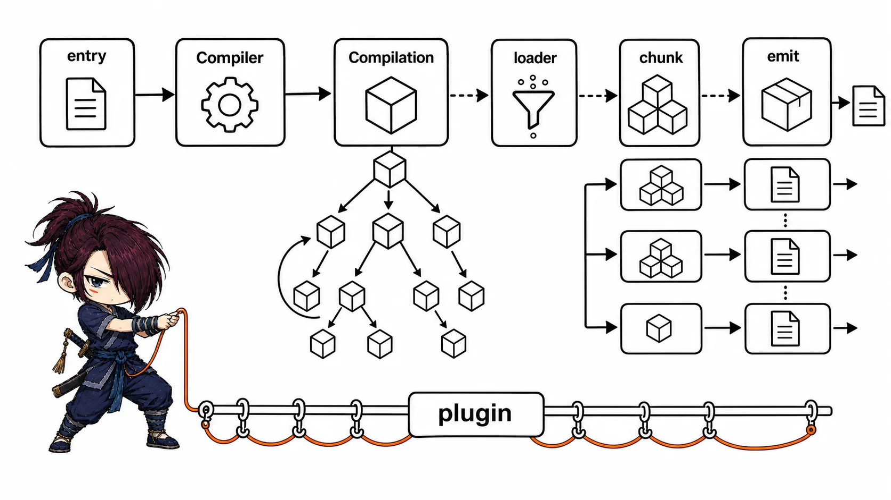
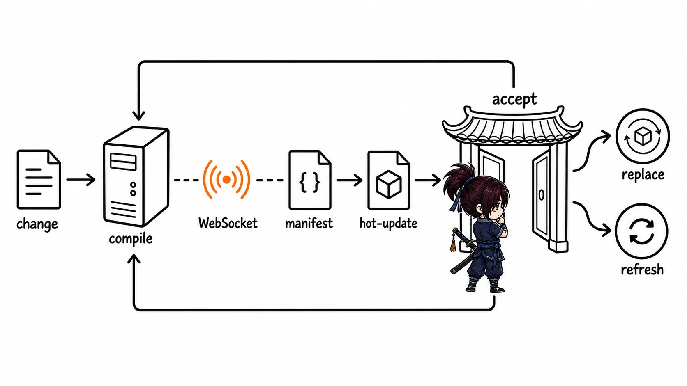
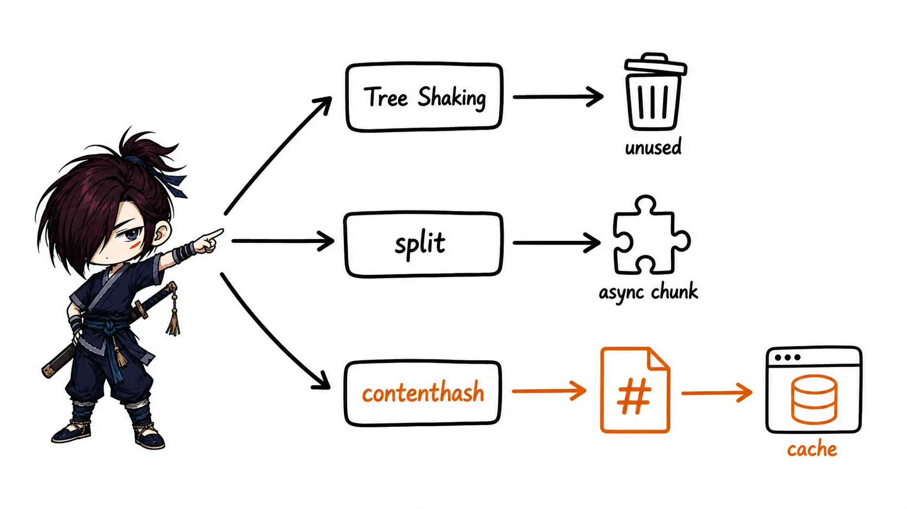
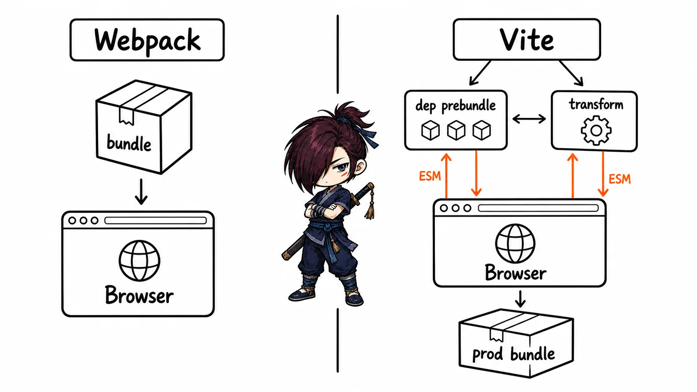

# Webpack 面试知识整理

> 本文基于《Webpack 面试真题》重新梳理。内容按知识依赖和面试复习效率组织，而非原 PDF 页序；重复配置已合并，Webpack 4 时代的部分 API 已按 Webpack 5 修正，并以“补充说明（非原文）”标出。

## 复习建议

- 先掌握“模块为什么需要打包 → Webpack 如何构建 → Loader/Plugin 如何扩展”这条主线，再复习 HMR 与性能优化。
- 面试回答避免只背配置。说清楚配置在构建生命周期的哪个阶段生效、解决什么问题，才容易经得起追问。
- 优先复习五星和四星模块；配置项只记典型场景，不必死记全部参数。

## Webpack 的定位与基础概念

**重要程度：⭐⭐⭐⭐**

> **来源页码：** PDF 第 1-5 页（原题 1）

### Webpack 解决了什么问题

Webpack 是一个模块打包器（module bundler）。它从一个或多个入口出发，递归分析 `import`、`export`、`require` 等依赖，按规则转换各种资源，最后输出浏览器可加载的 JavaScript、CSS、静态资源和 HTML。

面试时可以这样回答：

> 早期页面通过多个 `<script>` 标签加载脚本，模块容易污染全局变量，也难处理依赖顺序、CSS 预处理器和图片等资源。Webpack 以模块依赖图为核心，把非 JavaScript 资源转换为模块，并按需拆分、优化后输出可部署的产物。

### 核心术语

|术语|含义|面试要点|
|---|---|---|
|`entry`|构建依赖图的起点|可以是单入口、多入口或对象形式|
|`module`|依赖图中的一个资源|不只 `.js`；CSS、图片等经 Loader 转换后也是模块|
|`chunk`|Webpack 构建过程中的代码块|入口、动态导入和代码分割都可能生成 chunk|
|`asset`|最终输出到磁盘的文件|如 `.js`、`.css`、图片等|
|`bundle`|通常指打包后的 JS 文件|日常语境中常泛指最终构建产物|

### 最小化 Webpack 5 配置

```js
const path = require('node:path')

module.exports = {
  mode: 'development',
  entry: './src/index.js',
  output: {
    path: path.resolve(__dirname, 'dist'),
    filename: '[name].[contenthash:8].js',
    clean: true,
  },
}
```

`mode` 会提供合理的默认优化策略，但不替代业务需要的 Loader、Plugin 与 `optimization` 配置。

## 构建生命周期、依赖图与产物生成

**重要程度：⭐⭐⭐⭐⭐**

> **来源页码：** PDF 第 9-15 页（原题 3）

### 一句话理解

Webpack 先根据配置创建 `Compiler`，再创建一次构建对应的 `Compilation`；它从入口递归构建模块依赖图，完成代码生成、分 chunk、生成 assets，最后写入输出目录。

### 构建主流程

1. 读取 `webpack.config.js` 与命令参数，创建全局唯一的 `Compiler`。
2. `Compiler` 触发 `run`、`compile` 等钩子，并在每次构建时创建一个新的 `Compilation`。
3. 从 `entry` 开始，解析模块请求；`NormalModuleFactory` 创建模块实例。
4. 读取资源并按从右到左的顺序执行匹配的 Loader，转换成 JavaScript 可处理的模块内容。
5. 解析模块中的依赖，递归重复构建，形成模块依赖图。
6. `seal` 阶段根据入口、动态导入和优化策略生成 chunks，进行模块 ID、代码分割、压缩等处理。
7. 生成 assets，触发 `emit`，将文件写入 `output.path`；监听模式下继续等待下一次文件变更。

### `Compiler` 与 `Compilation`

|对象|生命周期|职责|
|---|---|---|
|`Compiler`|一次 Webpack 启动期间通常只有一个|保存全局配置、注册钩子、发起或监听构建|
|`Compilation`|每次构建都会新建|保存本轮的模块、依赖、chunks、assets 与错误信息|

一个实用记忆法：Plugin 想监听“整个构建器”就从 `compiler.hooks` 开始；想读取或修改“本次打包产物”，通常在拿到 `compilation` 后操作。

> [!VISUALIZATION]  
> **类型：** flow  
> **优先级：** high  
> **标题：** Webpack 从入口到产物的构建流程  
> **目的：** 展示 `Compiler`、每轮 `Compilation`、模块递归构建、chunk 生成和 emit 的先后关系。  
> **必须表达：** Loader 在模块构建阶段转换资源；Plugin 通过生命周期钩子介入；`Compilation` 每次构建重新创建。  
> **避免表达：** 不要画成所有文件同时、无依赖关系地直接输出。



### 高频追问：为什么说 Webpack 基于依赖图

入口并不是简单的“第一个被拼接的文件”。Webpack 会记录每个模块依赖了谁、被谁依赖，因而能够：识别重复依赖、支持动态 `import()`、按入口/异步边界拆分 chunk，并在生产构建中进行未使用导出的分析。

## 热模块替换（HMR）

**重要程度：⭐⭐⭐⭐⭐**

> **来源页码：** PDF 第 5-9 页（原题 2）

### HMR 与整页刷新的区别

HMR（Hot Module Replacement）在文件变化后只替换发生变化的模块及其可接受边界，不主动刷新整个页面。CSS 通常可直接替换；JS 必须有可接受更新的边界，否则会回退为整页刷新（开发服务器配置允许时）。

### 面试回答

> 开发服务器会监听文件变化。变更后 Webpack 重新编译，并把本次更新的 hash、manifest 和 hot-update chunk 通知浏览器。浏览器端的 HMR runtime 拉取更新，找到能够 `accept` 该模块的边界后替换模块并执行回调；如果找不到可接受边界，就回退为页面刷新。它的目标是保留未受影响模块的运行状态，提高开发反馈速度。

### 核心链路

1. `webpack-dev-server`（或其他开发服务器）监听源文件。
2. 文件变更触发增量编译，服务端产出更新清单与 hot-update chunk。
3. 服务端通过 WebSocket 通知客户端存在新 hash。
4. HMR runtime 请求 manifest，确认变更的 chunk 与模块。
5. runtime 下载 hot-update chunk，调用 dispose/accept 逻辑替换模块。
6. 更新无法被接受时，执行整页刷新作为降级方案。

```js
// 仅用于原生模块场景；框架通常已由其开发插件处理 HMR 边界
if (module.hot) {
  module.hot.accept('./util.js', () => {
    console.log('util.js 已热更新')
  })
}
```

> **补充说明（非原文）：** Webpack 5 开发模式启用 `devServer.hot` 时会自动加入 HMR 所需运行时代码，一般不再手动添加旧版 `HotModuleReplacementPlugin`。框架项目应优先使用框架脚手架/插件提供的 HMR 集成。

> [!VISUALIZATION]  
> **类型：** flow  
> **优先级：** high  
> **标题：** HMR 更新链路  
> **目的：** 展示文件变更、重新编译、WebSocket 通知、manifest 与 hot-update chunk 拉取、模块替换/刷新降级。  
> **必须表达：** HMR 是客户端 runtime 和开发服务器协作完成的；`accept` 边界决定能否局部更新。  
> **避免表达：** 不要把 HMR 描述成“只重新运行某个文件”或保证永不刷新。



## 开发服务器与代理

**重要程度：⭐⭐⭐⭐**

> **来源页码：** PDF 第 15-17 页（原题 4）

### 为什么开发时需要代理

浏览器同源策略会拦截前端开发服务器直接调用不同源的后端接口。代理由开发服务器代替浏览器请求目标 API，浏览器只与本地同源服务器通信，因此可避免开发阶段的跨域限制；它不是后端 CORS 配置的替代品。

```js
module.exports = {
  devServer: {
    static: './dist',
    port: 9000,
    proxy: [
      {
        context: ['/api'],
        target: 'https://api.example.com',
        changeOrigin: true,
      },
    ],
  },
}
```

常用项：`target` 是目标服务；`changeOrigin` 用于需要匹配目标 `Host` 的服务；`pathRewrite` 用于重写转发路径；`secure: false` 仅用于本地调试自签名 HTTPS 服务。

> **补充说明（非原文）：** 原资料中的 `contentBase` 是 Webpack Dev Server 4 之前的 API；Webpack 5 应使用 `devServer.static`。代理底层常用 `http-proxy-middleware`，但配置应以当前 `webpack-dev-server` 文档为准。

## Loader：让非 JavaScript 资源进入依赖图

**重要程度：⭐⭐⭐⭐⭐**

> **来源页码：** PDF 第 17-25 页（原题 5）

### Loader 是什么

Loader 本质是模块源码的转换器。Webpack 只天然理解 JavaScript 和 JSON；当遇到 CSS、Sass、图片、TypeScript 等资源时，Loader 把输入内容处理为 Webpack 可继续分析的模块结果。

### 执行顺序与常见 CSS 链

`use` 中的 Loader 默认从右到左（或从下到上）执行：

```js
{
  test: /\.s?css$/,
  use: [
    'style-loader',
    'css-loader',
    'sass-loader',
  ],
}
```

这里 `sass-loader` 将 Sass 编译为 CSS，`css-loader` 解析 `@import`、`url()` 并把 CSS 转为模块，`style-loader` 再在开发环境把样式注入 `<style>`。生产环境一般用 `MiniCssExtractPlugin.loader` 替代 `style-loader`，抽取独立 CSS 文件。

### 常见 Loader 与现代替代

|需求|优先方案|说明|
|---|---|---|
|JS/TS 转译|`babel-loader`、`ts-loader` 或 SWC/esbuild Loader|只处理必要目录，避免编译整个 `node_modules`|
|CSS Modules|`css-loader` 的 `modules` 选项|处理局部类名|
|Sass/Less|`sass-loader` / `less-loader`|需配合对应编译器|
|导入文本|Webpack 5 `asset/source`|替代 `raw-loader`|
|图片、字体等文件|Webpack 5 Asset Modules|替代 `file-loader`、`url-loader`|

```js
{
  test: /\.(png|jpe?g|gif|svg)$/i,
  type: 'asset',
  parser: { dataUrlCondition: { maxSize: 8 * 1024 } },
  generator: { filename: 'images/[name].[contenthash:8][ext]' },
}
```

`asset` 会在小文件时内联为 Data URL、大文件时输出独立文件；也可按需使用 `asset/resource` 或 `asset/inline`。

### 手写 Loader 的关键点

Loader 接收原始源码（`string` 或 `Buffer`），返回转换后的源码；异步 Loader 应使用 `this.async()`/回调，而不是既回调又 `return`。

```js
module.exports = function bannerLoader(source) {
  const options = this.getOptions()
  return `/* ${options.banner} */\n${source}`
}
```

> **补充说明（非原文）：** `this.query` 是旧写法，现代 Loader 应优先使用 `this.getOptions()`；若产生 Source Map 或 AST，需要按 Loader API 返回或回调传递，不能随意丢失映射信息。

## Plugin：在生命周期中扩展构建能力

**重要程度：⭐⭐⭐⭐⭐**

> **来源页码：** PDF 第 25-33 页（原题 6）

### Plugin 是什么

Plugin 是一个具有 `apply(compiler)` 方法的对象或类。它通过 Tapable hooks 订阅 Webpack 生命周期，可影响多个模块、chunks、assets 或构建过程本身，因此适合处理 Loader 无法承担的跨构建任务。

```js
class BuildLogPlugin {
  apply(compiler) {
    compiler.hooks.done.tap('BuildLogPlugin', (stats) => {
      console.log(`构建完成，耗时：${stats.endTime - stats.startTime}ms`)
    })
  }
}

module.exports = BuildLogPlugin
```

面试时可补充：不同钩子有同步、异步串行、异步并行等类型；应选择对应的 `tap`、`tapAsync` 或 `tapPromise`，不要把异步操作塞进同步钩子。

### 高频 Plugin 场景

|场景|典型工具|作用|
|---|---|---|
|生成 HTML|`HtmlWebpackPlugin`|以模板生成 HTML，并自动注入构建资源|
|清理输出|`output.clean: true`|Webpack 5 内置，通常无需 `clean-webpack-plugin`|
|抽离 CSS|`mini-css-extract-plugin`|输出独立 CSS 文件|
|编译时常量|`DefinePlugin`|替换源码中的标识符|
|复制静态文件|`copy-webpack-plugin`|复制不进入模块图的文件|
|压缩|Terser、CSS Minimizer|压缩 JS、CSS|

`DefinePlugin` 是文本级常量替换，不是读取环境变量的运行时对象。传入字符串值时通常需要 `JSON.stringify`：

```js
new webpack.DefinePlugin({
  __API_BASE__: JSON.stringify(process.env.API_BASE ?? '/api'),
})
```

### Loader 与 Plugin 的区别

> **来源页码：** PDF 第 33-37 页（原题 7）

|维度|Loader|Plugin|
|---|---|---|
|作用对象|单个模块的源代码|整个构建生命周期与产物|
|调用方式|匹配 `module.rules` 后按链执行|配置中实例化，Webpack 调用 `apply`|
|适合解决|语法/资源转换，例如 Sass 转 CSS|生成 HTML、压缩、注入常量、改写 assets 等|
|能力边界|主要是“把这个模块变成另一个模块”|可观察和修改 modules、chunks、assets、构建流程|

## 构建速度优化

**重要程度：⭐⭐⭐⭐**

> **来源页码：** PDF 第 37-43 页（原题 8）

优化前先用 `--profile --json`、`webpack-bundle-analyzer` 或构建日志定位瓶颈。大多数项目的第一收益来自“少构建、少解析、命中缓存”，而不是堆叠插件。

### 高收益策略

1. **缩小处理范围：** 为 `babel-loader` 等设置 `include: path.resolve(__dirname, 'src')`，避免无差别处理 `node_modules`；必要时精确设置 `exclude`。
2. **优化模块解析：** `resolve.extensions` 只保留实际需要的扩展名；用 `resolve.alias` 缩短路径或固定单一依赖版本；谨慎配置 `resolve.modules`。
3. **启用持久化缓存：** Webpack 5 可配置 `cache: { type: 'filesystem' }`，让未变化模块复用磁盘缓存。
4. **减少昂贵的转换：** 现代项目优先评估 SWC/esbuild 等更快的转译器；对耗时 Worker 开启合理并行，避免机器核数不足时反而争抢资源。
5. **开发环境选择合适 Source Map：** 追求快速重建可用 `eval-cheap-module-source-map`；生产环境根据是否公开源码映射与排错需求选择 `source-map`、`hidden-source-map` 等。

```js
module.exports = {
  cache: { type: 'filesystem' },
  module: {
    rules: [{
      test: /\.[jt]sx?$/,
      include: path.resolve(__dirname, 'src'),
      use: 'babel-loader',
    }],
  },
}
```

### 需要谨慎的旧方案

DLL 曾用于把稳定第三方依赖预编译以减少重复构建，但配置维护成本高。Webpack 5 的持久化缓存与更成熟的代码分割通常已能满足需求，应只在基准测试证明收益明显时采用。`cache-loader` 也不是 Webpack 5 的首选，应优先使用内置文件系统缓存。

## 生产构建：体积、缓存与加载性能

**重要程度：⭐⭐⭐⭐⭐**

> **来源页码：** PDF 第 43-52 页（原题 9）

### 代码压缩与资源压缩

生产模式默认启用 JavaScript 最小化；需要定制时用 `TerserPlugin`。CSS 使用 `css-minimizer-webpack-plugin`，图片则在构建时压缩或交给 CDN/图片服务。Gzip/Brotli 是传输压缩，必须由服务器或 CDN 正确返回 `Content-Encoding`，不能只生成 `.gz` 文件就认为线上已生效。

### Tree Shaking 的前提

Tree Shaking 是对“未使用导出”的静态分析和删除，最可靠的前提是 ES Modules 的静态 `import`/`export`。Webpack 先标记 `usedExports`，再由压缩器移除死代码。

`package.json` 的 `sideEffects` 用来声明导入模块是否可能产生副作用：

```json
{
  "sideEffects": ["*.css", "./src/polyfills.js"]
}
```

如果库错误地写成 `false`，CSS 导入、polyfill 或仅靠执行产生效果的模块可能被错误删除；因此它不是“性能开关”，而是对包行为的声明。

### 代码分割与长期缓存

```js
module.exports = {
  optimization: {
    runtimeChunk: 'single',
    splitChunks: { chunks: 'all' },
  },
}
```

- 动态 `import()` 是按路由/交互拆包的自然边界。
- `splitChunks` 可提取公共模块和第三方依赖，减少重复下载。
- 文件名使用 `[contenthash]` 能让内容不变的文件保持 URL 不变，从而命中浏览器长期缓存。
- 抽离 runtime 能降低业务代码变更引发的入口文件 hash 连锁变化。

### 易混点：Tree Shaking、代码分割与压缩

|概念|目标|典型手段|
|---|---|---|
|Tree Shaking|删除未使用代码|ESM、`usedExports`、压缩器|
|代码分割|把代码拆成按需/共享 chunks|`import()`、`splitChunks`|
|代码压缩|缩短仍需执行的代码|Terser、CSS Minimizer|

> [!VISUALIZATION]  
> **类型：** relationship  
> **优先级：** medium  
> **标题：** 生产构建中代码分割、缓存与 Tree Shaking 的关系  
> **目的：** 区分“删除无用代码”“拆分可加载代码”“为稳定文件名命中缓存”三类优化。  
> **必须表达：** 三者可协作但解决的问题不同；动态导入产生异步 chunk，`contenthash` 服务于缓存。  
> **避免表达：** 不要把 Tree Shaking 画成网络层的按需加载。



## Webpack 与 Rollup、Parcel、Snowpack、Vite

**重要程度：⭐⭐⭐**

> **来源页码：** PDF 第 52-59 页（原题 10）

|工具|开发期核心思路|更适合|
|---|---|---|
|Webpack|构建完整依赖图并打包，生态和可定制性强|复杂应用、遗留配置、需要深度定制的工程|
|Rollup|以 ESM 库打包和 Tree Shaking 见长|组件库、工具库等发布型项目|
|Parcel|约定优于配置，自动处理常见资源|希望快速开始、较少定制的小中型项目|
|Snowpack|开发期直接利用原生 ESM 的早期工具|历史了解即可，主流实践已被 Vite 等取代|
|Vite|开发期基于原生 ESM 按需提供模块并预构建依赖；当前版本默认用 Rolldown 完成生产构建|现代前端应用的快速开发体验|

面试回答不应绝对化：Vite 并非“完全不打包”，它在生产构建阶段仍会打包优化；Webpack 也并非一定慢，合理缓存、增量构建和范围控制后同样可用于大型工程。选择取决于现有生态、构建定制深度、迁移成本与团队经验。

> **补充说明（非原文）：** 原资料编写于 2023 年，当时 Vite 的生产构建主要依赖 Rollup；当前 Vite 已采用 Rolldown 作为默认构建器，但其插件 API 仍延续并兼容 Rollup 生态的主要约定。

> [!VISUALIZATION]  
> **类型：** comparison  
> **优先级：** medium  
> **标题：** Webpack 打包开发与 Vite 原生 ESM 开发的请求差异  
> **目的：** 对比开发阶段“预先构建 bundle”和“浏览器按需请求模块、服务端按需转换”的差异。  
> **必须表达：** Vite 仍会对依赖做预构建，并在生产阶段通过 Rolldown 打包；两者都是构建工具链而非简单快慢对立。
> **避免表达：** 不要画成 Vite 完全不转换或不产出 bundle。



## 面试冲刺索引

### ⭐⭐⭐⭐⭐ 核心必会

- Webpack 构建流程：`Compiler`、`Compilation`、依赖图、Loader、chunk、emit
- HMR 完整链路与 `accept` 边界
- Loader 与 Plugin 的职责、调用方式和手写思路
- Tree Shaking 的 ESM 前提与 `sideEffects`
- 代码分割、`contenthash` 与长期缓存

### ⭐⭐⭐⭐ 高频重点

- Webpack 解决的模块化与资源处理问题
- 开发服务器代理的原理与常用配置
- 构建提速：缩小范围、解析、缓存、Source Map
- JS/CSS/资源压缩与传输压缩的区别

### 容易连续追问的知识链

- 入口 → 依赖图 → Loader 转换 → `Compilation` → chunk/assets → emit
- 文件变更 → 增量编译 → WebSocket 通知 → HMR runtime → `accept` / 刷新降级
- ES Modules → `usedExports` → 压缩器 → Tree Shaking → `sideEffects`
- `import()` → 异步 chunk → `splitChunks` → `contenthash` → 浏览器缓存
