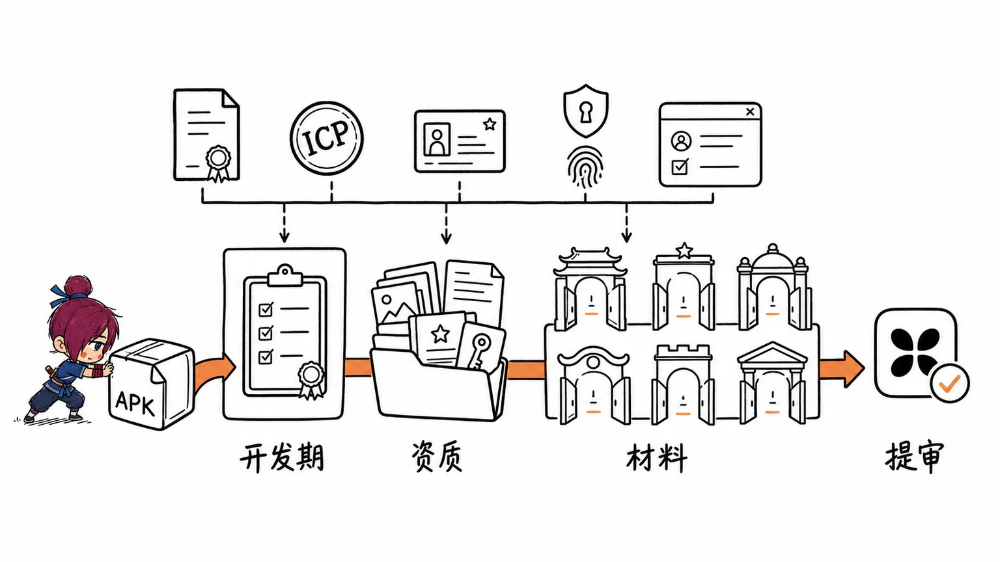
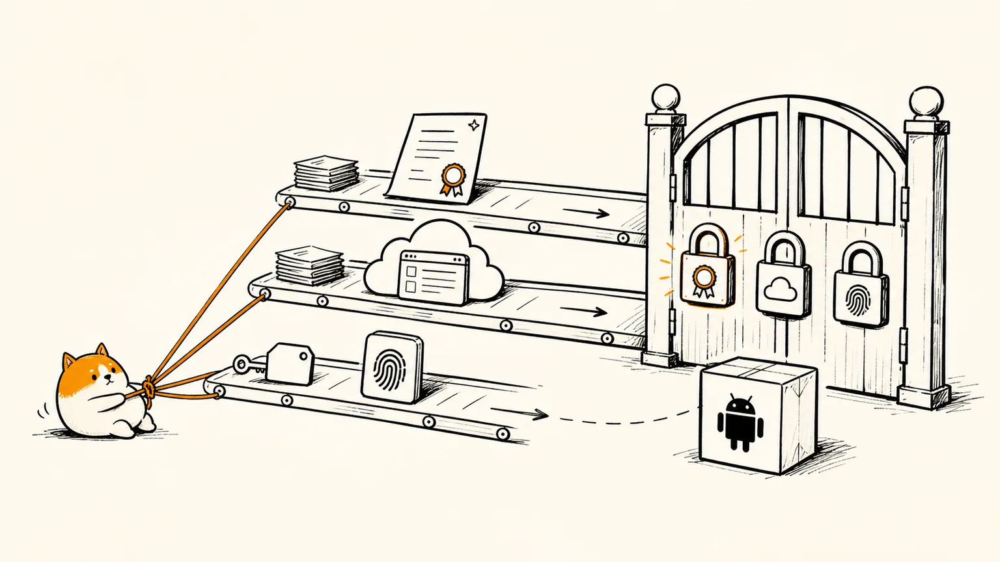
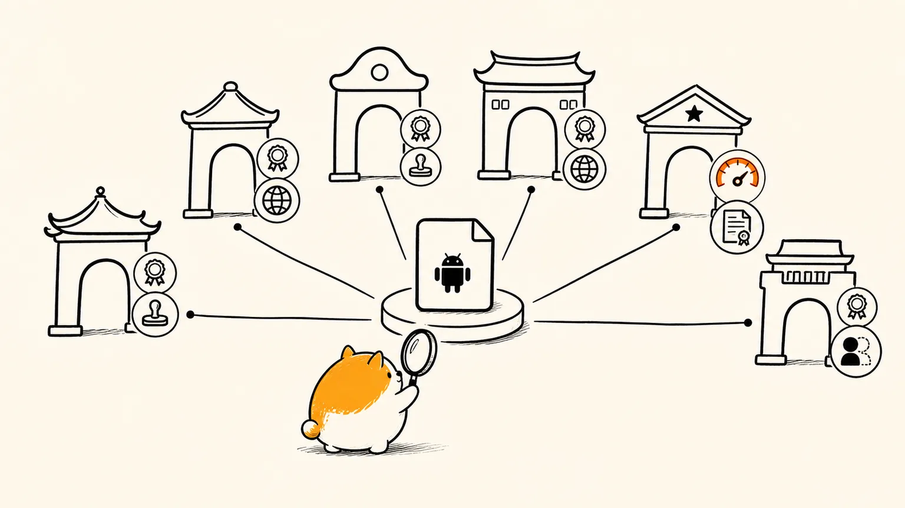

# 国内安卓应用市场上架指南

国内安卓应用没有统一的应用商店，华为、小米、OPPO、vivo、应用宝、荣耀等各自维护独立的分发平台，每个平台都有独立的开发者账号体系和审核规则。自 2023 年起工信部强制要求所有 APP 完成备案，进一步提高了上架门槛。

上架流程分三个阶段：**开发阶段并行推进**资质准备；**开发完成后**整理提审材料；**提交审核**并跟进。资质类事项（软著、备案）审批周期较长，必须在开发阶段就同步启动，否则 APP 做完却卡在资质上。

---

## 一、开发阶段：并行推进的准备项

开发期间不需要等 APK 出包，以下事项可以同步启动。

### 1. 注册各平台开发者账号

前往各平台开发者官网完成注册与实名认证，企业账号需上传营业执照、法人身份证件。

| 平台 | 开发者后台地址 | 个人可上架 Android App |
|------|---------------|----------------------|
| 华为 AppGallery | developer.huawei.com/consumer/cn | ✅ |
| 小米应用商店 | dev.mi.com | ✅ |
| OPPO 软件商店 | open.oppomobile.com | ❌（仅快应用/主题等） |
| vivo 应用商店 | dev.vivo.com.cn | ✅ |
| 腾讯应用宝 | open.tencent.com | ✅ |
| 荣耀应用市场 | developer.honor.com/cn | ✅ |

注册所需材料（企业账号）：
- 营业执照（三证合一，提供统一社会信用代码）
- 企业法定代表人身份证正反面
- 法人手持身份证照片（部分平台要求）
- 对公银行账户（荣耀支持打款认证，审核最快 30 分钟）
- 企业公章（盖章承诺函等材料时使用）

> 账号建议使用公司公共邮箱或公共 QQ 注册，不要用员工个人号。一个公司主体通常只能注册一个开发者账号，腾讯开放平台的 QQ 号注册后不能直接变更。

---

### 2. 申请软件著作权（软著）— 最先启动

**审批周期：30～45 个工作日（付费加急约 10～20 天）**

几乎所有主流市场的硬性要求。不提前申请，APK 做完也无法提审。

所需材料：
- 软件著作权登记申请表（盖公章或法人签字）
- 源代码（前 30 页 + 后 30 页，共 60 页）
- 软件说明文档（用户手册或操作说明）

提交方式：中国版权保护中心官网自助申请，或通过阿里云、腾讯云等代理机构提交（约 300 元，35 个工作日下证）。

> 软著中填写的**应用名称**须与上架时填写的名称、APP 备案中的名称完全一致。名称变更后须重新申请或办理变更手续。

---

### 3. 完成网站 ICP 备案（官网）

大多数平台要求填写官网地址，官网须已完成域名 ICP 备案，且备案主体与开发者账号主体一致。

- 小米：ICP 备案主体须与提交的企业信息保持一致
- OPPO：要求域名 ICP、软著、开发者须属同一公司

ICP 备案通过云服务商（阿里云/腾讯云/华为云）提交，无需前往管局窗口。审批完成后，备案号（如：京ICP备XXXXXXXX号）须显示在官网底部。

---

### 4. 确定包名、签名、targetSdkVersion

这三项在开发阶段就需要确定，且会直接影响 APP 备案。

- **包名（Application ID）**：格式如 `com.company.appname`，全局唯一，上架后不可更改，换包名等于重新上架一款新应用
- **签名文件（Keystore）**：生成正式签名（非 debug 签名），记录 SHA-1 / SHA-256 指纹，备案时需要填写签名公钥
- **targetSdkVersion**：荣耀强制要求 ≥ 30（2024 年起），建议直接对齐 Android 最新 target 版本

---

### 5. 完成 APP ICP 备案（工信部）

**审批周期：3～22 个工作日**

2023 年 9 月 1 日起，新上架应用强制要求在提审前完成 APP 备案。备案需要包名和签名信息，应在包名与签名确定后尽快提交。

备案填写的核心信息：
- 主办者身份信息（与开发者账号一致）
- 应用名称、运行平台（Android/iOS/鸿蒙等）
- 包名（Application ID）
- 签名公钥（APK 签名证书的公钥）
- 网络接入信息：接入服务商（如阿里云、腾讯云、华为云）、服务器 IP

备案入口：通过各云服务商后台提交，可在 beian.miit.gov.cn 查询结果。备案号须在 APP 内「设置」或「关于」等显著位置标明。

> 网站 ICP 备案和 APP ICP 备案是两个独立的备案，已有网站备案不等于完成了 APP 备案。如已有网站备案主体，APP 备案时无需重填主体信息，仅补充 APP 相关信息即可。

---

### 6. 在 APP 内接入隐私合规

各平台审核都会检查以下几点，开发阶段直接实现，避免提审后反复改版：

- **首次启动弹窗**：用户首次打开时弹出隐私政策同意弹窗，用户勾选同意后方可进入
- **常驻隐私入口**：APP 内（如「设置 → 隐私政策」）须有单独查看隐私政策的入口
- **隐私政策 URL**：建议托管在官网，URL 须稳定可访问，不要用临时链接
- **备案号展示**：在 APP 内「关于」页或底部显著位置标注 APP 备案号

隐私政策内容须包含：收集信息的目的、方式、范围；开发者信息及联系方式。字体不得过小、颜色不得过淡（小米审核有此要求）。

---

## 二、开发完成：整理提审材料

APK 构建完成后，按以下清单逐项准备。

### 1. APK 本体

- 使用正式签名（非 debug 签名）打包
- 签名须与 APP 备案时填写的签名一致
- versionCode 须大于已上架版本（多平台提审时保持一致）

### 2. 应用展示素材

| 材料 | 规格 | 说明 |
|------|------|------|
| 应用图标 | PNG，512×512，< 800KB | 各平台规格基本一致 |
| 应用截图 | JPG/PNG，480×800 起，4～6 张，单张 < 3MB | 各张尺寸须统一 |
| 一句话简介 | 15 字以内 | |
| 详细描述 | 清楚说明功能 | 内容须与实际功能相符，截图和描述须对应 |
| 关键词标签 | 按平台要求填写 | 影响搜索排名 |

### 3. 资质材料包

| 材料 | 说明 |
|------|------|
| 软件著作权证书 | 三选一：《计算机软件著作权登记证书》/《APP 电子版权证书》/《软件著作权认证证书》 |
| APP ICP 备案号 | 从 beian.miit.gov.cn 查询并复制 |
| 网站 ICP 备案号 | 官网对应的 ICP 备案号 |
| 隐私政策 URL | 稳定可访问的链接 |
| 营业执照 | 企业开发者提供 |
| 承诺函 | 部分平台（荣耀）要求，平台会提供模板 |

### 4. 测试账号

- 如 APP 需要登录才能使用核心功能，必须提供测试账号给审核人员
- 如 APP 主功能包含付费内容，需提供免费体验的测试账号
- 如需特殊硬件支持，须提供使用演示视频链接（小米明确要求）

### 5. 特殊行业资质（按类型准备）

| 行业类型 | 所需资质 |
|----------|----------|
| 社交 / 直播 | 《增值电信业务经营许可证》（ICP 证，B25）、《网络文化经营许可证》（文网文，含"网络社交"）、公安联网备案号 |
| 短视频 / 视频播放 | 《信息网络传播视听节目许可证》、《广播电视节目制作经营许可证》 |
| 网络游戏 | 版号（游戏出版物号）、《网络文化经营许可证》、ICP 证 |
| 金融 / 理财 / 证券 | 对应金融监管部门颁发的经营许可证 |
| 医疗健康 | 《互联网医疗卫生信息服务审核意见书》等 |
| 新闻资讯 | 《互联网新闻信息服务许可证》 |
| 网络出版（小说/漫画） | 《互联网出版许可证》 |
| 招聘 | 《人力资源服务许可证》（应用宝明确要求） |
| 含短信验证码服务 | 《SP 许可证》 |

> 涉及"具有舆论属性或社会动员能力"的产品，需额外提交**安全评估报告**（在全国互联网安全管理服务平台审批通过的截图）。

---

## 三、提交审核

### 各平台提审步骤

1. 登录开发者后台，创建应用（填写应用名称、分类、包名）
2. 上传 APK
3. 上传图标、截图，填写描述、关键词、联系人信息
4. 填写备案号、隐私政策链接
5. 上传软著等资质材料
6. 提供测试账号（如需要）
7. 提交审核

联系人信息须填写真实姓名（不能填"xx先生/女士"），大陆手机号，并精确到省市区路门牌号（应用宝明确有此要求，填写不清晰直接驳回）。

### 各平台审核周期

| 平台 | 审核周期 |
|------|----------|
| 华为 AppGallery | 3～5 个工作日 |
| 小米应用商店 | 1～3 个工作日 |
| OPPO 软件商店 | 1～2 个工作日 |
| vivo 应用商店 | 1～3 个工作日 |
| 腾讯应用宝 | 1～3 个工作日 |
| 荣耀应用市场 | 1～2 个工作日 |

审核结果通过邮件/短信通知，需及时关注后台与邮件。

### 审核被拒后的处理

- 按驳回反馈整改后重新提交
- 若因**隐私问题**被拒（应用宝明确）：必须升级版本号后重新提交，版本号不变系统不会重新做隐私检测，依然会被驳回
- 遇到有疑议的驳回结论，可提工单申诉，一般半个工作日内有回复（小米）

---

## 四、各平台特殊要求对比

| 要求项 | 华为 | 小米 | OPPO | vivo | 应用宝 | 荣耀 |
|--------|------|------|------|------|--------|------|
| 软著 | ✅ 必须 | ✅ 必须 | ✅ 必须 | ✅ 必须 | ✅ 必须 | ✅ 必须 |
| APP ICP 备案 | ✅ 必须 | ✅ 必须 | ✅ 必须 | ✅ 必须 | ✅ 必须 | ✅ 必须 |
| 网站 ICP 备案号 | 建议提供 | ✅ 必须，主体一致 | ✅ 须与软著同一公司 | 特殊行业需要 | 建议提供 | ✅ 必须 |
| 承诺函 | — | 金融/影音/医疗等需要 | — | — | — | ✅ 所有应用需要 |
| targetSdkVersion | 建议最新 | 建议最新 | 建议最新 | 建议最新 | 建议最新 | ≥ 30（强制） |
| 马甲包处理 | 有检测 | 有检测 | 有检测 | 需提供其他平台（华为/小米/OPPO/阿里）上线截图 | 有检测 | 有检测 |
| 绿色应用认证 | ✅ 可选，通过后优先推荐 | — | — | — | — | — |

---

## 五、常见坑点

**1. 软著名称、备案名称、上架名称三者必须完全一致**

名称变更后，软著和 APP 备案须同步更新，否则提审时资质与应用不匹配会被驳回。

**2. 首次提交后不要随意删除应用**

华为等平台删除已提交的应用后，再次以同包名提交会触发"应用冲突"，需走认领流程，耗时更长。

**3. APP 备案与网站 ICP 备案是两个独立的备案**

已有网站 ICP 备案不等于完成了 APP 备案，两者必须分别办理。

**4. ICP 备案主体须与开发者账号主体一致**

小米、OPPO 等平台明确要求，主体不一致直接驳回。

**5. 隐私问题被拒后须升版本号才能重提**

仅适用于应用宝平台的已知规则，不升版本号重提审核依然按原因驳回。

**6. 开发者账号不要用个人号注册**

腾讯开放平台 QQ 号注册后不能直接变更。建议所有平台统一使用公司公共账号，并做好账号密码、注册手机号的集中管理记录。

---

## 参考资料

**官方平台文档**

- [华为 AppGallery Connect 开发者中心](https://developer.huawei.com/consumer/cn/)
- [小米澎湃OS开发者平台 — 应用商店上架要求](https://dev.mi.com/xiaomihyperos/documentation/detail?pId=1322)
- [小米澎湃OS开发者平台 — 应用资质上传操作指南](https://dev.mi.com/xiaomihyperos/documentation/detail?pId=1261)
- [小米澎湃OS开发者平台 — 应用资质 FAQ](https://dev.mi.com/xiaomihyperos/documentation/detail?pId=2251)
- [小米澎湃OS开发者平台 — 应用提交流程](https://dev.mi.com/docs/appsmarket/distribution/app_submit/)
- [OPPO 开放平台](https://open.oppomobile.com/)
- [vivo 开放平台](https://dev.vivo.com.cn/)
- [腾讯开放平台（应用宝）](https://open.tencent.com)
- [荣耀开发者服务平台 — 应用市场开发者入驻指南](https://developer.honor.com/cn/forum/topicdetail/topicid-3566101256634368)

**政策与法规**

- [工业和信息化部 — 关于开展移动互联网应用程序备案工作的通知（国务院官网）](https://www.gov.cn/zhengce/zhengceku/202308/content_6897341.htm)
- [工信部 ICP/IP 地址/域名信息备案管理系统](https://beian.miit.gov.cn/)

**综合参考**

- [2025年APP上架安卓应用商店的资质、流程与操作步骤](https://www.xiaohuokeji.com/archives/appd/1722)
- [大应用商店APP上架指南 — 知乎](https://zhuanlan.zhihu.com/p/665885019)
- [各类App上架应用市场资质攻略分享 — 知乎](https://zhuanlan.zhihu.com/p/144540526)
- [安卓上架华为应用市场、应用宝上架流程保姆级记录 — CSDN](https://blog.csdn.net/m0_51282960/article/details/148582678)
- [应用上架腾讯应用宝流程 — CSDN](https://blog.csdn.net/2501_91049919/article/details/147029312)
