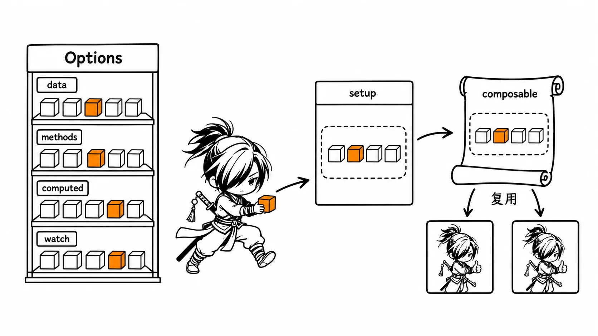
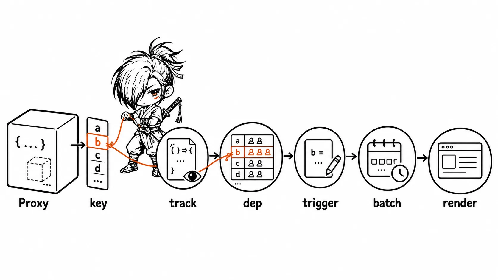
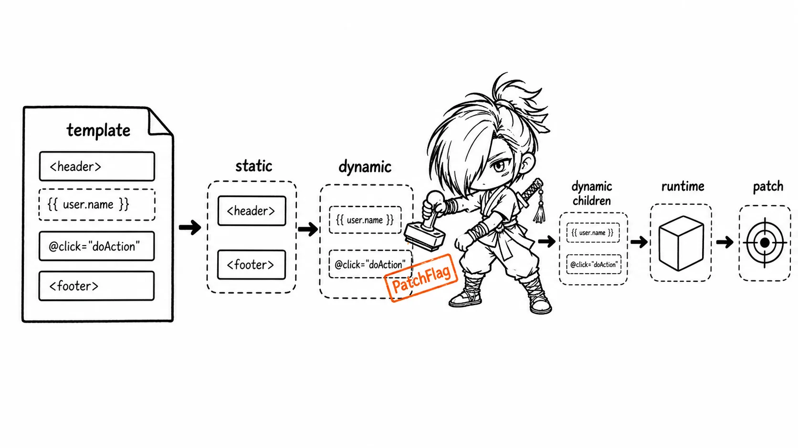
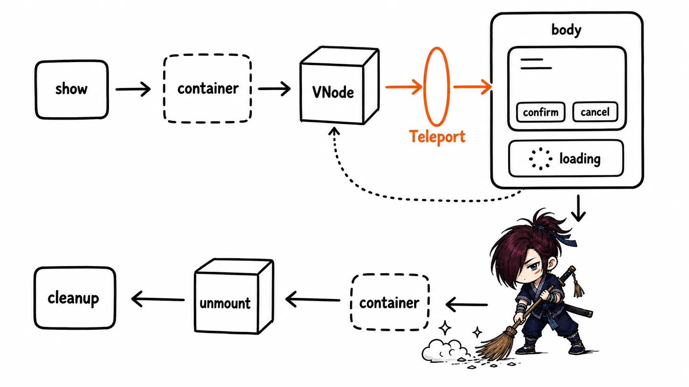

# Vue3 面试知识整理

> 重点放在"Vue 3 变了什么、为什么这么变、怎么用、源码层面怎么实现"，尽量少重复 Vue 2 已经讲过的通用概念。

## 复习建议

- 第一轮先吃透五星模块：Vue 3 为什么出现、Composition API 怎么写、响应式为什么改用 Proxy。
- 不必为了面试强行否定 Options API——Vue 3 完整支持它，你的优势是能从 Vue 2 的组件拆分经验、生命周期理解和线上问题出发，再说明 Vue 3 具体改进了什么。
- 遇到 `ref`、`reactive`、`computed`、`watch` 时，先讲使用边界，再解释依赖收集与触发更新，不要只背 API 签名。
- Teleport、程序化 Modal、编译优化和 Tree Shaking 是很好的"理解工程化"加分题；没有实战经验时应诚实说明是学习型理解，并讲清设计取舍，而不是编造项目经历。

## 一、Vue 3 为什么出现：核心目标与 Vue2/Vue3 对照

### Vue 3 要解决什么问题

> 面试回答：
>
> Vue 3 不是把 Vue 2 推倒重来，而是在保留模板和组件心智模型的基础上，解决 Vue 2 在大型项目里暴露出的几个具体痛点：复杂组件的逻辑复用困难（mixin 命名冲突、来源不透明）、TypeScript 类型推导支持弱、响应式系统对新增属性和数组索引处理不自然、以及运行时性能和打包体积有优化空间。最直观的变化是组合式 API 和 Proxy 响应式；底层则是编译期标记动态节点、静态提升、按需引入 API，减少运行时不必要的工作。

可以从四个方向具体展开：

- **更好维护**：Composition API 允许按"业务功能"聚合状态、计算属性、监听和生命周期，而不是分散在 `data`、`methods`、`computed`、`watch` 这些按类型划分的选项里。
- **更好复用**：composable（通常命名为 `useXxx`）替代命名容易冲突、来源不透明的 mixin。
- **更适合 TypeScript**：函数参数、返回值、props/emit 都可以在组合函数的边界上写出精确类型，类型推导比 Options API 的 `this` 上下文更自然。
- **更快、更小**：Proxy 响应式、编译器优化、基于 ES Module 的 Tree Shaking，分别改善了更新精度、更新范围和产物体积。

### 关键对照表

| 维度 | Vue 2 常见方式 | Vue 3 推荐理解 | 面试要点 |
| --- | --- | --- | --- |
| 组件逻辑组织 | Options API | Options API 仍可用；复杂逻辑可用 Composition API | 不是二选一，而是按复杂度选择 |
| 逻辑复用 | mixin、renderless component | composable | composable 的依赖和返回值都是显式的 |
| 响应式实现 | `Object.defineProperty` + 改写数组方法 | `Proxy` + `Reflect` | Vue 3 能感知新增、删除、数组索引等操作 |
| 全局配置 | `Vue.prototype` | `app.config.globalProperties` | Vue 3 是应用实例级别，多个 app 互不污染 |
| 程序化组件 | `Vue.extend` / `new` | `createVNode` + `render` | 组件库场景常见，业务项目一般不需要手写 |
| 跨 DOM 层级渲染 | 手动 `appendChild` 到 `body` | `Teleport` | DOM 位置变了，组件逻辑关系仍在原组件树 |
| 生命周期命名 | `beforeDestroy`、`destroyed` | `beforeUnmount`、`unmounted` | 其余常用钩子基本一一对应，加 `on` 前缀显式导入 |

### 从 Vue 2 平滑迁移，而不是一次性重写

对已有 Vue 2 项目，更稳妥的做法是按组件和风险分层迁移，而不是停下业务开发去做一次性重写：

1. 先升级构建链路、依赖版本，确认第三方组件库的 Vue 3 兼容性。
2. 保留简单展示型页面的 Options API 不动；新写或需要重构的复杂组件优先使用 `<script setup>` 和 Composition API。
3. 把可以独立验证的逻辑先抽成 composable，比如分页、表单校验、键盘事件处理、请求状态管理——这类逻辑改动风险低、收益直接。
4. 最后处理 API 层面的差异：`this` 使用方式变化、过滤器移除、Event Bus（`$on`/`$off`）被移除、`Vue.prototype` 挂载方式改变、`$listeners` 合并进 `$attrs` 等。

Composition API 和 Options API 可以在同一个项目甚至同一个组件里共存，但同一份状态不应该在两种组织方式里重复维护。实践中，迁移过程里最常见的问题往往不是语法不熟，而是响应式连接丢失（比如解构 `reactive` 对象）、`this` 使用错误（在 `setup` 里访问不存在的 `this`）、以及插件 API 没有跟着改造成应用实例级别。

## 二、Composition API 与 Options API

### 两种 API 的本质区别

Options API 按选项类型组织代码：状态放 `data`，副作用放 `watch`，方法放 `methods`。组件小的时候非常直观，一眼能看到每类内容在哪；但组件变大后，同一个"搜索功能"相关的状态、请求、监听会散落在好几个选项里，改一个功能要在文件里来回跳。

Composition API 在 `setup`（或更常用的 `<script setup>`）里按业务能力组织：和"搜索"相关的关键词、分页、请求状态、重置动作、监听可以写在一起，形成一段自包含的逻辑块。它不是"函数式组件"的语法，也不是为了少写代码，核心目的是让**相关逻辑物理上聚合在一起，同时更容易抽成可复用的函数**。

```vue
<script setup>
import { computed, ref, watch } from 'vue';

const keyword = ref('');
const page = ref(1);
const loading = ref(false);
const query = computed(() => ({ keyword: keyword.value, page: page.value }));

watch(query, async () => {
  loading.value = true;
  try {
    // await fetchList(query.value)
  } finally {
    loading.value = false;
  }
});
</script>
```

> 面试回答：
>
> Options API 按 `data`、`methods` 这类选项分类，Composition API 按业务功能聚合。复杂组件里后者更容易定位相关代码、也更容易抽取复用逻辑，类型推导也更自然；简单的展示型组件继续用 Options API 完全没问题，关键是团队风格要保持一致，不要在同一个项目里两种写法随意混用导致阅读成本上升。

### 用 composable 替代 mixin

Vue 2 的 mixin 能复用逻辑，但有三类典型问题：

- 属性和方法命名容易冲突（多个 mixin 都定义了 `loading` 字段，后合并的会覆盖前面的，且不易察觉）。
- 使用组件的人不容易知道某个字段或方法到底来自哪个 mixin——阅读组件本身看不出依赖来源。
- 多个 mixin 混入同一个组件时，生命周期钩子的合并顺序、`data` 的合并规则增加了理解成本。

composable 是普通的 JavaScript/TypeScript 函数，依赖通过参数显式传入，能力通过返回值显式导出：

```ts
// composables/useMove.ts
import { onMounted, onUnmounted, reactive, toRefs } from 'vue';

export function useMove() {
  const position = reactive({ x: 0, y: 0 });

  const handleKeyup = (event: KeyboardEvent) => {
    if (event.code === 'ArrowUp') position.y--;
    if (event.code === 'ArrowDown') position.y++;
    if (event.code === 'ArrowLeft') position.x--;
    if (event.code === 'ArrowRight') position.x++;
  };

  onMounted(() => window.addEventListener('keyup', handleKeyup));
  onUnmounted(() => window.removeEventListener('keyup', handleKeyup));

  return { ...toRefs(position) };
}
```

```vue
<script setup lang="ts">
import { useMove } from './composables/useMove';

const { x, y } = useMove();
</script>
```

这里 `onUnmounted` 和事件清理逻辑被封装在 composable 内部，调用方完全不需要关心清理细节——这正是可复用副作用的价值：**逻辑连同它的生命周期一起被打包复用，而不是只复用一段计算逻辑**。

> [!VISUALIZATION]
> **类型：** comparison
> **优先级：** high
> **标题：** Options API、Composition API 与 composable 的逻辑组织方式
> **目的：** 对比同一个业务功能在 Options API 中分散到多个选项、在 Composition API 中聚合，并展示 composable 被多个组件显式复用。
> **必须表达：** Composition API 的核心价值是按功能组织和显式复用，不是弃用 Options API。
> **避免表达：** 不要把 Options API 描绘成错误或已废弃的写法。



## 三、setup、this 与生命周期钩子映射

### setup 的执行时机

`setup` 在组件实例创建**之前**执行——这意味着其中不能访问组件代理对象上的 `this`（这一点和 Options API 里方法内部可以用 `this` 访问 `data`/`methods` 完全不同，是很容易踩的坑）。`setup(props, context)` 接收两个参数：`props` 是响应式的只读对象（不能解构后直接用，会丢失响应式，见第四章）；`context` 上可以取到 `attrs`、`slots`、`emit`、`expose`。使用 `<script setup>` 语法糖时，这些能力通过编译宏（`defineProps`、`defineEmits` 等）暴露，通常不需要手写 `setup` 函数签名。

### 生命周期钩子对照

| Vue 2 选项式 | Vue 3 组合式（从 `vue` 显式导入） | 说明 |
| --- | --- | --- |
| `beforeCreate` / `created` | 不需要对应钩子 | 这两个阶段等价于直接写在 `setup` 顶层的同步代码 |
| `beforeMount` | `onBeforeMount` | |
| `mounted` | `onMounted` | |
| `beforeUpdate` | `onBeforeUpdate` | |
| `updated` | `onUpdated` | |
| `beforeDestroy` | `onBeforeUnmount` | 改名，语义更贴近"卸载"而非"销毁" |
| `destroyed` | `onUnmounted` | 同上 |
| `activated` / `deactivated` | `onActivated` / `onDeactivated` | `keep-alive` 缓存场景，用法和 Vue 2 一致 |

```ts
import { onMounted, onUnmounted, ref } from 'vue';

const timer = ref<number>();

onMounted(() => {
  timer.value = window.setInterval(() => console.log('tick'), 1000);
});
onUnmounted(() => {
  clearInterval(timer.value);
});
```

有一条容易被追问的规则：在 composable 里调用生命周期钩子，必须发生在组件初始化的**同步调用链**中，不能等某个异步请求完成之后才注册。原因是 Vue 依赖一个模块级的"当前组件实例"指针来判断"这个钩子应该注册到哪个组件上"，`await` 之后这个指针可能已经指向了别的组件实例（或者变成了 `null`），钩子就注册失败或者注册错了地方。

```ts
// 错误：await 之后再调用生命周期钩子，组件实例指针可能已经丢失
export function useBadExample() {
  async function setup() {
    await fetchData();
    onMounted(() => {}); // 这里大概率不会按预期工作
  }
  setup();
}

// 正确：钩子调用保持在同步链路上，异步逻辑放在钩子回调内部
export function useGoodExample() {
  onMounted(async () => {
    await fetchData();
  });
}
```

## 四、ref、reactive 与解构陷阱

### 基本用法与选择

`ref` 适合包装基本类型，也可以包装对象；在 JavaScript 逻辑代码里通过 `.value` 访问和修改。`reactive` 只接受对象、数组、`Map`、`Set` 等引用类型，返回一个代理对象，不能用来包装基本类型。

```ts
import { reactive, ref, toRefs } from 'vue';

const count = ref(0);
const form = reactive({ name: '', age: 18 });

// 错误：普通解构拿到的是当时的值快照，之后表单再变化，name 也不会更新
// const { name } = form;

// 正确：需要解构时改用 toRefs，保留和 form 的响应式连接
const { name, age } = toRefs(form);
```

之所以 `reactive` 解构后会丢失响应式，是因为普通解构语法本质上是"读取一次当前值赋给新变量"，读取动作发生后，新变量和原来的代理对象之间就没有任何联系了；而 `toRefs` 会为每个属性生成一个通过 getter/setter 代理回原始 `reactive` 对象的 `ref`，因此解构出来的变量仍然保留着"读写会同步回原对象"的能力。

### 为什么模板里能省略 .value

常见追问："模板里为什么不用写 `count.value`，直接写 `count` 就行？"

> 模板渲染函数在编译阶段会对顶层的 `ref` 做自动解包处理，组件代理对象（`this` 或者说传给渲染上下文的对象）在访问属性时也会自动做一次 `ref` 解包。但这只是模板和组件渲染上下文的特殊行为；在普通 JavaScript 代码里（比如 `setup` 函数体内、composable 内部）仍然必须显式写 `.value`。对象属性中嵌套的 `ref` 是否会被自动解包，还要看它所在的容器类型（`reactive` 对象里嵌套的 `ref` 会自动解包，普通数组或 `Map` 里的 `ref` 不会），不能把模板里的规则直接套用到所有场景。

### reactive 的边界

- 不要把原始对象和它对应的代理对象混着当作状态源使用——更新操作应该统一通过代理对象完成，直接修改原始对象不会触发依赖更新。
- 给 `reactive` 对象整体重新赋值（`state = { ...newData }`）会让变量指向一个全新对象，丢失和视图之间原有的响应式引用关系；需要整体替换的场景更适合用 `ref({})` 包一层。
- 传入第三方库实例、DOM 节点，或者明确不需要响应式追踪的大对象时，可以用 `markRaw` 阻止它被代理，或用 `shallowRef`/`shallowReactive` 只做浅层响应式，减少不必要的代理开销——但应该先确认这里真的有性能问题，而不是提前优化。

## 五、Vue 3 响应式：为什么使用 Proxy

### 一句话理解

> 面试回答：
>
> Vue 2 主要通过 `Object.defineProperty` 给已存在的属性单独设置 getter/setter；Vue 3 改用 `Proxy` 直接代理整个对象。`Proxy` 能拦截属性读取、设置、删除、`in` 判断、遍历等更多种操作，因此不再需要 `Vue.set`/`Vue.delete` 这类补丁 API 来处理属性新增和删除的监听问题，对数组索引和 `length` 的处理也更自然。本质上 Vue 3 依然是"访问时收集依赖（track）、修改时触发依赖更新（trigger）"这套响应式模型，变的是拦截手段。

### 依赖收集与触发更新

可以把响应式过程理解成三步：

1. 组件渲染函数、`computed`、`watch` 等在**执行期间**读取响应式属性时，Vue 记录下"当前这个执行上下文（effect）依赖了这个属性"，这一步叫 `track`。
2. 属性被写入、删除，或者集合类型（`Map`/`Set`）结构发生变化时，Vue 找到这个属性关联的所有 effect 并通知它们，这一步叫 `trigger`。
3. 组件更新通常会被调度器合并、批量执行，而不是每次属性赋值都立刻同步触发一次渲染。

```ts
const state = reactive({ count: 0 });

// 渲染或 watcher 执行期间读取 state.count：track 收集依赖
console.log(state.count);

// 修改 count：trigger 找到依赖，随后调度组件更新
state.count++;
```

### Vue 2 与 Vue 3 响应式差异

| 场景 | Vue 2 的典型限制 | Vue 3 的处理 |
| --- | --- | --- |
| 新增/删除对象属性 | 默认无法侦测，需要 `Vue.set` / `Vue.delete` | `Proxy` 天然拦截 `set` / `deleteProperty` 陷阱 |
| 数组索引与 `length` | 需要改写 7 个数组变异方法才能触发更新 | `Proxy` 能拦截包括索引在内的属性设置，也能感知 `length` 变化 |
| 深层嵌套对象 | 初始化时递归遍历全部属性，数据量大时成本高 | 访问到嵌套对象时才递归创建代理（惰性深层响应） |
| `Map`、`Set` | 支持有限，需要额外特殊处理 | 提供了针对集合类型的响应式实现 |
| 浏览器兼容性 | 可以兼容更旧的浏览器 | `Proxy` 无法被完整 polyfill，需要现代运行环境 |

需要纠正一个常见误区：**"Proxy 天然只能监听第一层"是不准确的**。Vue 3 在读取到某个属性的值是嵌套对象时，会对这个嵌套对象递归返回一层新的代理，所以 `state.user.profile.name` 依然能保持响应式；它真正的"惰性"体现在**不会在初始化阶段就一次性把整个对象树全部代理一遍**，而是访问到哪一层才代理哪一层，这是相比 Vue 2 初始化递归遍历的一个性能改进点，而不是功能上的限制。

```ts
const state = reactive({ user: { profile: { name: 'Ada' } } });
state.user.profile.name = 'Grace'; // 能正常触发依赖更新
```

### 手写简化版 reactive / effect

```js
const targetMap = new WeakMap(); // target -> (key -> Set<effect>)
let activeEffect = null;

function track(target, key) {
  if (!activeEffect) return;
  let depsMap = targetMap.get(target);
  if (!depsMap) targetMap.set(target, (depsMap = new Map()));
  let dep = depsMap.get(key);
  if (!dep) depsMap.set(key, (dep = new Set()));
  dep.add(activeEffect);
}

function trigger(target, key) {
  const depsMap = targetMap.get(target);
  if (!depsMap) return;
  const dep = depsMap.get(key);
  if (dep) dep.forEach(fn => fn());
}

function reactive(target) {
  return new Proxy(target, {
    get(obj, key, receiver) {
      const result = Reflect.get(obj, key, receiver);
      track(obj, key);
      // 嵌套对象访问时递归代理，实现惰性深层响应
      return typeof result === 'object' && result !== null ? reactive(result) : result;
    },
    set(obj, key, value, receiver) {
      const result = Reflect.set(obj, key, value, receiver);
      trigger(obj, key);
      return result;
    },
  });
}

function effect(fn) {
  activeEffect = fn;
  fn(); // 立即执行一次，执行期间触发的 get 会调用 track 完成依赖收集
  activeEffect = null;
}
```

这段代码省略了依赖清理（见第十章）、`ref` 的单独实现、`readonly`/`shallowReactive` 等变体，但保留了"用 `Proxy` 拦截读写、`track` 收集、`trigger` 通知"的主干逻辑。

> [!VISUALIZATION]
> **类型：** flow
> **优先级：** high
> **标题：** Vue 3 响应式的依赖收集与触发流程
> **目的：** 展示组件渲染、computed/watch 读取代理属性时收集依赖，属性修改后触发调度和重渲染。
> **必须表达：** 依赖按"属性"关联，深层对象在访问时被代理；更新通常经过批处理调度。
> **避免表达：** 不要画成任意数据变化都会让整个应用立即全量重渲染。



### 高频追问

**Proxy 相比 `Object.defineProperty` 的缺点是什么？**

最现实的限制是旧浏览器兼容性——`Proxy` 的很多能力无法通过 polyfill 完整模拟，因此 Vue 3 放弃了对 IE11 等旧环境的支持。另外，`Proxy` 代理的是对象本身，代理对象和原始对象在 `===` 比较下并不相等，调试时打印出来的是 Proxy 包装对象，和第三方库交互（比如把状态传给一个只认原始对象的库）时要用 `toRaw()` 转换回原始对象，否则可能出现意料之外的行为。

**为什么 Vue 3 还保留 ref？**

因为 JavaScript 的 `Proxy` 只能代理对象，无法代理基本类型（数字、字符串等）的赋值行为。`ref` 用一个带 `.value` 访问器的对象把基本类型包装起来，间接获得响应式能力；同时它也提供了"整体替换引用"的能力（比如 `const list = ref([])`，之后 `list.value = newList` 直接替换整个数组，而不需要像 `reactive` 那样只能修改属性）。

## 六、computed、watch 与 watchEffect

| API | 适合场景 | 特点 |
| --- | --- | --- |
| `computed` | 从已有响应式状态推导出一个展示值 | 有缓存，依赖不变时直接复用上次结果；应当保持无副作用 |
| `watch` | 监听明确指定的数据源，执行副作用 | 可以拿到新旧值，能控制 `immediate`（是否立即执行一次）、`deep`（是否深度监听）、`flush`（回调相对于 DOM 更新的执行时机） |
| `watchEffect` | 自动收集回调函数**同步执行期间**访问到的所有依赖 | 立即执行一次；依赖关系不够显式，容易在阅读代码时漏看某个依赖 |

```ts
const count = ref(1);
const doubled = computed(() => count.value * 2);

watch(count, (newValue, oldValue) => {
  console.log(newValue, oldValue);
});
```

不要在 `computed` 的 getter 里写 `count.value++` 这类修改响应式数据的代码——`computed` 的语义是"根据已有状态推导出一个值"，在推导过程中反过来修改依赖数据，会破坏这个语义，也容易在依赖链路复杂时引发难以排查的更新循环。如果业务确实需要一个可以双向赋值的映射，应该给 `computed` 传入 `{ get, set }` 对象形式，而不是在只读的 getter 里搞副作用：

```ts
const age = ref(18);
const ageDisplay = computed({
  get: () => `${age.value} 岁`,
  set: (val) => { age.value = parseInt(val, 10); },
});
```

`watchEffect` 有一个容易被忽略的边界：它只会自动收集**同步执行期间**访问到的依赖。如果回调里有 `await`，`await` 之后才读取的响应式属性不会被自动追踪到：

```ts
watchEffect(async () => {
  console.log(a.value); // 同步阶段访问，会被收集为依赖
  await delay(100);
  console.log(b.value); // await 之后才访问，不会被收集为依赖
});
```

这是因为依赖收集依赖一个"当前活跃 effect"的全局指针，`await` 会让出执行权，等异步操作完成后代码恢复执行时，这个全局指针早已经被别的逻辑重置或指向了别处（原理和第三章"生命周期钩子不能在 await 之后调用"是同一个根因）。需要在异步回调里也能追踪到的依赖，应该提前在同步阶段显式读取一次，或者拆分成 `watch` 明确声明依赖源。

## 七、编译期优化与 Virtual DOM 更新

### Vue 3 为什么能减少不必要的 Diff

Vue 2 的运行时很难提前知道模板里哪些节点会变化，因此更新时需要相对宽泛地比较整棵虚拟 DOM 子树。Vue 3 的编译器会静态分析模板，把"确定不变的静态内容"和"可能变化的动态绑定"编码进生成的渲染函数里，让运行时把注意力集中在真正可能变化的节点上。

> 面试回答：
>
> Vue 3 的性能优化不只是改进了传统的 Diff 算法本身，而是把一部分判断从运行时提前挪到了编译阶段。编译器会把不会变的静态节点提升到渲染函数外部只创建一次，给有动态绑定的节点打上 Patch Flag 标记具体是文本、class、style、props 还是事件绑定会变，并把这些动态节点收集进一个 block 里。更新时运行时优先遍历这个动态节点集合，而不是逐层比较整棵树，因此减少了对无关静态节点的比较开销。

### 三个高频关键词

- **静态提升（Static Hoisting）**：确定不依赖任何响应式数据的静态 VNode，会在渲染函数外部创建一次并被后续每次渲染复用，而不是每次重新渲染都重新创建一个一模一样的对象。
- **Patch Flags**：给动态节点标记它具体哪一部分可能变化（文本内容、`class`、`style`、某个 prop、事件绑定等），更新时可以针对性地只比较、只更新对应部分，而不是把所有属性都重新比较一遍。
- **Block Tree**：把一个作用域（block）内所有动态子节点收集到一个扁平数组里，更新时可以直接遍历这个数组定位到所有可能变化的节点，不需要按照 DOM 树的层级结构逐层递归查找。

以这段模板为例：

```vue
<span>固定文案</span>
<div>{{ message }}</div>
```

编译后，`span` 因为不含任何动态绑定，会被静态提升，只创建一次；`div` 会被标记为"文本内容动态"的 Patch Flag。当 `message` 变化触发重新渲染时，运行时可以直接从 block 收集到的动态节点集合里定位到这个 `div`，跳过对 `span` 的重新创建和比较。

### 事件处理函数缓存与 SSR

模板里内联的事件处理函数（如 `@click="() => doSomething(item)"`）如果不依赖渲染过程中产生的临时变量，Vue 3 编译器会把它缓存起来，避免每次重新渲染都创建一个新的函数引用——如果不缓存，子组件即使自身状态没变，也会因为收到了一个"新的" `onClick` prop 而被判定为需要更新。在 SSR 场景中，编译器还能针对性地生成更贴近字符串拼接的渲染代码，降低服务端渲染的开销。

> 这些都是框架内部的编译优化，业务开发中最有效、最应该优先掌握的手段仍然是：保持组件状态边界清晰、给动态列表正确的 `key`、避免不必要的深度监听、避免不必要的组件重新渲染。不要为了"手动优化"去直接操作 VNode 或绕过框架的声明式模型。

> [!VISUALIZATION]
> **类型：** relationship
> **优先级：** medium
> **标题：** Vue 3 编译期标记与运行时定向更新
> **目的：** 对比模板中静态节点和动态节点，展示静态提升、Patch Flag、动态节点集合如何减少更新范围。
> **必须表达：** 编译阶段提供信息，运行阶段据此定向更新。
> **避免表达：** 不要宣称 Vue 3 完全没有 Diff 或不会创建 Virtual DOM。



## 八、Teleport 与程序化 Modal：从组件到工程设计

### 为什么 Modal 适合用 Teleport

弹窗在组件语义上通常属于当前页面或当前业务模块的一部分，但它的 DOM 结构往往需要被挂载到 `body` 下：如果留在原来的组件树位置渲染，很容易被祖先元素的 `overflow: hidden`、层叠上下文（`z-index` 失效）或 `position` 限制裁剪或遮挡。

```vue
<template>
  <Teleport to="body">
    <div v-if="modelValue" class="modal">
      <div class="mask" @click="close"></div>
      <section class="panel" role="dialog" aria-modal="true">
        <slot />
      </section>
    </div>
  </Teleport>
</template>
```

`Teleport` 改变的只是最终渲染出的真实 DOM 挂载位置，**不改变组件在 Vue 组件树中的父子关系**。因此 props 传递、事件 `emit`、`provide`/`inject`、组件内部的响应式状态，都仍然按照它在模板里原本所在的组件层级正常工作——这是最容易被追问、也最容易答错的一点（不少人会误以为 Teleport 之后组件就"脱离"了原来的逻辑树）。

### 一个可维护 Modal 的设计要点

除了遮罩、标题、内容、确认与取消这些基本结构，面试中更能体现工程思维的是这些细节：

- 用 `v-model` / `update:modelValue` 管理显隐状态，让父组件始终是显隐状态的唯一数据源，组件内部不私自修改这个状态。
- 内容优先通过默认插槽传入；确实需要通过 API 调用（而非模板声明）触发弹窗时，才需要支持传入字符串、VNode 或渲染函数。
- 确认回调可能是异步的：loading 期间要禁用重复提交；请求成功后关闭弹窗，请求失败后应该保留弹窗并展示具体的错误反馈，而不是无提示地静默关闭。
- 关闭时要清理临时容器、事件监听、恢复焦点和页面滚动锁定；同时存在多个弹窗时还要处理层级堆叠顺序和排队展示。
- 补齐可访问性：`role="dialog"`、`aria-modal="true"`、弹窗打开时焦点应该进入弹窗内部、关闭后焦点应该还给触发它的元素、支持 `Esc` 关闭、背景内容在弹窗打开期间不应该可被键盘聚焦到。

### Vue 2 与 Vue 3 的程序化挂载差异

Vue 2 常见写法是 `Vue.extend(Modal)` 创建一个组件构造器，再用 `new` 实例化并手动挂载。Vue 3 不再提供 `Vue.extend`，底层实现通常改用 `createVNode` 创建虚拟节点，再用 `render` 把这个 VNode 渲染到一个临时创建的容器元素上；关闭时调用 `render(null, container)` 完成卸载。

```ts
import { createVNode, render } from 'vue';
import Modal from './Modal.vue';

export function showModal(props: Record<string, unknown>) {
  const container = document.createElement('div');
  const vnode = createVNode(Modal, {
    ...props,
    onClose: () => {
      render(null, container); // 传入 null 触发卸载
      container.remove();
    },
  });

  render(vnode, container);
  document.body.appendChild(container);
}
```

这段代码表达的是底层原理性的思路。业务项目里应该优先使用声明式的 `<Modal v-model="visible" />`，只有在开发组件库或者需要提供 `$confirm()` 这类全局命令式 API 时，才值得单独封装这种程序化调用方式。

### 插件全局 API 的迁移

Vue 2 插件常见写法是 `Vue.prototype.$modal = ...`；Vue 3 需要在插件的安装函数里，基于传入的应用实例来挂载：

```ts
export default {
  install(app: App) {
    app.config.globalProperties.$modal = { show: showModal };
  },
};
```

使用 TypeScript 的项目还需要额外扩展 `ComponentCustomProperties` 接口的类型声明，否则组件里访问 `this.$modal` 会提示类型错误。全局挂载的 API 应该只用于真正需要在任意位置访问的通用能力（比如全局提示、全局确认框），普通业务逻辑仍然应该优先显式 `import`，避免依赖来源不透明。

> [!VISUALIZATION]
> **类型：** architecture
> **优先级：** medium
> **标题：** Vue 3 程序化 Modal 的挂载、交互与卸载
> **目的：** 展示调用 `show`、创建容器和 VNode、Teleport 到 body、确认/取消回调、异步 loading、卸载清理的完整链路。
> **必须表达：** 关闭后要卸载 VNode 并移除容器；Teleport 不改变组件事件和状态关系。
> **避免表达：** 不要把 `createVNode` 画成每个普通业务弹窗都必须使用的方案。



## 九、Tree Shaking：Vue 3 为什么更容易按需打包

### 一句话理解

Tree Shaking 是构建工具基于 ES Module 静态的 `import`/`export` 结构做分析，删除那些确认未被使用、可以安全移除的代码（dead code elimination）。Vue 3 把许多 API 设计成可以按名字单独导入的独立导出，而不是像 Vue 2 那样统一挂在一个 `Vue` 对象上，因此打包器更有机会只保留代码里实际用到的那部分。

```ts
// Vue 3：只声明要使用的 API
import { computed, nextTick, ref } from 'vue';
```

> 面试回答：
>
> Tree Shaking 依赖 ES Module 的静态结构，构建工具需要在编译时就能确定性地判断某个导出到底有没有被引用。Vue 3 的 API 设计更模块化，没有用到的 API 更有机会从最终产物里被摇掉。但它不是"只要写了命名导入体积就一定会变小"——还受构建工具的配置、模块是否标记了副作用（`sideEffects`）、是否存在动态引用、以及依赖本身内部实现方式的影响。

### 常见误区

- Tree Shaking 是构建阶段的静态分析优化，不是运行时能力。
- 不能因为某个组件文件里没有直接调用 `watch`，就断言最终产物里一定不包含 `watch` 相关的全部代码——`watch` 依赖的底层响应式模块可能被其他被引用的 API 间接依赖到，实际效果应该以构建产物分析工具（如 bundle analyzer）为准，而不是主观推测。
- CommonJS 的 `require` 是运行时动态求值的，构建工具难以静态分析其依赖关系；ES Module 的静态 `import`/`export` 更利于 Tree Shaking，这也是现代构建工具普遍要求依赖以 ESM 格式发布的原因之一。
- 带有副作用的模块（比如只是导入就会执行全局样式注入、修改全局状态的模块）不能被随意删除，构建工具通常需要依赖包在 `package.json` 里正确声明 `sideEffects` 字段，否则可能被误删或误保留。

### 与 Composition API 的关系

Composition API 的按需导入风格和 Tree Shaking 之间存在协同效应：组件只导入实际用到的 `ref`、`computed` 等 API。但这不是选择 Composition API 的首要理由——可维护性和逻辑复用能力通常是更重要的决策依据，包体积上的收益更像是一个附带的正向结果。

## 十、源码高频深问

这一节聚焦"用法层面"之外的实现细节，回答时给出关键结论和主干逻辑即可，不需要逐行还原源码。

### effect 的依赖清理机制

一个 effect（比如一个 `watchEffect` 回调或组件渲染函数）在每次重新执行前，都需要先清空它上一次收集到的全部依赖，再重新执行一遍收集新的依赖——这个动作叫 `cleanup`。如果不做这一步，条件分支场景会出问题：

```ts
const state = reactive({ show: true, a: 1, b: 2 });

effect(() => {
  console.log(state.show ? state.a : state.b);
});
```

首次执行时 `state.show` 为 `true`，读取了 `state.show` 和 `state.a`，这两个属性都会收集到当前 effect。如果之后把 `state.show` 改成 `false`，effect 重新执行，这次只会读取到 `state.show` 和 `state.b`——但如果没有先清理掉上一轮收集到的 `state.a` 依赖，`state.a` 这个已经不再被实际用到的"过时依赖"会一直残留在依赖表里，之后修改 `state.a` 依然会触发这个 effect 重新执行（多余的执行），长期积累下来也是一种隐性的内存泄漏（依赖表越来越大，且引用着不再需要的 effect）。正确做法是每次执行 effect 前，先根据上一次收集到的依赖列表逐一移除对当前 effect 的订阅，再执行函数体重新收集。

### reactive 如何用 WeakMap 缓存代理

如果同一个原始对象被多次调用 `reactive()`，理想情况下应该始终返回同一个代理对象，而不是每次都创建一个新的 `Proxy`——否则用 `===` 比较两次 `reactive(sameObj)` 的结果会得到 `false`，也会造成同一份数据存在多个互相不知道彼此的代理实例。Vue 3 内部用一个 `WeakMap` 把"原始对象"映射到"已经创建过的代理对象"，`reactive()` 调用时先查这个缓存，命中则直接复用，未命中才真正创建新的 `Proxy` 并存入缓存。用 `WeakMap` 而不是普通 `Map` 的原因是它的 key 是弱引用——当原始对象在其他地方不再被引用时，垃圾回收器可以正常回收它，不会因为这份缓存的存在而导致内存泄漏。

配套的 `toRaw(proxy)` API 则相反：给定一个代理对象，返回它对应的原始对象，用于需要绕过响应式追踪（比如传给不认识 Proxy 的第三方库）的场景。

### ref 的内部实现

`ref` 内部大致是一个带 `.value` 访问器的类：

```js
class RefImpl {
  constructor(value) {
    this._value = typeof value === 'object' && value !== null ? reactive(value) : value;
    this.dep = new Set();
  }
  get value() {
    track(this, 'value'); // 简化处理，实际实现依赖收集会更精细
    return this._value;
  }
  set value(newValue) {
    this._value = typeof newValue === 'object' && newValue !== null ? reactive(newValue) : newValue;
    trigger(this, 'value');
  }
}

function ref(value) {
  return new RefImpl(value);
}
```

这解释了两个常被追问的细节：为什么 `ref` 包装对象时会自动获得深层响应式（因为内部直接调用了 `reactive` 包一层）；以及为什么读写都要经过 `.value`（因为响应式追踪能力就是靠这一层 getter/setter 实现的，脱离了 `.value` 访问器，Vue 就无法拦截到读写操作）。

### scheduler 如何批量去重执行更新

和 Vue 2 类似，Vue 3 也不会在每次 `trigger` 触发后立即同步重新执行对应的 effect（如果是组件渲染 effect，同步执行意味着同一轮修改多次数据会触发多次渲染）。真实实现中，一个响应式属性变化后，`trigger` 会把关联的 effect 交给一个调度器（scheduler），调度器用一个 Set（天然去重）暂存本轮需要重新执行的 effect，并通过微任务把真正的批量执行推迟到当前同步代码执行完毕之后。这一点和 Vue 2 依赖 `nextTick` 实现的异步队列在设计目标上是一致的——**把一轮同步修改合并成一次更新**，只是 Vue 3 的响应式系统本身（`effect`/`scheduler`）和渲染系统是解耦的，调度逻辑更通用，不专属于组件渲染这一种场景。

### Diff 算法：从双端比较到"快速 Diff”

Vue 2 使用双端比较算法（见《Vue 面试知识整理》第六章）。Vue 3 的运行时 Diff（配合编译期的 Patch Flag 和 Block Tree 一起工作）采用了一种通常被称为"快速 Diff"的策略，大致分两步：

1. **预处理头尾相同的部分**：从新旧两组子节点的头部开始，只要类型和 `key` 相同就直接复用、双方指针一起后移；再从尾部做同样的处理。这一步能快速处理"只是在头部或尾部增删了几项"的常见场景，不需要进入复杂的乱序比较逻辑。
2. **处理中间乱序部分**：预处理后如果还剩下中间一段顺序被打乱的节点，Vue 3 会用剩余节点的 `key` 建立新旧位置的映射，进而计算出一个**最长递增子序列**——这个子序列对应的节点是"相对顺序没有变化、不需要移动"的部分，只需要移动不在这个子序列里的节点。这样能把总的 DOM 移动次数降到接近最少，比"发现顺序不对就逐个移动"要高效。

面试里不需要能默写最长递增子序列的具体算法实现，理解"先处理简单的头尾场景做快速路径，剩余乱序部分再用最长递增子序列尽量减少移动次数"这个思路，以及它相比 Vue 2 双端比较在中间乱序场景下更高效，通常就足够。

## 十一、常见不兼容变更与迁移清单

- 组件 `v-model`：`value` / `input` 改为 `modelValue` / `update:modelValue`，且支持多个 `v-model`（`v-model:title`、`v-model:visible` 等）。
- 过滤器（`{{ value | filter }}`）被移除，需要用方法调用、`computed` 或工具函数替代。
- `.native` 修饰符被移除（Vue 3 组件上未声明为 `emits` 的原生事件会自动透传，不再需要 `.native`）；`keyCode` 修饰符被移除，改用按键名（如 `@keyup.enter`）；实例事件 API `$on`/`$off`/`$once` 被移除，需要用第三方事件库或自行封装替代 Event Bus。
- 生命周期改名：`beforeDestroy` / `destroyed` → `beforeUnmount` / `unmounted`（见第三章对照表）。
- 自定义指令的钩子函数名称和参数发生调整（对齐组件生命周期的命名风格），`Transition` 的 CSS class 命名也有变化（如 `v-enter` 改为 `v-enter-from`）。
- 组件的 `$scopedSlots` 和 `$slots` 被合并，统一通过 `$slots` 访问，且所有插槽都以函数形式返回 VNode。
- `Vue.set` / `this.$set` 在基于 `Proxy` 的响应式系统下不再需要，直接赋值即可被追踪到。

> 迁移时的实际经验是：这些 API 差异逐条对照文档修改并不难，真正容易出问题、且不容易在代码审查中被发现的，反而是响应式写法上的细微差异（比如 `reactive` 解构丢失响应式、`props` 解构丢失响应式）——这类问题往往要运行时才会暴露，建议迁移过程中针对关键交互路径做充分的手动测试或补充自动化测试。

## 十二、面试冲刺索引

### ⭐⭐⭐⭐⭐ 核心必会

- Vue 3 为什么出现，相比 Vue 2 解决了哪些具体痛点，而不是只会说"响应式变了、有组合式 API 了"。
- Composition API 与 Options API 的本质区别，composable 相比 mixin 解决了什么问题。
- `ref`、`reactive`、`toRefs` 的选择依据与解构陷阱，模板里为什么能省略 `.value`。
- `computed`、`watch`、`watchEffect` 的使用边界，`watchEffect` 为什么追踪不到 `await` 之后的依赖。
- Vue 3 响应式如何完成 track / trigger，`Proxy` 相比 `Object.defineProperty` 具体改善了什么、又有什么代价。

### ⭐⭐⭐⭐ 高频加分

- Vue 3 编译期优化：静态提升、Patch Flag、Block Tree 各自解决什么问题。
- Teleport 的作用，以及为什么它不改变组件在逻辑树中的父子关系。
- Vue 2 的 `Vue.extend`、`Vue.prototype` 如何迁移为 Vue 3 的 `createVNode`/`render` 与 `app.config.globalProperties`。
- effect 依赖清理机制、`reactive` 用 `WeakMap` 缓存代理、快速 Diff 相比双端比较的改进思路。

### 适合按这条链连续复习

- Vue 2 大组件难维护 → mixin 的命名冲突和来源不透明问题 → Composition API → composable → `ref`/`reactive`/`toRefs` 的选择。
- 响应式读取触发 track → 修改数据触发 trigger → scheduler 批量调度更新 → 编译期 Patch Flag 标记 → 运行时快速 Diff 定向更新。
- 弹窗 DOM 挂载受限于祖先样式 → Teleport 挂到 body → `v-model` 与 `emit` 管理显隐 → 异步确认与 loading → 程序化挂载与卸载清理。
- ES Module 静态结构 → Tree Shaking 依据静态分析删除死代码 → Vue 3 按需导入设计 → 实际产物体积需要构建分析工具验证。
