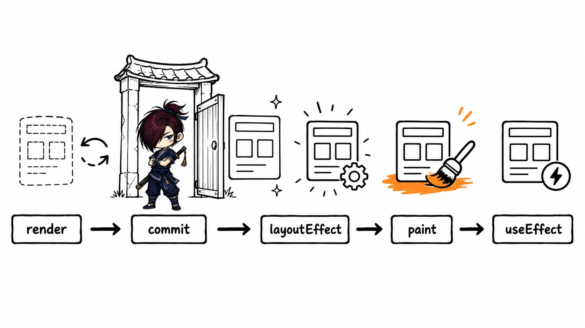
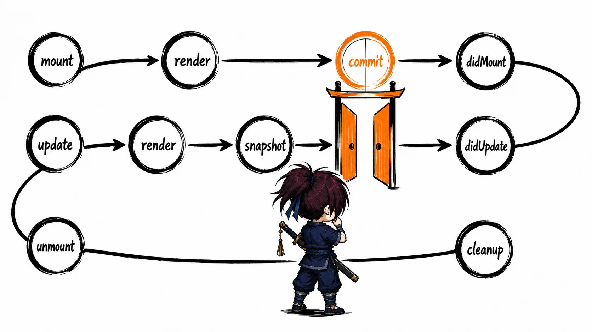
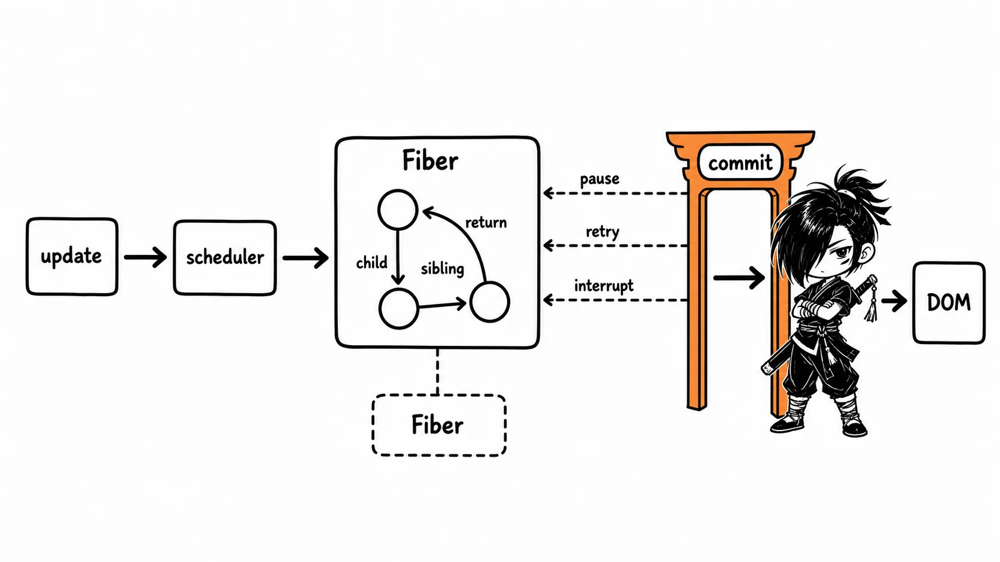
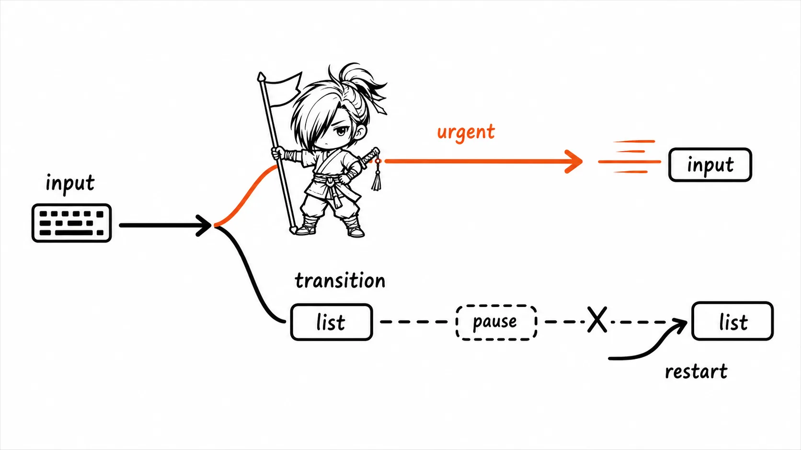
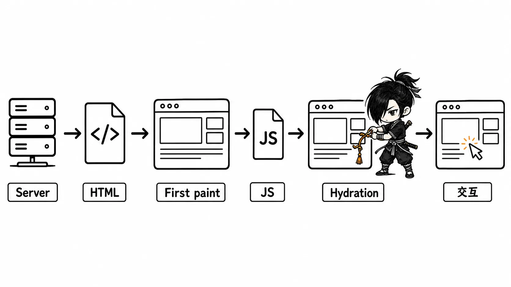

# React 面试知识整理

> 本文按知识依赖关系重新组织，覆盖用法、渲染机制与 Fiber 源码层追问三个层次；每个话题尽量先说清楚"要解决什么问题"，再讲机制和代码。文中会区分 **React 的通用机制**（如 Fiber、协调、批处理）与**某个版本或库的具体 API**（如 React Router v5 的 `Switch` 与 v6 的 `Routes`），避免把两者混为一谈。

## 复习建议

- 先掌握五星模块的"面试回答"和代码边界，再复习四星模块。
- 回答原理题时按"结论 → 为什么 → 一个工程影响"组织，不要只背 API 名字。
- 区分 React 的通用机制与某个版本/库的 API：例如 Fiber 是机制，`useHistory` 是 React Router v5 的 API，`useNavigate` 是 v6 的 API。

## 一、React 是什么：声明式与组件化

### 核心思想

React 是用声明式组件描述 UI 的库：开发者根据当前 `props`、`state` 和 `context` 声明"界面应该长什么样"，React 负责在状态变化后重新计算、协调并提交必要的 DOM 变更。组件不是 DOM 的简单封装，而是把 UI 结构、事件处理和状态组合成的可复用单元。

> 面试回答：
>
> React 的核心是声明式和组件化。我们不手动逐步修改 DOM，而是让 UI 成为状态的函数：状态变化后 React 重新计算组件树，协调新旧结果的差异，再把必要的改动一次性提交到 DOM。

### JSX、React Element 与组件

JSX 是 JavaScript 的语法扩展，构建时会被编译成创建 React Element 的函数调用；React Element 是对 UI 的一份不可变描述，既不是真实 DOM，也不是组件实例。

```jsx
const element = <Greeting name="Ada" />;
// 概念上相当于 React.createElement(Greeting, { name: 'Ada' })
```

- 小写标签（如 `div`）描述的是宿主 DOM 节点；大写开头的标识符（如 `Greeting`）表示自定义组件。
- 函数组件是普通函数，React 调用它得到一个 Element；类组件则会先创建实例，再调用实例上的 `render` 方法。
- `key`、`ref` 是 React 保留给协调和引用机制使用的特殊字段，组件内部不能像访问普通 props 一样读取它们。

## 二、props、state 与单向数据流

### 数据如何流动

`props` 由父组件传入，组件内部应该把它当作只读数据；`state` 由组件自身（或组件使用的状态逻辑）维护。数据默认自上而下流动：子组件如果需要影响父组件的状态，正确做法是调用父组件通过 props 传下来的回调函数，这个模式叫"状态提升"。

```jsx
function PricePicker({ onChange }) {
  return <button onClick={() => onChange(100)}>选择商品</button>;
}

function Cart() {
  const [price, setPrice] = useState(0);
  return <PricePicker onChange={setPrice} />;
}
```

### 受控组件与非受控组件

| 类型 | 值的来源 | 常见写法 | 适用场景 |
| --- | --- | --- | --- |
| 受控组件 | React state | `value` + `onChange` | 表单校验、字段联动、需要唯一数据源 |
| 非受控组件 | DOM 本身 | `defaultValue` + `ref` | 简单表单、接入非 React 控件、文件输入 |

受控输入框必须在 `onChange` 中同步更新对应的 state；只给 `value` 而不更新 state，会导致这个输入框完全无法编辑——因为每次按键后 React 重新渲染时又把值设回了旧的 `value`。

### 事件系统与 `this` 绑定

React 事件采用 camelCase 命名（如 `onClick`），并接收一个合成事件对象；需要访问原生事件时可以通过 `event.nativeEvent`。事件默认沿着 React 组件树冒泡，必要时用 `event.stopPropagation()` 阻止继续传播。

类组件的普通方法默认不会自动绑定组件实例：

```jsx
class Counter extends React.Component {
  state = { count: 0 };
  handleClick = () => this.setState(({ count }) => ({ count: count + 1 }));
  render() { return <button onClick={this.handleClick}>{this.state.count}</button>; }
}
```

上面用箭头函数类字段的写法可以规避绑定问题；此外也可以在构造器里 `bind`，或在渲染时包一层箭头函数。现代新代码优先使用函数组件，这个问题在函数组件里不存在（函数组件没有 `this` 指向组件实例这回事）。

## 三、状态更新、批处理与函数式更新

### setState / 状态 setter 为什么不是"立刻改变量"

调用状态 setter 本质上是向 React 发起一次更新请求，而不是同步修改一个普通变量。React 会把这些请求调度、批处理，并在后续的一次渲染中提供新状态，因此不能依赖"调用之后立刻同步读取到新值"。

```jsx
setCount(count + 1);
setCount(count + 1); // 两次调用都基于同一个 count 快照，最终只 +1

setCount(c => c + 1);
setCount(c => c + 1); // 函数式更新依次基于前一次的最新结果，可靠地 +2
```

> 面试回答：
>
> 不能直接修改 state，也不能把状态更新理解成同步赋值。React 会把更新放入队列并批处理；当新值依赖旧值时应该用函数式更新，React 会按顺序把每一次更新应用到最新的待处理状态上，而不是都基于渲染开始时的那个旧快照。

React 18 起，自动批处理覆盖到了更多异步边界（比如 `Promise.then`、`setTimeout`、原生事件回调里的多次更新也会被合并），因此不应该再用"合成事件内异步、`setTimeout` 内同步"这种旧版本的经验去判断是否会被批处理；更准确的心智模型是"把每一次状态更新都当作可以被合并、可以被调度的请求"。

### 不要直接修改状态

直接写 `this.state.message = 'x'` 或 `state.user.name = 'x'` 会绕开 React 的更新流程——React 完全不知道发生了修改，因为它是靠 `setState`/setter 调用来感知"有更新需要处理"的；直接修改还会破坏引用比较（`Object.is` 判断不出变化），导致依赖引用比较来判断是否更新的机制（比如 `memo`）也失效。正确做法是创建新的引用：

```jsx
setUser(user => ({ ...user, profile: { ...user.profile, name: 'Ada' } }));
```

## 四、状态保留与重置、useEffect 的时序

### 状态为何会保留或重置

React 把 state 关联到组件在**渲染树中的位置**，而不是关联到 JSX 里写出的变量名。在相同的树位置上，如果组件类型相同、`key` 也相同，React 通常会保留这个组件的 state；一旦类型改变、树中的位置改变，或者 `key` 改变，旧的 state 就会被重置。

```jsx
// 切换用户时，主动改变 key 来重置 Profile 内部的表单状态
<Profile key={user.id} user={user} />
```

这是理解"列表 key 为什么重要""条件渲染切换后表单状态为什么没清空"背后的统一原则。也不要为了图方便在一个组件函数内部定义嵌套的子组件——父组件每次渲染都会创建一个新的组件类型（虽然看起来定义相同，但每次渲染都是一个新的函数引用），React 会认为这是一个全新的组件类型，从而意外重置这个嵌套组件内部原本应该保留的 state。

### useEffect 的正确定位

`useEffect` 用来让组件和 React 之外的系统保持同步，比如订阅、定时器、浏览器 API 或第三方库实例。它不是"每次想在渲染后执行一段代码就往里塞"的万能位置——如果只是想根据现有的 props/state 计算出另一个值，应该直接在渲染过程中计算（或用 `useMemo` 缓存），而不是用 Effect 先渲染一次再异步算出来触发二次渲染。

```jsx
useEffect(() => {
  const connection = connect(roomId);
  return () => connection.disconnect();
}, [roomId]);
```

- 不传依赖数组：每次组件提交后都会运行。
- 传 `[]`：只在挂载后运行一次；开发模式下的 Strict Mode 会额外多做一次 setup → cleanup → setup 的检验，用来暴露没有正确清理的副作用。
- 传 `[a, b]`：首次提交，以及之后 `a` 或 `b` 发生 `Object.is` 意义上的变化后运行。
- Effect 函数的返回值是清理逻辑：会在下一次同一个 Effect 重新执行之前运行，也会在组件卸载时运行。

常见错误是依赖数组里漏写了实际用到的响应式值（导致 Effect 内部使用的是过期闭包里的旧值），或者 cleanup 函数没有正确撤销订阅导致内存泄漏、重复触发。

### render、commit 与 effect 的执行时机

一个常被搞混的点是：`useEffect` 里的代码究竟是在 DOM 更新"之前"还是"之后"执行？完整的顺序是：**React 先执行组件函数完成计算（render 阶段）→ 把计算结果提交并写入真实 DOM（commit 阶段）→ 浏览器完成绘制 → 最后才异步执行 `useEffect` 回调**。也就是说 `useEffect` 里能稳定读取到的是已经更新完成的 DOM，但它的执行本身是被异步调度的，不会阻塞浏览器绘制这一帧——这也是它和同步执行、会阻塞绘制的 `useLayoutEffect` 之间最核心的差异，`useLayoutEffect` 只应该用在"必须在绘制前读取或修改 DOM 布局"的少数场景（比如测量元素尺寸后立即定位一个悬浮层，避免用户看到闪烁）。

> [!VISUALIZATION]
> **类型：** flow
> **优先级：** high
> **标题：** render、commit 与 useEffect 的执行时序
> **目的：** 展示组件函数执行（render）、DOM 变更写入（commit）、浏览器绘制、useEffect 异步执行这四步的先后顺序。
> **必须表达：** useEffect 在浏览器绘制之后异步执行，不会阻塞首次绘制；useLayoutEffect 在绘制前同步执行。
> **避免表达：** 不要把 useEffect 画成在 commit 之前执行，或者和 componentDidMount 完全等价（时序等价，但调度机制不同）。



## 五、类组件生命周期与函数组件迁移

### 生命周期主线

类组件的生命周期可以按创建、更新、卸载三个阶段理解：

1. **创建**：`constructor` → `render` → `componentDidMount`
2. **更新**：`getDerivedStateFromProps` → `shouldComponentUpdate` → `render` → `getSnapshotBeforeUpdate` → `componentDidUpdate`
3. **卸载**：`componentWillUnmount`

`render` 必须是纯函数，不能在其中调用 `setState` 或发起请求。`componentDidMount` 适合做订阅、发起请求或读取真实 DOM；`componentWillUnmount` 要清理定时器、订阅和其他外部资源。

### 容易被追问的方法

- `getDerivedStateFromProps` 是静态方法，返回一个新的局部 state 对象或 `null`；只应该在确实需要从 props 派生 state 时使用，绝大多数场景应该避免简单地把 props 复制进 state（复制之后两者容易不同步）。
- `shouldComponentUpdate` 返回布尔值决定是否继续本次更新；它是一个性能提示，不应该承载任何影响业务正确性的逻辑（比如不能指望它来阻止一次必须发生的状态同步）。
- `getSnapshotBeforeUpdate` 在 DOM 实际变更**之前**读取信息（比如滚动位置），它的返回值会作为参数传给 `componentDidUpdate`。
- `componentDidUpdate` 适合根据更新前后的 props/state 差异执行副作用，但必须包一层条件判断，否则容易在这里再次调用 `setState` 触发无限循环更新。

`componentWillMount`、`componentWillReceiveProps`、`componentWillUpdate` 属于已经被标记为不安全的旧生命周期方法（在并发特性下可能被多次调用，产生副作用的代码在这些钩子里不安全），现代代码不应该继续使用。新代码优先使用函数组件配合 Hooks；类组件生命周期和 Hooks 之间不是简单的一对一映射，应该按"渲染需要的计算"和"需要和外部系统同步的副作用"重新拆分理解，而不是机械地找对应关系。

> [!VISUALIZATION]
> **类型：** lifecycle
> **优先级：** high
> **标题：** 类组件创建、更新与卸载生命周期
> **目的：** 区分 render 前后、DOM 提交前后以及卸载时的职责。
> **必须表达：** `getSnapshotBeforeUpdate` 在 DOM 更新前，`componentDidUpdate` 在更新提交后；`render` 保持纯净。
> **避免表达：** 不要把旧的 `componentWill*` 方法画成现代推荐流程。



## 六、Context、Ref、Portal、高阶组件与错误边界

### Context：跨层传递，不等于全局状态方案

Context 适合主题、当前用户、国际化这类"许多层级都可能需要、变化频率相对可控"的数据。由 Provider 提供值，子树用 `useContext` 读取：

```jsx
const ThemeContext = createContext('light');
function Button() {
  const theme = useContext(ThemeContext);
  return <button className={theme}>保存</button>;
}
```

Provider 的 `value` 发生变化时，所有使用了这个 Context 的消费者组件都会重新渲染——这意味着如果 `value` 是一个高频变化的巨大对象，会导致大范围不必要的重渲染，此时应该拆分成多个粒度更小的 Context，或者改用更适合频繁更新场景的状态管理方案，而不是继续往一个 Context 里塞所有东西。

### ref 的正确边界

`ref` 用于命令式地访问 DOM 节点，或者保存"不需要触发渲染"的可变值，比如聚焦一个输入框、保存一个定时器 ID、集成地图或播放器这类第三方实例。不要用 `ref` 替代本该由 state 管理的、会影响渲染结果的数据——修改 `ref.current` 不会触发组件重新渲染。

```jsx
function Search() {
  const inputRef = useRef(null);
  return <button onClick={() => inputRef.current?.focus()}>聚焦</button>;
}
```

类组件用 `createRef`，函数组件用 `useRef`。跨组件传递 ref 需要目标组件显式支持（函数组件默认不能直接接 `ref`，需要 `forwardRef`）；不要依赖已经被废弃的字符串 ref 写法。

### Portal：DOM 位置变了，React 树关系不变

Portal 用于把弹窗、浮层等内容渲染到 `document.body` 这类独立的 DOM 容器里，避免被父元素的 `overflow` 裁剪或层叠上下文限制：

```jsx
import { createPortal } from 'react-dom';

function Modal({ children }) {
  return createPortal(<div className="modal">{children}</div>, document.body);
}
```

它只改变最终渲染出的 DOM 挂载位置，**不改变组件在 React 树中的父子关系**：Context 依然能沿着原本的 React 树读取到，事件依然按照 React 树（而不是实际 DOM 树）的层级冒泡。面试中要把 Portal 和"另外开辟一个独立的 React 根节点"这两个概念区分清楚，它们的行为不同。

### 高阶组件（HOC）

HOC 是一种"接收一个组件、返回一个增强后的组件"的模式，常见于权限校验、日志记录、数据注入等横切逻辑。

```jsx
const withLogging = Wrapped => function WithLogging(props) {
  console.log('render', Wrapped.displayName);
  return <Wrapped {...props} />;
};
```

它不是继承关系，也不应该在 `render` 函数内部动态创建 HOC——如果每次渲染都调用一次 `withLogging(Wrapped)`，会得到一个全新的组件类型（和第四章"状态保留/重置"的原理一致），导致子树在每次父组件渲染时都被卸载重建。使用 HOC 时要注意透传无关的 props；`ref` 不是普通 prop，不会自动透传，旧式 HOC 如果需要转发 ref 要用 `forwardRef` 显式处理。现代业务代码里，可复用的组合逻辑更多用自定义 Hook 实现，HOC 主要还出现在一些旧代码库或第三方库的封装里。

### 错误边界（Error Boundary）

错误边界通过 `static getDerivedStateFromError` 渲染出兜底 UI，通过 `componentDidCatch` 记录错误信息。它能捕获子树在渲染、生命周期方法及构造函数阶段抛出的错误，但**不能**捕获事件处理函数里的错误、异步回调（如 `setTimeout`、`Promise` 内部）里的错误、服务端渲染时的错误，也不能捕获它自身抛出的错误。

```jsx
class ErrorBoundary extends React.Component {
  state = { hasError: false };
  static getDerivedStateFromError() { return { hasError: true }; }
  componentDidCatch(error, info) { reportError(error, info); }
  render() { return this.state.hasError ? <Fallback /> : this.props.children; }
}
```

事件处理函数里的错误需要自己用 `try/catch` 处理；异步操作的错误需要在对应的 `.catch()` 或 `try/catch` 里处理并上报。

## 七、虚拟 DOM、协调与 Fiber 架构

### 虚拟 DOM 与协调（Reconciliation）

虚拟 DOM 是用普通 JavaScript 对象表达 UI 结构的一层中间表示；它让 React 能够比较前后两次的描述差异，从而只安排真正需要的 DOM 操作，但它的性能优势并不是单纯因为"操作 JS 对象比操作 DOM 快"。它真正的价值在于提供了声明式编程模型、支持批处理，以及让更新过程变得可预测、可中断（见 Fiber 部分）。

协调阶段会比较新旧 Element/Fiber 树，决定复用、创建、删除或移动哪些节点；提交阶段才会把这些决定真正写入 DOM。一个组件的 state 是否会被保留，取决于它在树中的位置、类型与 `key`（第四章已展开）。

### Fiber 是什么

> 面试回答：
>
> Fiber 是 React 16 引入的协调器重写，也是 React 内部用来表示"一个组件工作单元"的数据结构。旧的递归式协调一旦开始就会占住 JavaScript 调用栈，直到递归完成才能返回；Fiber 把整棵树的更新拆成一个个可以独立处理的节点任务，React 因此可以给不同更新分配优先级，在合适的节点上让出主线程。优先级较低的渲染工作可能会被更高优先级的更新打断、重启，甚至丢弃；只有真正完成之后才会一次性提交到 DOM，所以用户不会看到半更新状态的界面。

### 为什么旧的 Stack Reconciler 不够用

React 15 的协调过程主要依赖 JavaScript 的函数调用栈：从根节点开始递归处理更新，一旦开始就必须一路执行到返回，中途无法插入其他工作。大型组件树或者计算量较大的渲染很容易占满浏览器的一帧时间，用户的输入响应、动画、绘制就会被延后，表现为页面卡顿。

而 UI 更新本身并不是同等紧急的：输入框的即时回显、点击的即时反馈通常应该优先于列表筛选结果、后台数据刷新这类可以稍等的更新。要实现"先完成重要的工作，其余工作稍后继续"，React 需要一种方式把原本隐式保存在函数调用栈里的执行上下文显式地保存下来，可以暂停、可以恢复——Fiber 正是这样一份"可保存、可恢复的工作上下文"。

### Fiber、React Element、组件实例与 DOM 的区别

| 对象 | 是什么 | 何时创建 / 是否可变 | 关键作用 |
| --- | --- | --- | --- |
| React Element | JSX / `createElement` 产出的轻量描述 | 每次渲染都可能新建；不可变 | 描述"这次想要什么样的 UI" |
| Fiber | React 内部的工作节点 | 协调过程中创建或复用 | 记录该节点的状态、待处理更新、优先级和树结构关系 |
| 类组件实例 | `class extends Component` 的实例 | 类组件挂载时创建 | 保存类实例的字段和方法；函数组件没有这个实例 |
| DOM 节点 | 浏览器中真实存在的宿主节点 | 提交阶段创建或更新 | 最终呈现给用户的真实页面 |

Fiber 不是虚拟 DOM 的同义词，也不是 DOM 本身。一个可更新的组件在内部通常会同时存在 `current` 和 `workInProgress` 两个互相指向的 Fiber 副本（见下文"双缓冲"），但这**不代表对应有两份 DOM**——DOM 只有一份，是最终提交后的结果。

### 一个 Fiber 节点保存什么

具体字段会随 React 版本调整，面试不需要背下源码的逐字段类型；但可以把一个 Fiber 理解为下面这个"面试理解版"的简化模型：

```ts
/**
 * 用于理解 Fiber 的简化模型，不是 React 对外 API，也不保证和任一源码版本逐字段一致。
 */
type FiberNodeForInterview = {
  // ===== 1. 身份：我代表哪个 React 节点 =====

  /** 节点类别：函数组件、类组件、原生 DOM 标签、文本、Fragment 等，决定处理方式。 */
  tag: number;

  /** 列表中的稳定身份；同一层级中与 type 一起决定是否复用旧 Fiber 和 state。 */
  key: string | null;

  /** JSX 中的类型：例如函数组件本身、class，或 'div' 这样的宿主标签。 */
  type: unknown;

  /**
   * 运行环境对应的"实际对象"：类组件通常是实例，DOM Fiber 通常是 DOM 节点。
   * 函数组件没有组件实例，因此这里未必是 DOM。
   */
  stateNode: unknown;

  // ===== 2. 结构：如何不用 JavaScript 调用栈也能遍历整棵树 =====

  /** 父 Fiber；字段名叫 return，表示当前节点完成后要回到哪里。 */
  return: FiberNodeForInterview | null;

  /** 第一个子 Fiber。 */
  child: FiberNodeForInterview | null;

  /** 下一个兄弟 Fiber；多个子节点由 child + sibling 串成链。 */
  sibling: FiberNodeForInterview | null;

  /** 当前节点在同级兄弟中的位置，协调列表时会用到。 */
  index: number;

  /** 本次 render 要附着 / 更新的 ref。 */
  ref: unknown;

  // ===== 3. 输入、状态和更新：本次工作与上次提交结果的对照 =====

  /** 本次 render 正准备处理的 props。 */
  pendingProps: unknown;

  /** 上一次已经完成并提交的 props，可用于判断是否需要继续更新。 */
  memoizedProps: unknown;

  /** 上一次已提交的 state：类组件对应 state；函数组件中对应 Hook 链表的入口（见第十章）。 */
  memoizedState: unknown;

  /** setState、Hook state 更新、回调等排队等待处理的更新信息。 */
  updateQueue: unknown;

  // ===== 4. 优先级和提交：这次工作何时做、完成后要做什么 =====

  /** 当前节点自身待处理更新所在的 lane 位掩码；不同 lane 代表不同优先级/工作集合。 */
  lanes: number;

  /** 子树中仍待处理的 lane，帮助 React 快速跳过没有工作的分支。 */
  childLanes: number;

  /** 当前节点在 commit 阶段需要执行的操作，如插入、更新、删除、ref 等。 */
  flags: number;

  /** 子树中的 flags 汇总，避免 commit 阶段重新全树扫描。 */
  subtreeFlags: number;

  // ===== 5. 双缓冲：保持屏幕上的 current 树始终完整 =====

  /**
   * 当前 Fiber 与 work-in-progress Fiber 的配对指针。
   * React 在 alternate 上计算下一版 UI；完成后再提交并切换 current。
   */
  alternate: FiberNodeForInterview | null;
};
```

读这个类型时可以记住一句话：**Fiber 同时是树节点、可暂停的工作单元，以及保存这次更新中间状态的记录。** 早期资料中出现的 `effectTag`、`nextEffect`、`expirationTime` 是较早版本源码使用的字段名，现代实现用 `flags`/`subtreeFlags` 和 `lanes` 表达相近的职责——理解职责本身比记住具体字段名更可靠，字段名会随版本演进变化。

### Fiber 树为什么使用 child / sibling / return

这三个指针的作用不是把"DOM diff 树变成链表"，而是让协调过程可以脱离 JavaScript 调用栈、手动遍历整棵树：

```text
App
└─ child → Header ─ sibling → Main ─ sibling → Footer
             ↑ return        ↑ return          ↑ return
            App             App               App
```

React 处理完一个节点后，可以直接根据这些指针知道下一个要处理的是子节点还是兄弟节点；如果都没有了，就沿着 `return` 回到父节点完成收尾工作。因为"下一步该做什么"和"当前的中间状态"都被显式保存在 Fiber 结构里，而不只是隐式存在于 JavaScript 调用栈中，调度器才能够在任意一个节点的边界上暂停，之后再从这个位置继续处理剩余工作。

## 八、调度、render 与 commit 工作流程

### 完整流程

1. `setState`、状态 setter、Context 变化等会产生一次更新；React 为这次更新标记所在的 lane（优先级通道）。
2. 调度器从待处理的多个 lane 中选出当前最重要的一个，从根节点开始构造或复用一棵 work-in-progress Fiber 树。
3. **render / reconciliation 阶段**：逐个执行 Fiber 的 begin work 与 complete work，比较新旧子节点，标记出需要执行的副作用；这一阶段在并发渲染模式下可以被让出、之后继续、重试，甚至因为出现了更高优先级的更新而被直接放弃重来。
4. **commit 阶段**：把已经完成的树对应的变更一次性写入真实 DOM（或原生视图），处理 `ref`，并运行对应的生命周期方法。commit 阶段必须保持原子性、不能被中断，否则用户可能看到只完成了一半的 UI。
5. 提交成功后，work-in-progress 树成为新的 `current` 树；随后才会异步运行被动 Effect（即 `useEffect`，见第四章）。

"可中断"这个特性只描述 render 阶段，**不代表**任意 JavaScript 代码或 DOM 提交操作都能被中断，commit 阶段是同步且不可打断的。也不是每一次被打断的低优先级任务之后都能从精确断点继续执行——当新的更新使得之前正在进行的计算已经过期时，React 可能会直接重新渲染，最终以能够被完整提交的结果为准，而不追求复用每一点已经算过的中间结果。

### 优先级、Lanes 与 requestIdleCallback 的常见误解

早期资料常说"每个 Fiber 有一个优先级"，更准确的现代模型是：**更新本身和根节点待处理的工作**用 `lanes`（一种位掩码通道）来表示优先级和可以合并的工作集合，Fiber 及其子树会记录相关联的 lane，以便快速跳过没有对应工作的分支。高优先级的交互更新可以抢占正在进行中的低优先级渲染；被 `startTransition` 标记的更新通常就属于这类可以被延后处理的工作（见下一章）。

`requestIdleCallback` 体现的是"利用浏览器空闲时间做低优先级工作"这个早期思路，但 React 并没有把它当作 Fiber 调度机制的必需实现，也不建议业务代码依据它来推断 React 的具体行为——React 使用自己实现的 Scheduler 和一套协作式让出机制（核心是 `shouldYield` 判断是否应该把主线程让出去），React 的 Scheduler 源码实际上是通过 `MessageChannel` 来实现调度的。面试中可以说"**类似 requestIdleCallback 的可让出调度思想**"，但说"Fiber 内部调用了 `requestIdleCallback` 来实现"是不准确的。

### 双缓冲：current 与 workInProgress

屏幕上正在展示的那棵 Fiber 树叫 `current`；React 计算下一版 UI 时，是在与之配对的 `workInProgress` 树上进行的，两者通过 `alternate` 指针相互关联。这样设计的好处是：即使 render 阶段被中断，正在展示给用户的 `current` 树依然完整、可交互，不会露出中间状态；等 `workInProgress` 树完成全部计算后，React 只需要在 commit 阶段把它切换为新的 `current`，一次性应用所有变更。这正是"允许渲染过程被中断，却不会让用户看到中间态 UI"的关键实现手段。

Fiber 架构在 React 16 就已经作为内部实现落地，但早期版本出于兼容性考虑并没有开放完整的并发能力——可中断渲染、Transition 这类面向应用开发者的并发特性，是在后续版本（尤其是启用了并发根 `createRoot` 的 React 18）中才成为日常开发会实际用到的能力。Fiber 本身不是一个需要业务代码直接调用的公开 API。

> [!VISUALIZATION]
> **类型：** architecture
> **优先级：** high
> **标题：** React 更新：调度、协调与提交
> **目的：** 展示状态更新如何进入调度，协调阶段可分片，提交阶段统一写入 DOM。
> **必须表达：** render/协调可被中断或重试，commit 不可中断；Fiber 节点具有 child、sibling、return 关系。
> **避免表达：** 不要把 Fiber 描述成真实 DOM，或声称它必然使用 `requestIdleCallback`。



## 九、并发渲染与 Transition

并发渲染不是"同时运行多个 JavaScript 线程"，而是指 React 可以把非紧急的渲染工作暂停、让出主线程、之后再重启（甚至因为有更新的更新到来而直接放弃重新开始）。输入框的即时回显、点击按钮的即时反馈这类更新应该保持同步、即时；筛选大列表、切换内容较重的页面这类可以稍等的更新则可以显式标记为 Transition。

```jsx
const [isPending, startTransition] = useTransition();

function onFilterChange(value) {
  setInput(value);                 // 紧急：立即回显输入框
  startTransition(() => {
    setFilter(value);              // 非紧急：允许被后续更新打断
  });
}
```

- `isPending` 用来在界面上展示"结果正在更新中"这类反馈，避免用户以为操作没有生效。
- Transition 不应该用来包裹控制文本输入框实际显示值的那次状态更新，否则用户会感觉输入有明显的滞后延迟。
- 它优化的是交互的响应流畅度，不能替代数据请求的缓存策略，也不能替代虚拟列表这类从根本上减少渲染节点数量的手段。

> [!VISUALIZATION]
> **类型：** timeline
> **优先级：** medium
> **标题：** 紧急更新与 Transition 的调度优先级
> **目的：** 展示输入回显可先完成，而大列表的非紧急渲染可暂停并在新输入后重启。
> **必须表达：** 这是可中断的渲染调度，不是多线程并行执行。
> **避免表达：** 不要把 Transition 画成延迟 `setTimeout`，或用于控制文本输入。



### key：身份，不是为了消除控制台警告

在同一层级的同类节点之间，`key` 用于标识一个节点的稳定身份，React 依据它决定复用哪一个组件实例以及它对应的 state。

```jsx
items.map(item => <Todo key={item.id} item={item} />)
```

优先使用列表项自身稳定的业务 ID。完全静态、不会重新排序的列表使用 index 作为 key 影响不大；但只要列表会插入、删除、排序，或者列表项内部包含表单这类需要保留输入状态的内容，就不应该使用 index（原因和 Vue 列表 diff 里的问题完全一致：位置对应关系变了，但 key 没变，会导致状态错误地留在了错误的节点上）。也不要在每次渲染时都生成一个随机 key——这会让 React 认为每次都是全新的节点，强制重建并丢失所有内部状态，等于完全抵消了 key 应该带来的复用能力。

## 十、Hooks：规则、闭包与实现原理

### Hooks 的调用规则和 useState 的基本用法

Hooks 只能在函数组件或自定义 Hook 的顶层调用，不能放进循环、条件判断或嵌套函数内部。这不是一条随意的代码风格约定，而是直接由 Hooks 的底层实现方式决定的——见下文的手写实现。

```jsx
function Counter() {
  const [count, setCount] = useState(0);
  return <button onClick={() => setCount(c => c + 1)}>{count}</button>;
}
```

`useState` 的 setter 会触发重新渲染；如果新值和旧值按 `Object.is` 判断相等，React 可以跳过这一次不必要的更新。多个状态之间存在复杂关联时，可以考虑用 `useReducer`（见后文）替代多个各自独立的 `useState`。

### 手写简化版 useState：为什么 Hooks 不能出现在条件或循环里

真实 React 内部用链表存储一个组件的所有 Hook 状态；下面用一个更容易理解的数组版本还原核心逻辑：

```js
let currentFiber = null; // 当前正在渲染的 Fiber
let hookIndex = 0;       // 本次渲染中，第几次调用 Hook

function useState(initialValue) {
  const fiber = currentFiber;
  const hooks = fiber.memoizedState || (fiber.memoizedState = []);
  const index = hookIndex++; // 关键：完全依赖调用顺序，不依赖变量名

  if (hooks[index] === undefined) {
    hooks[index] = { state: initialValue }; // 只有首次渲染会用到初始值
  }
  const hook = hooks[index];

  function setState(newValue) {
    hook.state = typeof newValue === 'function' ? newValue(hook.state) : newValue;
    scheduleRerender(fiber); // 触发这个 Fiber 重新进入调度、重新渲染
  }

  return [hook.state, setState];
}

function renderComponent(fiber, Component, props) {
  currentFiber = fiber;
  hookIndex = 0; // 每次渲染都从第 0 个位置重新开始按顺序对应
  const result = Component(props);
  currentFiber = null;
  return result;
}
```

这段代码解释了两个关键结论：

- 组件的所有 Hook 状态保存在**这个组件对应的 Fiber 节点**上（对照第七章的 `memoizedState` 字段），而不是保存在某个全局变量或者 React Element 上——这也是为什么"函数组件没有实例，却能在多次渲染之间记住状态"的原因。
- Hook 之间**完全靠调用顺序（也就是 `hookIndex` 递增的顺序）来对应**，而不是靠变量名或者其他标识。如果某次渲染因为一个 `if` 条件多调用或少调用了一个 Hook，那么这次渲染里 `hookIndex` 为 2 的位置，可能对应的其实是上次渲染里 `hookIndex` 为 3 的那个 Hook 的状态——状态会被错误地"串号"，且通常不会报错，只会得到一个令人困惑的错误结果。这正是"Hooks 只能在顶层无条件调用"这条规则背后的真实原因。

### 闭包与依赖数组

每一次渲染都会产生这次渲染专属的 props/state 快照，组件内部定义的函数、Effect 回调、定时器回调都会闭包捕获住这份快照。依赖数组不是"用来随意控制 Effect 要不要执行的开关"，而是在如实声明"这个 Effect 内部用到了哪些会变化的响应式值"。

```jsx
useEffect(() => {
  const id = setInterval(() => setCount(c => c + 1), 1000);
  return () => clearInterval(id);
}, []);
```

上面这个例子因为用了函数式更新 `c => c + 1`，所以不需要在依赖数组里读取外层的 `count` 变量。但如果 Effect 内部读取了 `roomId`、`serverUrl` 这类会变化的值，它们就应该老老实实出现在依赖数组里——为了让 lint 检查通过而随意删掉依赖项，只会导致 Effect 内部使用的是某次渲染时捕获到的过期闭包值，而不是最新值。

### useRef、useMemo、useCallback 与 memo

| 工具 | 解决的问题 | 不要误解为 |
| --- | --- | --- |
| `useRef` | 跨渲染保存可变值或 DOM 引用，读写不触发重新渲染 | 状态管理的替代品 |
| `useMemo` | 缓存一次计算成本较高的结果，或者缓存一个需要保持引用稳定的对象 | 应该默认打开的性能开关 |
| `useCallback` | 缓存函数引用，常配合已经 memo 过的子组件一起使用 | 让函数本身执行得更快 |
| `React.memo` | 当 props 经过浅比较相等时，跳过这个函数组件的重新渲染 | 对所有组件都有性能收益 |

正确的优先级是：先保证组件本身是纯的、state 尽量下沉到真正用到它的组件、列表 `key` 正确、传给子组件的对象/函数引用保持稳定；只有通过 Profiler 实际发现了某个具体的性能问题，才针对性地加上记忆化处理。给 `React.memo` 传自定义比较函数时必须比较所有会影响这次渲染结果的 props，漏掉某个 prop 会导致组件该更新的时候没有更新，界面停留在过期状态。

### useReducer 与自定义 Hook

当多个状态彼此存在关联、更新的规则比较复杂，或者希望把"如何根据一个动作计算出新状态"这段逻辑独立出来单独测试时，用 `useReducer` 通常会比维护一堆各自独立的 setter 更清晰。这里的 reducer 和 Redux 里的 reducer 概念一致：接收旧状态和一个 action，返回新状态，必须保持纯函数。

```jsx
function reducer(state, action) {
  if (action.type === 'submitted') return { ...state, status: 'success' };
  return state;
}
const [state, dispatch] = useReducer(reducer, { status: 'idle' });
```

自定义 Hook 复用的是**有状态的逻辑**，而不是 UI 本身：比如 `useOnlineStatus()`、`useDebouncedValue()`。每一个调用某个自定义 Hook 的组件都会拥有自己独立的一份状态——多个组件共享的是这段逻辑的写法，而不是共享同一份状态实例（这一点和 Vue 的 composable 概念完全一致）。自定义 Hook 的命名必须以 `use` 开头（这样 lint 工具和 React 才能识别并检查它是否遵守了顶层调用规则），并且同样要遵守"只能在顶层无条件调用"这条规则。

## 十一、渲染性能、代码分割与动画

### React 的重渲染不等于 DOM 重建

父组件更新时，子组件通常也会再次执行自己的渲染函数；但这只是"组件函数被重新调用"，随后 React 才会协调比较新旧输出的差异，如果最终产出的结果没有变化，真实 DOM 可能完全不会发生任何改动。因此排查性能问题时，要把"组件函数执行"和"DOM 实际提交变更"这两件事分开看待，不能只看组件函数被调用的次数就断定一定有性能问题。

常见的优化路径（按优先级排列）：

1. 让 state 尽量靠近真正使用它的组件，避免无关的父组件更新连带影响到不相关的子组件。
2. 避免在渲染过程中不必要地创建新的对象/数组/函数引用，合理使用不可变更新，减少"引用变了但内容其实没变"的情况。
3. 对已确认渲染成本高、且 props 大多数时候保持稳定的子组件使用 `memo`/`PureComponent`。
4. 用 React DevTools Profiler 实际测量验证优化效果，而不能仅凭"行内箭头函数一定慢"这类经验之谈就下结论——很多时候这类微小开销远不是真正的瓶颈。

### 懒加载与 Suspense

`lazy` 配合 `Suspense` 可以按需加载组件代码，适合按路由边界或大功能模块边界来切分代码包。

```jsx
const SettingsPage = lazy(() => import('./SettingsPage'));

<Suspense fallback={<Spinner />}>
  <SettingsPage />
</Suspense>
```

被懒加载的模块必须有默认导出；加载失败的情况还需要配合错误边界提供一个可以重试或者友好提示的恢复体验。不需要把所有细小的组件都拆成单独的包——额外产生的网络请求和加载态之间的抖动切换本身也是一种成本，应该按"用户是否马上就会用到"这个标准来决定拆分粒度。

### 动画的状态转换

`react-transition-group` 的 `CSSTransition` 常见做法是通过 enter/exit 阶段的 CSS class 来控制过渡样式；动态增删的列表动画需要配合 `TransitionGroup` 统一管理。列表动画同样要求给每一项一个稳定的 `key`，不能用会随增删变化的 index。应该优先尊重用户系统设置的 `prefers-reduced-motion` 偏好，并且不要让动画的执行阻塞用户的正常交互。

## 十二、路由：SPA 原理与版本差异

### BrowserRouter 与 HashRouter

两者都负责把浏览器 URL 映射到对应的 UI：

- `BrowserRouter` 使用 History API（`pushState`/`replaceState`），URL 更简洁自然；但生产环境的服务器必须把所有未知路径都回退到应用入口 HTML，否则用户直接访问某个深层链接会得到服务器返回的 404。
- `HashRouter` 使用 URL 中 `#` 后面的片段和 `hashchange` 事件，完全不需要服务器配合改写路由，但 URL 观感上不如前者简洁，并且 `#` 后面的内容通常不会被发送给服务器。

前端路由内部的页面跳转应该使用路由库提供的 `Link`/`NavLink` 组件，而不是普通的 `<a href>`（普通链接会触发整个页面的重新加载，丢失 SPA 的所有好处）。

### 路由匹配、参数与导航

路由参数通常写作 `/detail/:id` 这种形式，从路径中直接解析；查询字符串参数则要从 `location.search` 里单独读取。定义路由规则时，应该按从具体到模糊的顺序排列，避免一个像 `/:id` 这样宽泛的动态路由，抢先匹配掉了本该命中某个固定路径（比如 `/settings`）的请求。

需要注意 React Router 主要版本之间 API 差异较大：v5 使用 `Switch`、给 `Route` 传 `component` prop、用 `useHistory` 做编程式导航、用 `Redirect` 组件做重定向；v6 起改用 `Routes`、给 `Route` 传 `element` prop（传入的是 JSX 而不是组件引用）、用 `useNavigate` 做编程式导航、用 `Navigate` 组件做重定向。面试回答时应该先说明自己使用/了解的是哪个版本，再解释具体原理，不要把两套 API 混着写。

## 十三、Redux、不可变数据与状态管理

### Redux 数据流与 connect

传统 Redux 的核心数据流是：UI 调用 `dispatch(action)` → 经过可选的 middleware 处理 → reducer 根据旧 state 和 action 计算出新 state → store 通知所有订阅者 → UI 读取到新的 state 并重新渲染。`reducer` 必须是纯函数，绝对不能直接修改传入的旧 state。

`react-redux` 提供的 `Provider` 把 store 放入 Context，让整棵组件树都能访问到；旧代码常用 `connect(mapStateToProps, mapDispatchToProps)` 把 state 和 dispatch 映射成组件的 props。现代函数组件通常直接使用 `useSelector` 读取状态、`useDispatch` 获取 dispatch 函数，写法更直接。

### middleware 与 thunk

middleware 位于 `dispatch` 和 `reducer` 之间，典型形态是一个三层柯里化函数：

```js
const middleware = ({ getState, dispatch }) => next => action => {
  // 可以在这里记录日志、拦截 action，或者扩展 action 的处理方式
  return next(action);
};
```

`redux-thunk` 允许 `dispatch` 一个函数而不只是一个普通 action 对象，让异步请求完成后再把结果 dispatch 成一个真正的 action；`redux-logger` 一类的 middleware 则用于记录每一次 action 和对应的 state 变化，方便调试。新项目通常推荐直接用 Redux Toolkit，它内置封装了 `configureStore`、基于 Immer 的"看起来像直接修改、实际上是不可变更新"的写法，以及处理异步逻辑的常见模式，理解 Redux 的基础数据流链路，比手写一遍 `applyMiddleware` 的源码实现更重要。

### 为什么强调不可变更新

不可变更新让"数据是否发生了变化"这件事可以通过简单的引用比较（`===`）快速判断出来，这正是 reducer 判断是否需要更新、`memo` 判断是否需要跳过渲染、以及调试工具实现"时间旅行"功能的基础。它并不要求每次更新都做一次完整深拷贝——正确的做法是只复制被真正修改到的那条路径上的节点，没有变化的分支可以继续复用原来的引用（这种做法通常被称为结构共享）。

一些旧项目里可能会见到 `immutable.js` 这类持久化数据结构库提供的 `Map`、`getIn`、`setIn` 等 API；现代 React/Redux 项目更常见的做法是配合 Immer（或者内置了 Immer 的 Redux Toolkit）在普通对象上写"看起来像直接修改"的代码，底层自动帮你生成符合不可变更新规则、且做了结构共享的新对象。不要把"深拷贝"当成"不可变更新"的同义词，两者要解决的问题不同，深拷贝往往是没有必要的额外开销。

## 十四、服务端渲染（SSR）与 Hydration

### SSR 的完整链路

SSR 在服务器根据请求的 URL 渲染出初始 HTML，浏览器可以先展示这份内容，随后再下载客户端 JavaScript，对已经存在的这份 HTML 做 hydration（水合），让事件处理和状态管理真正接管这个页面、变得可交互。

```text
请求 URL → 服务端匹配路由并渲染 HTML → 浏览器首屏展示内容
     → 下载客户端 JS → hydrate / hydrateRoot → 页面变得可交互
```

它的优点是能提供更快的首屏内容呈现速度，也更利于搜索引擎抓取到有意义的内容；代价是服务器需要承担渲染计算的成本，还要处理数据一致性和额外的工程复杂度。服务端渲染部分通常使用 `StaticRouter`（因为服务端没有浏览器的 URL 历史可以监听），客户端接管后使用普通的 `BrowserRouter`。

### Hydration 常见追问

- 服务端生成的 HTML 必须和客户端首次渲染的结果保持一致。如果在首屏渲染逻辑里直接使用了 `Date.now()`、`Math.random()`，或者其他只在浏览器端才能访问的 API，服务端和客户端算出来的结果就会不一样，产生 hydration mismatch（React 会检测到不匹配并在控制台报警告，严重时甚至会丢弃服务端渲染的内容，退化成客户端重新渲染，等于白做了 SSR）。
- `useEffect` 不会在服务端运行（服务端渲染只是把组件计算成字符串，不存在真实的浏览器环境和绘制这个概念），因此任何需要访问 `window`、`document` 的逻辑都应该放在客户端才会执行的 Effect 里，或者用明确的"只在客户端渲染"的边界包裹起来。
- 较旧的资料里使用的是 `renderToString` 和 `ReactDOM.hydrate`；现代客户端入口应该使用 `hydrateRoot`。大型应用通常会直接采用像 Next.js 这类框架提供的流式 SSR、路由和数据加载能力，而不是从零手写这一整套机制。

> [!VISUALIZATION]
> **类型：** flow
> **优先级：** high
> **标题：** SSR 到 Hydration 的请求与交互链路
> **目的：** 区分服务器生成 HTML、浏览器首屏显示与客户端接管交互三个阶段。
> **必须表达：** SSR 只提供初始 HTML；hydration 复用既有 DOM 并绑定交互；首屏两端输出需要一致。
> **避免表达：** 不要画成客户端下载 JavaScript 后重新替换全部 DOM。



## 十五、面试冲刺索引

### ⭐⭐⭐⭐⭐ 核心必会

- `props`、`state`、单向数据流、受控组件与非受控组件的选择。
- 状态更新的批处理与函数式更新，为什么不能直接修改 state。
- JSX → React Element → 虚拟 DOM → 协调（Reconciliation）→ Fiber → commit 的完整链路。
- `key` 的身份语义，状态在组件树中保留/重置的判断依据。
- `useState`、`useEffect` 的依赖数组、闭包陷阱与 cleanup，render/commit/effect 的执行时序。
- Hooks 为什么只能顶层调用（能结合简化版 `useState` 实现说明）。

### ⭐⭐⭐⭐ 高频重点

- 类组件生命周期与它们在函数组件里的对应关系（不是机械一一映射）。
- `Context`、`ref`、错误边界、高阶组件各自的适用边界。
- `memo`/`useMemo`/`useCallback` 该在什么时候引入，而不是默认全部加上。
- 并发渲染、`useTransition` 解决什么问题，和多线程并行的区别。
- BrowserRouter/HashRouter 的差异，React Router v5 与 v6 的 API 变化。
- Redux 的 dispatch → middleware → reducer 数据流，为什么强调不可变更新。

### 容易连续追问的知识链

- 状态更新 → 批处理 → 闭包快照 → 函数式更新 → Effect 依赖数组。
- JSX → React Element → 虚拟 DOM → Reconciliation → Fiber → commit → useEffect。
- 列表渲染 → `key` → 组件身份判断 → state 保留/重置。
- Hooks 调用顺序 → Fiber 上的 Hook 链表 → 为什么不能条件调用。
- Fiber → 可中断渲染 → lanes 优先级 → 紧急更新与 Transition。
- SSR → 首屏 HTML → hydration → 两端渲染结果必须一致。
