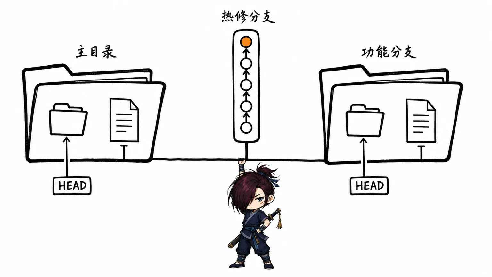
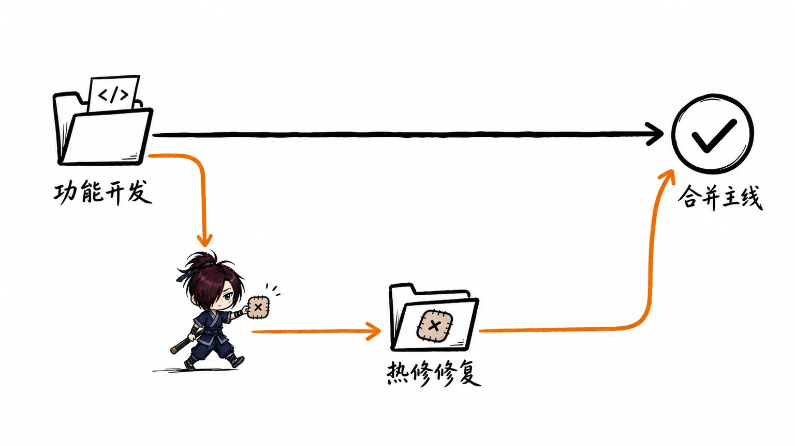
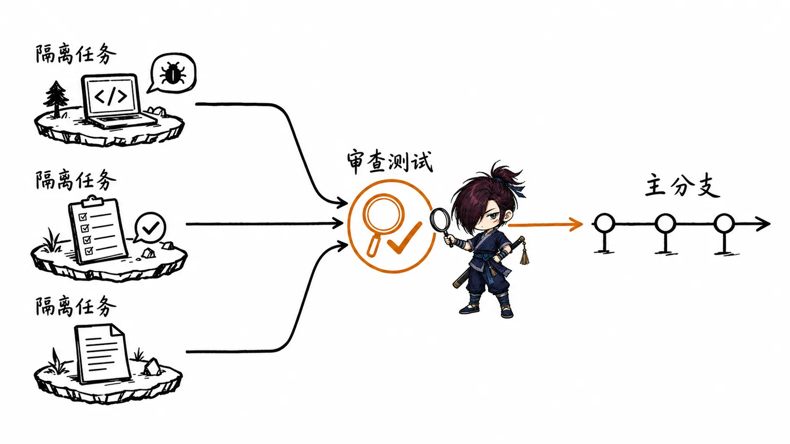

# Git worktree：多工作目录与 Codex 并行开发

## 一、为什么需要 worktree

开发时经常会遇到这样的打断：功能分支写到一半，线上突然需要修复一个 bug。传统做法是先提交或 stash 当前改动，再切到 `main` 或发布分支处理问题；修完后还要切回来、恢复现场。分支越多、任务越并行，这种切换越容易打断思路，也更容易误带未完成的改动。

`git worktree` 的思路是：**同一个 Git 仓库可以同时拥有多个工作目录**。每个目录检出不同分支，文件和暂存区互相独立；底层 Git 对象库仍由同一份仓库共享。这样可以一边保留当前功能开发目录，一边在另一个目录修复 hotfix，两个任务不需要来回切换分支。

它不是多 clone 一份仓库：多 clone 完全独立，通常需要分别拉取对象和维护远程；worktree 则共享同一仓库的历史和对象，创建更快、更节省空间。

| 方式 | 适合场景 | 主要代价 |
| --- | --- | --- |
| `git switch` 切分支 | 单任务、短暂切换 | 需要处理当前未提交改动 |
| `git stash` 暂存改动 | 临时插队的小事 | 容易忘记恢复或产生冲突 |
| `git clone` | 需要完全隔离的仓库或配置 | 占空间、同步成本更高 |
| `git worktree` | 多个分支并行开发、修复、审查 | 需要管理多个工作目录 |

> worktree 隔离的是工作目录，不会替你解决业务上的合并冲突。两个分支修改同一段代码后，最终合并时仍然要正常处理冲突。

## 二、核心概念与工作方式

第一次 `git clone` 后所在的目录叫作主工作目录（main worktree）。通过 `git worktree add` 创建的目录叫附加 worktree。每个 worktree 都有自己的：

- 已检出文件；
- `HEAD` 指针；
- 暂存区；
- 未提交改动。

因此，在 `feature/login` worktree 编辑文件，不会让 `hotfix/payment` worktree 中的同名文件随之变化。

但所有 worktree 共享提交历史、对象数据库、远程仓库配置和大多数仓库级配置。某个 worktree 创建并提交了 commit 后，其他 worktree 也能立刻引用这条 commit；只是它们的当前分支不会自动移动。

一个本地分支通常只能同时被一个 worktree 检出。这是 Git 的保护机制：如果同一分支在两个目录中同时提交，很难判断该分支的工作区状态应该以哪个为准。需要第二个工作目录时，应创建新分支，或检出另一个尚未使用的分支。



## 三、Git worktree 常用操作

以下命令假设仓库主目录为 `~/code/my-app`，新的 worktree 放在它的相邻目录。实际目录名可以按团队约定调整。

### 查看已有 worktree

```bash
git worktree list
```

输出会列出每个目录、当前 commit 以及关联分支：

```text
/Users/name/code/my-app          4f21c1a [main]
/Users/name/code/my-app-hotfix   d93b0e1 [hotfix/login]
```

### 新建 worktree 并创建分支

```bash
# 从当前 HEAD 创建 feature/search 分支，并检出到相邻目录
git worktree add -b feature/search ../my-app-search
```

如果新分支应基于指定分支或 Tag，最后补上起点即可：

```bash
git worktree add -b hotfix/v1.2.1 ../my-app-hotfix v1.2.0
```

### 检出已有分支到新 worktree

```bash
git worktree add ../my-app-release release/1.2
```

这里的 `release/1.2` 必须没有被其他 worktree 检出。若 Git 报错某个分支已被占用，可以改用新分支，或先从原 worktree 切走该分支。

### 在独立目录中正常开发

进入新目录后，开发流程和普通仓库没有区别：

```bash
cd ../my-app-hotfix
git status
git add src/auth.ts
git commit -m "fix: handle expired session"
git push -u origin hotfix/v1.2.1
```

提交会进入共享对象库，但只会推进当前 worktree 的 `hotfix/v1.2.1` 分支，不会改变主目录的 `main` 分支。

### 移除已完成的 worktree

确认该目录不再需要、其中也没有未提交改动后，从任意一个 worktree 执行：

```bash
git worktree remove ../my-app-hotfix
```

需要强制移除包含改动的 worktree 时才使用 `--force`：

```bash
git worktree remove --force ../my-app-hotfix
```

这会删除该工作目录。它不会删除对应分支；分支是否删除，应在确认已合并后另行执行 `git branch -d hotfix/v1.2.1`。

### 清理失效记录

如果曾经直接删除 worktree 文件夹，Git 可能还保留着失效记录。执行下面的命令清理：

```bash
git worktree prune
```

日常优先使用 `git worktree remove`，不要直接在文件管理器或终端里删除目录。

## 四、完整示例：开发功能时修复线上问题

假设主目录正在开发搜索功能，线上 `v1.2.0` 需要紧急修复登录问题。

```bash
# 在主目录中执行：以 v1.2.0 为起点建立热修复分支与目录
git worktree add -b hotfix/login-timeout ../my-app-hotfix v1.2.0

# 进入热修复目录，修改、测试并提交
cd ../my-app-hotfix
git status
git add .
git commit -m "fix: handle login timeout"
```

提交一旦完成，其他 worktree 就可以立即使用这条本地 commit；它们共享 Git 对象库，因此**不需要先推送远端**。

### 在本地合并到目标分支

在检出了目标分支、且工作区干净的 worktree 中执行合并即可。以下示例把 hotfix 合并到 `main`：

```bash
cd ../my-app
git branch --show-current  # 确认这里是 main
git merge --no-ff hotfix/login-timeout
```

这里的“目标 worktree”不一定是最初的主工作目录。上面的例子假设 `../my-app` 当前已经检出 `main`；如果它仍在开发 `feature/search`，且里面有未提交改动，就不要强行切换分支。可以新建一个专门用于合并的本地 worktree：

```bash
git worktree add ../my-app-main main
cd ../my-app-main
git merge --no-ff hotfix/login-timeout
```

若修复也需要进入当前的 `feature/search`，则在检出该分支的 worktree 中执行 `git merge hotfix/login-timeout`。只想带回 hotfix 中的一两个提交时，可以改用：

```bash
git cherry-pick <commit-sha>
```

`git push -u origin hotfix/login-timeout` 只在需要将分支分享给远端、创建 PR 或触发远程 CI 时才执行。确认本地合并和测试完成后，再移除 hotfix worktree：

```bash
cd ../my-app
git worktree remove ../my-app-hotfix
git branch -d hotfix/login-timeout
```

整个过程中，主目录的 `feature/search` 工作区始终保持原样，不需要 stash 或来回切换。



## 五、Codex 为什么适合搭配 worktree

Codex 桌面端内置了 worktree 支持。它可以让多个任务在同一仓库的隔离副本中并行推进：一个任务修 bug，另一个任务补测试或做重构，它们不会直接改动同一份本地工作区。完成后，可以先查看每个任务的 diff 和测试结果，再决定将哪些改动取回本地或合并到目标分支。[^1]

这解决的是多 agent 或多任务同时修改文件时最常见的覆盖问题。它不意味着任务天然可以并行：如果两个任务依赖同一套 API 设计、会修改同一个核心模块，先让 Codex 做只读分析或规划，再顺序实施通常更稳。

可以把职责这样划分：

| 角色 | 负责什么 |
| --- | --- |
| Git worktree | 提供不同分支的隔离工作目录 |
| Codex 任务 / agent | 在一个明确范围内分析、修改、测试 |
| 开发者 | 拆分任务、审查 diff、处理冲突并决定合并 |



## 六、在 Codex 中的推荐用法

### 单一、连续的小改动：使用当前工作目录

如果只是修一个确定的小 bug、补一处文档或调整少量测试，直接让 Codex 在当前目录工作通常更轻量。开始时应明确告诉它保留现有未提交改动，并先检查 `git status`：

```text
请先检查 git status 和现有改动。只修复 src/auth.ts 的空值处理，
不要修改无关文件；完成后运行相关测试并汇报 diff。
```

这种方式适合任务边界清楚、需要立即查看效果的场景。

### 多个独立任务：为每个任务使用隔离 worktree

当需要并行推进多个互不依赖的工作时，使用 Codex 的 worktree 支持更合适。例如：

- 任务 A：修复登录超时；
- 任务 B：为订单模块补充单元测试；
- 任务 C：整理某个组件的文档。

在 Codex 中为它们分别创建任务，并让各任务在隔离 worktree 内完成。Codex 官方将这种方式描述为：每个 agent 在隔离的代码副本中工作，主工作目录不会被正在运行的任务直接影响。[^1]

建议每个任务都写清楚目标分支、允许修改的范围和验收条件：

```text
请在独立 worktree 中处理此任务。

目标：修复登录超时后页面无法恢复的问题。
范围：仅修改 src/auth/ 和对应测试；不要改 API 协议或依赖版本。
验收：运行 auth 相关测试；最后给出变更摘要、测试结果和合并建议。
```

### 先规划，再并行实施

对于影响范围不明的任务，不要一开始就让多个 agent 同时改代码。可以先让一个 Codex 任务只读分析：

```text
先不要修改文件。请分析登录超时相关的调用链，
列出可能改动的文件、风险和推荐测试；再给出可并行的任务拆分。
```

等任务边界清晰后，再把互不重叠的部分交给独立 worktree。这样比“所有 agent 一起写”更容易审查，也能明显降低最终合并冲突。

### 取回与合并改动前的检查

无论改动来自手工 worktree 还是 Codex 任务，都建议按以下顺序收口：

1. 查看 diff，确认改动没有越出任务范围。
2. 运行对应测试，以及必要的 lint、构建或手动验证。
3. 检查目标分支是否已经有新的提交；必要时 rebase 或合并后再测试。
4. 通过 PR、merge 或 cherry-pick 将确认过的提交纳入主线。
5. 任务完成后再移除对应 worktree。

> 不要把“Codex 在隔离目录中完成了任务”理解成“改动已经进入主分支”。隔离让尝试更安全，是否合并仍需要人来审查和决策。

## 七、常见误区与注意事项

- **同一分支不能同时检出到多个 worktree。** 这是 Git 的正常限制，不是命令失败。
- **worktree 不会自动同步未提交改动。** 每个目录的工作区和暂存区彼此独立。
- **worktree 不等于自动合并。** 多条分支修改同一位置，最终仍需正常处理冲突。
- **不要直接删除 worktree 文件夹。** 优先执行 `git worktree remove <path>`；若已误删，再用 `git worktree prune` 清理记录。
- **留意运行环境冲突。** 多个 worktree 同时启动开发服务时，可能争抢端口；本地数据库、`.env.local`、生成文件和依赖缓存也需要按项目特点隔离。
- **控制 Codex 并行度。** 只有任务可以独立推进时才并行；共享数据模型、公共接口或同一核心文件的改动，更适合先统一设计后顺序实施。

## 八、实践建议

主目录保留当前最重要、最需要频繁查看的工作；临时 hotfix、代码审查或可独立交给 Codex 的任务放进相邻 worktree。目录名最好能表达任务，例如 `../my-app-hotfix-login`、`../my-app-test-order`。

对于小而明确的修改，直接在当前工作目录与 Codex 协作即可；对于跨天任务、需要并行探索的方案或不希望污染现有改动的任务，再创建独立 worktree。这样既不会为每一次小改动增加管理成本，也能在复杂任务中保留安全的回退空间。

## 参考资料

[^1]: OpenAI — [Introducing the Codex app](https://openai.com/index/introducing-the-codex-app/) · OpenAI · 2026。
