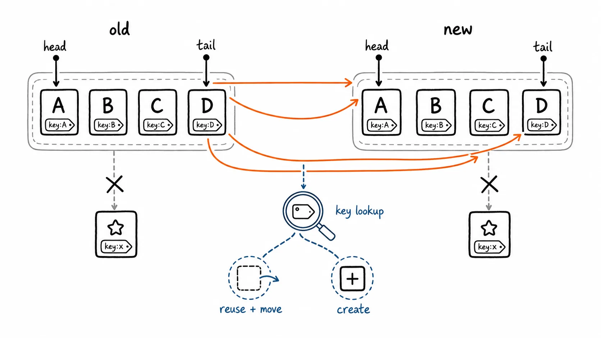

# Vue 面试知识整理

> 本文以 Vue 2 为主线重新梳理面试高频知识点，按知识依赖关系组织，覆盖用法、实现原理与源码层追问三个层次；每个话题尽量先说清楚"要解决什么问题"，再讲机制和代码。文中在必要处标注 Vue 3 的差异写法，方便对照阅读；Vue 3 的完整内容见另一篇《Vue3 面试知识整理（Vue2 开发者过渡版）》。

## 复习建议

- 先吃透五星模块：生命周期、响应式原理、渲染更新与 Diff、组件通信、路由与状态管理。
- 回答源码题先给整体流程，再点出关键对象或方法名，不需要背大段实现代码；但高频手写题（如简化版 `defineReactive`）建议能默写出主干逻辑。
- 区分 Vue 2 与 Vue 3 的表述方式：Vue 2 以 `Object.defineProperty` 为核心，Vue 3 以 `Proxy` 为核心，两者的取舍原因是高频追问点。
- 工程类问题（权限、请求封装、性能优化）要同时说明"前端做了什么"和"后端必须兜底什么"，避免把体验层的措施说成安全边界。

## 一、Vue 是什么：渐进式框架与 MVVM 心智模型

写原生 JS 应用时，数据变了要手动找到对应 DOM 节点再更新，页面稍微复杂一点，这种"手动同步"就会散落在代码各处，难维护也容易漏更新。Vue 要解决的核心问题就是这件事：**把"数据变化"和"视图更新"这条链路标准化，开发者只管改数据，视图更新交给框架**。

围绕这个核心，Vue 提供三块能力：

- **响应式系统**：自动追踪数据依赖，数据变化后知道该通知谁重新渲染。
- **组件化**：把界面拆成职责单一、可复用、可组合的单元。
- **声明式渲染**：模板描述"界面应该长什么样"，而不是命令式地一步步操作 DOM。

### MVVM 与 Vue 的关系

Vue 的设计借鉴了 MVVM（Model-View-ViewModel）思想：

| 角色 | 对应 | 职责 |
| --- | --- | --- |
| Model | 组件的 `data` / 响应式状态 | 保存业务数据 |
| View | 模板渲染出的真实 DOM | 用户看到、操作的界面 |
| ViewModel | Vue 实例本身 | 监听 Model 变化更新 View，监听 View 事件更新 Model |

开发者只操作 Model，ViewModel 负责双向同步。但 Vue 并不是教科书意义上严格的 MVVM 实现（比如没有强制的双向绑定契约、`this.$emit` 之类的命令式 API 也在广泛使用），面试里回答"Vue 借鉴了 MVVM 思想，用响应式系统实现了数据驱动视图"就足够准确。

### 渐进式是什么意思

"渐进式"指的是 Vue 的能力可以按需叠加，而不是一次性接受一整套技术栈：

- 只用核心库，替代 jQuery 做局部视图渲染。
- 加上 Vue Router，做单页应用路由。
- 加上 Vuex/Pinia，做跨组件共享状态管理。
- 加上工程化工具链（Vite/webpack、ESLint、TypeScript），搭建完整前端项目。
- 加上 SSR 方案（Nuxt），解决首屏与 SEO。

这意味着一个已有的传统多页项目也可以只引入 Vue 核心库做局部增强，不需要推倒重来。

### 常见指令与安全边界

- `v-bind` / `:` 绑定属性，`v-on` / `@` 绑定事件，`v-model` 是表单双向绑定的语法糖。
- `v-once` 只渲染一次，之后即使依赖数据变化也不会更新，适合确定不再变化的静态内容。
- `v-pre` 跳过该元素及子元素的编译，直接原样输出，适合展示 Vue 模板语法本身或跳过大段静态内容以提速编译。
- `v-html` 会把字符串当 HTML 插入 DOM，如果内容来自用户输入且未经消毒，攻击者可以注入 `<script>` 或事件属性执行任意 JS，构成存储型或反射型 XSS。默认应使用文本插值 `{{ }}`，确需渲染富文本时必须先用专业的 HTML Sanitizer（如 DOMPurify）过滤。

```html
<!-- 危险：content 来自用户输入 -->
<div v-html="content"></div>

<!-- 安全：渲染前过滤 -->
<div v-html="sanitizeHtml(content)"></div>
```

Vue 3 的组件 `v-model` 默认是 `modelValue` prop 与 `update:modelValue` 事件，并支持多个 `v-model`；Vue 2 默认是 `value` prop 与 `input` 事件，可以通过组件的 `model` 选项自定义 prop 和事件名。

## 二、常用指令、模板语法与 v-for 的 key

### `v-if` 与 `v-show` 的选择

`v-if` 控制的是元素"是否存在"：条件为假时对应的 VNode 和真实 DOM 都不会创建；条件切换时会经历销毁旧分支、创建新分支的完整过程，开销较高。`v-show` 无论条件真假都会渲染，只是切换 CSS 的 `display: none`，初始渲染成本略高（要渲染出来），但切换成本极低。

> 面试回答：
>
> 频繁切换显隐用 `v-show`，因为它复用同一份 DOM，只改样式；条件很少变化，或者初始不展示且子树很重（比如包含大量子组件、复杂表单），用 `v-if`，避免一开始就渲染出用户看不到的内容。

### 为什么不建议 `v-if` 和 `v-for` 写在同一元素上

Vue 2 中同一元素上 `v-for` 的优先级高于 `v-if`：每次渲染都会先完整遍历列表，再对每一项求值 `v-if` 条件，即使大部分项会被过滤掉，遍历和创建 VNode 的开销依然发生。可读性上也容易让人误以为是"先过滤再渲染"。

> Vue 3 中这两个指令的优先级关系相反（`v-if` 优先），这正是版本差异容易被连续追问的点——不要死记哪个优先级更高，而是记住"结论是两者都不建议同时用在一个元素上"。

正确做法：

```vue
<!-- 不推荐 -->
<li v-for="item in list" v-if="item.visible" :key="item.id">{{ item.name }}</li>

<!-- 推荐：提前过滤 -->
<li v-for="item in visibleList" :key="item.id">{{ item.name }}</li>
```

```js
computed: {
  visibleList() {
    return this.list.filter(item => item.visible);
  }
}
```

或者把 `v-if` 提到外层 `<template>` 上，与 `v-for` 分离到不同层级。

### `key` 的作用

`key` 是 VNode 的稳定身份标识，本质上是给 Diff 算法提供"这两个节点是不是同一个东西"的判断依据。没有 `key`（或者用不稳定的 `key`）时，Vue 会退化为按位置逐一比较、就地复用，这在列表发生插入、删除、排序时会导致内部状态错位。

一个具体场景：一个带输入框的列表，用户在第二项输入了内容，随后在列表头部插入一条新数据。如果 `key` 用的是数组下标：

```vue
<li v-for="(item, index) in list" :key="index">
  <input v-model="item.text" />
</li>
```

插入新数据后，所有元素的 `index` 都往后挪了一位，但 Vue 发现 `key` 对应关系没变（还是 0、1、2...），会认为节点本身没变，只是数据变了，于是直接复用了原来位置的 DOM——但原来位置的 DOM 上还保留着用户此前的输入框焦点和内部状态，最终导致用户输入的内容"挪到了别的行"。

正确做法是使用列表项自身稳定、唯一的业务 id：`:key="item.id"`。静态、不会重排的展示内容，其实加不加 `key` 影响不大，重点是动态增删排序的列表和组件切换场景。

### `v-model` 的本质

`v-model` 是语法糖，具体展开成什么取决于作用对象：

```vue
<!-- 原生 input，本质上等价于 -->
<input :value="msg" @input="msg = $event.target.value" />

<!-- Vue 2 组件上，本质上等价于 -->
<Child :value="val" @input="val = $event" />
```

不同表单控件展开的 prop/事件不同（比如 `checkbox`/`radio` 用 `checked`），并支持 `.lazy`（change 事件代替 input）、`.trim`（自动过滤首尾空格）、`.number`（自动转数字）等修饰符。

Vue 2 组件上的 `v-model` 可以通过 `model` 选项自定义要绑定的 prop 和事件：

```js
export default {
  model: {
    prop: 'checked',
    event: 'change',
  },
  props: ['checked'],
};
```

### 过滤器与全局 mixin：为什么现代项目里少用

过滤器（`{{ value | filter }}`）可以做简单的展示格式化，但它隐藏了依赖来源、不方便调试和复用，Vue 3 已经移除这个特性。现代项目更推荐用 `computed` 或普通格式化函数替代。

`Vue.mixin()` 会把选项混入所有组件实例：生命周期钩子会合并依次执行，`data` 会做浅合并，同名选项按 Vue 的合并策略处理（比如同名方法后注册的会覆盖）。它的问题是影响范围不可控、来源不透明——用一个组件时很难一眼看出某个字段或方法来自哪个 mixin。项目里应该谨慎使用全局 mixin，局部复用优先用普通的 mixin 文件显式引入，Vue 3 项目则优先使用组合式函数（composable）。

## 三、实例创建与生命周期

### `new Vue()` 到首屏渲染的完整过程

1. 调用内部 `_init` 方法：合并全局配置、组件配置与 mixin 选项，初始化生命周期相关属性、自定义事件、渲染上下文。
2. 依次初始化 `props`、`methods`、`data`、`computed`、`watch`：其中 `data` 会被递归遍历，把每个属性转换成响应式的 getter/setter（见第四章）。
3. 若配置了 `el`，触发 `$mount`：优先使用用户提供的 `render` 函数；如果只写了 `template`，运行时版本会先把模板编译成 `render` 函数；如果都没提供，退化为使用挂载元素的 `outerHTML` 作为模板。
4. 创建一个渲染 `Watcher`。它在求值（即执行 `render` 函数）时会调用 `_render` 生成 VNode 树，再调用 `_update` → `patch` 把 VNode 转换/更新为真实 DOM 并挂载到页面。
5. 后续任意响应式数据变化，都会通知这个渲染 Watcher，Watcher 被放入异步队列，下一轮统一重新渲染整个组件并做 Diff patch（而不是每次修改都同步触发一次完整渲染）。

理解这个流程的关键是：**`data` 的响应式转换发生在首次渲染之前**；首次渲染和后续所有更新，都是由同一个渲染 Watcher 驱动的——初次是"求值 + 挂载"，之后是"重新求值 + Diff patch"。

> [!VISUALIZATION]
> **类型：** flow
> **优先级：** high
> **标题：** Vue 2 实例创建到首屏挂载
> **目的：** 展示初始化状态、编译/生成 render、创建渲染 Watcher、VNode 和 patch 的先后关系。
> **必须表达：** `data` 初始化发生在首次渲染前；首次渲染由渲染 Watcher 驱动。
> **避免表达：** 不要把模板编译描述为每次数据更新都执行。


### 生命周期钩子一览与使用场景

| 阶段 | 钩子 | 此时可以做什么 |
| --- | --- | --- |
| 创建 | `beforeCreate` / `created` | `created` 中已可访问 `data`、`computed`、`methods`，但还没有真实 DOM |
| 挂载 | `beforeMount` / `mounted` | `mounted` 后 DOM 已插入页面，适合初始化图表、测量节点尺寸、绑定依赖真实 DOM 的第三方库 |
| 更新 | `beforeUpdate` / `updated` | `beforeUpdate` 适合读取更新前的状态；`updated` 仅在确认不会再触发新一轮更新时做 DOM 后处理 |
| 销毁 | `beforeDestroy` / `destroyed` | 清理副作用；Vue 3 对应改名为 `beforeUnmount` / `unmounted` |
| 缓存组件 | `activated` / `deactivated` | 被 `<keep-alive>` 缓存的组件被重新展示/切走时触发，详见第十章 |

### `created` 还是 `mounted` 里发请求

请求本身不依赖 DOM 时，`created` 能更早触发，让请求尽早发出、和模板编译/挂载的时间重叠，缩短用户等待时间。只有当请求参数依赖元素尺寸、`ref` 获取的 DOM 节点，或某个第三方插件初始化后的状态时，才需要放到 `mounted`。

### 为什么组件更新阶段通常不直接修改状态

`updated` 触发的前提是"某个响应式数据变化 → 视图更新完成"。如果在这个钩子里再次修改响应式数据，会重新触发一轮"数据变化 → 视图更新 → updated"，如果这个修改的条件没有被正确收敛，就会陷入死循环。真的需要在更新后联动修改其他状态，通常应该用 `computed` 表达这种派生关系，而不是在 `updated` 里手动赋值。

### 组件销毁时要清理什么

- `setTimeout` / `setInterval` 定时器。
- 通过 `addEventListener` 手动绑定的 DOM/window 事件监听（Vue 自己声明式绑定的 `@click` 等会随组件销毁自动清理，不需要手动处理）。
- WebSocket、SSE 等长连接。
- 第三方图表、编辑器等实例的 `destroy()` 方法。
- 未完成请求的取消逻辑（如 `AbortController`），避免组件卸载后请求结果里的回调仍访问已销毁的组件实例。

不要用箭头函数定义生命周期钩子：箭头函数没有自己的 `this`，不会绑定到组件实例上，`this` 会指向定义时所在的外层作用域，导致钩子内部访问不到组件的数据和方法。

## 四、响应式原理：Object.defineProperty、Dep 与 Watcher

### 核心流程

> 面试回答：
>
> Vue 2 在初始化时递归遍历 `data`，通过 `Object.defineProperty` 把每个属性转换成带 getter/setter 的访问器属性。组件渲染时会读取这些属性，getter 里会把当前正在求值的渲染 Watcher 收集到这个属性对应的 `Dep` 里；属性被修改时，setter 会通知 `Dep`，`Dep` 通知它收集到的所有 Watcher，Watcher 被放入一个去重的异步更新队列，最后统一在 `nextTick` 里批量执行重新渲染。

理解这个机制，要抓住三个对象的关系：

- **响应式属性**：每个属性对应一个 `Dep`（依赖收集器），负责记录"谁依赖了我"。
- **`Dep`**：内部维护一个 Watcher 数组（订阅者列表）。
- **`Watcher`**：一个组件的渲染函数、一个 `computed`、一个用户声明的 `watch`，都各自对应一个 Watcher。Watcher 在**求值期间**读取了哪些响应式属性，就会被收集进哪些属性的 `Dep`。

也就是说，依赖关系不是提前声明的，而是"求值时自动发现"的——这也是为什么条件分支里不同路径读取了不同属性，依赖关系会随分支变化自动调整。

### 手写简化版 `defineReactive`

```js
class Dep {
  constructor() {
    this.subscribers = new Set();
  }
  depend() {
    if (Dep.activeWatcher) {
      this.subscribers.add(Dep.activeWatcher);
    }
  }
  notify() {
    this.subscribers.forEach(watcher => watcher.update());
  }
}
Dep.activeWatcher = null;

function defineReactive(obj, key, val) {
  const dep = new Dep();

  Object.defineProperty(obj, key, {
    get() {
      dep.depend(); // 求值期间收集当前正在执行的 Watcher
      return val;
    },
    set(newVal) {
      if (newVal === val) return;
      val = newVal;
      dep.notify(); // 通知所有订阅者
    },
  });
}

class Watcher {
  constructor(updateFn) {
    this.updateFn = updateFn;
    this.get(); // 创建时立即求值一次，触发依赖收集
  }
  get() {
    Dep.activeWatcher = this;
    this.updateFn(); // 执行期间访问的响应式属性会把 this 收集进对应 Dep
    Dep.activeWatcher = null;
  }
  update() {
    this.get(); // 简化处理：直接重新求值，真实实现会走异步队列
  }
}
```

这段代码省略了递归遍历嵌套对象、数组方法拦截、异步调度队列等实现，但保留了"getter 收集依赖、setter 触发通知"的主干逻辑，是面试中最常被要求默写的部分。

### Vue 2 的已知限制与应对

`Object.defineProperty` 只能拦截"已经存在的属性"的读写，这决定了 Vue 2 有几类天生的限制：

- **新增对象属性不能被自动侦测**：初始化时没有遍历到的属性，自然没有 getter/setter。
- **通过下标直接修改数组元素、直接修改数组 `length`，不能可靠触发更新**：因为 Vue 2 没有对数组的每个索引都定义 getter/setter（成本太高），而是选择拦截了 `push`、`pop`、`shift`、`unshift`、`splice`、`sort`、`reverse` 这 7 个会改变原数组的方法。
- **`Map`、`Set` 等集合类型不能被这套机制覆盖**。

应对方式：

```js
// 新增属性：用 Vue.set / this.$set，而不是直接赋值
this.$set(this.obj, 'newKey', value);
Vue.set(this.list, index, newValue); // 数组按下标改值也要走这个 API

// 数组变异方法（已被 Vue 内部重写，会触发更新）
this.list.push(item);
this.list.splice(index, 1);
```

`$set` 内部对数组场景会调用 `splice`（已被重写过，能触发依赖通知）；对普通对象场景，会调用 `defineReactive` 给新属性补上 getter/setter，再手动触发一次 `dep.notify()`。

## 五、nextTick 与异步更新队列

### 为什么要异步批量更新

如果每次修改响应式数据都立即同步触发一次完整的组件重新渲染和 DOM patch，同一个事件处理函数里修改三次数据就会渲染三次，其中两次是完全浪费的中间状态。Vue 的做法是：**把需要更新的 Watcher 去重后放进一个队列，在当前这一轮同步代码执行完之后，统一异步执行一次**。

```js
this.count = 1;
this.count = 2;
this.count = 3;
// 页面只会渲染一次，最终看到 count 为 3 的结果
```

### `nextTick` 解决的问题

DOM 更新是异步的，这意味着修改数据后立即读取 DOM，拿到的还是修改前的旧状态：

```js
this.visible = true;
console.log(this.$refs.dialog); // 此时 DOM 可能还没更新，拿不到对应节点

this.visible = true;
await this.$nextTick();
this.$refs.dialog.focus(); // 这里可以保证 DOM 已经完成本轮更新
```

`nextTick` 的回调会在当前这一轮 DOM 更新完成后执行。Vue 2 内部会优先使用微任务 `Promise.then` 实现，不支持的环境依次降级到 `MutationObserver`、`setImmediate`、`setTimeout(fn, 0)`。面试时不需要死记这个降级顺序，理解核心是"把 DOM 更新和后续回调都安排进异步任务，从而攒够一轮同步修改后再统一处理"就足够。

## 六、虚拟 DOM、双端 Diff 与更新粒度

### 为什么需要虚拟 DOM

直接操作真实 DOM 成本高，因为浏览器要为每次操作触发布局、样式计算等一整套流程。虚拟 DOM（VNode）用普通 JavaScript 对象描述节点类型、属性、子节点、文本内容，是真实 DOM 的一层轻量级中间表示。状态更新时，Vue 会重新生成一棵新的 VNode 树，与上一次的旧 VNode 树做对比（Diff），只把真正变化的部分应用到真实 DOM 上。

> 需要澄清一个常见误区：虚拟 DOM 本身并不必然比直接操作真实 DOM 快，它的价值在于**把大量分散、命令式的 DOM 操作，转换成一次性、可预测、可优化的批量更新**，同时让开发者可以用声明式的方式描述 UI，而不需要手动追踪每一处该改什么。极端场景下（比如只改一个文本节点），直接操作 DOM 反而更快。

### 更新粒度：组件级，而非节点级

Vue 的响应式追踪是"属性级"的（谁读取了这个属性，谁就被收集为依赖），但更新触发的是"组件级"的重新渲染——一个组件内任意响应式数据变化，都会重新执行整个组件的 `render` 函数，生成一棵全新的 VNode 子树，再和旧树做 Diff。也就是说 Vue 不会精确到"只更新某个 DOM 节点"，而是"重新渲染整个组件，再靠 Diff 尽量减少真实 DOM 操作"。这也是为什么合理拆分组件粒度本身就是一种性能优化手段：父组件更新不会波及粒度更细、依赖更少的子组件（子组件有自己的渲染 Watcher）。

### Vue 2 的双端比较 Diff

Vue 2 的 Diff 只发生在同一层级的子节点之间，不会跨层级比较（这是所有主流虚拟 DOM 实现的通用简化，因为跨层级 diff 的时间复杂度太高）。同层级子节点采用**双端比较**：同时维护新旧两组子节点的头尾四个指针（旧头、旧尾、新头、新尾），按以下优先级尝试命中：

1. 旧头与新头相同 → 直接复用，两个头指针都后移。
2. 旧尾与新尾相同 → 直接复用，两个尾指针都前移。
3. 旧头与新尾相同 → 说明该节点被移到了末尾，复用后移动 DOM，旧头后移、新尾前移。
4. 旧尾与新头相同 → 说明该节点被移到了开头，复用后移动 DOM，旧尾前移、新头后移。
5. 以上都不命中 → 用 `key` 在旧节点中查找是否存在对应节点：存在则复用并移动，不存在则创建新节点。

这套策略对"整体顺序变化不大、只是局部移动"的常见列表操作（如置顶、插入、删除）效率较高，但它是针对同层级列表的启发式优化，并不是通用意义上的最优编辑距离算法。

> [!VISUALIZATION]
> **类型：** relationship
> **优先级：** high
> **标题：** Vue 2 同层子节点的双端 Diff
> **目的：** 直观看出旧/新子节点各自的头尾指针、四种优先级匹配路径，以及未命中时的 `key` 查找分支。
> **必须表达：** 只在同层级比较；跨端命中时复用并移动 DOM；`key` 查找只在四种匹配均失败后发生。
> **避免表达：** 不要把它画成响应式更新全链路，也不要暗示会跨层级 Diff。



## 七、组件通信、插槽与组件/插件的区别

### 通信方式如何选择

| 场景 | 推荐方式 | 说明 |
| --- | --- | --- |
| 父传子 | `props` | 单向数据流，子组件不能直接修改传入的 prop |
| 子传父 | 自定义事件 `this.$emit` | 由父组件决定如何处理、如何更新自己的状态 |
| 跨多层祖孙 | `provide` / `inject` | 适合依赖注入式的上下文传递，不宜用来代替全局状态管理 |
| 兄弟或无直接关系组件 | 状态提升到公共父组件，或用 Vuex/Pinia | Vue 2 的 Event Bus 可以临时应急，但难以追踪数据流向 |
| 复杂的跨页面共享状态 | Vuex（Vue 2）/ Pinia（新项目） | 状态、更新规则、调试能力集中管理 |

`$parent`、`$children`、`$refs` 直接访问并操作其他组件实例会显著增加组件间耦合，不作为默认方案，仅适合确实需要直接调用子组件方法（如表单校验、图表重绘）的场景。Vue 2 的 Event Bus 通常写作：

```js
// main.js
Vue.prototype.$bus = new Vue();

// 组件 A
this.$bus.$emit('user-updated', payload);

// 组件 B
mounted() {
  this.$bus.$on('user-updated', this.handleUserUpdated);
},
beforeDestroy() {
  this.$bus.$off('user-updated', this.handleUserUpdated); // 必须显式解绑，否则重复挂载会重复触发
}
```

它的问题是事件的发送方和接收方之间没有显式的依赖关系，项目大了以后很难追踪"这个事件到底谁在监听、谁在触发"，因此现代项目更推荐用状态管理或更明确的组合式函数替代。

### 插槽（Slot）

插槽解决的问题是："组件负责结构、样式和行为，但局部内容需要由使用方决定"。

```vue
<!-- Child.vue -->
<template>
  <ul>
    <li v-for="row in rows" :key="row.id">
      <slot name="item" :row="row">{{ row.name }}</slot>
    </li>
  </ul>
</template>

<!-- Parent.vue -->
<Child :rows="rows">
  <template #item="{ row }">
    <strong>{{ row.name }}</strong> - {{ row.price }}
  </template>
</Child>
```

- **默认插槽**：一个未命名的内容区域，适合单一自定义区块。
- **具名插槽**：`<slot name="xxx">` 对应父组件的 `<template #xxx>`，适合多个内容区域（如卡片的 header/body/footer）。
- **作用域插槽**：子组件通过 `<slot :row="row">` 把内部数据以 slot props 的形式暴露给父组件，父组件的 `<template #item="{ row }">` 接收后可以自由决定渲染方式。

容易被追问的细节是：插槽内容（`<template #item>` 里的内容）虽然渲染出来后出现在子组件的 DOM 结构里，但**它的作用域属于父组件**——也就是说这段模板里能访问到的是父组件的 `data`/`methods`，不是子组件的。子组件通过 slot props 显式传出来的数据是唯一的例外，可以在插槽内容里通过解构拿到。

Vue 2.6+ 统一用 `v-slot` / `#` 语法，取代了更早版本里 `slot`、`slot-scope` 的写法。

### 组件与插件的区别

组件是可组合的 UI/业务单元，通常有模板、状态、事件、插槽；插件是通过 `Vue.use()` 为 Vue 整体增加全局能力的安装单元，可以在其中注册全局组件、指令、混入、原型方法等。

```js
// 一个简单插件
const MyPlugin = {
  install(Vue, options) {
    Vue.prototype.$myMethod = function () { /* ... */ };
    Vue.directive('focus', { inserted(el) { el.focus(); } });
    Vue.mixin({ /* ... */ });
  },
};

Vue.use(MyPlugin, { someOption: true });
```

`Vue.use()` 内部会检查插件是否已经安装过，避免重复安装。不建议把大型、可变的业务状态挂到 `Vue.prototype` 上——它难以测试（无法方便地 mock）、难以追踪修改来源，也会污染全局实例，业务共享状态应该用 Vuex/Pinia 这类有明确读写路径的方案。

## 八、Vuex 状态管理与错误处理

### Vuex 的核心概念与数据流向

Vuex 用单一状态树管理跨组件共享的状态：

| 概念 | 职责 |
| --- | --- |
| `state` | 保存共享数据，单一数据源 |
| `getters` | 从 `state` 派生出的计算属性，有缓存 |
| `mutations` | 唯一允许**同步**修改 `state` 的地方 |
| `actions` | 处理异步逻辑（如请求），最终通过 `commit` 提交 `mutation` |
| `modules` | 按业务域拆分大型 store，避免单一 store 文件过大 |

> 面试回答：
>
> 组件局部状态就近放在组件内部；当多个页面或深层组件需要共享同一份状态、并且需要统一的更新规则和可追溯的调试轨迹时，才引入 Vuex。异步请求放在 `action` 里处理，请求完成后通过 `commit` 提交 `mutation` 同步修改状态——这样设计的目的是让 Vue Devtools 能清晰地记录"状态从哪个 mutation 变化而来"，如果允许在任意地方直接改 `state`，这条追溯链路就断了。

```js
// store/modules/user.js
export default {
  namespaced: true,
  state: () => ({ profile: null }),
  mutations: {
    SET_PROFILE(state, profile) {
      state.profile = profile;
    },
  },
  actions: {
    async fetchProfile({ commit }) {
      const profile = await api.getProfile();
      commit('SET_PROFILE', profile);
    },
  },
  getters: {
    displayName: state => state.profile?.nickname ?? '未登录',
  },
};
```

`mutation` 必须是同步函数——这是一条强约定而非语言层面的强制限制，目的同样是保证状态变化在 Devtools 时间线上是可追踪、可回放的；如果在 `mutation` 里做异步操作，状态变化的时机会和 Devtools 记录的时机脱节，调试时无法准确定位问题。

Vuex 适用于 Vue 2 项目和存量的 Vue 3 项目；新的 Vue 3 项目通常优先选择 Pinia（更轻量、去掉了 `mutation` 这一层、TypeScript 支持更自然）。也不要因为"状态要集中管理"就把纯组件内部的、不共享的表单临时状态也一并搬进全局 store，这会让 store 变得臃肿，也让组件本该局部维护的状态失去了就近维护的清晰性。

### 错误边界与统一异常处理

Vue 2 提供两层错误捕获能力：

- 组件内的 `errorCaptured(err, vm, info)`：捕获所有后代组件抛出的错误，返回 `false` 可以阻止错误继续向上冒泡。
- 全局配置 `Vue.config.errorHandler`：作为兜底，捕获没有被任何 `errorCaptured` 处理的错误。

```js
Vue.config.errorHandler = (err, vm, info) => {
  console.error('全局捕获:', err, info);
  reportToMonitor(err); // 上报监控平台
};
```

这两者只能捕获 Vue 组件渲染、watcher 回调等同步执行链路里的错误，不能捕获 Promise 里未处理的异步错误（需要额外监听 `window.onunhandledrejection`），也不能替代请求层的错误处理。一个完整的异常处理体系还需要：请求层统一处理网络失败、401 静默刷新/登出、403 无权限提示、业务错误码映射为用户可读文案，以及把关键错误上报到可观测性平台。

## 九、路由原理、SPA/SEO 与前端权限控制

### SPA、路由模式与 SEO

SPA（单页应用）首次通常只加载一个 HTML 外壳和 JS 资源，后续页面切换完全由前端路由接管，不再向服务端请求新文档；MPA（多页应用）每个页面对应一份独立的服务端渲染文档。SPA 换页顺滑、前后端分离友好，但要面对两个典型问题：首屏需要下载并执行更多 JS 才能看到内容；传统爬虫不执行 JS，直接抓取到的可能是空壳页面，SEO 不友好（可以用 SSR/预渲染缓解，见第十二章）。

Vue Router 提供两种历史模式：

| 模式 | 实现方式 | 特点 |
| --- | --- | --- |
| hash 模式 | 监听 `window` 的 `hashchange` 事件，`#` 后面的内容变化不会触发浏览器向服务端发请求 | 兼容性好，部署无需服务端配合 |
| history 模式 | 使用 `history.pushState` / `replaceState` 修改 URL，监听 `popstate` 处理前进后退 | URL 更简洁自然，但用户直接刷新或输入 URL 访问二级路径时，服务端必须能正确响应 |

history 模式部署后出现"刷新 404"，通常不是 Vue Router 本身的问题，而是服务器把 `/user/1` 当作真实文件路径去查找、没找到就返回 404。需要配置服务器把未知路径统一回退到入口 HTML：

```nginx
location / {
  try_files $uri $uri/ /index.html;
}
```

要注意这个回退规则不能覆盖到真实静态资源（如 `/static/xxx.js`），否则资源请求也会被错误地返回 `index.html`。

### 路由守卫与前端权限

典型流程：用户登录后获得 token 和权限信息 → 根据权限计算可访问的路由 → 动态添加路由、生成侧边栏菜单 → 全局前置守卫 `router.beforeEach` 校验每次跳转的访问资格 → 无权限跳转 403 页面，未登录跳转登录页。按钮级别的权限控制可以用自定义指令（如 `v-permission="'user:delete'"`）或组件包裹实现。

```js
router.beforeEach((to, from, next) => {
  const token = getToken();
  if (to.meta.requiresAuth && !token) {
    next({ path: '/login', query: { redirect: to.fullPath } });
  } else if (to.meta.roles && !hasPermission(to.meta.roles)) {
    next('/403');
  } else {
    next();
  }
});
```

> 关键边界：前端的权限控制只能改善使用体验、避免用户误操作，**不能作为安全边界**。即使前端隐藏了某个按钮或路由，攻击者仍然可以直接构造请求调用对应接口；真正的权限校验必须由服务端在每次请求时按用户身份和资源权限重新判断。同理，仅把角色信息写入 `sessionStorage` 后就信任它也是不安全的——客户端存储的数据可以被用户自行篡改。

## 十、`keep-alive` 缓存机制

`<keep-alive>` 是一个抽象组件（不会渲染成真实 DOM 节点），作用是缓存其包裹的第一个组件子节点的实例和 VNode。被缓存的组件切走时不会被销毁，而是触发 `deactivated`；再次被激活时触发 `activated`，而不会重新执行 `created`/`mounted`。

```vue
<keep-alive :include="['ListPage', 'DetailPage']" :max="10">
  <router-view v-if="$route.meta.keepAlive" />
</keep-alive>
<router-view v-if="!$route.meta.keepAlive" />
```

- `include` / `exclude`：按组件 `name` 决定哪些组件需要缓存，支持字符串、正则、数组。
- `max`：最大缓存实例数，超出后按 LRU（最近最少使用）策略淘汰最久未被访问的缓存。

被缓存的组件从列表页跳转详情页再返回时，如果需要刷新数据（比如详情页修改后返回列表要看到最新数据），应该在 `activated` 里重新拉取，而不是只依赖 `mounted`——因为组件被缓存后再次展示时不会触发 `mounted`。缓存会保留表单填写内容、滚动位置等状态，这既是它的价值（用户体验更连续），也是代价：缓存的组件实例会一直占用内存，不能不加区分地把所有页面都缓存起来。

> [!VISUALIZATION]
> **类型：** lifecycle
> **优先级：** medium
> **标题：** 普通组件与 keep-alive 缓存组件的生命周期
> **目的：** 对比切换页面时销毁/重建与 `activated`/`deactivated` 的区别。
> **必须表达：** 缓存组件离开时不是销毁，返回时不会再次 `mounted`。
> **避免表达：** 不要说 keep-alive 会自动决定所有页面缓存策略。


## 十一、Axios 封装、拦截器原理与 token 并发刷新

### 请求封装要解决什么

请求封装的目标不是简单包一层 `axios.get`/`axios.post`，而是让 base URL、超时时间、认证头、参数序列化、重复请求取消、统一响应结构、错误提示策略和日志上报都变得可控、可复用。一般做法是创建一个独立的 axios 实例，再挂载请求/响应拦截器，最后按业务领域拆分成不同的 API 模块。

```js
import axios from 'axios';

const http = axios.create({ baseURL: '/api', timeout: 10_000 });

http.interceptors.request.use((config) => {
  const token = getToken();
  if (token) config.headers.Authorization = `Bearer ${token}`;
  return config;
});

http.interceptors.response.use(
  (response) => response.data,
  (error) => Promise.reject(normalizeHttpError(error)),
);
```

### token 过期后的并发刷新

如果多个请求同时因为 token 过期收到 401，让每个请求各自触发一次刷新 token 的逻辑，会产生多次刷新请求、可能相互覆盖导致最终 token 状态错乱。常见做法是用一个"单飞锁 + 等待队列"：第一个触发刷新的请求去真正调用刷新接口，期间到达的其他请求先加入等待队列挂起，刷新成功后统一用新 token 重试队列里的请求。

```js
let isRefreshing = false;
let waitQueue = [];

http.interceptors.response.use(null, async (error) => {
  const { config, response } = error;
  if (response?.status !== 401) return Promise.reject(error);

  if (!isRefreshing) {
    isRefreshing = true;
    try {
      const newToken = await refreshToken();
      setToken(newToken);
      waitQueue.forEach(cb => cb(newToken));
      waitQueue = [];
    } finally {
      isRefreshing = false;
    }
  }

  return new Promise((resolve) => {
    waitQueue.push((newToken) => {
      config.headers.Authorization = `Bearer ${newToken}`;
      resolve(http(config));
    });
  });
});
```

token 的存储策略需要结合 XSS/CSRF 防护一并设计（比如是否放进 `httpOnly` cookie、是否需要额外的 CSRF token），不能只套用一个通用模板，要看具体的认证方案和后端配合能力。

### Axios 为什么能有拦截器

Axios 内部会把"请求拦截器 → 核心 `dispatchRequest` → 响应拦截器"串成一条 Promise 链：请求拦截器按注册的**逆序**参与链路（后注册的先执行），核心层根据运行环境选择浏览器 XHR 或 Node.js HTTP 模块作为 adapter 真正发出请求，响应回来后再依次经过响应拦截器。`axios.create()` 创建的实例拥有独立的默认配置和拦截器链，互不影响。

新项目也常直接用原生 `fetch`；它和 Axios 的一个重要差异是：`fetch` 不会因为 HTTP 4xx/5xx 状态码自动 reject，封装时必须显式检查 `response.ok`。选用 Axios 还是 `fetch` 并不是关键决策，统一的错误处理模型和请求取消策略才是封装质量的核心。

## 十二、首屏性能优化与 SSR

### SPA 首屏优化

优化前先用性能指标（如 LCP、首包大小、瀑布图）定位真正的瓶颈，而不是凭经验直接动手。常见措施：

- 路由级动态导入（`() => import('./Page.vue')`）、组件按需加载，减小入口包体积，避免把所有 UI 库、富文本编辑器等打入首屏 bundle。
- Tree Shaking、代码拆包、去除重复依赖，合理利用长期缓存（文件名内容哈希）。
- 图片压缩、响应式图片（`srcset`）、懒加载；静态资源走 CDN，服务端启用 Brotli/Gzip 压缩。
- 减少关键请求链路（避免请求瀑布式串行），对真正关键的资源使用 `<link rel="preload">`；接口尽量并行发起，配合骨架屏、缓存策略提升用户的感知速度。
- 用 Performance API、Web Vitals（LCP/INP/CLS）、网络面板做量化验证，不能只看 `DOMContentLoaded` 这类不代表用户感知的指标。

### SSR 的价值与代价

SSR（服务端渲染）在服务端把首屏内容渲染为完整 HTML 字符串返回给浏览器，浏览器可以立即显示内容，随后客户端 JS 加载完成后接管交互（这个过程叫 hydration）。它能显著改善首屏可见速度和搜索引擎抓取效果，但带来的代价是：服务端需要承担渲染计算和缓存压力、数据需要在服务端预取、组件代码需要兼容"同构"（既能在 Node 环境执行又能在浏览器执行）、以及客户端 hydration 结果必须和服务端渲染结果一致，否则会出现 hydration mismatch。

Vue 2 SSR 的关键要点：每个请求都要创建全新的 router、store、app 实例（避免不同用户请求之间状态串扰），服务端等待路由匹配到的组件完成异步数据获取后再渲染成 HTML，并把预取到的初始状态序列化后注入 HTML；客户端启动时读取这份初始状态直接复用，避免重复发起一次请求，也避免因为数据不一致导致 hydration mismatch。从零手写 Vue 2 SSR 的 webpack 构建配置成本较高，工程上更实际的选择是使用 Nuxt 这类封装好的框架。

SSR 并不是所有项目的默认答案——它主要解决内容型页面的 SEO 和首屏体验问题；后台管理系统这类不需要被搜索引擎收录、用户群体也相对固定的应用，通常收益远小于额外的工程复杂度。

## 十三、组件设计、性能排查与项目开放题

### 可复用组件如何设计

一个可复用组件需要有清晰的输入（`props`，带合理默认值和类型校验）和输出（`emit` 的自定义事件），职责单一、边界清晰。扩展点优先通过具名/作用域插槽提供，而不是不断增加各种业务相关的 boolean 开关 prop——开关越堆越多，组件会逐渐变成"专为某个页面定制"的东西，失去复用价值。

表单类组件体系通常需要考虑：字段的配置化描述、表单值与校验规则的统一管理、字段间的联动显示/联动校验、数据回显与整体重置能力。

### 大列表与复杂表格的性能优化

核心手段是减少同时渲染和参与响应式追踪的节点数量：分页、虚拟滚动（只渲染可视区域内的行）、分块渲染/懒加载。表格场景还要注意冻结列的重绘成本、单元格合并逻辑的复杂度、以及自定义渲染函数（render function）本身的执行开销。更新时应该只更新真正变化的行，避免因为整个数据源对象是深度响应式的，导致任意一个字段变化都触发全表重新渲染。

### 排查组件重复渲染

常见原因：父组件频繁更新（哪怕子组件用到的数据没变，只要父组件重新渲染时给子组件传入了新引用的对象或函数，也会导致子组件更新）、模板里直接调用函数或写复杂表达式（每次渲染都会重新执行）、`watch` 使用不当产生连锁更新、大对象整体做深度响应式导致依赖范围过大。排查思路是打开 Vue Devtools 观察组件更新链路，确认具体是哪个响应式依赖触发了更新，再判断这次更新是否必要。

### 如何回答项目开放题

推荐用"现象 → 定位 → 方案 → 结果/取舍"的结构。比如回答"首屏慢"：先说通过网络瀑布图和 LCP 指标定位到具体是首包体积大还是关键请求串行阻塞，再说明采取了路由拆包、按需引入、请求并行、图片优化等具体方案，最后说明如何验证收益（对比优化前后的指标数据），以及方案本身的取舍（比如懒加载会带来切换路由时的短暂 loading）。

从 0 到 1 搭建后台项目，可以按这个结构表达：选定技术栈（Vue 3 + Vite + TypeScript + Router + Pinia）→ 规划目录结构与模块边界 → 搭建请求层、路由层、权限层、统一布局 → 沉淀通用组件与 composable → 接入代码规范、监控埋点、测试、多环境配置与发布流程。

## 十四、源码高频深问

这一节是"知道怎么用"之外，更偏实现细节的追问，回答时给出关键结论和主干逻辑即可，不需要逐行还原源码。

### 组件更新调度：为什么要异步队列去重

响应式数据变化触发 setter → `Dep.notify()` → 通知所有订阅的 Watcher。如果 Watcher 收到通知就立即同步执行更新，同一个事件处理函数里对同一个数据连续赋值三次，会触发三次完整的组件重新渲染。Vue 的调度器（Scheduler）会把待更新的 Watcher 放入一个队列，用 Watcher 的唯一 id 去重（同一个 Watcher 在一轮里只会被放入队列一次），并且按 Watcher 创建顺序（本质上是父组件先于子组件创建）排序后统一执行——保证父组件先于子组件更新，避免子组件基于父组件的旧状态渲染出错误结果。整个队列的执行时机由 `nextTick` 的异步机制决定。

### 三类 Watcher 的区别

- **渲染 Watcher**：对应组件的 `render` 函数，数据变化后重新执行整个组件的渲染流程。
- **computed Watcher**：惰性求值，内部有一个 `dirty` 标记。依赖不变时 `dirty` 为 `false`，直接返回缓存值；依赖变化时只是把 `dirty` 标记为 `true`，并不立即重新计算，等下次真正被访问时才重新求值。
- **user watcher**（`watch` 选项/`this.$watch` 创建的）：数据变化后执行用户提供的回调函数，处理副作用（请求、日志、跳转等）。

它们的通知顺序也有讲究：一个 computed 依赖的数据变化时，会先通知 computed Watcher 更新自己的 `dirty` 标记，再通知依赖了这个 computed 的渲染 Watcher，保证渲染时读到的是最新的计算结果。

### 数组响应式为什么只拦截 7 个方法

给数组的每一个索引都定义 `Object.defineProperty` getter/setter，在数组很长或频繁增删时开销过大，也无法自然应对 `length` 变化。Vue 2 选择了折中方案：创建一个继承自 `Array.prototype` 的新原型对象，重写 `push`、`pop`、`shift`、`unshift`、`splice`、`sort`、`reverse` 这 7 个会修改原数组的方法——重写后的版本先调用原生方法完成真正的数组操作，再手动触发这个数组对应的 `Dep.notify()`。这也是为什么直接用下标赋值（`arr[0] = x`）或直接改 `arr.length` 不会触发更新——它们没有经过这层拦截。

### 模板编译的三个阶段

Vue 2 的模板编译大致分三步：

1. **`parse`**：用正则和有限状态机解析模板字符串，生成描述节点结构的抽象语法树（AST）。
2. **`optimize`**：遍历 AST，标记出不依赖任何响应式数据、渲染时不会变化的"静态节点"（以及静态根节点）。
3. **`generate`**：把 AST 转换成 `render` 函数的字符串代码，被标记为静态的节点会在渲染时跳过重新创建，直接复用上一次的 VNode，减少不必要的计算。

单文件组件（`.vue`）在构建阶段就完成了这个编译过程；运行时如果直接传入 `template` 字符串（而不是提前编译好的 `render` 函数），则需要引入包含编译器的"完整版" Vue，体积更大。

### `$on`/`$emit` 的内部实现

Vue 实例内部维护一个 `_events` 对象，`key` 是事件名，`value` 是对应的回调函数数组：

```js
// 简化实现
$on(event, fn) {
  (this._events[event] || (this._events[event] = [])).push(fn);
  return this;
}
$emit(event, ...args) {
  const callbacks = this._events[event];
  if (callbacks) callbacks.forEach(cb => cb(...args));
  return this;
}
$off(event, fn) {
  if (!fn) { delete this._events[event]; return this; }
  const callbacks = this._events[event];
  if (callbacks) this._events[event] = callbacks.filter(cb => cb !== fn);
  return this;
}
```

这也是为什么用 Event Bus 时必须显式 `$off` 解绑——回调函数只是被 push 进了一个数组，组件销毁并不会自动清理这个数组里的引用，不解绑会导致内存泄漏，以及组件重新挂载后同一个事件被重复触发多次。

## 十五、Vue3 迁移速览

Vue 3 的完整原理和用法见另一篇《Vue3 面试知识整理（Vue2 开发者过渡版）》，这里只列出面对 Vue 2 面试官追问"你了解 Vue 3 吗"时最需要能对答如流的核心差异：

| 维度 | Vue 2 | Vue 3 |
| --- | --- | --- |
| 响应式实现 | `Object.defineProperty`，需要 `Vue.set` 处理新增属性 | `Proxy`，能自然拦截新增/删除属性、数组索引 |
| 逻辑组织与复用 | Options API + mixin（易命名冲突、来源不透明） | 新增 Composition API + composable（显式导入、显式返回） |
| 编译期优化 | 标记静态根节点，减少静态子树的重新创建 | 静态提升、Patch Flag、Block Tree，编译期标记动态节点，更新时只处理必要部分 |
| 应用初始化 | `new Vue({ ... })`，全局配置挂在 `Vue` 构造函数上，会污染全局 | `createApp(App)`，配置挂在应用实例上，多个应用实例互不影响 |
| 组件 `v-model` | 默认 `value` + `input`，可通过 `model` 选项改名 | 默认 `modelValue` + `update:modelValue`，支持多个 `v-model` |
| 生命周期命名 | `beforeDestroy` / `destroyed` | `beforeUnmount` / `unmounted`，其余钩子改为 `onXxx` 形式从 `vue` 显式导入 |
| 跨 DOM 层级渲染 | 手动 `appendChild` 到 `body` | 内置 `Teleport` |
| Tree Shaking | 全局 API 挂在 `Vue` 对象上，难以按需摇树 | API 设计为可命名导入的独立导出，更容易被摇掉未使用部分 |

一句话记忆：**Vue 3 的改动集中在"响应式底层换成 Proxy"和"新增组合式 API 解决逻辑复用与 TypeScript 支持"这两条主线上，编译优化、Teleport、Tree Shaking 都是围绕这两条主线衍生出的能力升级**。

## 十六、面试冲刺索引

### ⭐⭐⭐⭐⭐ 核心必会

- 生命周期：`created` 与 `mounted` 的区别、缓存组件的 `activated`/`deactivated`、销毁前要清理什么。
- Vue 2 响应式：`Object.defineProperty`、`Dep`、`Watcher` 三者关系，`$set` 存在的原因，能默写简化版 `defineReactive`。
- `nextTick` 的批处理原理，`computed` 与 `watch` 的适用边界。
- VNode、`key` 的作用、Vue 2 双端 Diff 的五种命中情况、`v-if` 与 `v-show` 的选择依据。
- `props`/`$emit`、插槽的作用域归属、Vuex 数据流向、路由守卫与 `keep-alive`。

### ⭐⭐⭐⭐ 高频工程追问

- history 模式刷新 404 的根因与 Nginx 回退配置。
- 前端权限为什么不能替代后端鉴权。
- Axios 拦截器执行顺序、token 过期并发刷新怎么做单飞处理。
- SPA 首屏优化要用什么指标验证，SSR 解决什么问题、代价是什么。

### 容易连续追问的知识链

- 响应式属性 → `Dep` 收集 Watcher → setter 通知 → 异步队列去重 → `nextTick` → 重新渲染 → VNode Diff → 真实 DOM patch。
- `v-for` 缺少稳定 `key` → 节点被错误复用 → 组件/DOM 内部状态错位。
- SPA 路由模式选择 → history 模式部署回退 → SEO 弱势 → SSR / Nuxt。
- Vue 2 的 `Object.defineProperty` 限制 → 新增属性/数组下标问题 → Proxy 方案 → Composition API → Vue 3 迁移。
