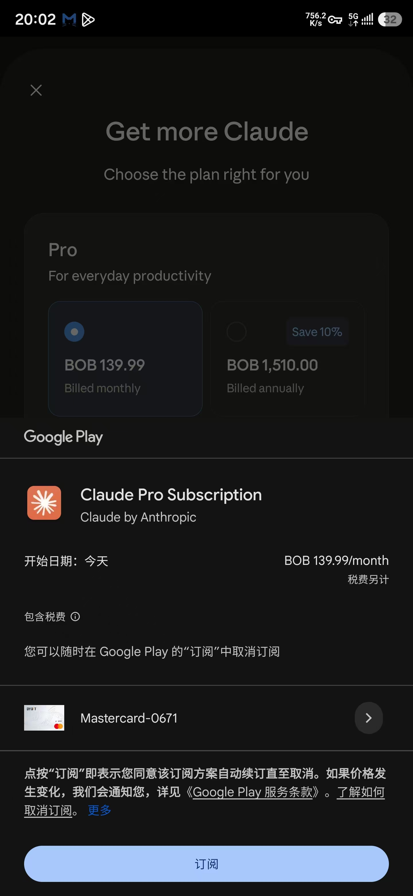
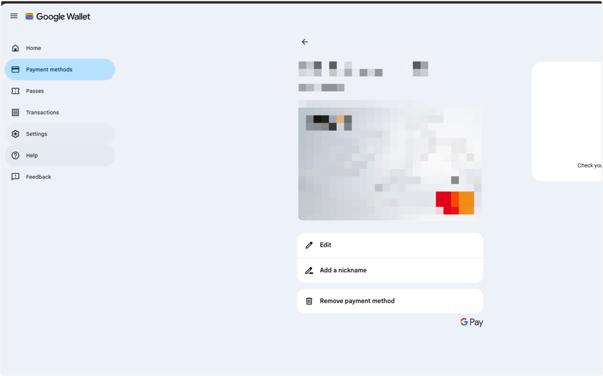
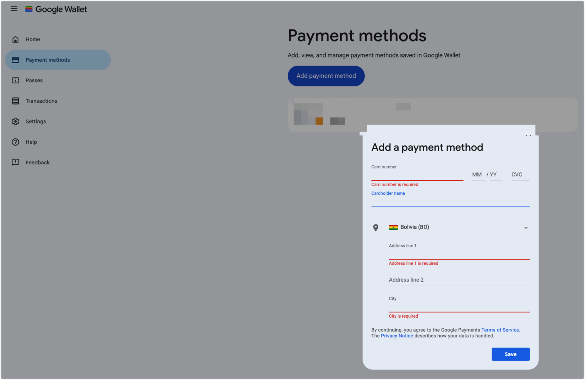

# 2026 Google Play 低价区换区教程：无需目标国家节点

本文以玻利维亚区为例，不需要玻利维亚网络节点。
> 如果有对应的节点，直接代理过去google play切换也可以

实测结果：

- Claude Pro：`BOB 139.99 / 月`
- 付款方式：Bybit Mastercard
- Claude Pro 可登录使用 Claude Code，二者共用套餐额度[^1]



> Google 换区存在风控，不保证所有账号都能成功。建议使用单独的 Google 账号操作。

## 一、准备材料

- 一个 Google 账号
- 一张可用的境外银行卡
- 一个玻利维亚地址

没有合适的卡可以尝试：

[申请 Bybit Card（推荐链接）](https://www.bsmkweb.cc/referral/earn-together/refer2earn-usdc/claim?hl=zh-CN&ref=GRO_28502_F7F2C&utm_source=referral_entrance) 

地址可以在 Google Maps 搜索玻利维亚的实际地址，记录以下信息：

- `Address line 1`：街道和门牌号
- `City`：城市
- `State / Province`：行政区
- `Postal code`：邮编

## 二、移除旧卡

打开 [Google Wallet](https://wallet.google.com/)，然后：

```text
Payment methods
  → 点击旧卡
  → Remove payment method
```



> 这里只移除银行卡，不要关闭整个 Google Payments 付款资料。

## 三、添加新卡

回到 `Payment methods` 页面：

```text
Add payment method
  → 填写卡号、姓名、有效期、CVC
  → 国家选择 Bolivia (BO)
  → 填写玻利维亚地址
  → Save
```



添加完成后，打开 [Google Payments](https://payments.google.com/)，确认付款资料的国家显示为玻利维亚。

## 四、清除 Google Play 缓存

在 Android 手机上打开：

```text
系统设置
  → 应用
  → Google Play Store
  → 存储和缓存
  → 清除缓存
  → 清除存储空间
```

重新打开 Google Play：

```text
右上角头像
  → 设置
  → 常规
  → 账号和设备偏好设置
  → 国家和个人资料
```

检查国家是否已经变成玻利维亚。

## 五、购买 Claude Pro

1. 打开或重新安装 Claude App。
2. 确认 Google Play 使用的是刚才换区的账号。
3. 进入 Claude Pro 订阅页面。
4. 看到价格显示为 `BOB`，说明玻利维亚区已经生效。
5. 选择 Bybit Card 并完成付款。

## 六、没有生效怎么办

按顺序检查：

1. Google Play 当前登录的是不是换区账号。
2. Google Payments 国家是不是玻利维亚。
3. 新卡和玻利维亚地址是否保存成功。
4. 再次清除 Google Play Store 的缓存和存储空间。
5. 手机登录了多个 Google 账号时，暂时移除无关账号。
6. 等待一段时间再试，Google 官方提示地区更新最多可能需要 48 小时。[^2]

> Google 官方还可能限制频繁换区，并要求当地付款方式。不要在主账号中反复切换地区。原地区余额、积分和订阅也不会自动转移。
